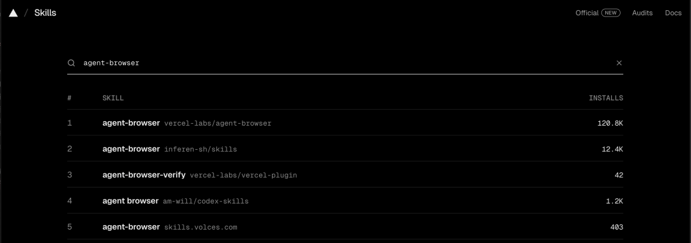
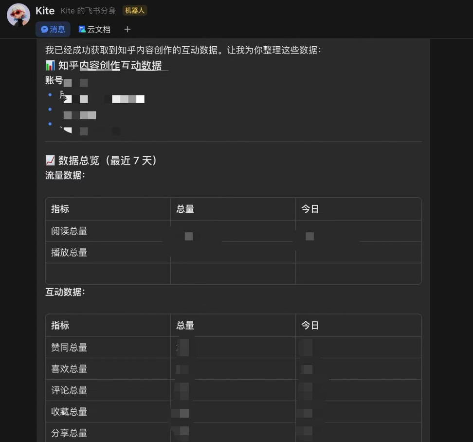
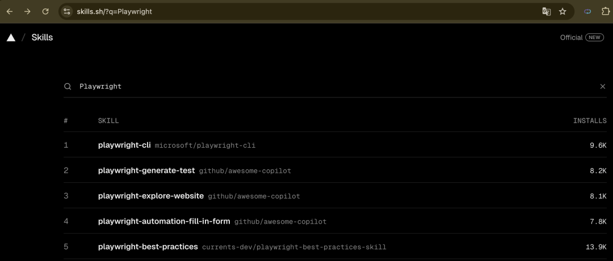
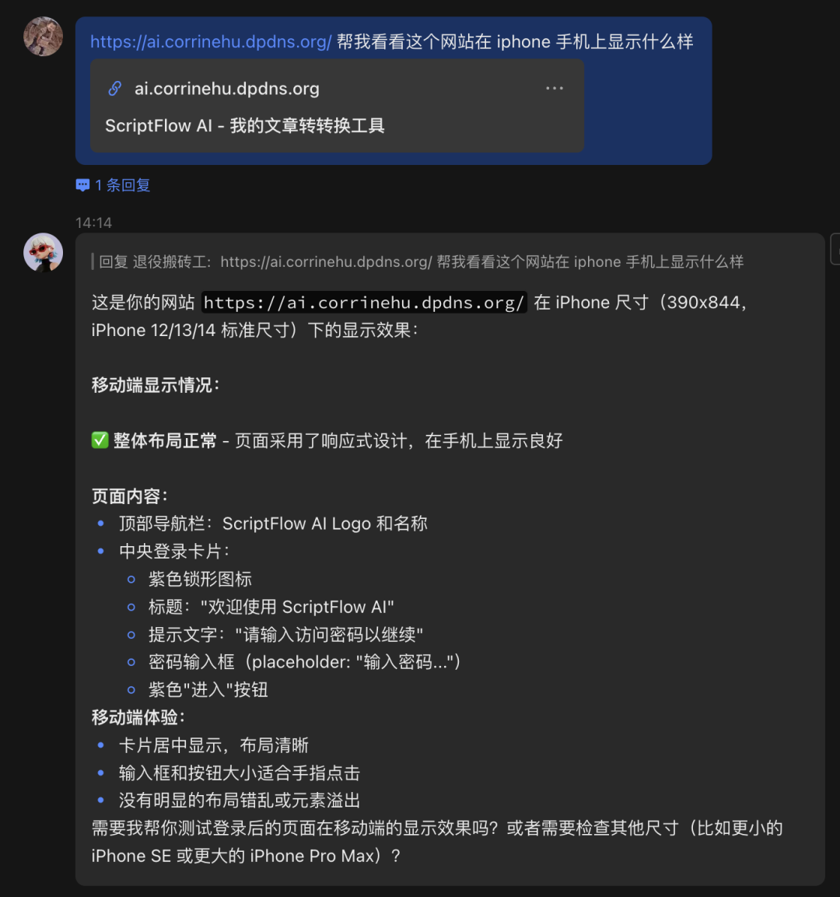

> 📎 来源: [AI自由派](https://mp.weixin.qq.com/s?__biz=MzY4MjA1MzA3Mw==&mid=2247483968&idx=1&sn=6a8ce083fb49edc5aed652b1bc507b0f&chksm=f256ae7293cfa8c6db41e94b8ab5b22e43064aa7a97da26b5b6d1f94d6566324d528c711f03d&mpshare=1&scene=1&srcid=0408AWNiwBik7msaNaTDrw8M&sharer_shareinfo=5b50c840943954b5815bbd1a0524fe29&sharer_shareinfo_first=5b50c840943954b5815bbd1a0524fe29) | 时间: 2026-04-13 16:15

---

上一篇 [高效养虾：给 OpenClaw 安上搜索之眼](https://mp.weixin.qq.com/s?__biz=MzY4MjA1MzA3Mw==&mid=2247483892&idx=1&sn=729f2a20c99d4ccc2ee3106f966d63ac&scene=21#wechat_redirect) ，能找信息了。但还要人工点开查看，有点太麻烦。

可以给 OpenClaw 配备"手"，让 Agent 直接操作浏览器。介绍两个相关的 Skill：

### Agent Browser

Vercel Labs 出品，专为 AI Agent 设计的浏览器自动化工具，采用纯文本操作而非截图，Token 消耗相对低。



**安装**

```
npx skills add vercel-labs/agent-browser
```

**实战：查看知乎数据**

可以在聊天工具中直接对 Openclaw 说：帮我查看下知乎内容创作的相关数据


稍后：



### Playwright

微软官方出品，业界最流行的浏览器自动化框架。支持三种浏览器内核：Chromium（Chrome/Edge）、Firefox、WebKit（Safari），并提供录制、调试等专业功能。

**安装 Playwright CLI**

```
npm install -g @playwright/cli@latest
```

**安装 Skill**

在 skills.sh 上搜索 Playwright，下载量最高的不是微软官方的 skill，其实两者都可以装：



这里安装 playwright-best-practices

```
npx skills add https://github.com/currents-dev/playwright-best-practices-skill --skill playwright-best-practices
```

**相关功能**

- 基础操作：打开浏览器、访问 URL、点击元素、填写表单、按键操作、获取页面内容
- 进阶功能：截图、录制操作视频、多标签页管理、Cookie 和存储管理
- 设备模拟：iPhone 13/15、Pixel 5、Galaxy S9、iPad、Surface Pro 等

**实战：模拟 iPhone 访问网页**



### 两款工具如何选择？

Agent Browser 和 Playwright 都能实现浏览器自动化，但定位有所不同。

**简单对照表**

| 需求场景 | 推荐工具 |
| --- | --- |
| 日常提取数据（知乎/B 站/豆瓣等） | Agent Browser |
| 复杂场景（录制、调试、多标签） | Playwright |

• **Agent Browser**：专为 AI Agent 设计，纯文本交互，聊天即可完成操作，适合绝大多数普通用户

• **Playwright**：功能更强大的专业工具，支持录制、调试等进阶功能，更适合有开发或测试需求的用户

对于大部分内容创作者而言，Agent Browser 已经足够满足日常需求。如果你需要更精细的浏览器控制或自动化测试能力，可以考虑使用 Playwright。

---

#### 关联文章

- [高效养虾：给 OpenClaw 安上搜索之眼](https://mp.weixin.qq.com/s?__biz=MzY4MjA1MzA3Mw==&mid=2247483892&idx=1&sn=729f2a20c99d4ccc2ee3106f966d63ac&scene=21#wechat_redirect)
- [有用有趣的 Skills①：一站式 AI 技能管理](https://mp.weixin.qq.com/s?__biz=MzY4MjA1MzA3Mw==&mid=2247483770&idx=1&sn=0798879b014d2980068f6e15dc83d424&scene=21#wechat_redirect)
