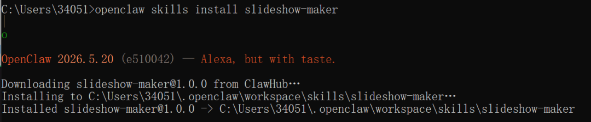
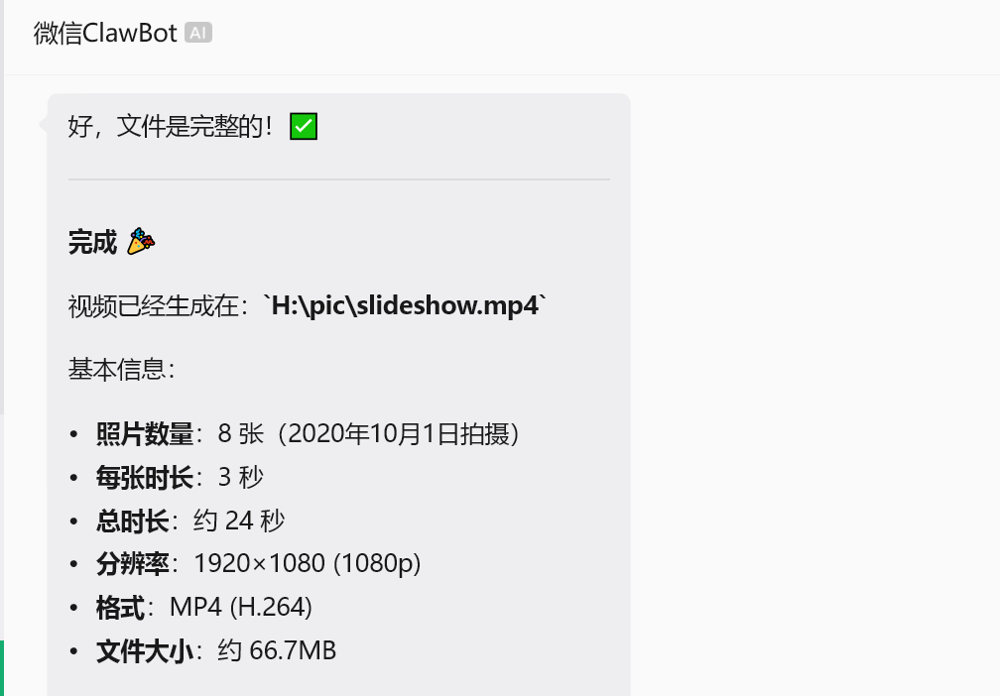
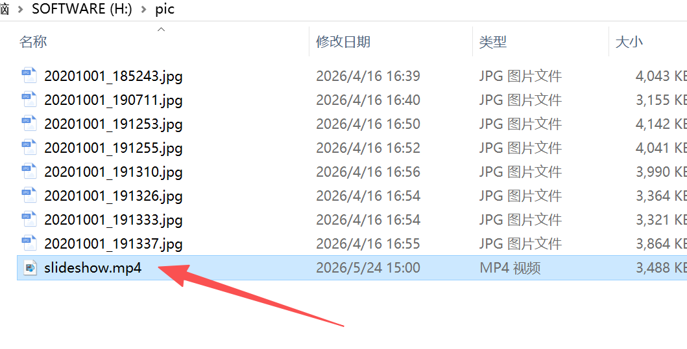

> 📎 来源: [simplesoft](https://mp.weixin.qq.com/s?__biz=MzUxNDczODQ5Mg==&mid=2247484003&idx=1&sn=3e77b6f1f1b71f395371439b20e2ac55&chksm=f8c075030ab27097fad32bdd39122dd85a77e20d4b29b9701f80534a6bcdef5f8c80c75a8a46&mpshare=1&scene=1&srcid=0528ayxxDg07JQOQlQTCNyHm&sharer_shareinfo=07c18bbd9af4711e350a3a7589812be8&sharer_shareinfo_first=07c18bbd9af4711e350a3a7589812be8) | 时间: 2026-05-28 21:03

---

# 用 OpenClaw 制作精美视频

**适用对象：**想将照片自动制作成视频的用户

**前置条件：**

- ✅ 已完成 OpenClaw 安装和配置
- ✅ 微信已连接并可以使用
- ✅ 有一些照片想要制作成视频

🎬 **本篇亮点：**
教你如何使用 **slideshow-maker** 技能，只需一句话，就能把照片变成带转场效果和背景音乐的精美视频！

---

## 一、为什么需要 slideshow-maker？

### 1.1 传统方式的痛点

如果你想把 vacation photos 做成视频分享给朋友，传统方式是：

1. 打开视频编辑软件（Premiere、剪映等）
2. 导入所有照片
3. 手动调整每张照片的显示时间
4. 添加转场效果（一个一个加）
5. 选择背景音乐
6. 设置分辨率和导出参数
7. 渲染导出（可能需要很长时间）

**耗时：**30 分钟 - 2 小时

### 1.2 使用 slideshow-maker

在微信中发送：

```
帮我把 H:\pic 的照片做成视频，1080p，带转场和音乐
```

**AI 自动完成所有步骤！**

**耗时：**2-5 分钟（取决于照片数量）

⚡ **效率提升：**从小时级降到分钟级，而且无需学习任何编辑软件！

---

## 二、安装 slideshow-maker 技能

### 2.1 检查当前可用技能

首先查看是否已经安装了该技能：

```
openclaw skills list | findstr slideshow
```

如果没有找到，说明需要安装。

### 2.2 安装技能

在 PowerShell 中执行：

```
openclaw skills install slideshow-maker
```

**预期输出：**



## 三、第一次使用：制作简单视频

### 3.1 准备照片

确保你的照片在一个文件夹中，例如：

```
H:\pic\├── photo1.jpg├── photo2.jpg├── photo3.jpg└── ...
```

⚠️ **注意事项：**

- 照片格式支持：JPG、PNG
- 建议照片尺寸一致（或接近）
- 照片数量：5-50 张最佳

### 3.2 发送第一条指令

在微信中发送：

```
帮我把 h:\pic 目录下的所有照片制作成一个视频
```

**AI 处理过程：**



可以在电脑上看到生成的视频文件，如图所示。



## 四、进阶使用：自定义视频参数

### 4.1 设置分辨率

**你发送：**

```
制作视频，分辨率设为 4K，照片来自 D:\Photos\Trip
```

**支持的分辨率：**

- ```
  720p
  ```

  - 1280x720（快速，文件小）
- ```
  1080p
  ```

  - 1920x1080（标准，推荐）⭐
- ```
  2K
  ```

  - 2560x1440（高清）
- ```
  4K
  ```

  - 3840x2160（超清，文件大）

### 4.2 调整每张照片显示时间

**你发送：**

```
制作视频，每张照片显示 5 秒，添加缓慢的缩放效果
```

**可选时长：**

- ```
  2 秒
  ```

  - 快节奏
- ```
  3 秒
  ```

  - 标准（默认）
- ```
  5 秒
  ```

  - 慢节奏，适合风景照
- ```
  10 秒
  ```

  - 很慢，适合展示细节

### 4.3 选择转场效果

**你发送：**

```
制作视频，使用滑动转场效果，从右到左
```

**常见转场效果：**

| 效果名称 | 描述 | 适用场景 |
| --- | --- | --- |
| ``` fade ``` | 淡入淡出 | 通用，柔和 ⭐推荐 |
| ``` slide-left ``` | 从右向左滑动 | 动态感强 |
| ``` slide-right ``` | 从左向右滑动 | 动态感强 |
| ``` zoom-in ``` | 放大进入 | 突出重点 |
| ``` zoom-out ``` | 缩小退出 | 结束感 |
| ``` rotate ``` | 旋转 | 活泼风格 |
| ``` none ``` | 无转场 | 简洁直接 |

### 4.4 添加背景音乐

**你发送：**

```
制作视频，添加欢快的流行音乐作为背景
```

**音乐类型选项：**

- ```
  轻快钢琴
  ```

  - 温馨、浪漫
- ```
  欢快流行
  ```

  - 活泼、阳光
- ```
  舒缓爵士
  ```

  - 优雅、放松
- ```
  电子舞曲
  ```

  - 动感、活力
- ```
  古典音乐
  ```

  - 庄重、大气
- ```
  无音乐
  ```

  - 只要画面
