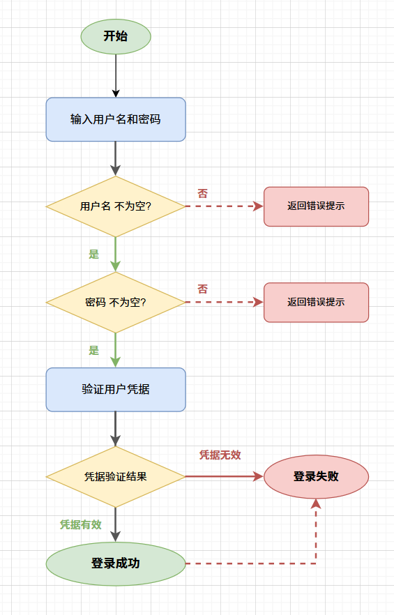
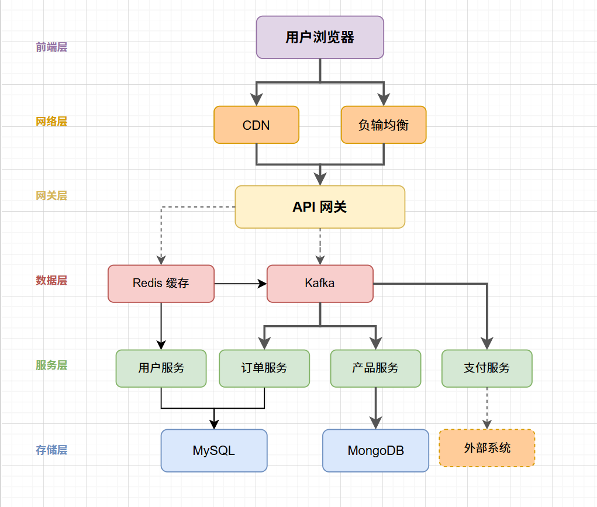
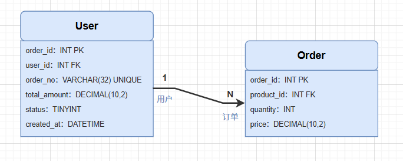

> 📎 来源: [创见AI实验室](https://mp.weixin.qq.com/s?__biz=MzY4NDAwNDk0Ng==&mid=2247484961&idx=1&sn=1a1b56efc332cafa495fc7389db8a0d9&chksm=f258af7e0635316ac9e5943bd4a745d449a6247d03bb80b932d734be8b2fa4d4b35b8c1ff1ff&mpshare=1&scene=1&srcid=0514rAVeqfbshSeVx8FRrKTz&sharer_shareinfo=1346714500cc3f24509d95aab767339e&sharer_shareinfo_first=1346714500cc3f24509d95aab767339e) | 时间: 2026-05-14 10:47

---


写技术文档时，明明脑子里清楚系统是怎么跑的，但一到画图就卡住。Graphviz 语法记不住，Mermaid 画出来总对不齐，最后只能"口述架构"——「这里有个网关，下面连着三个服务，再下面是数据库...」

这不是你不行，是工具门槛太高了。

今天聊一个真正能解决问题的组合：**OpenCode + Draw.io MCP**。用自然语言描述，AI 直接生成可编辑的 .drawio 文件，打开就能改，不用任何绘图基础。

## Draw.io MCP 是什么

jgraph/drawio-mcp 是 draw.io 官方提供的 Claude Code 集成方案，但它的本质不是"连接外部服务"，而是在你本地直接生成 .drawio 文件，因此对于OpenCode也是适用的。

关键特性：

- **原生 XML**

  ：生成的 .drawio 文件就是 mxGraphModel XML，可以用 draw.io Desktop 直接打开编辑
- **嵌入导出**

  ：可选导出 PNG/SVG/PDF，但文件里同时内嵌完整 diagram XML——导出的图片依然是可编辑的
- **不需要 MCP 服务**

  ：不依赖任何外部 API，纯本地生成，隐私安全

这个方案最初是给 Claude Code 用的，但 OpenCode 作为类 Claude Code 的 AI 编程工具，同样支持 Skill 扩展机制，经过适配可以完美运行。

## 安装方法

> skill 文件实际路径是 `skill-cli/drawio/SKILL.md`

**全局安装**（所有项目可用）：

```
mkdir -p ~/.claude/skills/drawiocp skill-cli/drawio/SKILL.md ~/.claude/skills/drawio/SKILL.md
```

**项目级安装**：

```
mkdir -p .claude/skills/drawiocp skill-cli/drawio/SKILL.md .claude/skills/drawio/SKILL.md
```

OpenCode 用户安装到 `C:\Users\Administrator\.config\opencode\skills\drawio\SKILL.md`（具体路径根据用户名调整）。

## 实际效果

### 用户登录流程图

只需要说一句：

```
/drawio 创建用户登录流程图
```

AI 自动生成包含以下逻辑的流程图：

```

```



###

### 电商系统架构图

```
/drawio 画一个电商系统架构图
```

AI 生成包含完整层级的架构图：

| 层级 | 组件 |
| --- | --- |
| 前端层 | 用户浏览器 |
| 网络层 | CDN → 负载均衡 |
| 网关层 | API Gateway |
| 服务层 | 用户服务、订单服务、产品服务、支付服务 |
| 数据层 | Redis 缓存、Kafka 消息队列 |
| 存储层 | MySQL、MongoDB |



###

### ER 图

```
/drawio 用户和订单的ER图
```

同样可以直接生成。

## 工作原理

```
1. 用户用自然语言描述需求↓2.AI分析需要的图形类型（流程图/架构图/ER图）↓3.生成mxGraphModelXML↓4.写入.drawio文件↓5.(可选)draw.ioCLI导出PNG/SVG/PDF↓6.Windows:start命令打开/macOS:open/Linux:xdg-open
```



###

### Windows 路径检测优先级

OpenCode 适配版做了 Windows 路径兼容，检测优先级如下：

```
# 1. 检查是否在 PATHGet-Command draw.io -ErrorAction SilentlyContinue# 2. 默认安装路径"C:\Program Files\draw.io\draw.io.exe"# 3. 用户安装路径"$env:LOCALAPPDATA\draw.io\draw.io.exe"# 4. 32-bit 系统"C:\Program Files (x86)\draw.io\draw.io.exe"
```

### draw.io XML 结构

每个 .drawio 文件的基础结构：

```
id="0"/>id="1"parent="0"/>id="2"value="开始".../>id="3"style="..."edge="1"source="2"target="4"/
```

### 常用图形样式

| 图形 | style | 颜色 |
| --- | --- | --- |
| 椭圆（开始/结束） | `ellipse` | 绿色 `#d5e8d4` |
| 圆角矩形（流程） | `rounded=1` | 蓝色 `#dae8fc` |
| 菱形（判断） | `rhombus` | 黄色 `#fff2cc` |
| 矩形（文档） | `parallelogram` | 橙色 `#ffcc99` |
| 错误/结束 | - | 红色 `#f8cecc` |

## 导出功能

导出 PNG/SVG/PDF 需要本地安装 draw.io Desktop，下载地址：https://github.com/jgraph/drawio/releases

**导出命令**：

```
# PNG 导出（嵌入 XML）&"C:\Program Files\draw.io\draw.io.exe"-x-fpng-e-b10-ooutput.pnginput.drawio# SVG 导出&"C:\Program Files\draw.io\draw.io.exe"-x-fsvg-e-ooutput.svginput.drawio# PDF 导出（多页）&"C:\Program Files\draw.io\draw.io.exe"-x-fpdf-e-a-ooutput.pdfinput.drawio
```

**完整 CLI 标志**：

| 短标志 | 长标志 | 类型 | 说明 |
| --- | --- | --- | --- |
| `-x` | `--export` | boolean | 导出模式（必须） |
| `-f` | `--format` | string | 格式：svg, png, pdf, jpg, html, xml, vsdx |
| `-o` | `--output` | string | 输出路径 |
| `-e` | `--embed-diagram` | boolean | 嵌入 XML（PNG/SVG/PDF 支持） |
| `-b` | `--border` | number | 边距（像素） |
| `-t` | `--transparent` | boolean | 透明背景（仅 PNG） |
| `-s` | `--scale` | number | 缩放比例 |
| `-q` | `--quality` | number | JPEG/PNG 质量 (1-100) |
| `-a` | `--all-pages` | boolean | 导出所有页（仅 PDF） |
| `-p` | `--page-index` | number | 页码（1-based） |
| `-r` | `--recursive` | boolean | 递归处理文件夹 |
| `-k` | `--check` | boolean | 不覆盖已存在文件 |
| `-c` | `--create` | boolean | 文件不存在时创建空白文件 |

## 应用场景

**技术文档自动生成**：写技术设计文档时，AI 根据描述自动生成 API 调用流程图、微服务架构图、数据库 ER 图。

**架构评审**：架构评审会议上实时生成架构图，让所有人直观看到系统设计，减少口述歧义。

**教学材料**：为技术分享、培训材料生成流程图和示意图，效率远高于手绘或找在线工具。

**需求分析**：需求讨论时用自然语言描述流程，AI 快速生成可视化流程图，会后直接保存进文档。

## 优势总结

1. **所见即所得**

   ：生成的文件直接可用，不需要二次转换
2. **完全可编辑**

   ：导出的 PNG/SVG/PDF 都内嵌 XML，随时可在 draw.io 恢复编辑状态
3. **无需 MCP 服务**

   ：不依赖外部服务，纯本地生成，隐私安全
4. **自然语言交互**

   ：用中文描述需求，AI 自动理解并生成对应图形
5. **跨平台支持**

   ：Windows/macOS/Linux 均可使用

## 局限与注意事项

1. **需要 draw.io Desktop**

   ：导出 PNG/SVG/PDF 需要本地安装 draw.io，但纯生成 .drawio 文件不需要
2. **复杂图形需要指引**

   ：非常复杂的图可能需要分步骤生成，一次性描述太多可能导致遗漏
3. **中文编码**

   ：XML 中使用 Unicode 实体编码中文，确保兼容性

## 写在最后

告别"手绘图表"的日子，用自然语言描述你的需求，AI 就能生成专业的、可编辑的技术图形。

无论是技术文档、架构评审还是教学材料，这个组合都能大大提升效率。建议现在就将这个 skill 集成到你的 OpenCode 环境中，体验 AI 绘图的便利。

**你在用 AI 画图吗？遇到过什么问题？评论区聊聊。**

精选系列

[](https://mp.weixin.qq.com/mp/appmsgalbum?__biz=MzY4NDAwNDk0Ng==&action=getalbum&album_id=4392528833040744449#wechat_redirect)

[](https://mp.weixin.qq.com/mp/appmsgalbum?__biz=MzY4NDAwNDk0Ng==&action=getalbum&album_id=4406601385140682758#wechat_redirect)

[](https://mp.weixin.qq.com/mp/appmsgalbum?__biz=MzY4NDAwNDk0Ng==&action=getalbum&album_id=4488295114536353797#wechat_redirect)
