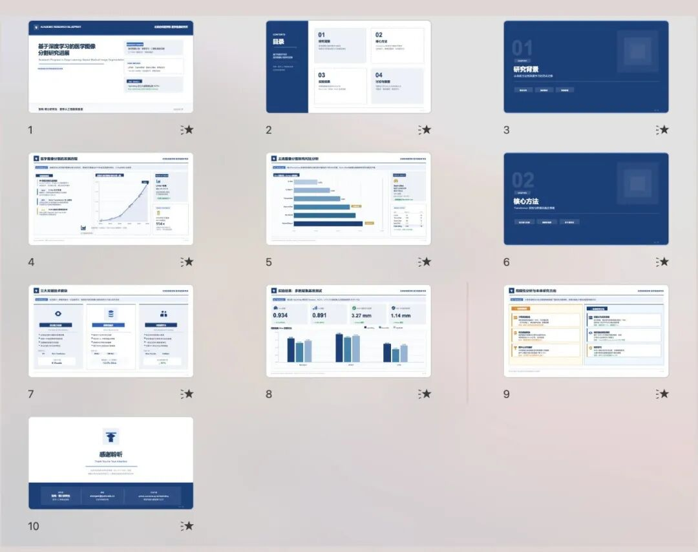
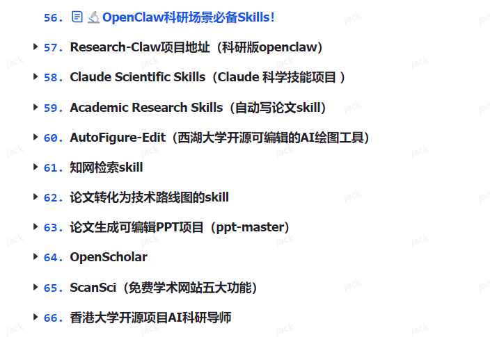

> 📎 来源: [AI学术圆桌派](https://mp.weixin.qq.com/s?__biz=Mzg3MjYzMDk0Nw==&mid=2247503301&idx=1&sn=0128e9ea3dfccdd69686f3a112cee81f&chksm=cfe2967c0a173931bc782a0679db4c34f9f0442a0139688f5c0713540716eb08ba71e3f18441&mpshare=1&scene=1&srcid=0430NNqbt1YHYQUIw2E1zgB6&sharer_shareinfo=5d208630b0605ee8caa4bb3bdabca96c&sharer_shareinfo_first=5d208630b0605ee8caa4bb3bdabca96c) | 时间: 2026-04-30 19:15

---

还在为论文答辩、课题汇报、课程课件熬夜做PPT吗？

几万字论文浓缩成十几页幻灯、逻辑梳理、排版配色、图表对齐……
别人半天搞不定，你用这个开源工具，**AI 全程代劳，直接输出可编辑PPT！**

今天给师生们安利一款近期爆火的学术生产力神器：
**PPT Master —— AI 驱动的 SVG 演示文稿生成系统**

**01**

**为什么它是师生刚需？**

**精准解决学术PPT三大痛**

**1. 内容难提炼：论文→PPT，缩编太费脑**

长篇论文、实验报告、文献综述，手动摘重点、搭框架动辄几小时。

**✅ PPT Master：**PDF/URL/Markdown 直接输入，AI自动拆解逻辑、生成标准学术大纲，研究背景→方法→结果→结论→展望一步到位。

**2. 排版太折磨：学术风不土、不花、够专业**

普通模板千篇一律，咨询级排版又学不会，图表、公式、代码块乱成一团。

**✅ PPT Master：**内置咨询级设计规范+CRAP原则，配色、留白、信息层级自动优化，学术严谨又高级，答辩/汇报直接加分。

**3. 改稿最崩溃：生成是图片，没法二次编辑**

很多AI PPT导出是整张图，文字改不了、图表动不了，等于白做。

**✅ PPT Master：**原生可编辑PPTX，所有文字、形状、矢量图都能在PowerPoint里直接改，Office 2016+完美兼容。

---

**02**

**专为学术场景打造的核心能力**

**1. 多角色AI协作，像请了专属PPT团队**

- **策略师** — 确认页数、版式、风格，把控学术逻辑
- **执行师** — 分页面生成SVG，自动排版、做图表
- **优化师** — 视觉精修，对标MBB顶级咨询质感
- **配图师** — AI生成高清无水印学术插图

**2. 学术场景全覆盖，师生全适配**

- **研究生：**毕业论文答辩、中期考核、课程报告、学术会议
- **老师：**课程课件、项目申报、成果汇报、讲座PPT
- 支持PPT 16:9、4:3、小红书、朋友圈等**10+画布尺寸**。

**3. 开源免费+本地安全，论文数据不外泄**

- 完全开源MIT协议，**无订阅、无水印、无功能限制**
- 除调用AI模型外，全程本地运行，敏感数据不上传第三方服务器。

**4. 现成学术案例，直接抄作业**

项目内置**15个完整项目、229页**高质量示例：

- 区域经济财政分析
- 学术论文格式规范
- AI代理架构研究
- 易经/禅意学术风
- 深色科技学术模板

拿来就能改，零基础也能做出专业级PPT。

---

**03**

**3分钟快速上手（师生友好版）**

**准备环境：Python 3.8+（简单安装即可）**

克隆项目：

git clone https://github.com/hugohe3/ppt-master.git cd ppt-master pip install -r requirements.txt

**初始化项目：**

python3 tools/project\_manager.py init 我的答辩PPT --format ppt169

**AI对话生成：**告诉AI"把这篇论文做成答辩PPT"，自动生成大纲+页面+讲稿

**导出PPTX：**

python3 tools/svg\_to\_pptx.py 项目路径 -s final

打开即可自由编辑文字、图表、配色。

---

**04**

**适合谁用？**

- **研一～博三：**答辩、开题、中期、会议汇报救星
- **高校教师：**批量做课件、申报书、成果展示
- **科研党：**论文可视化、数据图表自动排版

---

**05**

**最后说两句**

对师生来说，时间应该花在科研、教学、思考上，而不是耗在排版对齐。

**PPT Master** 把90%重复体力活交给AI，你只负责打磨内容与表达。

今年答辩、汇报、讲课，**别再熬夜做PPT了！**

**转发给同门、课题组，一起解放双手～**

扫码领取如下AI学术籽料

自动回复第一个链接里有
