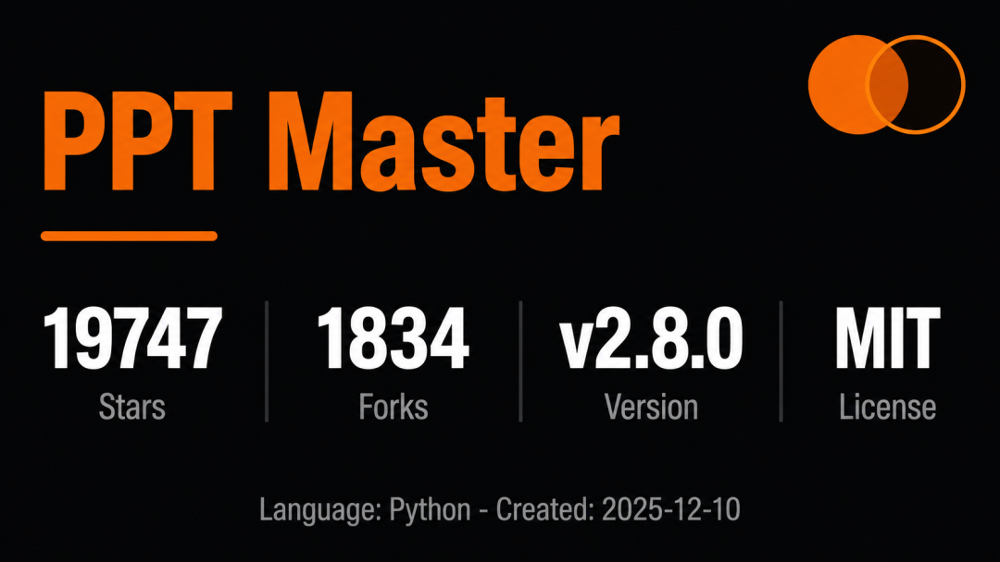
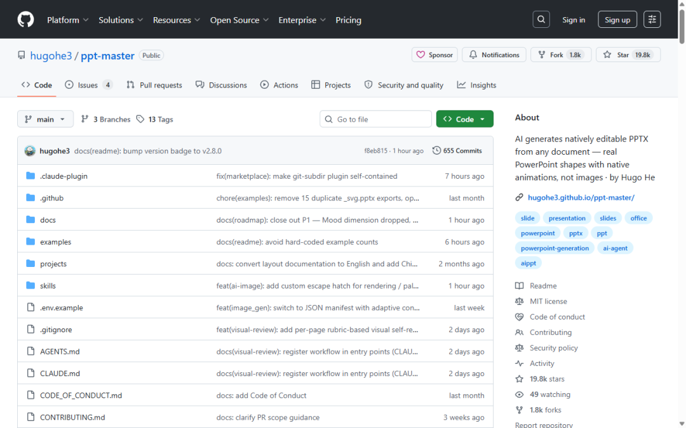

> 📎 来源: [码途日志](https://mp.weixin.qq.com/s?__biz=MzYzNjg2OTgzMQ==&mid=2247484193&idx=1&sn=c01025788ceb260e1bee2f7ab400cbd4&chksm=f1613acefb3b1a24bfb45c0ff959d12d8218b9a1d90414acfd6852fdd154ab4acc9606e7299d&mpshare=1&scene=1&srcid=05256xFlS8bjSm76U8cTzUwr&sharer_shareinfo=ff9d13f6c5daacdde1920dc2de157098&sharer_shareinfo_first=ff9d13f6c5daacdde1920dc2de157098) | 时间: 2026-05-25 19:53

---

# PPT Master：AI 造 PPT 的正确姿势

市面上的 AI PPT 工具几乎都在做同一件事：把每页变成一张图片塞进 PPTX。好看，但改不了。Gamma、美图、Canva——全是这个套路。**PPT Master 选择了更难的路：生成真正的 DrawingML 形状**。文字框、图表、图形，每一个元素都是原生 PowerPoint 对象，点一下就编辑。

上线 5 个月，**19,747 stars****，1,834 forks**。作者 Hugo He 是注册会计师出身，日常审阅上百页投资咨询 PPT，对"改不了"这件事零容忍。

## 它怎么工作的

不需要打开任何新工具。在 Claude Code、Cursor 或 VS Code Copilot 里跟 AI 对话就行——扔进去一个 PDF、DOCX、URL 或者 Markdown，AI 分析内容、设计视觉、生成 SVG、最后转成原生 `.pptx` 输出。全程在本地跑，文件不上传第三方。

成本极度透明：工具开源免费，唯一的开销是你的 AI 模型调用费。用 VS Code Copilot 生成一份 PPT **低至 $0.08**。

**v2.8.0 今天刚发**，三个值得看的变化：

**•****Live Preview 进主流程了**。生成过程中浏览器自动打开实时预览，点击任意元素写标注，回聊天框说"apply my annotations"，AI 直接改对应区域的 SVG 并重新导出 PPTX。不再需要截图→标注→描述→等改→再截图这种地狱循环。

**•****模板架构拆成三种独立形态**。brand（品牌色/字体/Logo）、layout（画布/页面节奏/SVG 结构）、deck（完整复刻），三者可任意组合。brand + layout + deck 三段式融合，Git 风格的冲突处理——同类型多个来源时按段对比，用户逐段选。

**•****AI 生图加了三重锁**。rendering × palette × type 三维锁定系统，Strategist 给出 ≥3 个候选方案而非单一默认选择，Image\_Generator 消费固定合约不再每张图重新决策。还加了一个 `custom` 逃逸出口——当预设库装不下你那个武侠风水墨风格时，用一段自然语言直接注入 prompt。

## 开发者为什么该看

这不只是一个 PPT 工具。它证明了两件事：

**第一，agent 驱动的 workflow 比 SaaS 更靠谱**。 PPT Master 本质上是一套 SKILL.md 工作流跑在 AI IDE 里，零后端、零数据库、零订阅。22 个示例项目、309+ 页的设计多样性，全是同一套规则 + 不同 AI 对话跑出来的。

**第二，"可编辑"这个看似基础的要求，多数产品做不到**。 图像式 PPT 省了技术复杂度，但丢了可用性。PPT Master 用 SVG → DrawingML 的转换管线把这个缺口填上了，包括图案填充、饼图弧线端点修正、旋转 pivot 修复这些细节。

附带一套完整的多格式输出能力：画布规格覆盖 PPT 16:9、小红书、微信朋友圈等 10+ 种格式；动画和页面切换用原生 OOXML 而非嵌入视频；语音旁白支持 90+ 语种并可嵌入 PPTX 导出 MP4；还支持 ElevenLabs/MiniMax 的克隆声音。

项目在 GitHub 以每周两个版本的速度迭代，今天刚发的 v2.8.0 把 Live Preview 推进了主流程——这是社区呼声最高的功能。开源、MIT 协议、本地运行。

> 地址：github.com/hugohe3/ppt-master[1]

---

📎 参考来源

[1] github.com/hugohe3/ppt-master: https://github.com/hugohe3/ppt-master
