> 📎 来源: [网罗灯下黑](https://mp.weixin.qq.com/s?__biz=MzU2NTAzNzYzMg==&mid=2247640680&idx=1&sn=2d7fd748a6c61f2632d66ca1f8125523&chksm=fdb39b560cc9db0f906eea7357fa2a6861f2468e02b8e7fd33564965236489a001e8d1d74d8c&mpshare=1&scene=1&srcid=0430cuB49kTaUIeG4YgxWudJ&sharer_shareinfo=873667d96449af76095e91f6b3a418fa&sharer_shareinfo_first=873667d96449af76095e91f6b3a418fa) | 时间: 2026-04-30 18:26

---

过去这一两年，做 AI 生成 PPT 的工具简直是大爆发，我也给你们安利过不少。但是，用起来依然还是有一种无力感。

因为现在的 AI 写 PPT，其实本质上说是在用代码写网页。它主要靠自主发挥，排版虽然很炫酷，但在真实的商业汇报和生活场景里，很多时候我们最需要的其实并不是创意。

比如说，领导看中了一个高大上的极简模板，就是让你照着做；公司的品牌部门规定了死板的 VI 视觉规范；或者甲方爸爸就扔给你一张图，说我就要这种感觉。

这时候，那些只会自主发挥的 AI 就像个听不懂人话的熊孩子。我们需要的，就是按照指定素材或者模版去设置，这是命题作文。

年前的时候我在留言区看到也有不少粉丝问到这个需求，当时有小伙伴回了一句，推荐了商汤的办公小浣熊，可以自定义 PPT 模板。

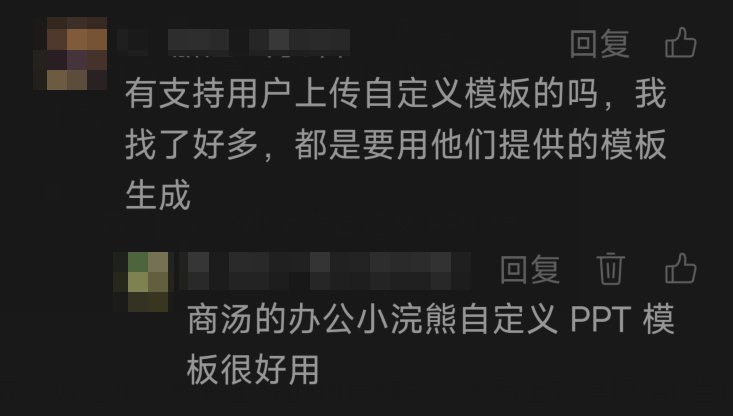

这个办公小浣熊我还真没听过，我查了一下，原来是商汤出品的，最近新上线的创意模式，真正实现了可控的风格型 PPT。

过年的时候我就体验了一次，觉得非常值得推荐给大家。

网址：office.xiaohuanxiong.com/home?utm\_source=wldxh

完成女儿寒假作业

为啥说是过年的时候呢，因为我小女儿的寒假作业里面有这个要求。。。

老师要求孩子们汇报一下寒假生活，甚至还要用 PPT 在班里做展示。

得嘞，这活还不得是交给老父亲上阵嘛。

我把她写的作文转为了一篇文档《我的寒假生活》。内容写得挺有模有样，她还给我说：爸爸，我最喜欢小猪佩奇了，我的 PPT 必须是小猪佩奇风格的，到时候要在班里做个显眼包。

这要是放在以前，我绝对头大如斗。但这次我想到了粉丝在留言区的推荐，那就拿这个小浣熊来试试看，不行再说呗。

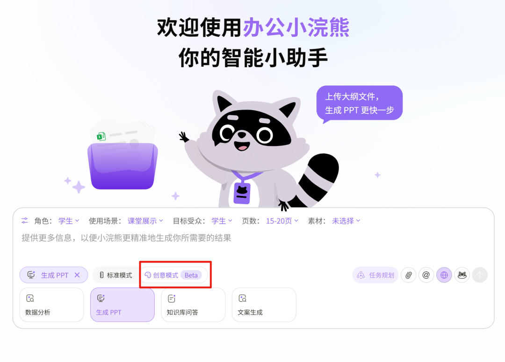

我把女儿那篇作文直接扔给了办公小浣熊，并在素材中心上传了几张小猪佩奇主题 PPT 的截图。

告诉它：把《我的寒假生活》这份文档生成一个PPT，主题风格参考素材中选择的几张图片

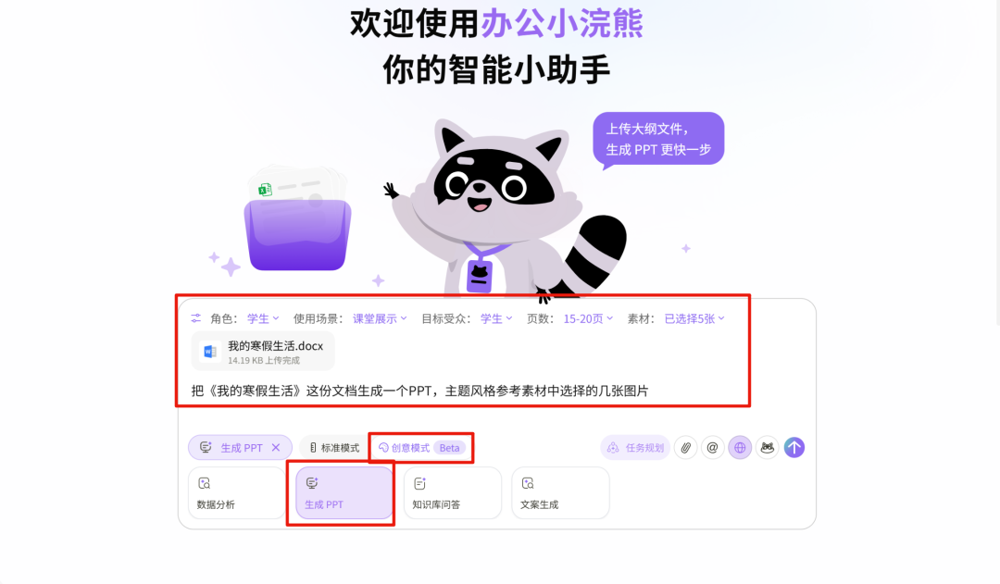

说实话，这次新上的素材库简直是定制 PPT 的效率神器：它允许你一次性甩给它最多 20 张、单张 1MB 以内的专属配图或 logo，个人库最高能囤 100 张！ 

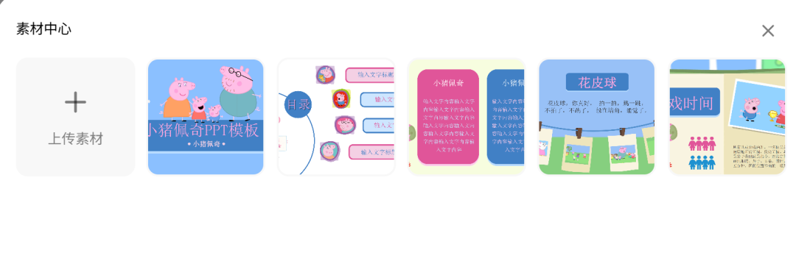

好了，开始任务后，点击生成，它根据你的内容和选择的场景和你确认一些问题，比如我第一次就选错使用场景了，它就会非常谨慎的再和你确认一下。

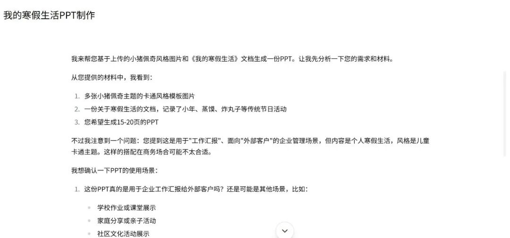

没有问题后，接下来就是生成大纲内容。

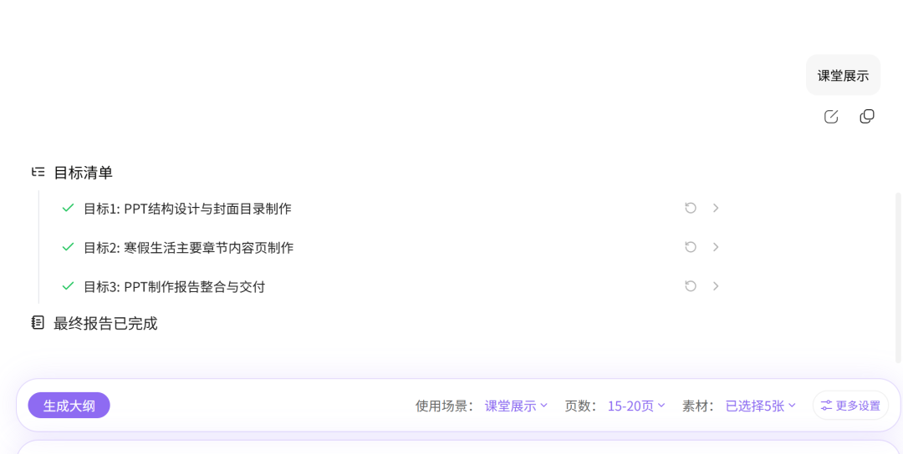

大纲生成后觉得不合适还可以重新生成或者修改，以免生成的 PPT 有问题。

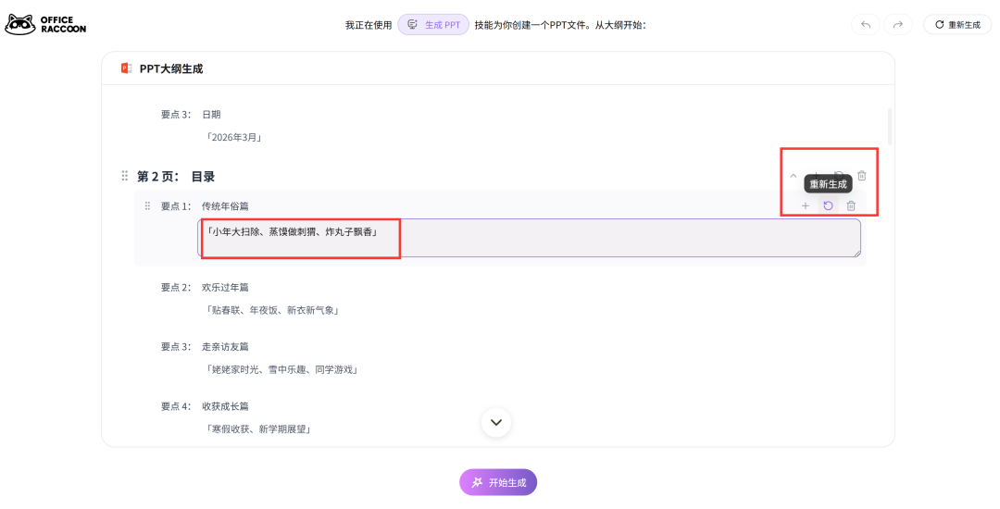

大纲无误后就可以生成 PPT 内容了，接下来就是见证奇迹的开盲盒时刻。

卧槽，这个结果真的让我惊艳到了，远超预期！

它绝不是简单地把小猪佩奇的图片当成背景图糊在后面，而是完美解析了参考图片的粉色系色调、圆润的字体边框、以及那种童真可爱的排版逻辑。

更厉害的是，AI 生成的配图，完全贴合了女儿的作文内容，加上了很多过年的元素，这是我完全没想到的。

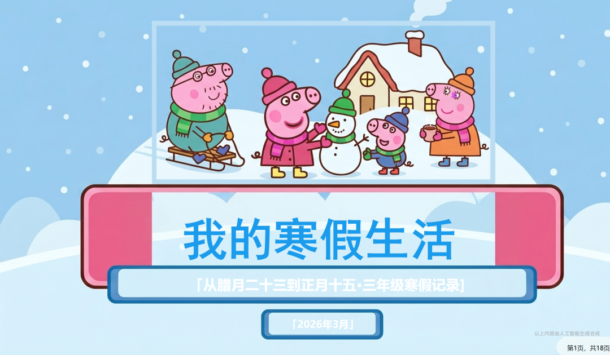

第一章传统春节习俗体验这一页，背景图片中完全都是新年的氛围，小猪佩奇全家也都穿上了新年主题衣服。

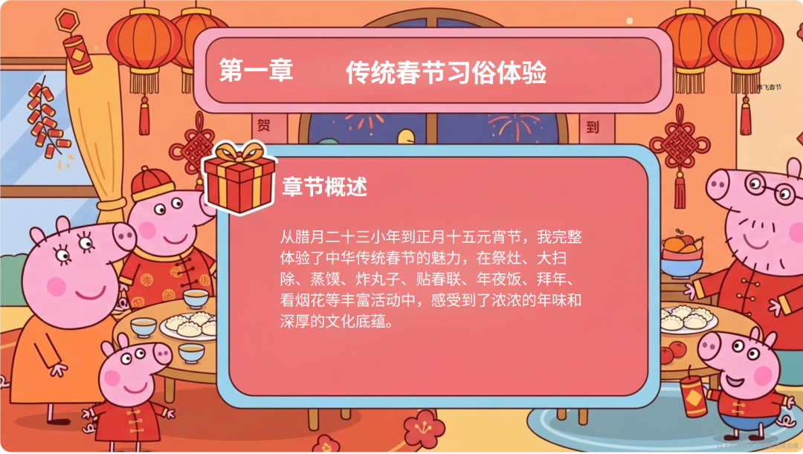

比如讲到腊月二十三小年祭灶这一页，它用可爱的卡通气泡框把文字包裹起来，旁边还配上了契合主题的小插画。

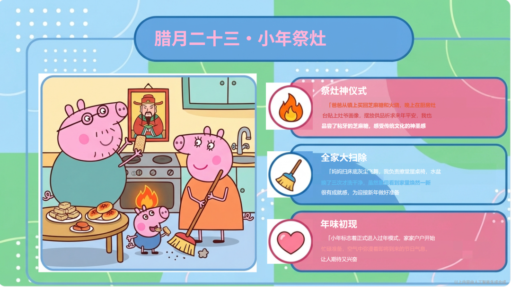

讲到下雪的时候，整个页面的视觉氛围直接拉满，这是真带着脑子在做命题作文啊。

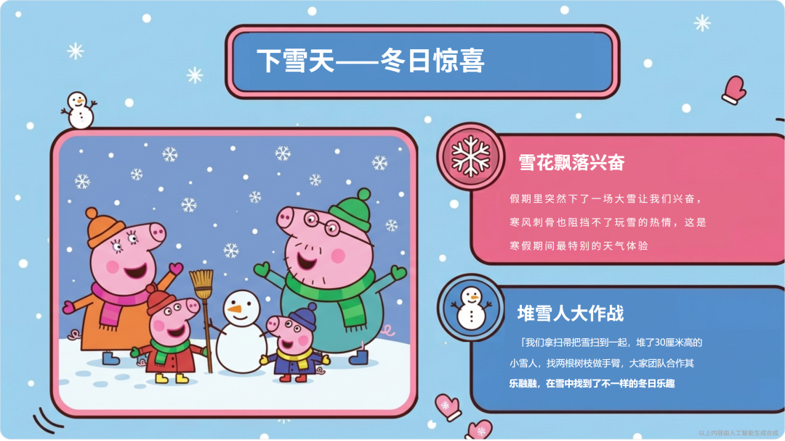

而且关键是每张生成的风格都是出奇的一致，尤其是小猪佩奇的形象。

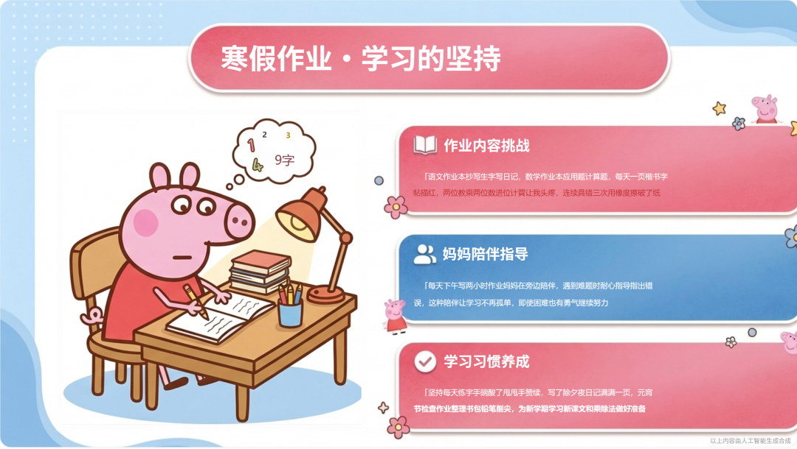

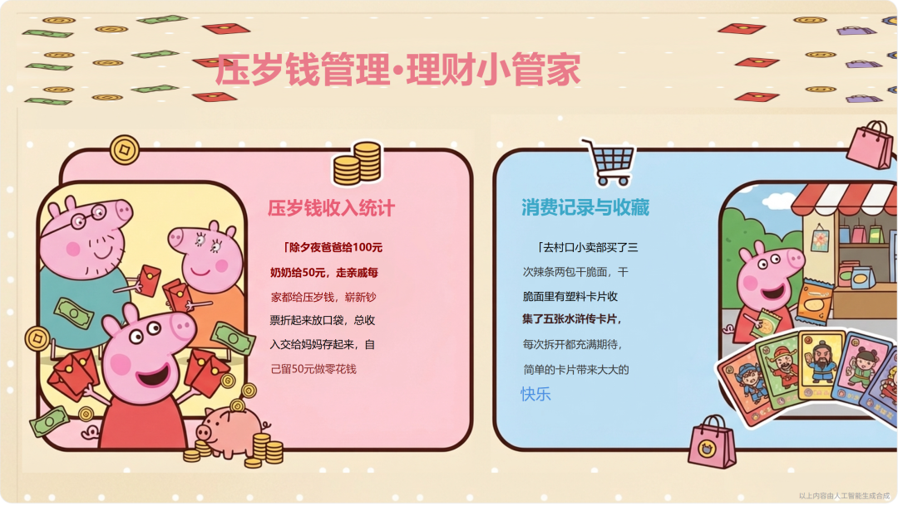

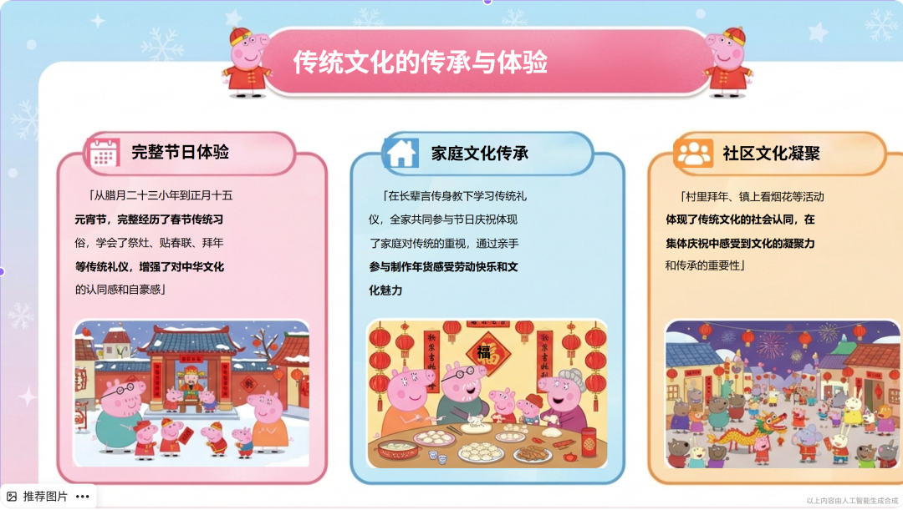

当然，它也不是只会一锤子买卖，哪里有问题还可以支持微调。

比如，它支持针对 PPT 某页进行一键重绘，文本进行各种修改，上传新的图片和图表。

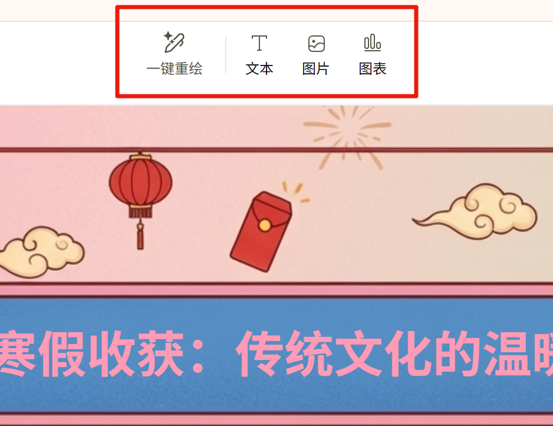

这个文本修改不少 AI 生成 PPT 时都有这个功能了，但是上传新的图片和图表以及一键重绘就基本没见过，目前也就办公小浣熊独有这个功能。

女儿看到成片后，高兴得在客厅里直蹦跶，都来不及等开学，就已经在微信上发给她同学得瑟了。。

完成行业分享

本来只是试试看，结果这效果是出乎意料得好。让我彻底爱上了这个功能。

这两天，接到一个邀请，要去参加一个 AI 自媒体行业分享会，分享这 8 年做 AI 自媒体的历程，需要做一个高大上的 PPT。

题目我都想好了：《自媒体八年历程：看见周期，服从内心》。

我喜欢的的风格是：极简、高级、充满科技感，有点科技发布会的风格。

于是，我故技重施。我找了一套极简深色系 PPT 截图，上传到素材库作为参考，然后把演讲稿喂了进去。

该说不说，小浣熊的生成速度不算快，所以你大可不必一直盯着。

现在支持「异步生成」。也就是说，现在我点完生成，直接切出去刷 B 站，它在后台自己跑，跑完通知我。极度丝滑。

大家看一看对比，这是我上传的图片。

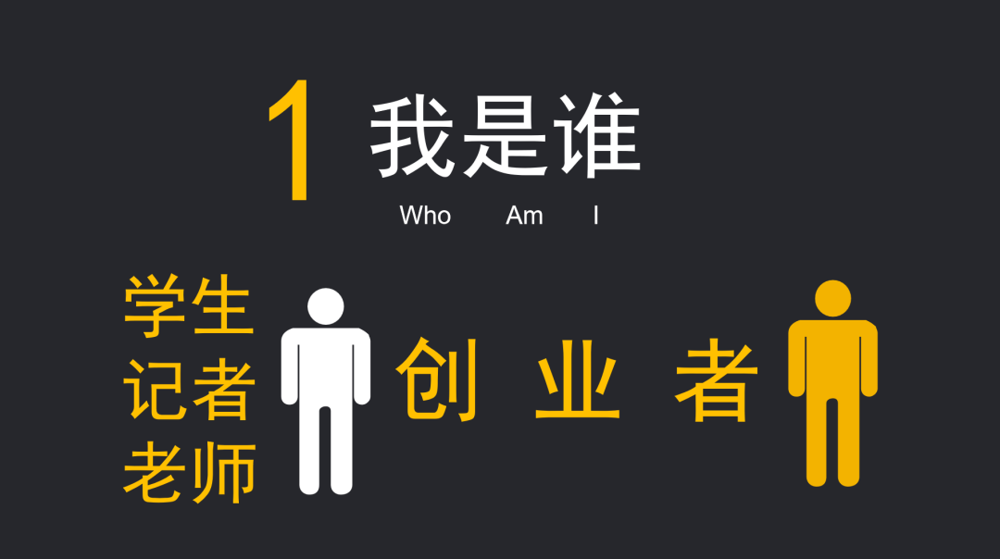

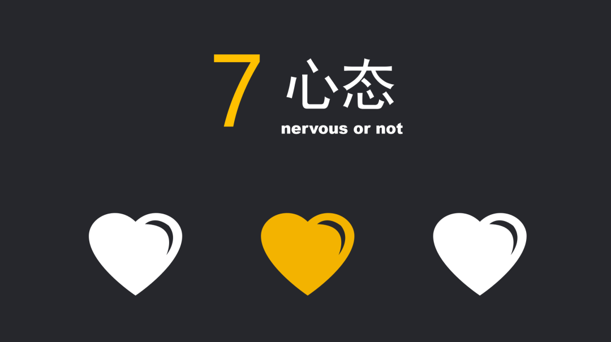

这是办公小浣熊给我生成的 PPT。

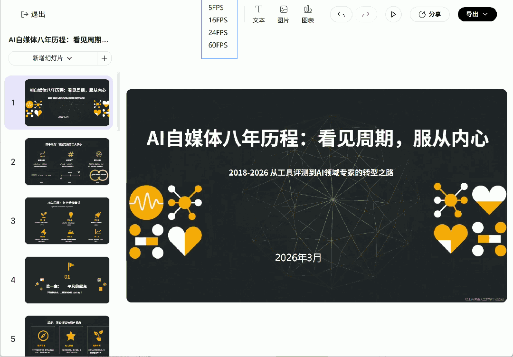

风格非常相似，真的是我要的这种感觉，这比 AI 自由发挥还是心里有谱的多。

它精准地抓住了深色背景、高对比度文字、大面积留白以及核心数字突出的视觉精髓。

如果不说，你应该也会以为这就是同一个设计师用同一个 PPT 模板做出来的吧？

内置模版库

当然了，我知道你们肯定有不少懒人，手头根本没有心仪的参考图片，就想快速搞定一个 PPT 准点下班。

没关系，不管是标准模式还是创意模式，它都提供了一个庞大的内置模版库：即选即用的风格型 PPT。

这次不仅新增了海量模板，还极其听劝地支持了「风格关键词搜索」。 这里的每一个模板都能提前预览风格图片。你一眼看过去，喜欢哪个商务风，直接搜，直接点选。

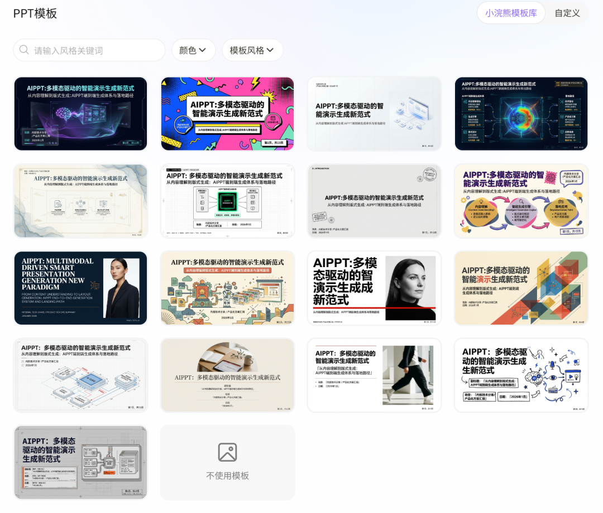

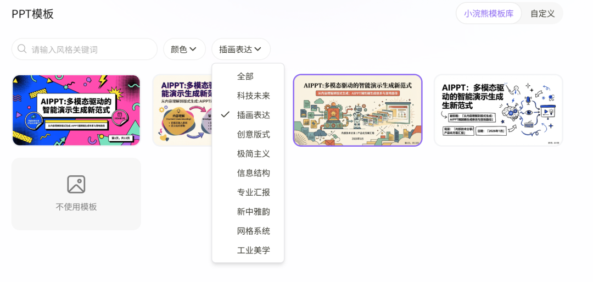

最牛逼的一点是，它的风格极度稳定。你完全不需要满头大汗地反复调提示词，选中了什么风格，出来的就是什么风格，真正做到了视觉上的绝对统一。

所见即最后所得，非常适合被老板催着马上交稿的极限场景。

另外，办公小浣熊现在打通了全平台。除了网页版外，还支持 iOS 移动端、电脑桌面端甚至小程序版（微信内搜索 **Raccoon 智能助手），这里实名求早点上线安卓版。**

你可以在地铁上用手机上梳理大纲，到了公司打开电脑网页版直接生成和排版，下班路上掏出手机无缝流转随时修改。

其实，除了这个 PPT 生成功能， 办公小浣熊定位的是全能的 AI 办公助手，它连数据分析、任务规划、长文档总结这些打工人的重灾区都能一站式包揽。

如果你遇到一堆密密麻麻的 Excel 数据报表，或者紧急排一个项目计划，别头疼，直接丢给小浣熊，几秒钟就能给你梳理出清晰的结论和执行步骤。

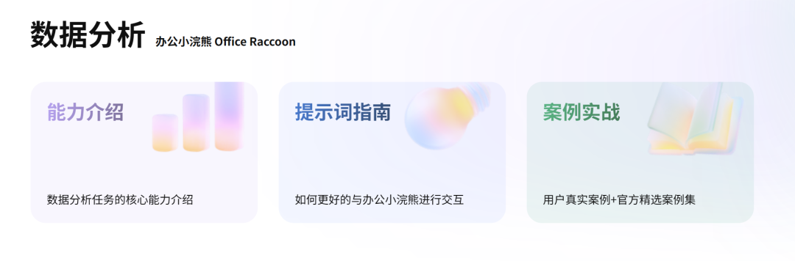

结语

按惯例，我想把视角拉远一点。

过去这两年，AI 生成 PPT 工具大爆发，但在完成命题作文的时候就有心无力，虽然创意十足，但却不太听话。但在真实商业环境里，一致性和可控永远大于瞎发散。

办公小浣熊这次的创意模式，开始支持单页对话修改，开始学会严格模仿指定的模板风格，老老实实地接过了排版、配图、对齐这些机械性的体力活。

这才真正从一个玩具变成了一个工具。AI 终于收起了它的小脾气，变成了一个的确定性系统。

听话的 AI，是它不再裹挟你的品味，而是乖乖融入你的工作流，为你降本增效。

很高兴，办公小浣熊做到了。

对了，最近办公小浣熊有一个开工隐藏彩蛋：即日起至 3 月 31 日，升级会员立享 5 折，再加赠 15 天，还有周边好礼等你拿！

接下来是福利时间：请大家踊跃评论留言，后续会抽 10 个小伙伴们的优质评论赠送周卡会员兑换码。

