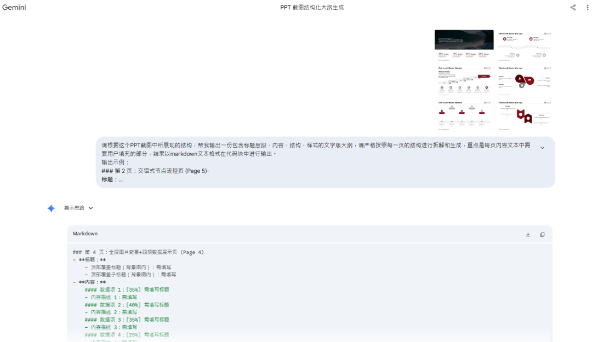
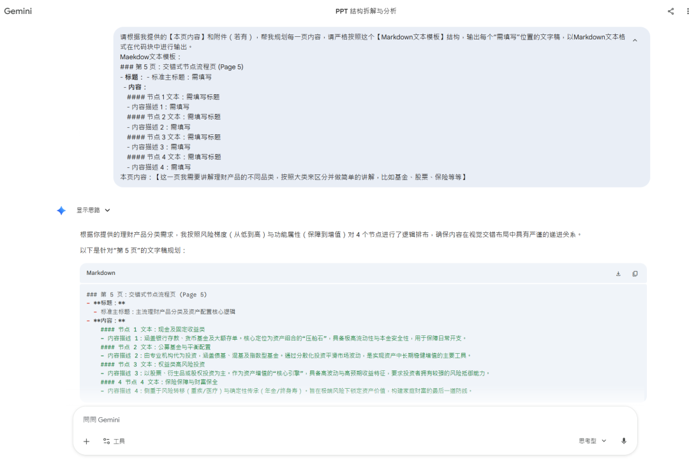
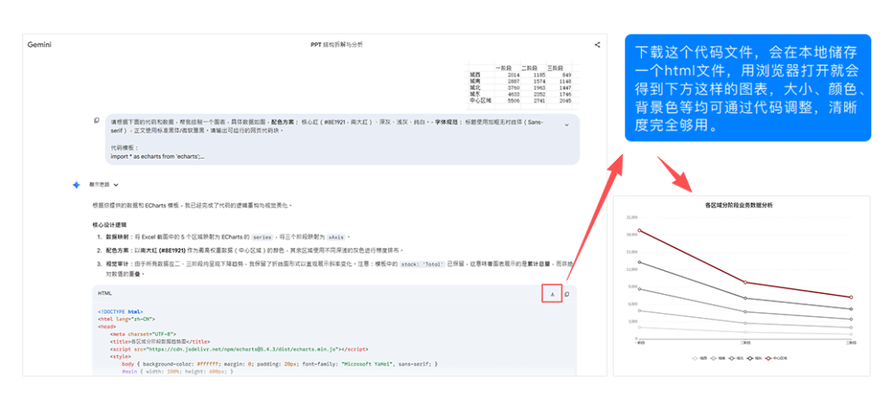

> 📎 来源: [1个v站](https://mp.weixin.qq.com/s?__biz=MzYzNDA1MDI2Mg==&mid=2247483740&idx=1&sn=100ed473d0cb4e8b0de69ac91ee7ed60&chksm=f18e0202fde7cb9898a18aea5b37a6aa2acd26c0400466cf17c1bc034e5d09b326e791493761&mpshare=1&scene=1&srcid=042938Z0OeTU4KCtgMEqoa77&sharer_shareinfo=65addc9335af19768a49c872234683e9&sharer_shareinfo_first=65addc9335af19768a49c872234683e9) | 时间: 2026-04-29 11:48

---

经过前面文章的[判断](https://mp.weixin.qq.com/s?__biz=MzYzNDA1MDI2Mg==&mid=2247483714&idx=1&sn=d4ddcc22a918f2331155269d485cbc10&scene=21#wechat_redirect)，或者亲自跑过一遍[敏捷流](https://mp.weixin.qq.com/s?__biz=MzYzNDA1MDI2Mg==&mid=2247483730&idx=1&sn=b8b4b7401343e9a0850e86628b5e302c&scene=21#wechat_redirect)之后，你可能会发现，有些PPT，AI的产出就是达不到要求，这类文档本身的要求确实更高——视觉必须严格符合企业VI规范，数据必须精准可溯源，逻辑链条必须绝对闭环...这类文档容不下任何一个“差不多”。可是如果选择传统手搓制作，成功率有保障，但代价是时间和精力的全面投入。在AI已经能承担大量执行工作的今天，全程手动是一种资源浪费。

所以精工流要解决的就是这个问题：不降低标准，但也不放弃AI能帮你省掉的那部分成本。它不是“一键生成”的升级版，而是一套以人为主导、以AI为执行层的协作系统——你来把关每一个关键节点，AI来完成中间那些耗时但不需要你亲自逐字完成的工作。

如果你的PPT属于这个范畴，这篇文章接下来的内容值得认真读完。

精工流的本质，是在你熟悉的工作方式里，让AI加入进来做它最擅长的那部分。主线还是在PowerPoint或WPS里完成——创作、排版、视觉呈现...这些你掌控；AI Chat窗口是支线，在需要的节点介入，承担内容处理、文案打磨、图表生成这类耗时但不需要你亲自逐字完成的工作。它不替你做决策，不替你把关质量，只替你节省掉那些消耗时间却不需要消耗判断力的环节。这是精工流和“一键生成”最根本的区别：你始终是主导者，AI是工具，不是外包对象。


## 第1步：

## 获取文字大纲模板

先回顾下我们上次讲过的PPT骨架【封面+目录+章节封面+内容页+封底】以及内容页核心【大标题→小标题→文本块→修饰文字】，我们手动制作PPT的时候也绕不开这个框架。

在办公软件中打开符合企业VI要求的PPT模板，浏览下这个模板的标题层级，这个层级决定了内容页的格式约束。在这一次使用这个模板时，可以试试将模板图片上传到Gemini之类的AI窗口中，让AI根据模板图片反推出一个对应的PPT文字模板，一次处理后续都可以重复使用。

```
【先上传你的PPT模板】
```

< 提示词参考，可复制修改后使用


< Gemini对话窗口示例，网站需要魔法网络
得到的PPT大纲模板文字版效果示例：

```
### 第 4 页：全屏图片背景+四项数据展示页 (Page 4)
```

< PPT设计结构文字化示例，节选4-9页。供参考
这一步的目的，是为整份PPT构建一个完整的文字底稿结构模板，用来约束AI后续的辅助生成。


第2步：

## 根据文字大纲模板处理正文内容

我们需要先根据本次PPT的主题来确定大纲的章节结构，然后再逐章或者逐页处理内容，这样能精细化处理每部分内容，尽可能的确保上下文流畅的衔接和逻辑的闭环。在处理每一部分的内容时，你可以先用自然语言描述这部分需要讲清楚什么事情，再把这份文字版大纲模板作为格式约束一并提供给AI——它会以这个格式为边界，对你提供的原始信息进行相应处理：压缩提炼信息量大的段落，整理改写表达散乱的笔记，判断取舍超出篇幅的内容...

```
请根据我提供的【本页内容】和附件（若有），帮我规划这一页内容，请严格按照这个【Markdown文本模板】结构，输出每个“需填写”位置的文字稿，以Markdown文本格式在代码块中进行输出。
```

< 提示词示例，可复制修改后使用
根据这个指令，我以“讲解理财产品”为案例内容，得到的效果是这样的：



< Gemini对话窗口示例，网站需要魔法网络
这个过程的关键在于：AI始终在你给定的格式框架内工作，输出的每一块内容都直接对应PPT里的一个具体位置——这页的大标题、这页的小标题、这页的文本块。

它不是在帮你“生成PPT”，而是在帮你完成一件过去最耗脑力的事：把杂乱的原始信息，按照每一页的设计位置，拆解成刚好能放进去的内容块。

这个动作看起来简单，但在没有AI之前，它是做PPT过程中最消耗精力的部分——你需要反复判断这句话该放哪、这段内容该怎么缩、这个数据该以什么形式呈现。现在这部分工作可以大量交出去，你只需要在AI完成之后，做最后一轮判断：它填进去的内容，是不是你真正想说的那件事。

内容与格式匹配完成之后，逐一粘贴进对应的文本框，这一页的模板嵌套就完成了。逐章、逐页重复这个动作，就能建立起整份PPT的文字底稿。


第3步：

数据图表

在PPT的实际制作过程中，我们又难免会遇到数据展示的需求，但是图表是一个需要单独处理的环节。

让AI直接生成图表，目前准确性普遍不可靠——数字对不上、比例失真、样式无法控制。但有一个更稳的做法：让AI生成图表的网页代码，而不是图表本身。

操作流程是这样的：把图表类型、具体数值、标注项、颜色和字体要求一并告诉AI，让它输出对应的网页代码。把代码保存为HTML文件，用浏览器打开，截图，贴进PPT。

这个做法解决了两个问题：清晰度由浏览器渲染保证，数值准确性由你提供的原始数据保证——AI只负责生成代码框架，不负责"发明"数字。



< Gemini对话窗口示例，网站需要魔法网络
**图表代码参考资源：** Apache ECharts示例库，涵盖了绝大多数常见图表类型，每个示例都可以一键复制源代码，图表超全，完全免费，直接交给AI修改数值和样式即可，公众号回复“ 图表 ”获得链接。


第4步：

## 设定AI观众

## 文字与图表都处理完毕，初稿就制作完成了，但精工流的价值，不止于做出一份好文件。初稿完成不等于可以成功演示。

## 一份PPT最终要面对的是真实的听众，而不仅仅是你自己——你觉得逻辑清晰的地方，听众未必这么认为；你觉得数据一目了然的图表，听众可能有完全不同的解读。所以我推荐的做法是：给AI一个角色设定，让它扮演你真实的听众，和你逐页过一遍PPT的内容。

比如这份PPT是向销售总监汇报的，就让AI以"销售总监"的身份进入对话，站在这个角色的立场上对你的内容提问、质疑、反馈。你也可以让AI同时扮演多个观众角色，从不同的专业角度来推敲这份内容。

这相当于在正式演示之前，提前完成了一次模拟彩排——把可能在会议室里被追问的问题，提前在对话框里暴露出来。

```
# Role
```

< 提示词示例参考，可复制修改后使用
但是这个环节的质量，取决于你的角色设定有多精准。设定越贴近真实听众——他的职级、他的关注点、他最在意的业务指标以及他的性格特质、偏好... AI给出的反馈就越有实战价值。如果你的角色设定敷衍，那这一步就只是走个形式。

走完这一轮模拟，你会发现真正需要修改的地方，往往不是视觉，而是表达。某页的核心句没说清楚，某个数据的呈现方式会引发误读，某个结论跳得太快让人跟不上——这些问题在你自己反复看稿时很难发现，但换一个角色站在对面，它们会自然浮出来。

传统做法里，这一步叫“找人帮你过一遍”。但能随时配合你、又真正理解你汇报对象背景的人，现实中很难找。AI在这里填补的，正是这个空缺。

这也是精工流和[敏捷流](https://mp.weixin.qq.com/s?__biz=MzYzNDA1MDI2Mg==&mid=2247483730&idx=1&sn=b8b4b7401343e9a0850e86628b5e302c&scene=21#wechat_redirect)各自适配不同场景的根本原因。[敏捷流](https://mp.weixin.qq.com/s?__biz=MzYzNDA1MDI2Mg==&mid=2247483730&idx=1&sn=b8b4b7401343e9a0850e86628b5e302c&scene=21#wechat_redirect)的终点是一份完成的文件，目标是快；精工流的终点是一场准备充分的汇报，目标是稳。两者没有高下，只有场景是否匹配。多出来的这些步骤——格式约束、逐章核查、模拟彩排——不是在把流程复杂化，而是在把风险提前消化掉。

文件发出去之前，你已经在对话框里经历过一次挑剔的审查。真正走进会议室的时候，你准备的不只是一份PPT，而是对每一个可能被追问的问题，都已经有了答案。

毕竟，AI与PPT只是手段，能成功完成这次演讲才是目的。
