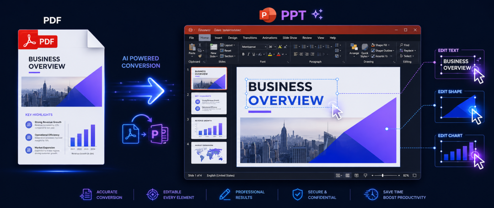
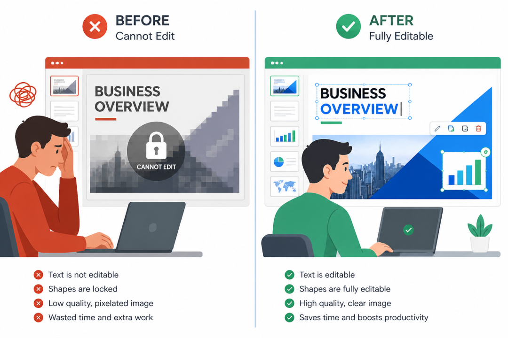
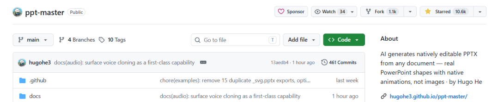
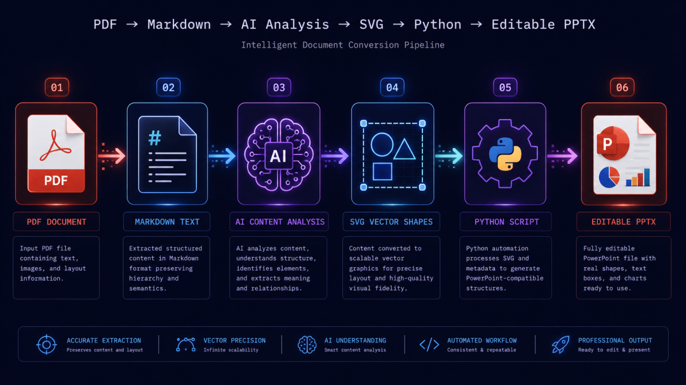
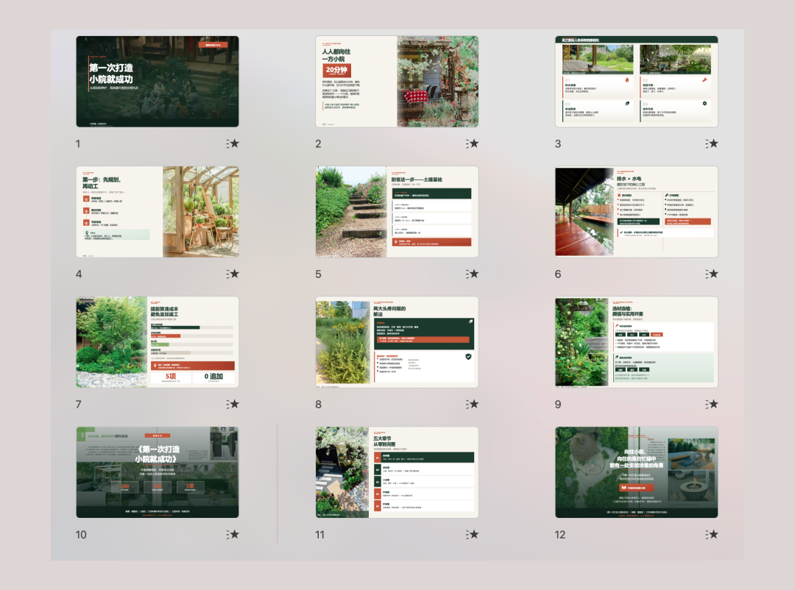
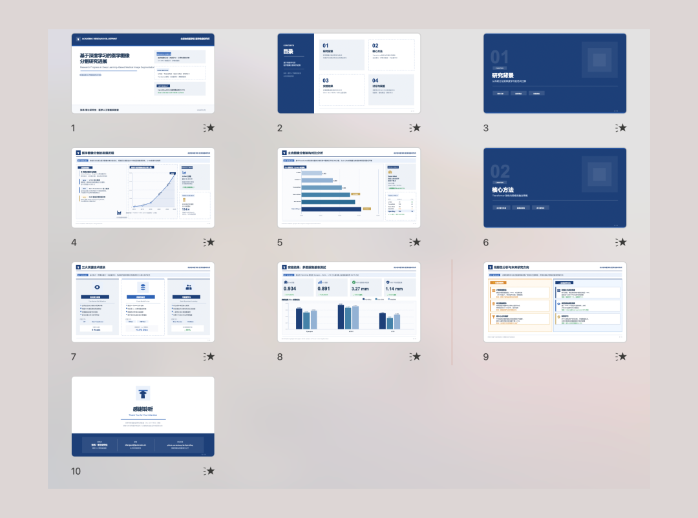
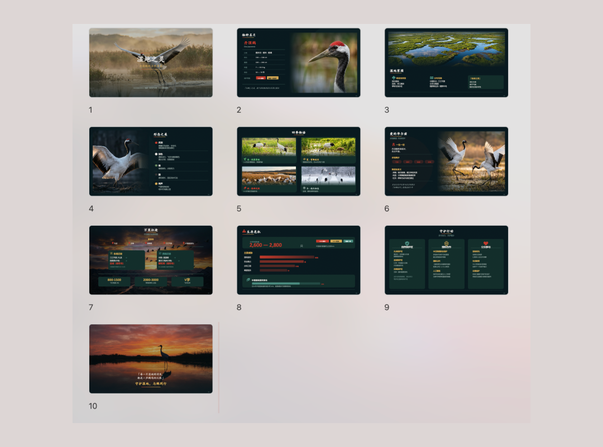
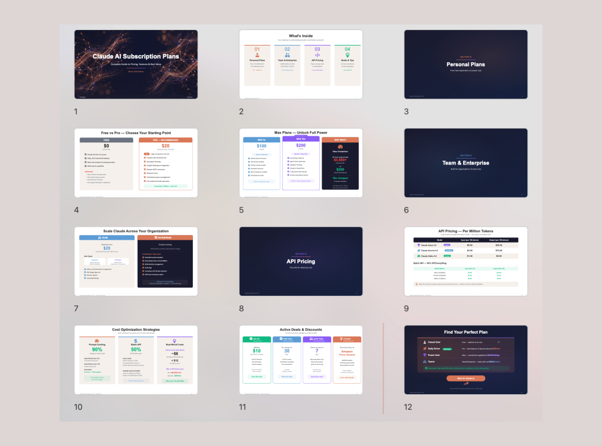
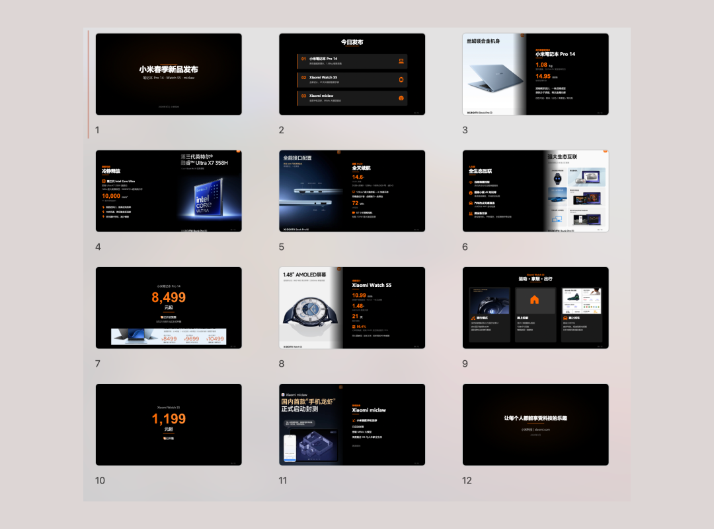

> 📎 来源: [顾北 AI](https://mp.weixin.qq.com/s?__biz=Mzg5ODk3NDc3MA==&mid=2247488867&idx=1&sn=95a01f1ce7759f70cb985097f60c22bd&chksm=c1576b81edaaa03806bbe55616a3db9453451a77f8306bcf8733b89fd01977623cc17900cc5a&mpshare=1&scene=1&srcid=0506assu2KKjtreuqhBbwRrE&sharer_shareinfo=4b239db085438837b9e8d2668e24b2a3&sharer_shareinfo_first=4b239db085438837b9e8d2668e24b2a3) | 时间: 2026-05-06 03:38

---

> 摘要：PPT Master 是一个开源工具，能把 PDF、网页、Word 等任意文档转换成**原生可编辑的 PowerPoint 文件。**不是图片，是真正的形状、文本框、图表。本文深度拆解它的技术路线、使用方法，以及它到底值不值得你花 15 分钟配置。



---

## 我被 AI PPT 工具"坑"过

说一个真实场景：你花 30 秒把一份 PDF 丢进某款 AI PPT 工具，10 秒后拿到了一份颜值不错的演示文稿。

如果你想打开 PowerPoint，改一行字。

你会发现，点不进去。那不是文字，是图片。

这个问题几乎所有主流 AI PPT 工具都有。

Gamma 生成的是网页渲染；Canva AI 导出的是图片嵌套；用 ChatGPT 生成 python-pptx 代码，布局是枯燥的文本框堆叠；NanoBanana 和 GPT-Image-2 虽然生成的PPT样式好看，但终究也只是图片。颜值和可编辑性，好像永远只能二选一。

直到我看到 **PPT Master** 这个项目。



---

## 这是什么？

**PPT Master** 是一个开源项目，GitHub 地址 

```
hugohe3/ppt-master
```

，目前已有 **10600+ Star**，MIT 开源协议。



一句话描述：**丢进一份文档（PDF、DOCX、URL、Markdown），AI 生成一份能在 PowerPoint 里直接点击编辑的 .pptx 文件。**

"能编辑"这三个字，这个项目是认真的——每个形状、文本框、渐变、阴影都是 DrawingML 原生对象，不是嵌入的图片，不需要"转换为形状"，点哪改哪。

它的作者叫 Hugo He（何雨果），是一位金融从业者（CPA + 投融资咨询工程师）。他自述道：

> "我每天都在做 PPT。现有的 AI 工具导出的是图片，作为每天要审阅、修改几十份演示文稿的人，这是不可接受的。我想要真正的 DrawingML——点任何元素，直接修改，就像手工做的一样。"

一个用业务痛点驱动的开源项目，通常比"技术驱动"的项目更知道用户要什么。

---

## 核心技术路线：为什么别人做不到，它做到了

这里值得展开说，因为技术路线决定了为什么这个工具的输出质量能这么高。

### 市面上主流 AI PPT 工具的三条路

**路线一：贴图片**把每页渲染成图片嵌进 PPTX。看起来精美，但文字不可选，颜色不可改，缩放模糊——本质是截图。

**路线二：HTML/CSS 渲染**Gamma、Tome 这类工具在浏览器里效果很好，但 HTML 是文档流，PPTX 是画布，导出时布局走样、字体丢失、元素被压扁是家常便饭。

**路线三：python-pptx 直接生成**ChatGPT 之类用代码构建 PPTX，元素可编辑，但 AI 缺乏生成复杂设计的"训练数据"，只能做基础文本框+列表，颜值惨不忍睹。

### PPT Master 走的第四条路：AI 生成 SVG → 脚本转 DrawingML

这条路能走通的核心洞察是：**SVG 和 DrawingML 本质上是同一类东西。**

两者都是基于绝对坐标的 2D 矢量格式，矩形、路径、渐变、阴影的概念一一对应。把 SVG 转成 DrawingML 是"方言翻译"，不是格式跨越。

整个工作流大致如下：

```
输入文档（PDF/DOCX/URL）    ↓[预处理] 文档转 Markdown    ↓[内容分析] AI 提取结构、要点、数据    ↓[视觉生成] AI 逐页生成 SVG（这是设计稿）    ↓[后处理] Python 脚本将 SVG 转换为 DrawingML    ↓输出：原生可编辑 .pptx（+ SVG 参考版）
```

AI 负责设计（它很擅长生成 SVG），Python 脚本负责工程化转换（精确可靠）。两者各司其职，组合出这个效果。



---

## 它是怎么工作的？——不是一个独立 App

这里有个关键点要说清楚：**PPT Master 不是一个独立应用程序，而是一个在 AI IDE 里运行的"工作流"（Skill）。**

你在 Claude Code、Cursor、VS Code + Copilot 等工具的对话框里告诉 AI："帮我把这个 PDF 做成 PPT"，AI 就会按照 PPT Master 定义的工作流执行，在你本地生成文件。

这个设计决定了几件事：

- **数据本地化**：你的文件不离开你的电脑，唯一的外部通信是你和 AI 编辑器之间的对话
- **不绑定模型**：Claude 系列效果最好（原生支持 Opus），但 GPT、Gemini、Kimi、MiniMax 同样可以驱动
- **成本透明**：PPT Master 本身免费，只花 AI 编辑器的费用。用 VS Code Copilot 最低 **$0.08/份 PPT**，即使用 Claude API 直接调用也大约 $5 左右一份

---

## 快速上手：15 分钟从零到一份 PPT

### 第一步：安装 Python 环境

```
# 克隆仓库git clone https://github.com/hugohe3/ppt-master.gitcd ppt-master# 安装依赖pip install -r requirements.txt
```

Windows 用户注意：官方提供了专门的 **Windows 安装指南**，主要是 PATH 配置和执行策略的设置，跟着走大概 10 分钟搞定。

**安装指南地址**：https://github.com/hugohe3/ppt-master/blob/main/docs/windows-installation.md

### 第二步：选择 AI 编辑器

| 工具 | 推荐程度 | 备注 |
| --- | --- | --- |
| Claude Code | ⭐⭐⭐ | 最佳效果，原生 Opus，上下文最大 |
| Cursor / VS Code Copilot | ⭐⭐ | 效果不错，成本更低 |
| Codebuddy IDE | ⭐⭐ | 国产模型（Kimi、MiniMax）首选 |

### 第三步：丢进去，聊出来

把你的素材（PDF、DOCX、图片等）放进 

```
projects/
```

 目录，然后在 AI 对话框里说：

```
帮我把 projects/q3-report/report.pdf 做成一份 PPT
```

AI 会先确认设计规格：

```
好的，确认一下设计方案：[模板] 自由设计[格式] PPT 16:9[页数] 8-10 页...
```

然后它会自行处理：内容分析 → 视觉设计 → SVG 生成 → PPTX 导出。

最终在 

```
exports/
```

 目录下生成两个文件：

- ```
  presentation.pptx
  ```

  ：原生可编辑版（推荐）
- ```
  presentation_svg.pptx
  ```

  ：SVG 参考版（视觉对比用）

---

## 能输入什么格式？

几乎什么都能喂：

- **文档**：PDF、DOCX、PPTX、EPUB
- **网页**：任意 URL、微信公众号文章链接
- **标记语言**：Markdown、HTML、LaTeX、RST
- **直接粘贴**：把文本内容直接贴到对话窗口里

这对有大量存量文档的用户来说很实用——季报、研究报告、技术文档，直接扔进去。

---

## 实际效果怎么样？

官方提供了 **15 个项目，229 页示例**，涵盖的风格包括：

- 杂志风（暖色调，图片丰富）



- 学术报告风（结构化，数据驱动）



- 暗色艺术风（暗色背景，高对比）


- 自然纪录片风（沉浸式摄影，极简 UI）



- SaaS 产品风（白色卡片，定价表）



- 产品发布风（高对比，规格高亮）



作者在 README 里展示了一个具体案例：用一篇微信公众号文章 URL 作为输入，通过 Claude Opus 4.7，端到端生成了一份 **12 页的完全可编辑演示文稿**——每个形状、文本框、图表都可以直接在 PowerPoint 里点击修改。

---

## 不藏着掖着：它的局限在哪里

这个项目的作者在文档里非常坦诚地列出了短板，我觉得这点值得尊重：

| 短板 | 实际影响 |
| --- | --- |
| 需要配置 | 安装 Python + 配置 AI IDE，大约 15 分钟，有一定门槛 |
| 生成较慢 | 10 页大概需要 10-20 分钟，串行生成保证跨页一致性 |
| 无可视化界面 | 全部通过 AI 对话操作，没有拖拽画布 |
| 无实时协作 | 本地文件，无分享链接，无多人共编 |
| 图表非数据绑定 | 图表是矢量形状，不是 Excel 关联对象，无法动态更新数据 |

如果你要零配置、浏览器里秒出幻灯片，那么 Gamma 和 Canva 是你更好的选择。

**但如果你要原生可编辑、成本可控、数据本地化、不被平台锁定**——这就是 PPT Master 解决的问题。

---

## 我的判断：适合谁用

**强烈推荐的场景：**

- 投融资、咨询、法律等需要频繁把长文档转成高质量演示文稿的从业者
- 有大量存量 PDF/报告，需要批量制作可编辑 PPT 的团队
- 对数据隐私敏感，不希望文件上传到第三方服务器的用户
- 已经在用 Claude Code / Cursor 的开发者（几乎零额外学习成本）
- 想要最低成本（$0.08/份）生成专业演示文稿的个人

**可能不适合的场景：**

- 需要立刻出稿，不想等 10-20 分钟的急用场景
- 需要团队实时协作的场景
- 不熟悉命令行、不想装 Python 的用户

---

## 最后说几句

PPT Master 让我觉得有意思的地方，不只是技术方案本身，而是它出现的背景。

AI PPT 工具这个赛道并不缺玩家，国内外都有，有大厂的、有融了几千万的、有免费的、有按月订阅的。但它们大多数选择了"快速出图"的路线，因为这条路短期内产品体验更好，毕竟几秒钟出结果，比十几分钟更有"哇塞"效果。

PPT Master 选择了一条更硬的路：**做真正可编辑的 PowerPoint**。这条路更难，慢，也没有那么酷炫的演示效果，但它解决的是一个真实的专业痛点。

一个每天做 PPT 的金融从业者，因为受不了现有工具的局限，花时间打磨出了一个开源方案。

这本身就是一个很好的开源故事。

GitHub：https://github.com/hugohe3/ppt-master

在线示例：https://hugohe3.github.io/ppt-master/


**你试过 AI 生成 PPT 吗？遇到过哪些问题？欢迎评论区聊聊。**

我是顾北，关注我，获取更多好玩有趣的AI制作PPT技巧！

谢谢你阅读我的文章~

我们下期再见！

PS：本文部分内容由AI辅助创作

推荐阅读

[上篇的续集来了！6个更炸裂的AI生成PPT提示词，附NoteBookLM隐藏玩法（二）](https://mp.weixin.qq.com/s?__biz=Mzg5ODk3NDc3MA==&mid=2247487952&idx=1&sn=1bc11f74b478f46aa540d0144ec79f79&scene=21#wechat_redirect)

[做PPT做到想哭？7种爆款PPT风格提示词，让你5分钟出大厂级效果，全部免费用！（一）](https://mp.weixin.qq.com/s?__biz=Mzg5ODk3NDc3MA==&mid=2247487929&idx=1&sn=284bac8f2ca69939e7ef76327ce7443f&scene=21#wechat_redirect)

[谷歌NotebookLM最强平替？国产这波杀疯了，免费一键生成PPT太香了！](https://mp.weixin.qq.com/s?__biz=Mzg5ODk3NDc3MA==&mid=2247487030&idx=1&sn=d4bea2b721908ab811fa5f85bac354fe&scene=21#wechat_redirect)

[别再熬夜做PPT了！谷歌NoteBookLM + Lovart，全自动生成各种交付级PPT（附保姆级教程）](https://mp.weixin.qq.com/s?__biz=Mzg5ODk3NDc3MA==&mid=2247486894&idx=1&sn=c06c7cd5a899b56633d1531a5d1cacba&scene=21#wechat_redirect)
