> 📎 来源: [黄大年茶思屋科技网站](https://mp.weixin.qq.com/s?__biz=Mzg2MzgwNzE4Mw==&mid=2247525693&idx=2&sn=88521927e35b47cbae4f911fe5c7f038&chksm=cf93395169de87b6de8070fabed85ded01a5eeee08762aae7522d641956b0ac948800705ba4a&mpshare=1&scene=1&srcid=0429iLAXXGvg6ySFHMwOwKik&sharer_shareinfo=55a9fff74272008d5687a9a5e1b90750&sharer_shareinfo_first=55a9fff74272008d5687a9a5e1b90750) | 时间: 2026-04-29 03:38

---

*25年下半年，随着 AlphaEvolve 和 OpenEvolve 等工作的出现，**自进化**（Self-evolution）这个概念在 Agent 社区引发了广泛的关注。紧接着，Anthropic 又将**Skill**的概念推到了台前，围绕它的学术探讨和工程化落地迅速成为了社区的新热点。*

*很自然地，在最近一两个月里，这两个本来就极具话题度的工作线终于交汇了：“Skill + 自进化”顺理成章地成为了一个备受瞩目的 topic。借着这个契机，我顺着这条线索做了一番梳理，挑出了 10 篇比较有代表性的 paper，结合我最近在自进化领域的实际经验，尝试用 survey 的视角把这个方向的演进脉络盘一盘。*

如果说早期 Agent 的主战场是会不会调工具，那么最近一波工作真正推动范式变化的地方，其实是另一件事：研究者开始不再把 skill 当成一次性写好的提示词补丁，而是把它当成一种可以被持续修改、验证、筛选、沉淀的外部能力资产。

一旦 skill 变成了资产，它就不再只是提示工程的产物，而开始接近软件工程里的模块、知识工程里的工件、以及强化学习里的可复用策略单元。顺着这个思路，skill + 自进化或许将开辟出一条全新的 Agent 研究路线。

基于这批近期工作[1]-[11]，这个方向的核心判断有三点：

- skill 正在从静态提示词，升级为一种非参数、可版本化、可治理的外部策略层。
- 真正拉开论文层次差距的，不是会不会自动生成 skill，而是能不能稳定地验证、筛选、保留和回滚 skill 更新。
- 这个方向已经不再只是学术上讨论能不能让 Agent 边用边学，而是开始进入一个更工程化的阶段：如何让 skill 库长期增长但不失控，如何让一次失败真正沉淀为全局能力，而不是只留在那次对话里。

---

***一. 全景：Skill 自进化的一般闭环***

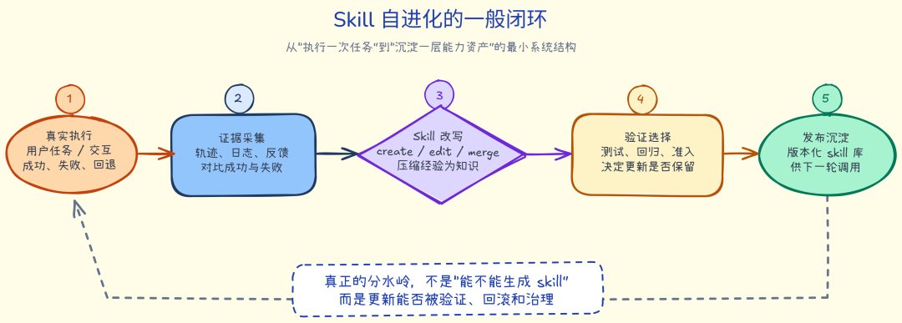

*从真实执行、证据采集、skill 改写、验证选择到版本沉淀，*

*构成了 skill 自进化系统的最小闭环*

***二、“skill + 自进化”到底是什么***

先做一个边界澄清。这里说的“skill + 自进化”，不是泛指所有 Agent 的持续学习，也不是只要系统性能在变强就算。更准确地说，它至少包含两个条件：

1. skill 是外部化的能力单元。它可以是 SKILL.md、workflow、工具调用规则、脚本、领域参考资料，或者分层的 skill bank，但它必须是一个可以被系统显式读取、检索、编辑、合并、替换的对象。
2. 被进化的对象是 skill 本身。也就是系统会基于执行轨迹、失败样本、验证结果、奖励差异或真实交互反馈，自动新增、改写、合并、裁剪甚至淘汰 skill，而不是只更新模型参数。

按这个定义看，OpenClaw-RL[1] 这样的工作虽然很有启发性，但它的核心是在线恢复 next-state signal 来训练 policy，本质上更偏参数侧持续学习。它可以作为旁支参考，但不是本文的主角。本文更关心的是另一层：skill 作为外部能力资产，如何自己长出来、改下去、留下来。

**一个统一的形式化抽象**

如果把这批论文放在一起看，我们其实可以给skill 自进化系统写出一个相对统一的抽象。

**定义 1：Skill 作为外部能力单元**

我们可以把一个 skill 抽象为：

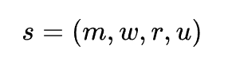

其中， *m* 表示元数据（名称、描述、触发条件、版本），*w* 表示 workflow 或策略主体，*r* 表示 references / scripts / templates 等附属资源，*u* 表示该 skill 当前的经验效用或可信度估计。

在这个定义下，某一时刻的 skill 库可以写成：

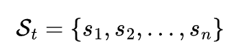

这一步很关键。因为一旦写成 *St*，我们就等于默认：skill 不是一次性提示词，而是一个**可以被系统显式维护的状态对象。**

**定义 2：Skill 自进化的状态转移**

一个自进化系统的本质，可以被写成 skill 库的状态更新：

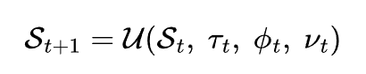

其中，

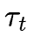

表示执行轨迹，*Φt*表示交互反馈或环境信号，*Vt*表示验证或评测结果，*U* 则表示更新算子。不同论文的差别，本质上就是对 *U* 的实现不同：

- Trace2Skill [2]偏向 many-to-one 的离线归纳
- CoEvoSkills[3] 偏向 generator-verifier 协同迭代
- SkillClaw [4] / EvoSkill [5] 偏向 evidence-driven 的批量治理
- SkillRL [6]/ D2Skill [7]偏向与 policy 联合更新的训练时演化

**定义 3：Skill 的效用更新**

从 D2Skill 这类工作里可以提炼出一个很有代表性的思想：skill 的价值不应只由语义相关性决定，还应由**用了它以后，到底比不用它强多少**来决定。于是可以写出一个效用更新式：

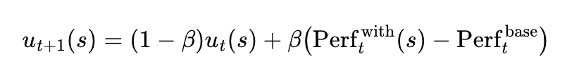

这里的 

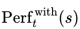

表示注入该 skill 后的表现，

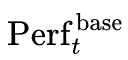

表示不使用 skill 或使用基线策略时的表现，*β* 是平滑系数。这个式子虽然是概括性的，但它很好地抓住了 D2Skill 的精髓：skill 不是看起来相关就算有用，而是必须**在结果层面体现增益。**

进一步地，检索时的打分也不该只看语义相似度，而应同时考虑历史效用与探索需要：

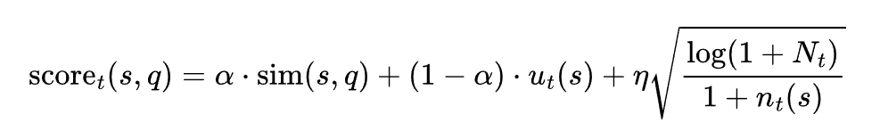

其中，*sim(s,q)*表示 skill 与当前任务查询 *q* 的语义匹配度，*ut(s)*表示 skill 的经验效用，最后一项则对应一种探索偏置：那些尚未被充分评估的新 skill，不应在早期就被完全埋没。

**定义 4：系统视角下的 SkillOps 目标函数**

如果进一步站在系统视角，那么 skill 自进化追求的就不只是性能越高越好，而是在性能、上下文成本、冗余度与回归风险之间做优化。于是可以写出一个更宏观的目标函数：

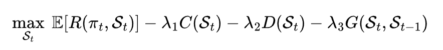

其中：

- *R(πt,St)*表示当前 policy 与 skill 库共同作用下的任务收益
- *C(St)*表示上下文注入与调用成本
- *D(St)*表示 skill 库的冗余和重复度
- *G(St,St-1)*表示新版本相对旧版本的回归风险

这个写法把这批论文共同面临的工程现实一口气说清楚了：未来真正难的，不是让

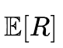

上升，而是让它在不引爆 *C、D、G*的前提下上升。也正因此，EvoSkill、SkillClaw、SkillForge 这些工作才会把这么多精力放在验证、准入、淘汰、保守编辑和回归控制上。

如果把上面几条定义压缩成一句话，那就是：

所谓“skill + 自进化”，本质上是在研究一个非参数知识状态 St，如何在真实执行中被不断更新，并在验证与治理约束下稳定提升系统收益。

***三、四条技术路线***

从 survey 视角看，这个方向大致已经分化成四条主线：

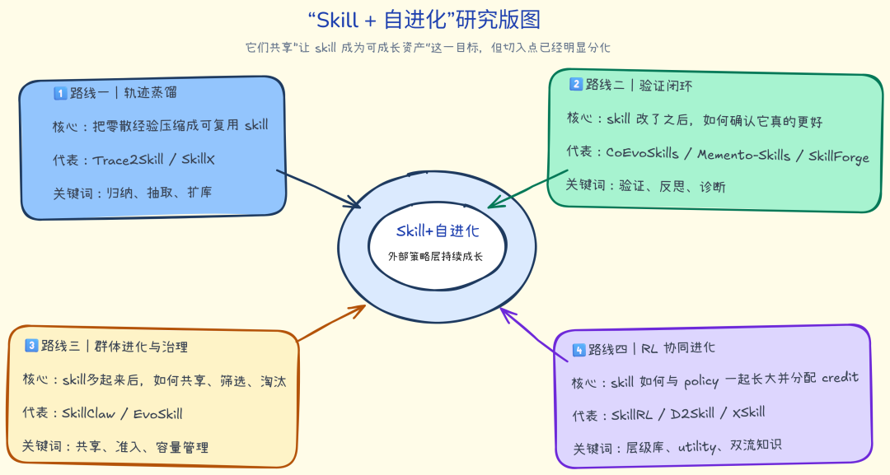

*这批工作大致可以归入四条主线。它们共享“让 skill 成为可成长资产”这一目标，**但切入点明显不同*

**路线一：从轨迹中蒸馏 skill**

这一类工作的代表是 Trace2Skill[2] 和 SkillX[8]。

Trace2Skill 的贡献不在于用了multi-agent，而在于它非常清楚地把问题设成了 many-to-one 的知识归纳：先收集成功与失败轨迹，再并行产出 patch，最后统一 merge 成可迁移的 skill 文档。它的洞见是，逐条在线更新 skill 很容易被顺序依赖绑架，而离线并行归纳更接近专家形成 SOP 的过程。

SkillX 则把这件事推向了工程化建库。它不只是从成功轨迹里提取 skill，还通过合并、过滤、主动探索去扩展和精炼 skill bank。相比前者，SkillX 更像一个自动化 skill 知识生产线。它的重要价值在于说明：skill 的自动构建已经不再只是概念验证，而开始具备跨模型赋能和规模化复用的潜力。

这一类工作的优点是抽象能力强、可迁移性好，缺点是通常偏离线，离真实在线环境中的持续修正还有一点距离。

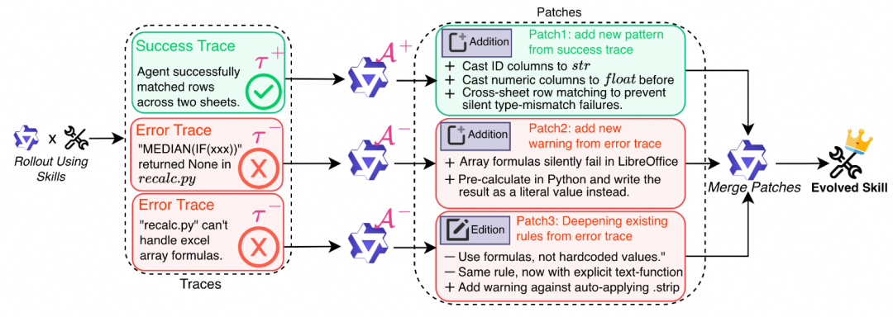

Trace2Skill：轨迹采样 -> 多分析器产出 patch -> 分层 merge的三阶段pipeline

**路线二：基于验证和诊断的闭环 skill 优化**

这一类是我认为最贴近“真正自进化”的路线，代表作是 CoEvoSkills [3]、Memento-Skills [9] 和 SkillForge[10]。

CoEvoSkills 的核心不是生成 skill，而是把skill 进化设计成一个生成者与验证者的双边闭环。生成器负责改 skill，验证器负责出题、诊断、升级测试，真实环境再提供黑盒 pass/fail。这个设计很漂亮，因为它把自进化从单边自省变成了“带对抗性的共同进化”。从方法论上说，这比让模型自我检查三轮更像真正的学习系统。

Memento-Skills 的贡献则在于理论抽象。它把 skill 库视为一个非参数、可成长的外部记忆层，通过 read-write-reflect 闭环持续改写 skill，并用任务成功率而不是语义相似度来训练 skill router。这相当于明确提出：持续学习未必非要改模型参数，skill 库本身就可以成为一个独立的学习层。

SkillForge 则代表了另一种很重要的现实主义方向：在企业垂直场景里，skill 自进化未必要追求最大自由度，反而更需要受约束的可靠闭环。它把脚本能力裁掉，用 VFS 和白名单工具控制执行边界；它不追求开放世界意义上的泛化，而是追求在确定反馈、领域知识充足、专家参考答案明确的场景里持续变好。

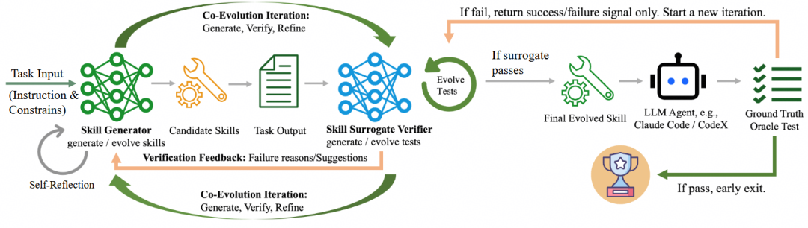

*CoEvoSkills：generator-verifier的对抗性协同进化框架*

**路线三：群体进化与 skill 治理**

这一类工作的代表是 SkillClaw [4]和 EvoSkill [5]。

SkillClaw 很有代表性，因为它第一次把 skill 进化从单个 agent 的私有记忆提升到了多用户生态的共享资产。白天用户正常使用，系统收集完整因果轨迹；夜间 agentic evolver 基于共享证据去 refine、create 或 skip；通过验证后再同步到所有 agent。它真正改变的是知识沉淀的位置：经验不再留在会话里，而进入 skill repository。

EvoSkill 则进一步把重点从演化拉到治理。它最有价值的地方，不是 create skill，而是明确区分 create 与 edit，并引入固定容量的 elite pool 做准入竞争。只有能提升独立验证表现的 skill 变体，才有资格留下来。这很像在对 skill 库做进化搜索，也很像在对 Agent 的能力边界做仓库治理。换句话说，EvoSkill 让我们看到：未来 skill 系统的核心工程挑战，很可能不是发现新能力，而是管理能力冗余。

如果只让我选一个最能代表未来工程方向的关键词，我会选 governance，而不是 generation。

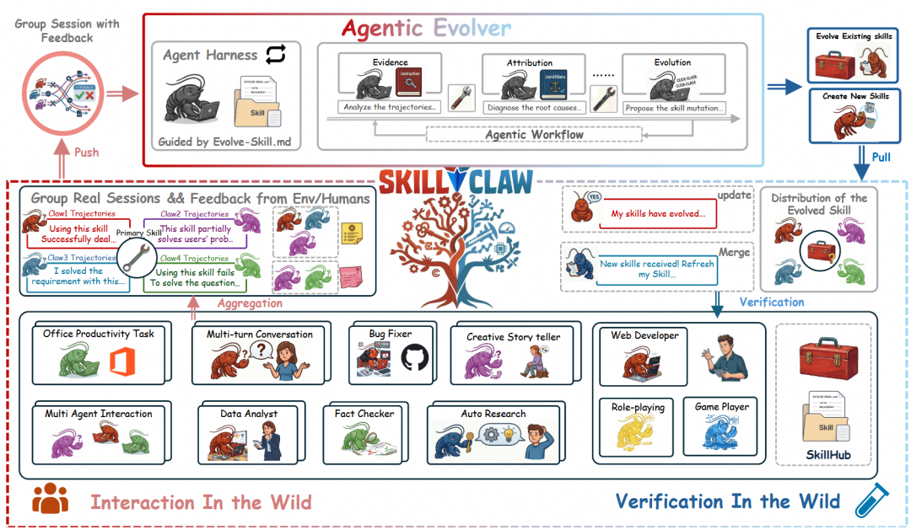

*SkillClaw：通过closed-loop pipeline实现多用户agent生态系统中的集体技能进化*

**路线四：RL 场景下的策略-技能协同进化**

这一类是 SkillRL [6]、D2Skill[7]，以及扩展意义上的 XSkill [11]。

SkillRL 的价值在于，它第一次较完整地把 skill 放进 RL 训练闭环里：先从轨迹蒸馏 skill，再冷启动 SFT 教模型学会用 skill，最后在 RL 过程中根据失败样本递归扩 skill 库。它证明了 skill 不是外挂提示词，而可以成为 policy learning 过程中的抽象经验层。

D2Skill 则更进一步，开始认真处理 skill 的粒度和治理问题。它提出 task skill 和 step skill 双粒度设计，用有无 skill 注入的轨迹性能差构造 hindsight utility，同时把 utility 用到奖励塑形、检索排序和剪枝淘汰上。这一点很关键，因为它第一次把skill 的真实价值变成了显式可计算、可累积的信用信号。

XSkill 虽然是多模态场景，但它提出的双流结构很值得注意：高层 skill 负责结构正确性，局部 experience 负责具体情境下的动作灵活性。它的启发在于，未来很多系统可能不是只维护一个 skill 库，而是维护一整套层级化的知识生态。

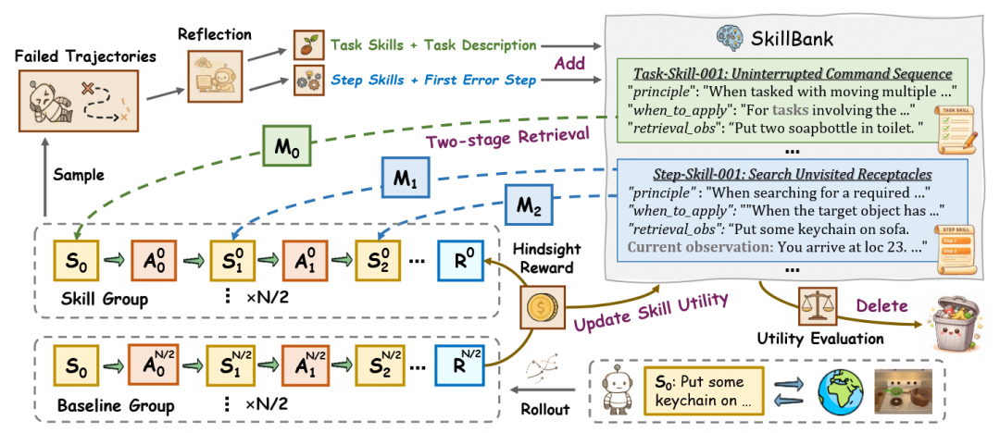

*D2Skill：双粒度skill建模与policy-skill 协同进化的联合训练范式*

***四、一张表看全局***

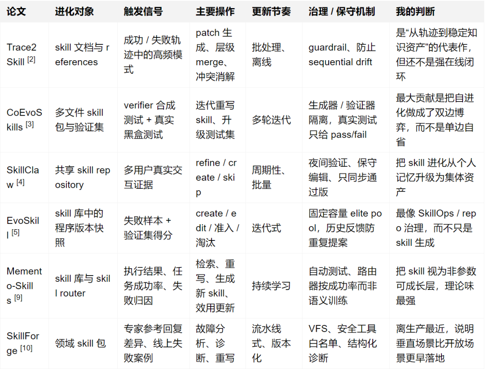

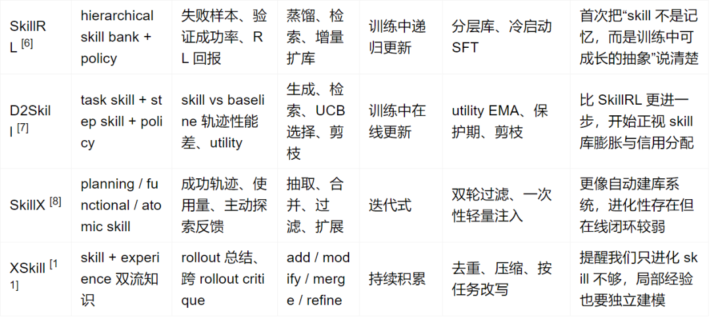

这张表有一个很重要的阅读提示：很多工作表面上都在谈skill learning，但真正区分它们层次的，是更新对象、验证信号和治理机制，而不是标题里是不是写了 evolve 或 skill。

***五、Insight总结***

**Insight 1：外部化 policy layer**

这是我看完这些工作后最强烈的感受。过去我们总把 prompt、memory、tool-use policy、workflow 看成不同东西，但在这些论文里，它们开始被统一成一种新的对象：可被显式读取、编辑、检索、验证、沉淀的外部策略层。

一旦接受这个视角，很多问题就会重新排序。以后大家比拼的可能不再只是底座模型谁更强，而是谁拥有更稳、更可积累、更可治理的外部 skill 层。这有点像操作系统之于芯片：底座决定上限，但外部能力层决定系统能否长期进化。

**Insight 2：核心瓶颈是信用分配**

今天让模型写一个 skill已经不难了，真正难的是：

- 这次成功到底归功于哪个 skill？
- 这次失败是 skill 不行，还是 skill 没被正确调用？
- 是该新建一个 skill，还是修补已有 skill？
- 一个局部 patch 的收益，是否足以抵消它带来的全局检索噪声？

D2Skill 用 hindsight utility，EvoSkill 用验证集准入，CoEvoSkills 用双体协同验证，实际上都在解决同一个问题：如何给 skill 更新分配可信的 credit。谁能把这个问题做得更细、更稳，谁就更可能把自进化从 demo 推到系统。

**Insight 3：受约束地单调改进**

很多人一开始想到 skill 演化，第一反应是让系统自动长出更多 skill。但 EvoSkill 提醒我们，问题从来不只是skill 不够多，很多时候反而是垃圾 skill 太多。一旦 skill 库开始膨胀，新的问题立刻出现：

- 检索噪声上升
- 上下文预算被占满
- 相似 skill 彼此冲突
- 老 skill 被新 skill 不稳定地覆盖
- 局部修补带来整体回归

最接近生产的，往往不是增长幅度最大的方案，而是最克制的方案。

SkillClaw 强调 conservative editing，SkillForge 强调 VFS 和工具白名单，EvoSkill 强调有限容量和验证准入，Memento-Skills 强调自动测试不过关就不能落库。这些设计背后其实都指向同一个趋势： skill 自进化的竞争，很可能不是谁变化最快，而是谁回归最少、爆炸半径最小、版本可回溯性最好。

**Insight 4：走向SkillOps**

一句话概括这批论文的共同趋势：

这个方向正在从“如何生成 skill”走向“如何运营一个会自己增长的 skill 系统”。

一个成熟的 SkillOps 栈，至少应该包含这些环节：

- 证据采集：从真实执行、失败案例、成功轨迹里拿到高质量信号
- 知识编辑：create、edit、merge、split、prune
- 验证选择：测试、准入、对比、回归检查
- 检索路由：在正确的时机把正确 skill 注入给正确任务
- 版本治理：回滚、灰度、保守发布、失效淘汰

所以诸如 EvoSkill、SkillClaw、SkillForge 这种论文的产业意义，可能会高于单点指标更漂亮的纯学术工作。

***六、结语***

**skill + 自进化**可以看成 Agent 领域里一个非常像样的中观层机会。

它比纯 prompt engineering 更系统，因为 skill 是可组织、可治理、可验证的；它比纯参数训练更灵活，因为它不必每次都动模型本体；它比传统 memory 更有操作性，因为它沉淀的是可执行规则，而不是原始日志。更重要的是，它天然适合连接研究与工程：研究上，它是一个关于抽象、信用分配和非参数学习的课题；工程上，它又直接对应版本管理、回归控制和生产稳定性。

而一旦 skill 层真的成为系统的一部分，那么未来 Agent 的竞争，可能就不只是模型之间的竞争，而会是**谁能让自己的 skill 资产在真实世界里越跑越厚、越改越稳、越用越聪明**的竞争。

***References***

1. *Yinjie Wang et al. OpenClaw-RL: Train Any Agent Simply by Talking. arXiv:2603.10165, 2026.*

   *https://arxiv.org/abs/2603.10165*
2. *Haokun Wang et al. Trace2Skill: Distill Trajectory-Local Lessons into Transferable Agent Skills. arXiv:2603.25158, 2026.*

   *https://arxiv.org/abs/2603.25158*
3. *Hanrong Zhang et al. CoEvoSkills: Self-Evolving Agent Skills via Co-Evolutionary Verification. arXiv:2604.01687, 2026.*

   *https://arxiv.org/abs/2604.01687*
4. *Zelong Zeng et al. SkillClaw: Let Skills Evolve Collectively with Agentic Evolver. arXiv:2604.08377, 2026.*

   *https://arxiv.org/abs/2604.08377*
5. *Yunjie Chen et al. EvoSkill: Automated Skill Discovery for Multi-Agent Systems. arXiv:2603.02766, 2026.*

   *https://arxiv.org/abs/2603.02766*
6. *Zixiang Li et al. SkillRL: Evolving Agents via Recursive Skill-Augmented Reinforcement Learning. arXiv:2602.08234, 2026.*

   *https://arxiv.org/abs/2602.08234*
7. *Songjun Tu et al. D2Skill: Dynamic Dual-Granularity Skill Bank for Agentic RL. arXiv:2603.28716, 2026.*

   *https://arxiv.org/abs/2603.28716*
8. *Chenxi Wang et al. SkillX: Automatically Constructing Skill Knowledge Bases for Agents. arXiv:2604.04804, 2026. https://arxiv.org/abs/2604.04804*
9. *Yuebing Wang et al. Memento-Skills: Let Agents Design Agents. arXiv:2603.18743, 2026.*

   *https://arxiv.org/abs/2603.18743*
10. *Xianda Guo et al. SkillForge: Forging Domain-Specific, Self-Evolving Agent Skills in Cloud Technical Support. arXiv:2604.08618, 2026.*

    *https://arxiv.org/abs/2604.08618*
11. *Yiming Zhang et al. XSkill: Continual Learning from Experience and Skills in Multimodal Agents. arXiv:2603.12056, 2026.*

    *https://arxiv.org/abs/2603.12056*

*\*点击**“阅读原文”**，了解黄大年茶思屋科技网站更多精彩内容。*

**扫码进入茶思屋科技网站**

加入茶思屋产学研思想碰撞

转载请联系本公众号获得授权

投稿：hdncsw@huawei.com
