> 📎 来源: [ColaHub](https://mp.weixin.qq.com/s?__biz=Mzg3NTE1ODI1Mg==&mid=2247485494&idx=1&sn=3cec18f524da9e79f8dc30488030f1e0&chksm=cff53b430e707ee404fc3ab61b9f024bfd4351bacf825ff39b5adb17f8ec768add4675dbae81&mpshare=1&scene=1&srcid=0515Hk1vnZPySj2Dgy5iFZ9i&sharer_shareinfo=955e222a3e4c645b0d5edfb4cf8520c2&sharer_shareinfo_first=955e222a3e4c645b0d5edfb4cf8520c2) | 时间: 2026-05-15 22:36

---

## unsetunset写在前面unsetunset

做 PPT 这件事正在被 AI Agent 重新定义。不是那种"输入标题，输出一堆丑模板"的传统工具——而是在 Claude Code、Codex、Cursor 这些 AI 编程环境里，用自然语言告诉 AI 你要什么，它就在你的电脑上生成一份完整的演示文稿。

背后起作用的是 **Agent Skill**——一套结构化的指令和脚本包，装进 AI 代理后，它就获得了某个专业领域的操作能力。2026 年以来，这个赛道经历了爆炸式增长。Agent Skills Hub 上 PPT & Presentation 分类收录了 25 个项目，总 Star 数超过 7 万。而我在梳理过程中还发现至少 2 个同样重量级的项目未被收录。

本文的目标是呈现完整的全景，帮你回答一个实际问题：**如果你今天就要做一份 PPT，应该用哪一个？**

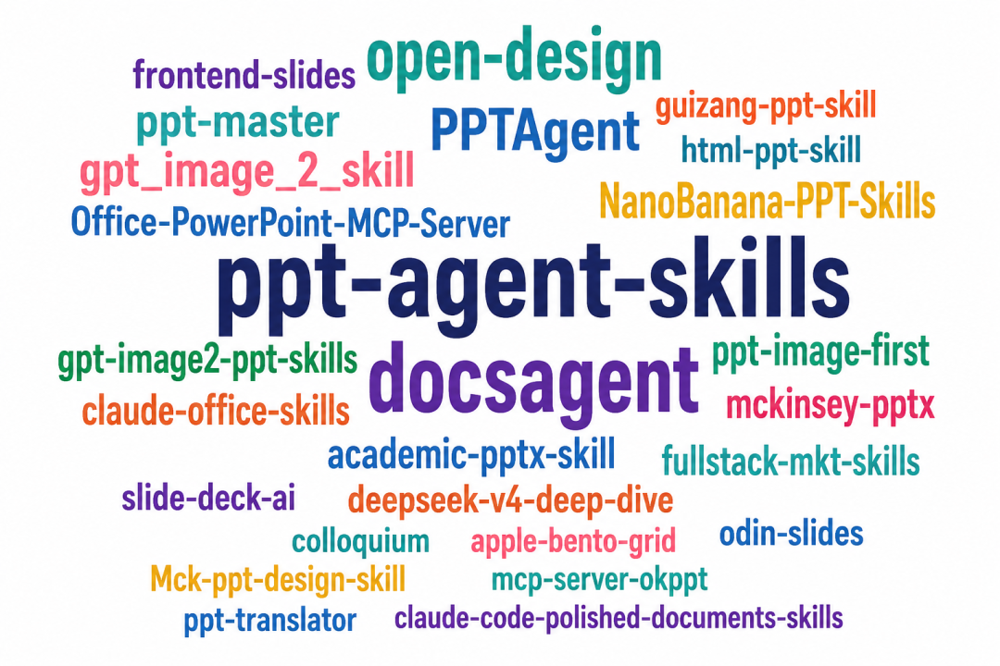

全景词云

---

## unsetunset底层路线unsetunset

在逐个盘点之前，先理解技术路线。这决定了每个工具的定位天花板。

**HTML 网页演示**：输出单文件 HTML，浏览器打开即用。视觉上限极高——CSS 动画、WebGL 特效、Canvas 粒子，什么都能做。缺点是交付后不可编辑，客户要改一个字就得重新生成。

**原生 PPTX**：输出真正的 .pptx 文件，每个文字框、形状、图表都可点击编辑。交付就能用，客户拿到就能改。但视觉上限受 PowerPoint 自身能力的约束。

**AI 图像驱动**：用 GPT Image 2、NanoBanana 这类模型逐页生成高完成度的视觉图片，再用 PPTX 作为容器。视觉效果最好，但每一页本质上是一张图，逐字修改很麻烦。

**MCP 协议层**：不直接生成 PPT，而是给 LLM 装上操作 PowerPoint 的手——通过 MCP 协议让 AI 读写、修改 .pptx 文件。

**垂直场景专用**：放弃通用性，专精于学术、营销、翻译等某个具体场景。

**综合设计平台**：PPT 只是其能力的一个出口。这类项目已经长成了完整的设计系统，能产出原型、图片、视频等多种产物。

---

## unsetunset一、HTML 网页演示派unsetunset

视觉表现力的主战场。这一类 Skill 的共同特征是单文件输出、零构建、浏览器打开即用。

### 1. frontend-slides — 17.5k Star

| 元信息 |  |
| --- | --- |
| 作者 | @zarazhangrui |
| GitHub | https://github.com/zarazhangrui/frontend-slides |
| Star | 17,530 |
| 语言 | Shell |

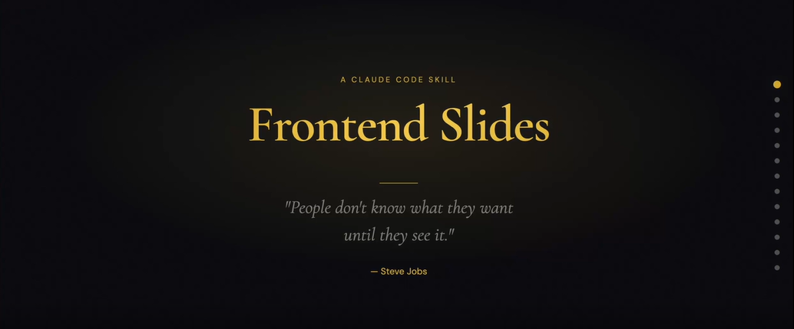

frontend-slides

HTML 演示赛道 Star 数最高的项目，也是最早把"Vibe Coding"理念引入演示文稿制作的 Skill 之一。

核心理念是 \*\*"show, don't tell"\*\*——不问你要什么风格，直接生成 3 个预览让你挑。这解决了一个真实痛点：大多数人描述不清楚自己想要的视觉风格，但看到之后一眼就分得清喜欢哪个。

内置 12 套视觉预设，分暗色系（Bold Signal、Electric Studio、Creative Voltage、Dark Botanical）、亮色系（Notebook Tabs、Pastel Geometry、Split Pastel、Vintage Editorial）和特殊风格（Neon Cyber、Terminal Green、Swiss Modern、Paper & Ink）。每套都刻意回避了那种一眼 AI 味的紫色渐变审美。

现在新增的亮点是 **PPT 转换能力**——可以把现有的 PowerPoint 文件转成 Web 演示，保留图片和内容。

适合技术分享、Demo Day、个人风格强烈的演讲。

### 2. guizang-ppt-skill — 8.8k Star

| 元信息 |  |
| --- | --- |
| 作者 | @op7418（歸藏） |
| GitHub | https://github.com/op7418/guizang-ppt-skill |
| Star | 8,832 |
| 语言 | HTML |

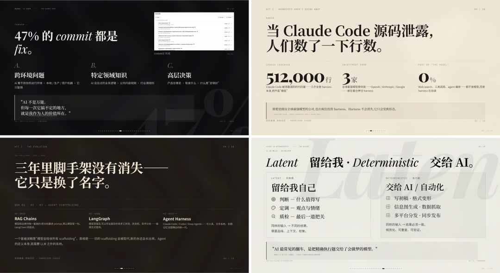

旧主题 · Style A 电子杂志风

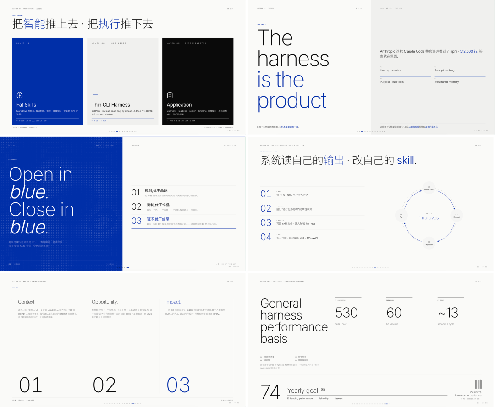

新主题 · Style B 瑞士国际主义

电子杂志 × 电子墨水的视觉基调。衬线大标题 + 非衬线正文 + 等宽元数据的三级字体分工，WebGL 流体背景只出现在 Hero 页，正文页保持极度克制。

提供 5 套主题色（墨水经典、靛蓝瓷、森林墨、牛皮纸、沙丘），10 种页面布局骨架。支持横向左右翻页，键盘/滚轮/触屏/底部圆点导航全支持。

一个值得注意的设计哲学：**不允许自定义 hex 色值**。作者的态度很明确——"保护美学比给自由更重要"。这在 Skill 设计里是少见的强主张，也是一个会定期回炉的项目，作者每次线下分享后都会把踩的坑写进 checklist。

适合行业私享会、带强烈个人风格的演讲、AI 产品发布。不适合大段表格数据和需要多人协作编辑的场景。

### 3. html-ppt-skill (HTML PPT Studio) — 3.8k Star

| 元信息 |  |
| --- | --- |
| 作者 | @lewislulu |
| GitHub | https://github.com/lewislulu/html-ppt-skill |
| Star | 3,834 |
| 语言 | HTML/CSS/JS |

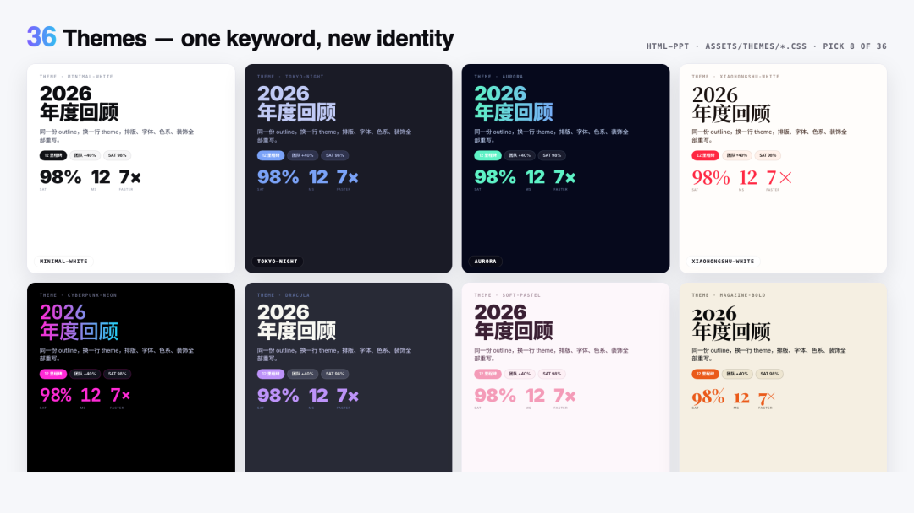

36 Themes

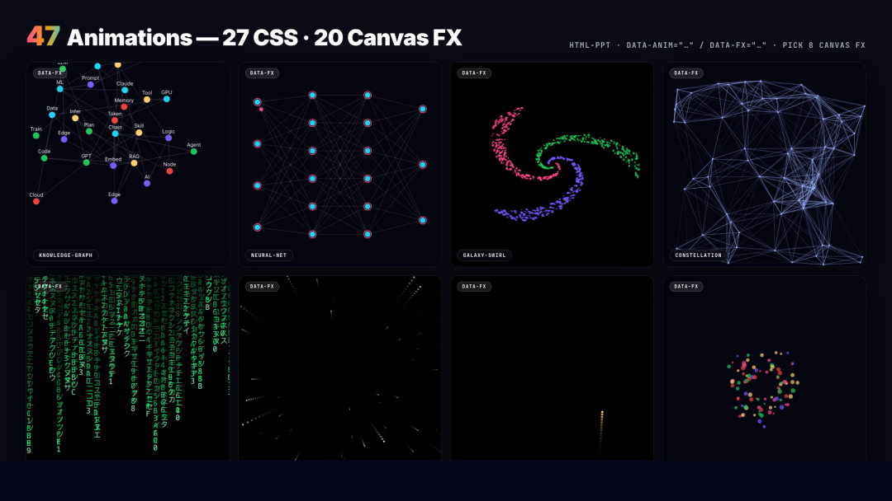

27 CSS animations + 20 Canvas FX

**这是体量最大的 HTML 演示 Skill。** 资源量在同赛道里几乎无出其右：36 套主题、15 个完整 Deck 模板、31 种单页布局、47 种动画（27 CSS + 20 Canvas 特效），以及一个**真正的演讲者模式**。

演讲者模式是它最突出的差异化功能：在任何 Deck 中按 S 键，弹出一个独立的演讲者窗口，包含 4 个可拖拽、可调整大小的磁吸卡片——当前幻灯片、下一页预览、逐字稿提词器、计时器。两个窗口通过 BroadcastChannel 实时同步，翻页不闪烁、不重载。

36 套主题覆盖了从 minimal-white、editorial-serif 到 cyberpunk-neon、vaporwave、pitch-deck-vc 的广泛风格。所有颜色、字体走纯 CSS 变量，换一行 link 标签就能给整份 Deck 换皮肤。

15 个完整 Deck 模板中，8 个从真实世界的演示中提取设计风格，7 个是通用场景脚手架（产品发布、技术分享、周报、小红书图文等）。每套模板自带 150-300 字的逐字稿，适合需要演讲备注的场合。

如果你想要 HTML 演示，先看 frontend-slides 和 guizang-ppt-skill；如果它们的模板不够用，html-ppt-skill 的 36 套主题和演讲者模式可能是更好的选择。

### 4. apple-bento-grid — 171 Star

| 元信息 |  |
| --- | --- |
| 作者 | @hubeiqiao |
| GitHub | https://github.com/hubeiqiao/apple-bento-grid |
| Star | 171 |
| 语言 | HTML |

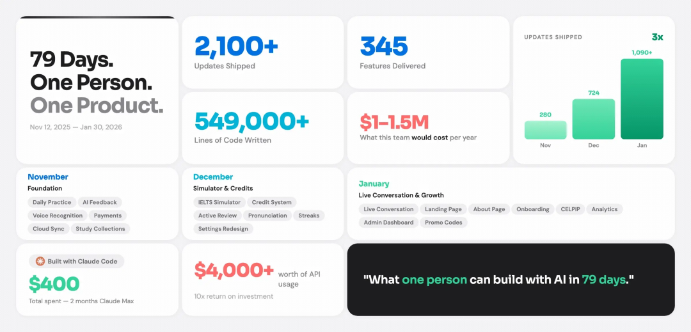

Solo Dev Project Stats

不做完整 Deck，不做封面页正文页，只做一种东西：**Apple-inspired bento grid presentation cards**——那种 Apple 发布会主题站点上"一组方格、每格一个亮点"的卡片排版。

适合产品发布的特性总览页、技术分享的成果一览页、年终汇报的数字一览页。把"小而专"做到极致。

### 5. deepseek-v4-deep-dive — 193 Star

| 元信息 |  |
| --- | --- |
| 作者 | @alchaincyf |
| GitHub | https://github.com/alchaincyf/deepseek-v4-deep-dive |
| Star | 193 |
| 语言 | HTML |

这不是一个通用 Skill，而是一份"成品 + 模板"——DeepSeek V4 的深度解读 73 页 PPT，加 20 分钟讲稿，加发布动画。

但当你要做"AI 模型/产品深度解读"类的内容时，它的结构和动画手法可以直接拷贝下来用，相当于 HTML PPT 的"开源样品间"。

---

## unsetunset二、原生 PPTX 派unsetunset

商业交付的主战场。每一份"客户要能改""公司模板必须套用"的 PPT，最终都要落到 .pptx 文件上。这条路线也是数量最多的，以 python-pptx 为技术基底。

### 6. mckinsey-pptx — 426 Star

| 元信息 |  |
| --- | --- |
| 作者 | @seulee26 |
| GitHub | https://github.com/seulee26/mckinsey-pptx |
| Star | 426 |
| 语言 | Python |

> tips：非中文

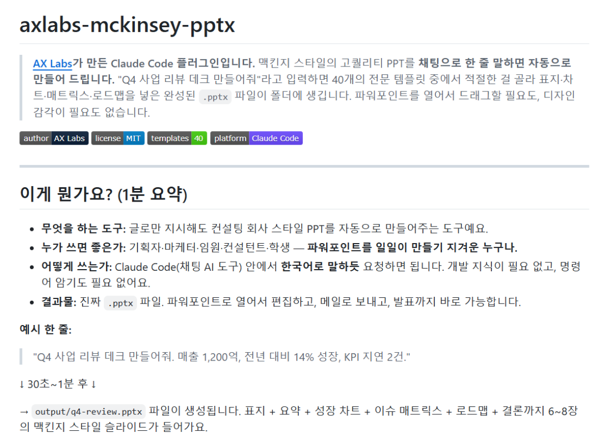

axlabs-mckinsey-pptx

40 个麦肯锡风格的幻灯片模板，外加一个**会"为自己的选择辩护"的 subagent**——它会自动从 40 个模板里挑出最适合当前内容的那一个，然后说明原因。

这个"AI 解释自己决策"的设计在咨询场景里特别有价值。咨询行业的 PPT 本身就是一种"为决策辩护"的载体，让 Skill 也学会辩护，是一种巧妙的同构。

### 7. Mck-ppt-design-skill — 135 Star

| 元信息 |  |
| --- | --- |
| 作者 | @likaku |
| GitHub | https://github.com/likaku/Mck-ppt-design-skill |
| Star | 135 |
| 语言 | Python |

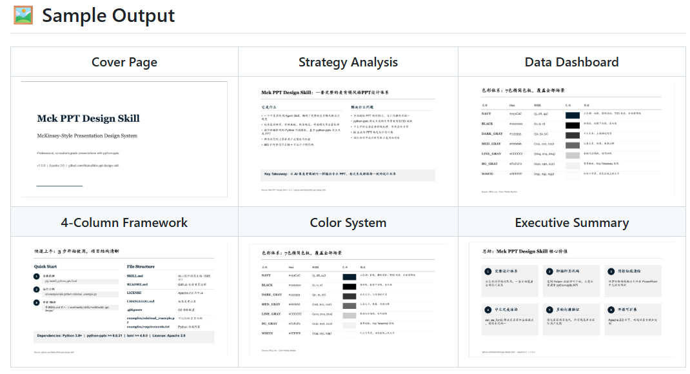

Sample Output

直接对标"咨询风格 PPT 设计系统"。70 套布局模式 + flat design + python-pptx。作者把咨询公司常用的版式提炼成了一套可调用的库。

和 mckinsey-pptx 是同类，区别在于侧重点：mckinsey-pptx 的核心是 subagent 决策逻辑，这个的核心是布局丰富度。知道自己要什么版式就用它，想让 AI 替你选就用前者。

### 8. ppt-agent-skills — 714 Star

| 元信息 |  |
| --- | --- |
| 作者 | @sunbigfly |
| GitHub | https://github.com/sunbigfly/ppt-agent-skills |
| Star | 714 |
| 语言 | Python |

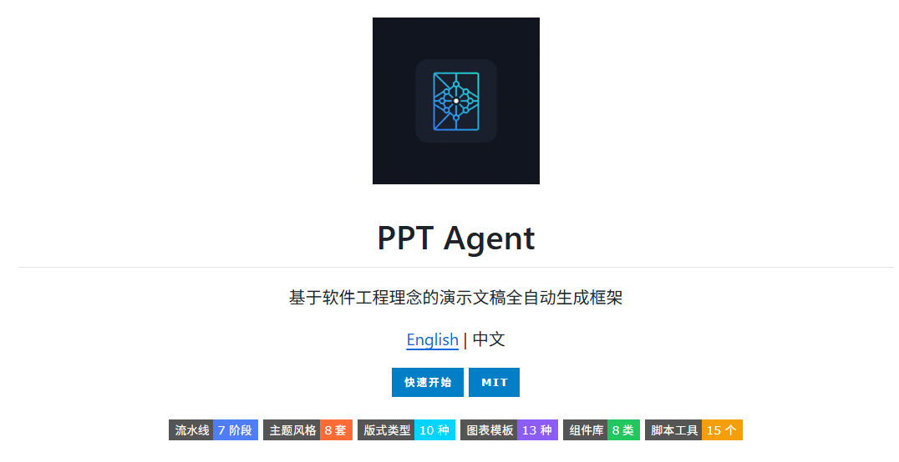

ppt-agent-skills

定位很清晰——\*\*"像构建软件工程一样生成演示文稿"\*\* 的 code-driven 框架。把 PPT 制作流程视同软件工程：需求分析、架构设计、模块组装、测试验证。

这种思路在做重型 Deck（几十页技术报告、产品白皮书）的时候特别有用，会强迫你结构化思考，而不是让模型一页页自由发挥。产物上既有网页预览，也能导出 PPTX，解决了 AI 生成 PPT 最常见的三个问题：内容失控、版式失控、交付不可编辑。

### 9. claude-office-skills — 631 Star

| 元信息 |  |
| --- | --- |
| 作者 | @tfriedel |
| GitHub | https://github.com/tfriedel/claude-office-skills |
| Star | 631 |
| 语言 | Python |

不只是 PPTX——PPTX、DOCX、XLSX、PDF 全部覆盖，还带自动化支持。如果你不想为每种文档类型装一个独立 Skill，这个一站式方案适合你。

### 10. claude-code-polished-documents-skills — 3 Star

| 元信息 |  |
| --- | --- |
| 作者 | @promptadvisers |
| GitHub | https://github.com/promptadvisers/claude-code-polished-documents-skills |
| Star | 3 |
| 语言 | Python |

这个 Skill 集合的最大卖点曾经是 10 个 premium 品牌主题（McKinsey、Deloitte、Stripe、Apple、Notion 等），除 PPT 外还覆盖 docx、pdf、xlsx。不过最近 Star 数大幅下滑，维护活跃度有待重新评估。

### 11. slide-deck-ai — 354 Star

| 元信息 |  |
| --- | --- |
| 作者 | @barun-saha |
| GitHub | https://github.com/barun-saha/slide-deck-ai |
| Star | 354 |
| 语言 | Python |

定位是 \*\*"co-create PowerPoint slide decks with AI"\*\*——不是让 AI 一把生成完，而是和 AI 来回打磨。特点是轻，能跑就行，不太追求视觉。适合工作汇报、内部讨论这类不要求出彩、但要求快的场景。

### 12. odin-slides — 147 Star

| 元信息 |  |
| --- | --- |
| 作者 | @leonid20000 |
| GitHub | https://github.com/leonid20000/odin-slides |
| Star | 147 |
| 语言 | Python |

解决一个非常具体的需求——**把超长 Word 文档变成结构化 PPT**。写完几十页报告之后把它压缩成 30 页演示是一个真实痛点。odin-slides 通过 LLM 自动把 Word 文档拆解、提炼、重组成 PPT 大纲。

适合学者、咨询、政府、企业研究——所有"先有长报告、再做演示"的工作流。

### 13. ppt-master — 16.6k Star（重磅）

| 元信息 |  |
| --- | --- |
| 作者 | @hugohe3 (Hugo He) |
| GitHub | https://github.com/hugohe3/ppt-master |
| Star | 16,626 |
| 语言 | Python |

> 参考：https://mp.weixin.qq.com/s/-SN8HExLSA3sbRHvLo9ByA

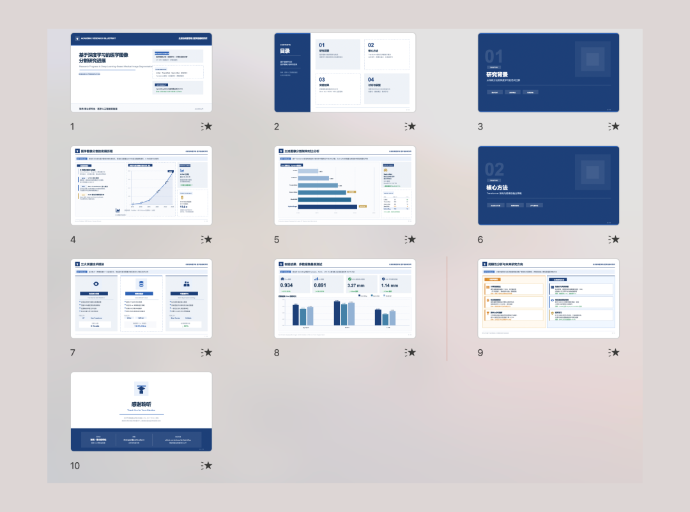

Academic — structured research format, data-driven

**这是整个盘点中最重要的新增发现。** 作者 Hugo He 本职是金融从业者（CPA、CPV），因为想要 AI 生成的 PPT 在 PowerPoint 里逐字可编辑，自己造了这套工具。短短几个月增长到 16.6k Star，速度惊人。

ppt-master 走的是 **SVG → 原生 DrawingML** 的技术路径：让 LLM 先生成 SVG（LLM 最擅长的图形格式），再把 SVG 高质量地转换成 PowerPoint 的原生形状。这意味着每个文字框、每个形状、每个图表在 PPTX 里都是真正可点击编辑的对象——不是图片，不是模板填空。

核心能力包括：

- 从 PDF、DOCX、URL、Markdown 生成原生可编辑 PPTX
- **模板复刻**：给它任何一份 .pptx，说"把它变成模板"，它就能提取主题色、字体、版式结构，之后直接复用
- **动画支持**：页面切换和元素入场动画，以真实 OOXML 实现，PowerPoint 和 Keynote 原生播放
- **语音旁白**：基于 edge-tts 的逐页旁白生成，支持 ElevenLabs / MiniMax 等平台的语音克隆，可导出为 MP4 视频
- **实时预览**：生成过程中在本地 5050 端口开一个浏览器预览，点选任意元素后说"改这个"，循环修改

比较遗憾的是它依赖 Claude Opus / Sonnet 配合大上下文窗口才能达到最佳效果，模型的上下文窗口直接决定了输出质量的天花板。

---

## unsetunset三、AI 图像驱动派unsetunset

用 AI 图像模型生成每一页的内容图。这条路线的本质是：与其和"AI PPT 长得很 AI"对抗，不如直接调用最强的图像模型生成最像设计师做的图。

### 14. NanoBanana-PPT-Skills — 2.7k Star

| 元信息 |  |
| --- | --- |
| 作者 | @op7418（歸藏） |
| GitHub | https://github.com/op7418/NanoBanana-PPT-Skills |
| Star | 2,668 |
| 语言 | Python |

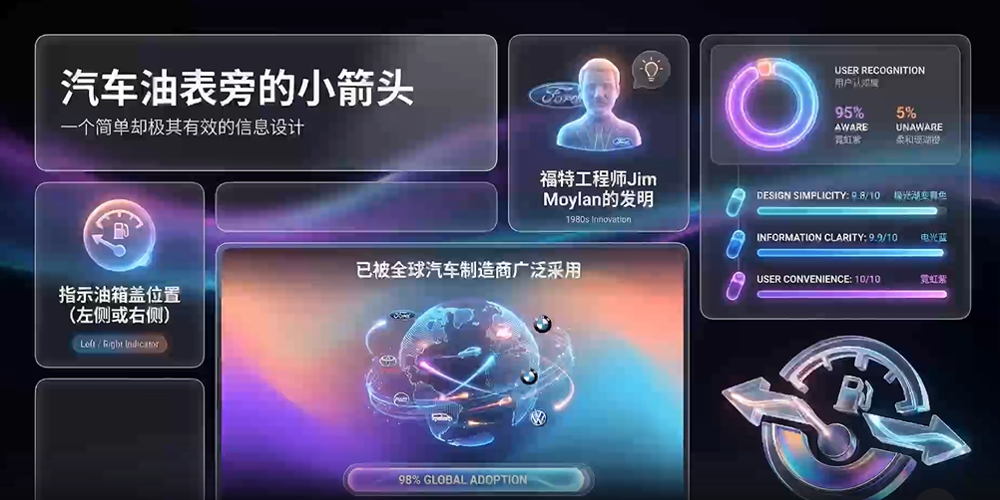

NanoBanana-PPT-Skills

歸藏的另一个项目——和 guizang-ppt-skill 走完全不同的路线。这个 Skill 基于 NanoBanana 模型自动生成 PPT 图片和视频，支持智能转场和交互式播放。歸藏在两条路线上都布局了：HTML 派给演讲分享、图像派给传播分发。

### 15. gpt\_image\_2\_skill — 2.1k Star

| 元信息 |  |
| --- | --- |
| 作者 | @wuyoscar |
| GitHub | https://github.com/wuyoscar/gpt\_image\_2\_skill |
| Star | 2,102 |
| 语言 | Python |

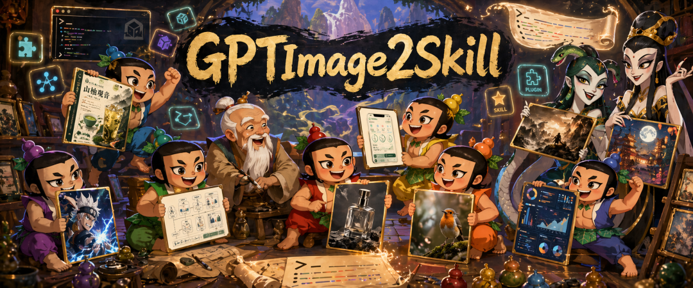

gpt\_image\_2\_skill

不是一个专做 PPT 的 Skill，而是围绕 OpenAI gpt-image-2 构建的提示词画廊 + 提示词库 + agentic skill + CLI，覆盖科研配图、海报、UI mockup、字体、地图等多个图像生成场景。

但它出现在 PPT 榜单里的理由是：很多"图像驱动派"的 PPT Skill 底层调用的就是 GPT Image 2。掌握了这个工具，你就拿到了底层的图像生成能力，可以反过来定制自己的 PPT 视觉风格。

### 16. gpt-image2-ppt-skills — 557 Star

| 元信息 |  |
| --- | --- |
| 作者 | @JuneYaooo |
| GitHub | https://github.com/JuneYaooo/gpt-image2-ppt-skills |
| Star | 557 |
| 语言 | Python |

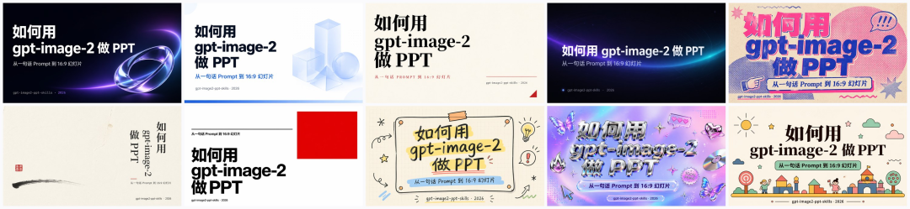

十种内置风格

这个 Skill 的玩法很有意思：**把任意一份 .pptx 模板"图像级仿版式"成你自己的版本**——gpt-image-2 负责模仿原模板的视觉版式，你只需要换内容。附赠 10 套精选风格作为兜底。

适合一个特殊场景：老板/客户给了你一份"按这个样子做"的 PPT 模板，但你懒得手动复刻。注意它的本质是图像级仿写，不是原生级复刻——成品的可编辑性受限，客户后续要逐字框修改的话，谨慎选这条路。

### 17. ppt-image-first — 799 Star

| 元信息 |  |
| --- | --- |
| 作者 | @NyxTides |
| GitHub | https://github.com/NyxTides/ppt-image-first |
| Star | 799 |
| 语言 | Python |

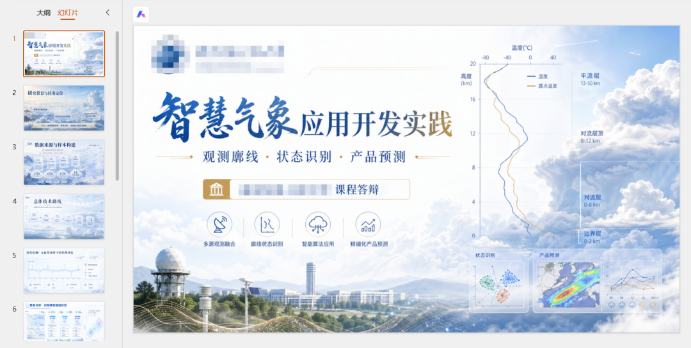

答辩 / 汇报类首页示例

这个名字就是它的设计哲学——**image-first**。先把视觉做对，再围绕图说话。在 Codex、Claude Code、OpenCode CLI 都能跑，是个跨 Agent 的好兵。

适合做内容卡片、社交媒体配图、文章题图这类"图比字重要"的场景。但成品更接近高完成度视觉稿，不是逐文字框都能编辑的原生 PPT。如果想做后续深度改文案的内容，请走原生 PPTX 路线。

---

## unsetunset四、MCP / 协议层unsetunset

这一类 Skill 不直接生成 PPT，它们的角色是给 LLM 装上操作 PowerPoint 的手。把这些 MCP Server 接进去，你的 Claude/GPT 就获得了读/改/写 .pptx 文件的能力。

### 18. Office-PowerPoint-MCP-Server — 1.7k Star

| 元信息 |  |
| --- | --- |
| 作者 | @GongRzhe |
| GitHub | https://github.com/GongRzhe/Office-PowerPoint-MCP-Server |
| Star | 1,708 |
| 语言 | Python |

> 仓库已停止维护

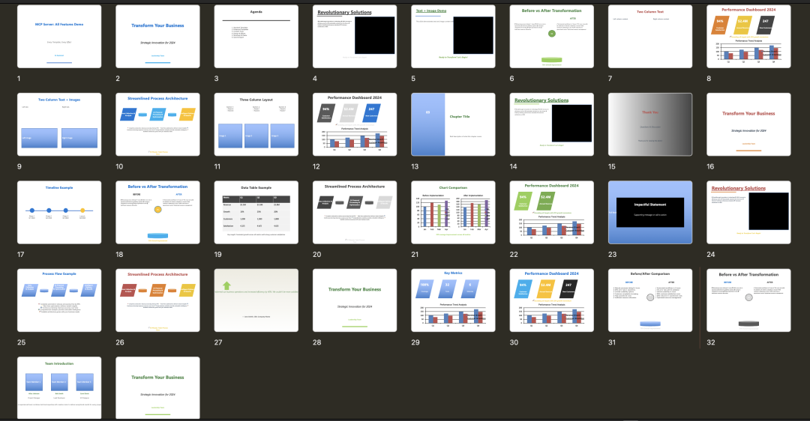

Office-PowerPoint-MCP-Server

把 python-pptx 这个老牌库包装成 MCP Server，通过 MCP 协议对外提供创建、编辑、操作 PowerPoint 的工具。如果你在 Claude Desktop 或任何 MCP 客户端里希望直接对话操作 .pptx 文件，这是最直接的方案。它不挑 Skill，它就是 Skill 们的底盘。

### 19. PPTAgent — 4.4k Star

| 元信息 |  |
| --- | --- |
| 作者 | @icip-cas（中科院信工所） |
| GitHub | https://github.com/icip-cas/PPTAgent |
| Star | 4,354 |
| 语言 | Python |

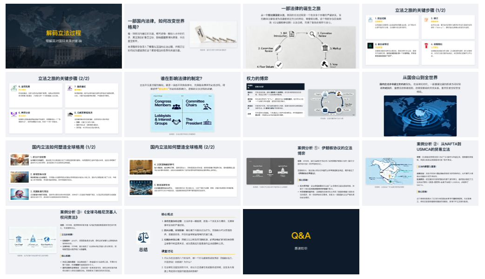

高中课堂展示课件

学术机构做的项目——\*\*"Agentic Framework for Reflective PowerPoint Generation"\*\*。Reflective 的意思是：Agent 生成完每一页之后，会回头检查这一页对不对、好不好、是否需要重做。

这是一个比较重的方案，更接近完整的研究框架而不是即用 Skill。但思想值得借鉴：AI 做的 PPT 之所以丑，本质上是因为它没有"回头看"的环节。

### 20. mcp-server-okppt — 66 Star

| 元信息 |  |
| --- | --- |
| 作者 | @NeekChaw |
| GitHub | https://github.com/NeekChaw/mcp-server-okppt |
| Star | 66 |
| 语言 | Python |

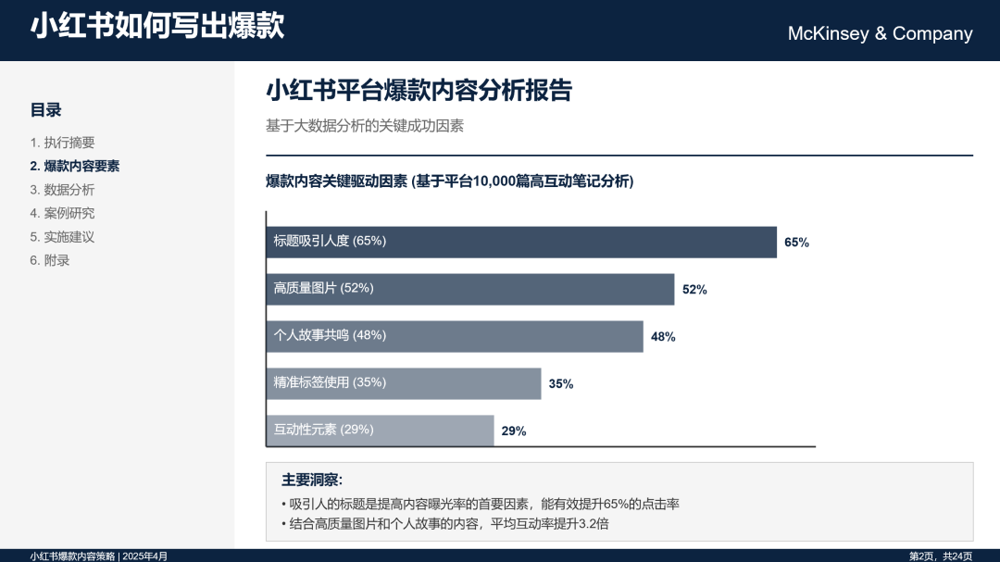

小红书爆款内容分析报告PPT页面

思路很巧：让 LLM 生成 SVG，再把 SVG 高质量地嵌进 PPTX 并保留矢量特性。SVG 是 LLM 最擅长生成的图形格式，把这两者打通，就在 LLM 的强项上做了 PPT。不过项目还比较早期。

---

## unsetunset五、垂直场景专用unsetunset

通用 PPT 工具不可能在每个场景都最优。下面这几个选择放弃通用性，专精于一个具体场景。

### 21. academic-pptx-skill — 387 Star

| 元信息 |  |
| --- | --- |
| 作者 | @Gabberflast |
| GitHub | https://github.com/Gabberflast/academic-pptx-skill |
| Star | 387 |
| 语言 | — |

为会议讲座、研讨会幻灯片、论文答辩、基金简报设计。强制执行 action title（行动式标题）、结构化论证、展品规范、引用标准、传播优先的设计。

学术 PPT 和商业 PPT 最大的区别：学术 PPT 的标题不是"市场分析"这种名词，而是"市场规模在 X 推动下三年翻倍"这种动词式句子。这个 Skill 把学术 PPT 的套路代码化了。

### 22. colloquium — 190 Star

| 元信息 |  |
| --- | --- |
| 作者 | @natolambert |
| GitHub | https://github.com/natolambert/colloquium |
| Star | 190 |
| 语言 | Python |

也是学术导向，但走的是 **markdown native** 的路。学者们日常笔记本来就是 markdown，让 markdown 直接变成幻灯片，比从 markdown 转成 PPTX 再演示更顺畅。适合用 Obsidian/VSCode 写笔记然后直接拿来讲课的人。

### 23. fullstack-mkt-skills — 385 Star

| 元信息 |  |
| --- | --- |
| 作者 | @minhnv0807 |
| GitHub | https://github.com/minhnv0807/fullstack-mkt-skills |
| Star | 385 |
| 语言 | PowerShell |

一个用 PowerShell 写的 Claude Skill，包含 20 个 production-ready 营销 Skill：内容日历、TikTok/Meta 广告文案、UGC brief、KPI 计算器、A/B 测试、定价策略、落地页。基准数据是越南市场 2025-2026。

PPT 只是它能产的一种产物，它真正解决的是"营销内容流水线"。如果你是做品牌或增长的，这个比单独的 PPT Skill 更实用。

### 24. ppt-translator — 61 Star

| 元信息 |  |
| --- | --- |
| 作者 | @daekeun-ml |
| GitHub | https://github.com/daekeun-ml/ppt-translator |
| Star | 61 |
| 语言 | Python |

一个非常具体的需求——**翻译 PowerPoint 的同时保留所有格式和结构**。底层用 Amazon Bedrock 的模型，既可以 CLI 用，也可以作为 MCP 接进 Claude/Kiro。

跨国团队、多语版本部署、本地化交付场景的硬刚需。把 PPT 翻成另一门语言，最痛的不是翻译质量——是格式错位。

---

## unsetunset六、综合设计平台unsetunset

这一类超出了"PPT Skill"的边界——平台级的产物，PPT 只是其中一个能力出口。

### 25. open-design — 40.8k Star

| 元信息 |  |
| --- | --- |
| 作者 | @nexu-io |
| GitHub | https://github.com/nexu-io/open-design |
| Star | 40,822 |
| 语言 | TypeScript |

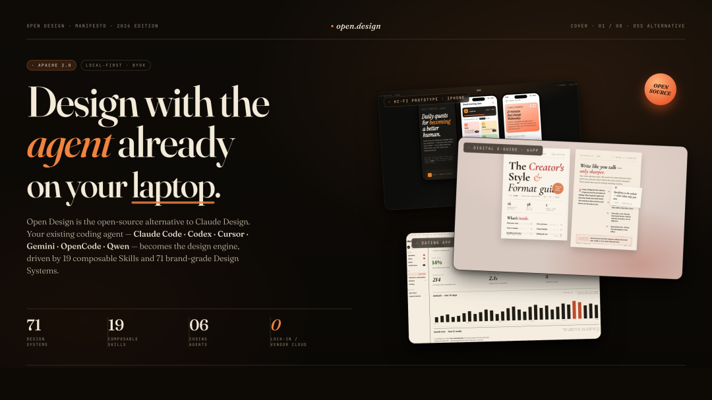

open-design

榜单里的星数王，比第二名 frontend-slides 的两倍还多。定位是 Anthropic Claude Design 的本地优先开源替代品。

能力面上，它能生成 web/desktop/mobile 原型、slides、images、videos、HyperFrames。沙箱预览、HTML/PDF/PPTX/MP4 导出。几乎所有主流 CLI 都支持——Claude Code、Codex、Cursor、Gemini、OpenCode、Qwen、Copilot、Hermes、Kimi。

这不是一个 PPT Skill——这是一个"包含 PPT 能力的设计平台"。如果你做的不只是 PPT，而是从设计稿到落地的全流程，这个值得关注。

### 26. docsagent — 687 Star

| 元信息 |  |
| --- | --- |
| 作者 | @docsagent |
| GitHub | https://github.com/docsagent/docsagent |
| Star | 687 |
| 语言 | TypeScript |

不是为做 PPT 而生。它是一个本地优先的 AI 文档助手，可以索引和对话桌面上几千份文档，零云端泄露。

但它出现在 PPT 榜单里的理由是：做 PPT 的前置步骤往往是消化大量参考文档。把 docsagent 作为 PPT 工作流的前置大脑，再用专业 PPT Skill 出稿，是一个值得考虑的组合用法。

---

## unsetunset全量对比表unsetunset

| 排名 | Skill | Star | 语言 | 路线 |
| --- | --- | --- | --- | --- |
| 1 | open-design | 40.8k | TypeScript | 综合平台 |
| 2 | frontend-slides | 17.5k | Shell | HTML 派 |
| 3 | ppt-master | 16.6k | Python | PPTX 派 |
| 4 | guizang-ppt-skill | 8.8k | HTML | HTML 派 |
| 5 | PPTAgent | 4.4k | Python | 协议层 |
| 6 | html-ppt-skill | 3.8k | HTML | HTML 派 |
| 7 | NanoBanana-PPT-Skills | 2.7k | Python | 图像派 |
| 8 | gpt\_image\_2\_skill | 2.1k | Python | 图像派 |
| 9 | Office-PowerPoint-MCP-Server | 1.7k | Python | 协议层 |
| 10 | ppt-image-first | 799 | Python | 图像派 |
| 11 | ppt-agent-skills | 714 | Python | PPTX 派 |
| 12 | docsagent | 687 | TypeScript | 综合平台 |
| 13 | claude-office-skills | 631 | Python | PPTX 派 |
| 14 | gpt-image2-ppt-skills | 557 | Python | 图像派 |
| 15 | mckinsey-pptx | 426 | Python | PPTX 派 |
| 16 | academic-pptx-skill | 387 | — | 垂直场景 |
| 17 | fullstack-mkt-skills | 385 | PowerShell | 垂直场景 |
| 18 | slide-deck-ai | 354 | Python | PPTX 派 |
| 19 | deepseek-v4-deep-dive | 193 | HTML | HTML 派 |
| 20 | colloquium | 190 | Python | 垂直场景 |
| 21 | apple-bento-grid | 171 | HTML | HTML 派 |
| 22 | odin-slides | 147 | Python | PPTX 派 |
| 23 | Mck-ppt-design-skill | 135 | Python | PPTX 派 |
| 24 | mcp-server-okppt | 66 | Python | 协议层 |
| 25 | ppt-translator | 61 | Python | 垂直场景 |
| 26 | claude-code-polished-documents-skills | 3 | Python | PPTX 派 |

注：Star 数为 2026-05-15 实时抓取。这个赛道更新极快，数字在变，但工具定位和选型逻辑是稳定的。

---

## unsetunset怎么选：11 条决策路径unsetunset

**做客户能改的咨询风 PPT**：mckinsey-pptx（让 AI 选模板）或 Mck-ppt-design-skill（你自己选版式）

**做品牌质感的商业 PPT**：claude-code-polished-documents-skills（如果还在维护的话）或 ppt-agent-skills

**做原生可编辑的演示文稿**：ppt-master。从任意文档直接生成，每字每框可改，还带动画和语音

**演讲用的酷炫 HTML Deck**：frontend-slides、guizang-ppt-skill 或 html-ppt-skill（后者的演讲者模式和 36 套主题最全）

**做 Apple 风的特性卡片**：apple-bento-grid

**把长 Word 报告转成 PPT**：odin-slides

**做学术报告 / 会议演讲**：academic-pptx-skill（PPTX 路线）或 colloquium（markdown 路线）

**把现有 PPT 翻译成另一种语言**：ppt-translator

**做营销内容（PPT 只是其中一项）**：fullstack-mkt-skills

**让 LLM 直接操作电脑里的 PPT 文件**：Office-PowerPoint-MCP-Server

**做的不只是 PPT，整套设计流程都要管**：open-design

---

## unsetunset写在最后unsetunset

最早的问题是怎么用 AI 把 PPT 做得好看。今天的局面已经完全不同：学术报告有 academic-pptx-skill，咨询交付有 mckinsey-pptx 和 ppt-master，Apple 风格有 apple-bento-grid，本地化有 ppt-translator，营销流水线有 fullstack-mkt-skills，Word 转 PPT 有 odin-slides，需要演讲者模式有 html-ppt-skill。

两个提醒。一是开源不等于零门槛，商用之前回 GitHub 看一眼 LICENSE 这一步省不了。二是成本不只有模型钱——图像派要付 GPT Image 2 / NanoBanana 的图像生成费，ppt-master 依赖大上下文模型，综合平台可能涉及云服务。挑你能负担、且和工作流匹配的那条路。
