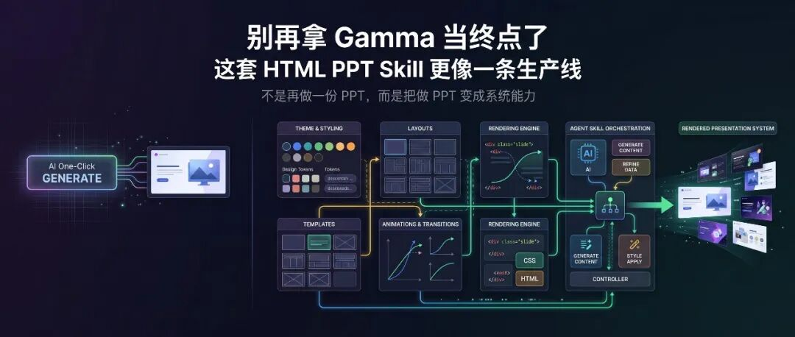

> 📎 来源: [硅基铁匠](https://mp.weixin.qq.com/s?__biz=MzcwNTE3NzI0OA==&mid=2247485037&idx=1&sn=b19fa87971c57ba80ec463f71afe5042&chksm=f5fbe13305da40cef95059bbf633fcfaa2a832b12479c9052436d38aafe9c4a49d18d2db28b1&mpshare=1&scene=1&srcid=0417UXqOBl0Zc7ceQyqiHB4i&sharer_shareinfo=cd503aa7e2d01938ac802c81a1b62ca4&sharer_shareinfo_first=cd503aa7e2d01938ac802c81a1b62ca4) | 时间: 2026-04-17 02:22

---



很多人第一次用 AI 做 PPT，都会先被 Gamma 打动。

这很正常。

因为 Gamma 的第一眼体验确实很强：输入几句话，马上给你一套看起来已经能发出去的页面，速度快、门槛低、视觉也不差。对于“我现在就要一份像样的演示稿”这个需求，它确实很容易让人上头。

但问题也恰恰出在这里。

很多人以为自己需要的是“一个能快速生成 PPT 的工具”，可一旦开始高频做演示、做汇报、做模板化内容、做多场景复用，你就会发现，真正值钱的不是“帮你生成一份 PPT”，而是“能不能把做 PPT 这件事沉淀成一套可复用、可控、可扩展的生产系统”。

这也是这次这套 

```
html-ppt-skill
```

 最值得看的地方。

它不是再做一个“像 Gamma 一样一键出稿”的产品表层，而是在把 PPT 生产这件事，往 **agent skill + design system + static artifact** 方向推。

如果你只是偶尔做一页分享，Gamma 当然够快。

但如果你想让 AI 真正进入长期内容生产链，这套东西代表的是另一条路线。

## Gamma 为什么好用，但不够“深”

先别急着吹新工具，先把 Gamma 的位置摆正。

Gamma 这类产品最强的地方，是把“做 PPT”从一个高门槛动作，压缩成了一个即时生成体验。

它帮用户解决的是：

1. 1. 不会排版
2. 2. 没时间搭结构
3. 3. 想快速得到一个看起来还不错的成品
4. 4. 希望一份内容能同时兼顾文档感和演示感

所以在很多场景里，Gamma 依然非常有价值。

但它的问题在于，它更像一个“成品生成器”，不是一个“能力系统”。

这两者的差异非常大。

成品生成器更适合偶发型需求：

1. 1. 今天急着做个 deck
2. 2. 明天出个 pitch
3. 3. 后天做个内部汇报

但一旦进入高频生产，你会越来越在意这些问题：

1. 1. 我能不能把自己的主题体系沉淀下来？
2. 2. 我能不能把页面布局当作积木复用？
3. 3. 我能不能让 agent 自动按我的生产规范出稿？
4. 4. 我能不能把动画、版式、主题、整套 deck 模板像代码一样管理？
5. 5. 我能不能脱离单一产品 UI，把产物真正掌握在本地？

Gamma 在“快速给你一个结果”这件事上很强。

但在“把 PPT 生产本身做成可编排系统”这件事上，它天然没那么占优。

这不是它不好，而是产品形态决定了边界。

## 这套 HTML PPT Skill 强的地方，不是模板多，而是层次清楚

这次看的 

```
html-ppt-skill
```

，最容易被表面数字带偏。

因为它一上来给出的数字很多：

1. 1. 36 个主题
2. 2. 14 套完整 deck 模板
3. 3. 31 个单页布局
4. 4. 47 种动画
5. 5. 纯静态 HTML / CSS / JS
6. 6. 无 build step

这些当然很吸引人。

但如果只看到“模板很多”，其实低估了它。

它真正厉害的地方，是把 PPT 这件事拆成了几个很清楚的层：

1. 1. **Theme**：解决视觉语言
2. 2. **Layout**：解决页面结构
3. 3. **Full-deck template**：解决整套场景骨架
4. 4. **Animation / FX**：解决动态表现
5. 5. **Skill dispatcher**：解决 agent 怎么调度这套能力

这就和 Gamma 的思路非常不一样。

Gamma 更像一个一体化应用：你向它提要求，它尽量一次性给你一个好结果。

而这套 

```
html-ppt-skill
```

 更像一个 PPT 设计引擎：

1. 1. 主题是可替换的
2. 2. 布局是可复用的
3. 3. deck 模板是可继承的
4. 4. 动画是可插拔的
5. 5. 整套产物是本地静态文件，可被 agent 编排

这个差别非常关键。

因为前者解决的是“这次帮我做完”，后者解决的是“以后我都可以这么做”。

## 你真正买到的，不是 PPT，而是一个可编程的演示系统

从仓库结构看，这套东西最值钱的地方不是页面截图，而是它背后的工程组织方式。

它不是把 PPT 当成某种神秘成品，而是把它拆成一套可以像前端工程一样管理的资产。

你从说明里能看到几个特别关键的点：

1. 1. 所有主题本质上是 CSS token 文件
2. 2. 整个系统是纯静态 HTML/CSS/JS
3. 3. 单页布局和整套 deck 都是独立模板
4. 4. 还能 headless 渲染到 PNG
5. 5. 甚至有验证截图和脚本化 scaffold

这意味着什么？

意味着如果你愿意，这套系统可以继续往下长成：

1. 1. 公司的品牌演示系统
2. 2. 内容团队的统一视觉生产线
3. 3. AI 自动生成 slide 的标准化出口
4. 4. 小红书图文 / 技术分享 / 周报 / pitch deck 的多场景模板库

这时候你会发现，Gamma 和它已经不是一个维度上的东西了。

Gamma 是一个很好用的交付界面。

而这套 skill 更像一个“演示文稿编译系统”。

## 最值得看的，不是效果图，而是这几个命令背后的味道

这类项目值不值得关注，看命令就够了。

仓库里几条命令非常说明问题：

```
npx skills add https://github.com/lewislulu/html-ppt-skill
```

这一步意味着它不是单纯给你模板，而是直接注册成 agent skill 。

也就是说，后面你的 agent 可以直接按自然语言调用这套能力。

比如：

1. 1. 做一份 8 页技术分享 slides，用 cyberpunk 主题
2. 2. 把这个 outline 变成一份 pitch deck
3. 3. 做一个 9 张的小红书图文，白底柔和风

这已经不是“人自己点 UI 选模板”的范式了，而是“agent 把演示能力当作可调用模块”。

再看这条：

```
./scripts/new-deck.sh my-talk
```

这一步的味道就更工程化了。

它说明 deck 不是一次性生成物，而是可以 scaffold 的项目骨架。

再看这条：

```
./scripts/render.sh examples/my-talk/index.html 12
```

这意味着静态演示还能被自动渲染、导出、验证。

这就把 PPT 从“一个设计软件里的文件”变成了“一个可生成、可渲染、可验证的前端产物”。

如果你本身就在做 AI 工作流、内容生产、模板系统或者 Agent 编排，这个味道应该会很熟。

它不是在优化某个功能点，而是在把“做 PPT”从工具操作，变成工程能力。

## 和 Gamma 放在一起看，真正的分水岭在哪里

如果一定要把它和 Gamma 正面放在一起看，我觉得分水岭不在“谁更好看”，也不在“谁更快”。

分水岭在于你到底把 PPT 当成什么。

### 如果你把 PPT 当成一次性交付

那 Gamma 很强。

因为你要的是：

1. 1. 快
2. 2. 省事
3. 3. 差不多就行
4. 4. 最好打开就能改

这种情况下，Gamma 的优势非常直接。

### 如果你把 PPT 当成长期生产能力

那这套 skill 的价值会越来越高。

因为你要的是：

1. 1. 可控的主题体系
2. 2. 可复用的布局系统
3. 3. 本地可持有的静态产物
4. 4. agent 可调度的生成能力
5. 5. 后续能不断积累的模板资产

说得更直一点：

Gamma 更像“让普通人现在就把 PPT 做出来”。

而这套 HTML PPT Skill 更像“让你把做 PPT 这件事系统化、工程化、资产化”。

这不是一个 UI 工具和另一个 UI 工具的区别。

而是“产品”与“生产线”的区别。

## 真正适合谁

这套东西不是每个人都需要。

如果你只是：

1. 1. 偶尔做份汇报
2. 2. 不关心底层结构
3. 3. 只想尽快拿到一个像样结果

那 Gamma 依然非常合适。

但如果你属于下面这些人，这个 skill 就值得认真看：

1. 1. 经常做技术分享、周报、产品发布、投融资 deck 的人
2. 2. 想把 slide 生成接进 AI 工作流的人
3. 3. 想积累自己模板资产，而不是永远从头点 UI 的人
4. 4. 希望演示产物可本地化、可渲染、可验证的人
5. 5. 想让“做 PPT”变成团队长期能力的人

它吸引的不是“第一次用 AI 做 slides 的用户”。

而是那些已经开始嫌一体化工具不够深的人。

## 最后一句

很多人第一次看到这类项目，会本能地拿它和 Gamma 比“谁更像一个成品工具”。

但真正值得比的，根本不是这个。

真正该问的问题是：你到底想要一个帮你这次生成 PPT 的工具，还是想要一套以后可以一直复用、一直长大的演示生产系统？

如果你的目标只是今天快点交稿，Gamma 当然没问题。

但如果你已经开始思考“怎么把内容生产、设计系统和 agent 能力接到一起”，那这类 HTML PPT Skill 代表的路线，显然更远，也更值钱。

项目地址：https://github.com/lewislulu/html-ppt-skill
