> 📎 来源: [智享教学](https://mp.weixin.qq.com/s?__biz=MzIyMTY1MTIyNA==&mid=2247537797&idx=1&sn=b6c54a8fa9ebe8f25dc57f13c4624c69&chksm=e9786e789a8484e8f2ed0f41237188b6170b9998148866bcd57f148f6695e3223d098aa4e655&mpshare=1&scene=1&srcid=0429dxtj6E95hFZnDakmQMfa&sharer_shareinfo=db0383289d9699dc9276fdf48ebc6b73&sharer_shareinfo_first=db0383289d9699dc9276fdf48ebc6b73) | 时间: 2026-04-29 03:44

---

你有没有遇到过这种情况：PPT在自己电脑上排得漂漂亮亮，一到会议室投影仪就字体乱飞、图片错位？现在有一个更轻、更美、更聪明的方案：把PPT做成HTML网页，不用装Office，不怕版本兼容，只要一个Chrome浏览器，双击就能开讲，而且自带演讲者视图。你甚至不用写一行代码——只需要有一个“小龙虾”，再给它装上html-ppt-skill。

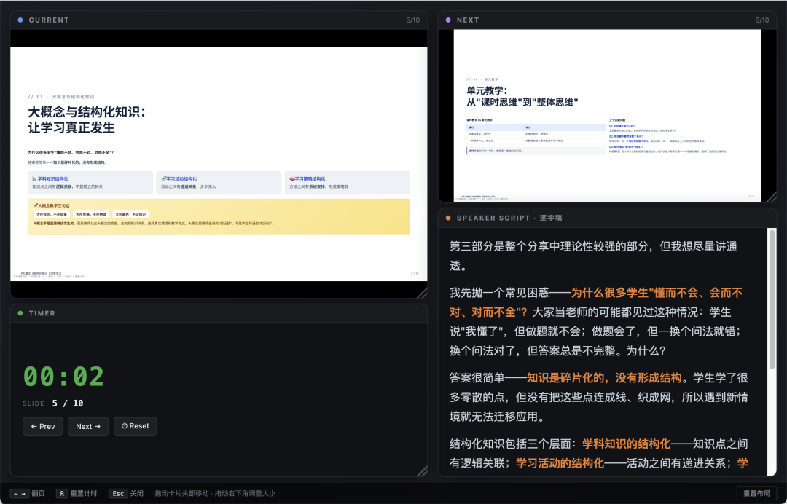

**第1步：安装html-ppt-skill**

大家俗称的“小龙虾”，指的是 Workbuddy、OpenClaw 这类新一代 AI 智能体（Agent）。以QClaw为例，在对话界面给QClaw发送安装命令。

```
npx skills add https://github.com/lewislulu/html-ppt-skill
```

或者像我一样直接用中文对话给出指令：

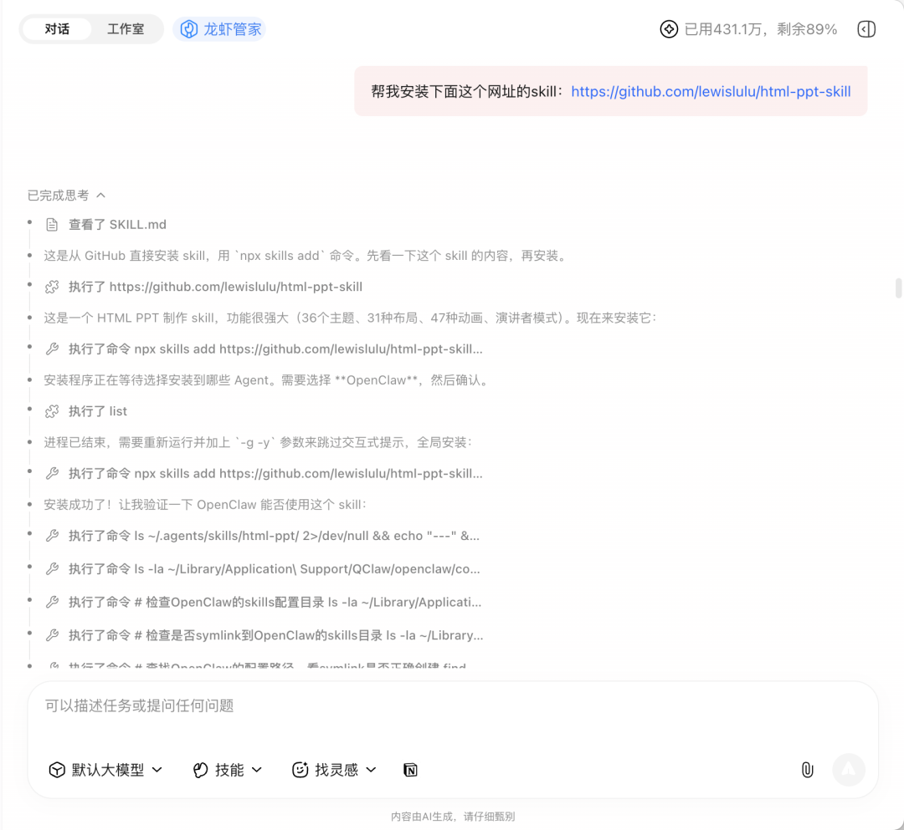

QClaw会自动完成下载、注册、依赖配置。安装完成后，你的“小龙虾”就拥有了直接生成专业级HTML PPT的完整能力。

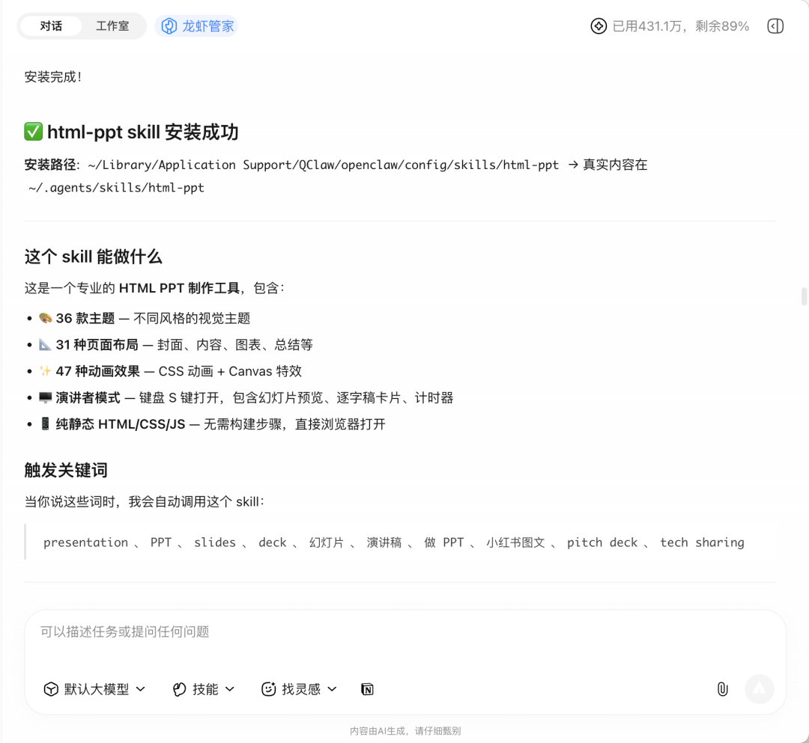

**第2步：生成html-ppt**

为了使生成的PPT符合要求，尽量对PPT的内容、使用场景、页数、风格偏好等方能描述清晰，以及是否需要演讲者模式和逐字稿。

以一篇讲座的笔记为例：[从“教书匠”到“研究者”：一位教育专家眼中的教师成长之路](https://mp.weixin.qq.com/s?__biz=MzIyMTY1MTIyNA==&mid=2247537771&idx=1&sn=cbb051f4610db439234f9f0dd551c869&scene=21#wechat_redirect)，将笔记内容粘贴给QClaw，并指示根据提供的内容生成PPT。

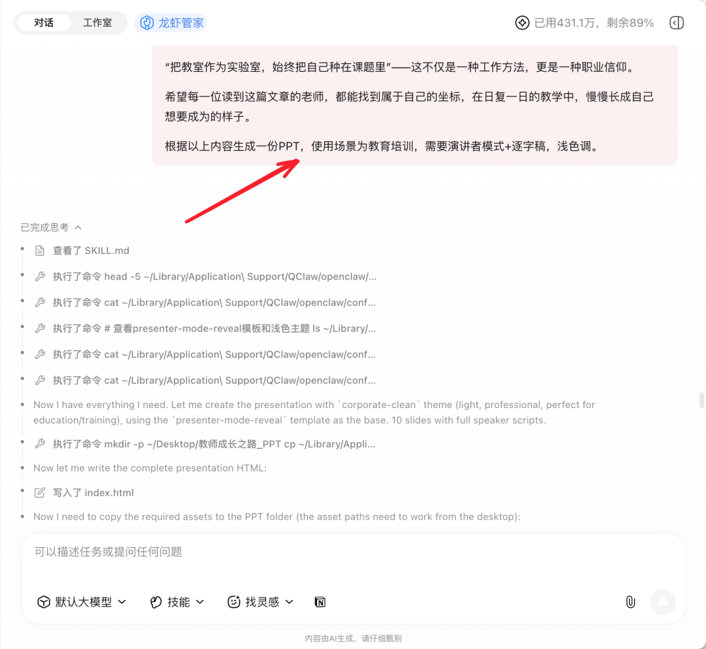

很快，PPT就制作完成了。

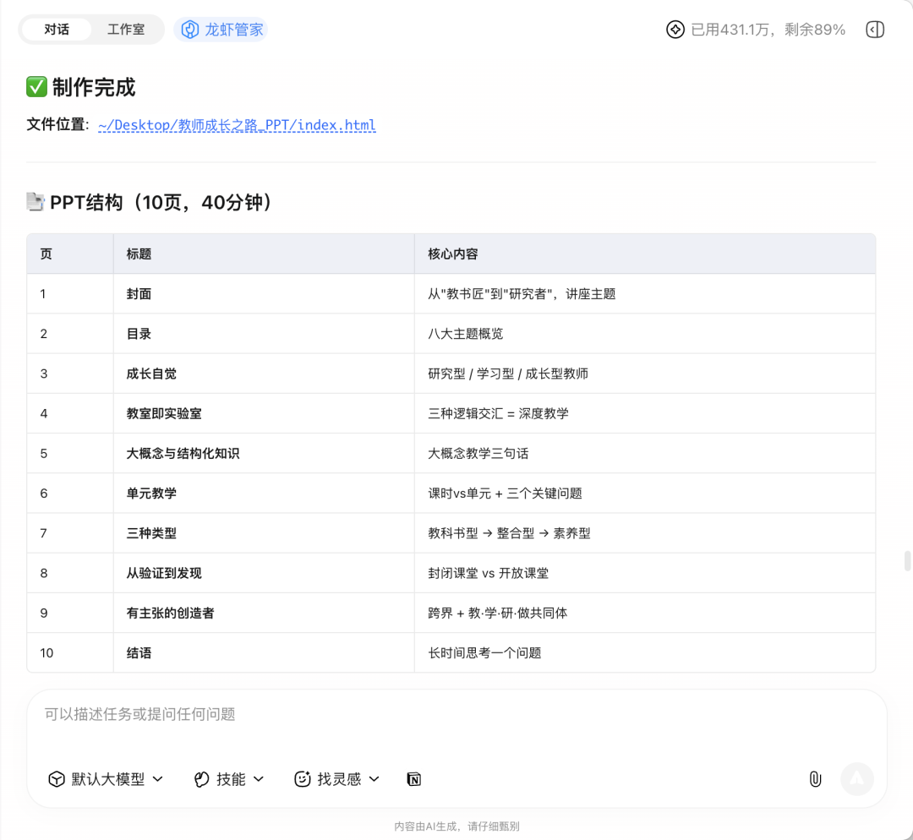

**第3步：使用html-ppt**

使用方法如下：

|  |  |
| --- | --- |
| **操作** | **快捷键** |
| 演讲者视图  （含逐字稿+计时器） | S |
| 切换主题 | T |
| 翻页 | ← → |
| 全屏 | F |
| 总览所有幻灯片 | O |
| 重置计时 | R |

按 S 后会弹出一个演讲者视图，包含当前页、下一页预览、完整逐字稿、计时器四个磁贴，可拖动调整大小和位置。窗口与主窗口实时同步。


下面是完整的10页内容展示。

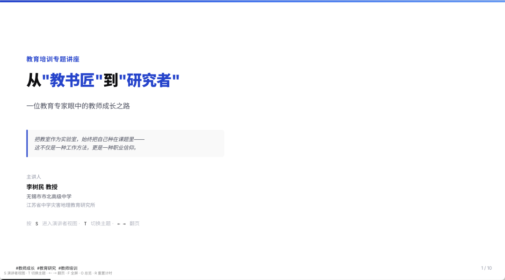

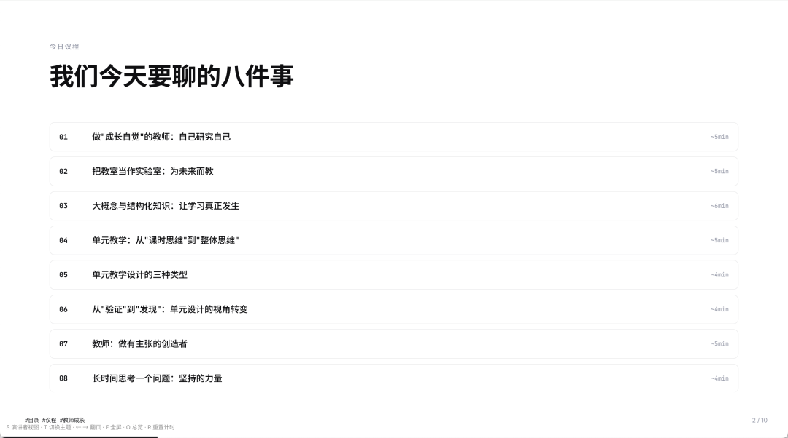

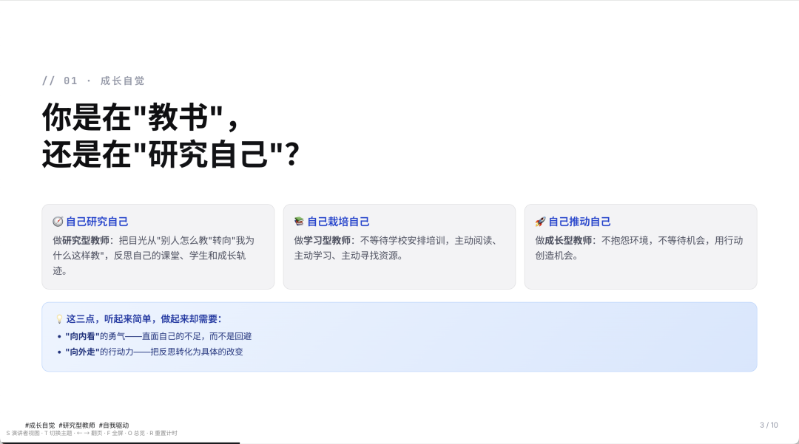

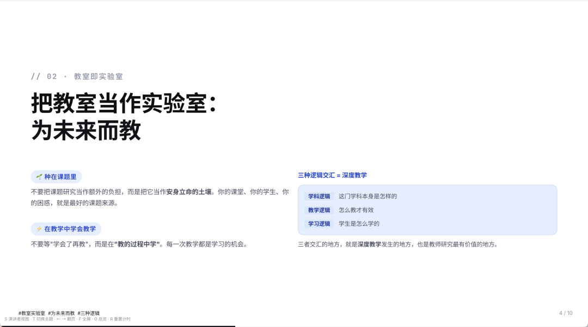

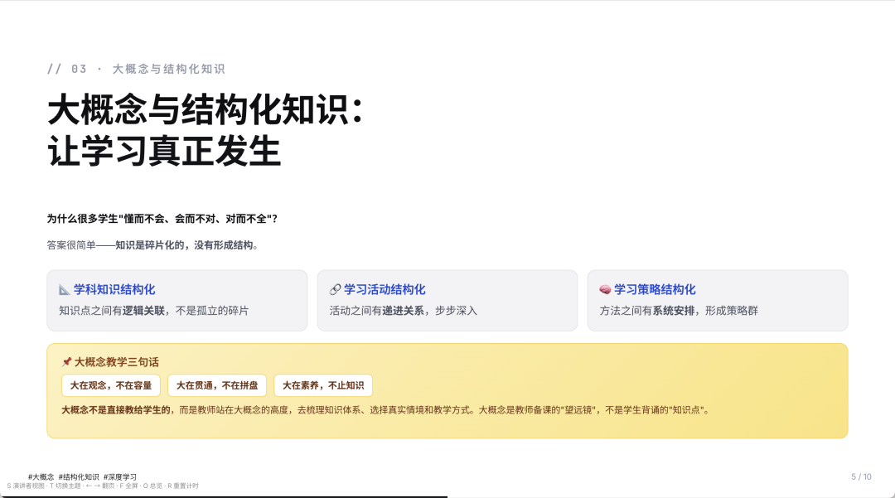

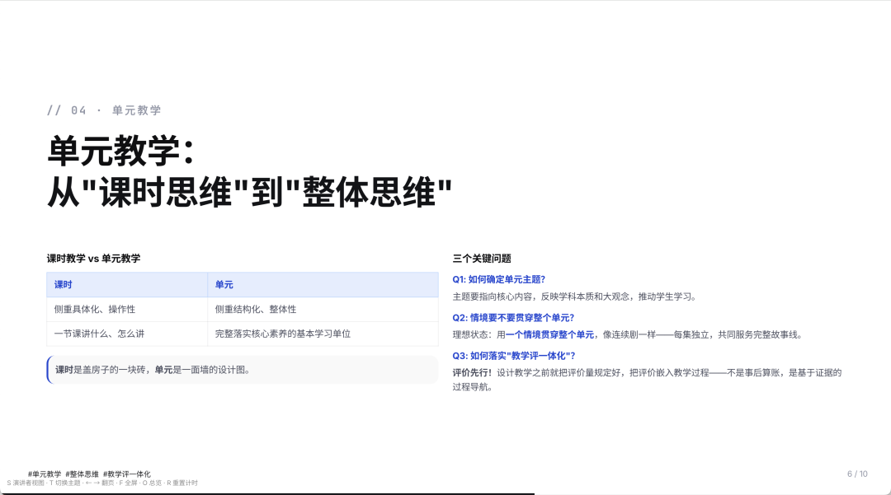

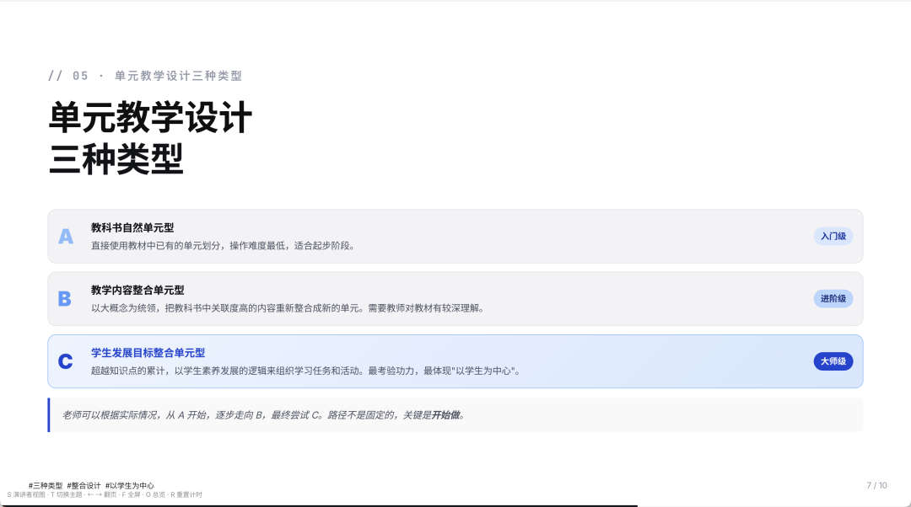

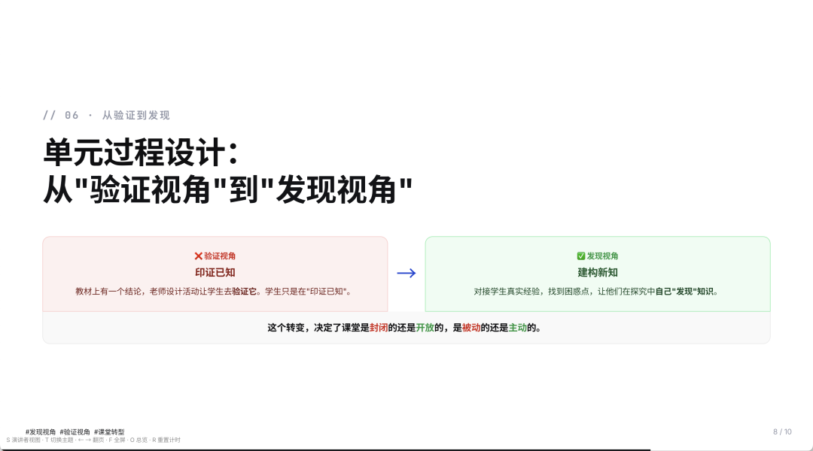

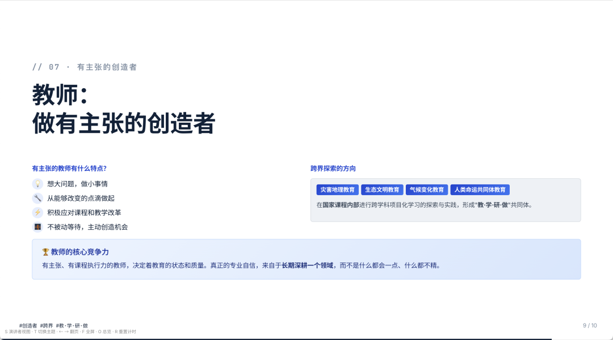

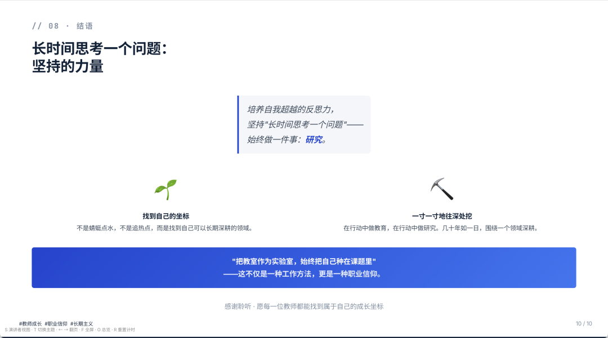

PPTX不会消失，但它不再是唯一的选择。

它可以是一个双击就能打开的网页，是一份可以发给任何人的链接，是一场让观众忘了看手机的演讲。

试一试吧。
