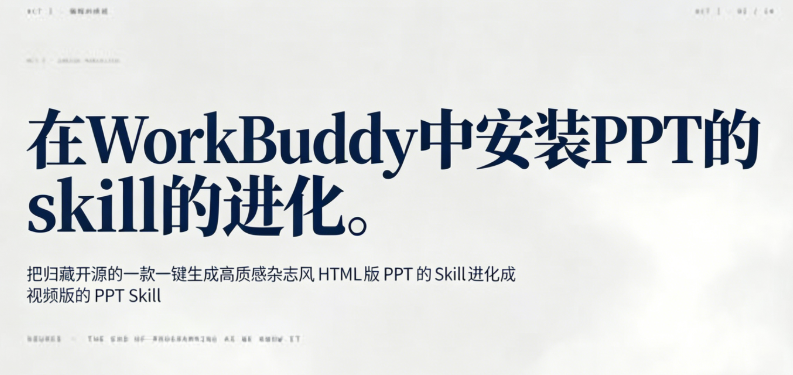
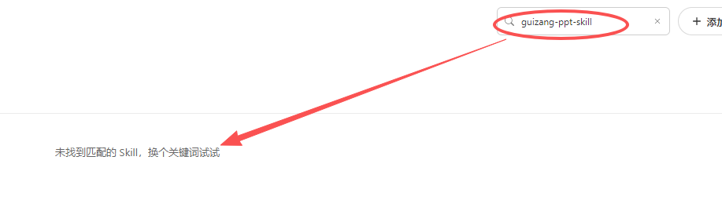
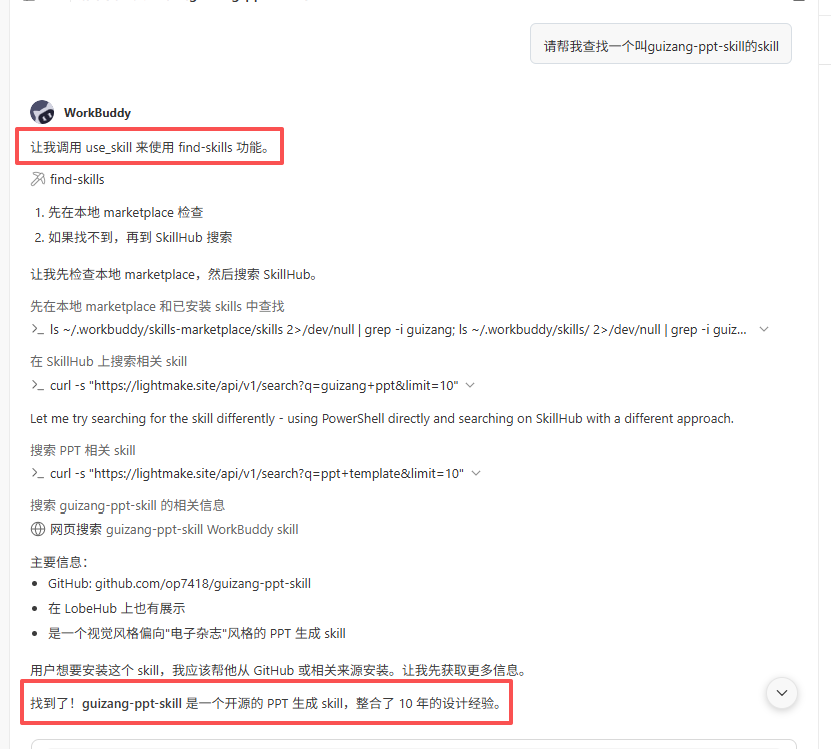
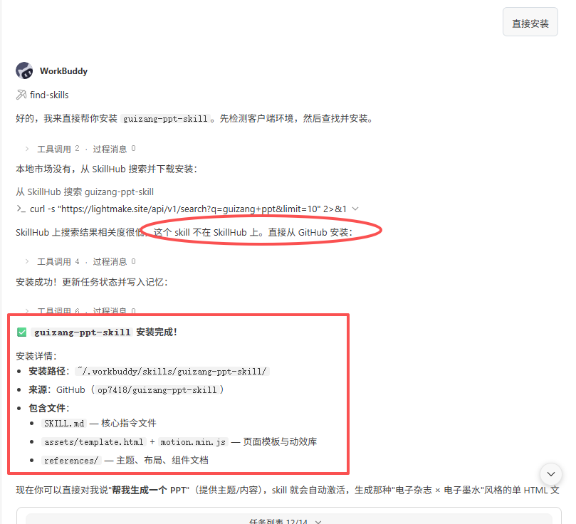
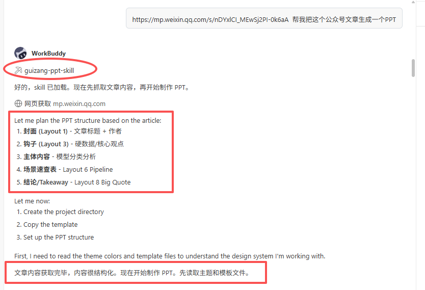
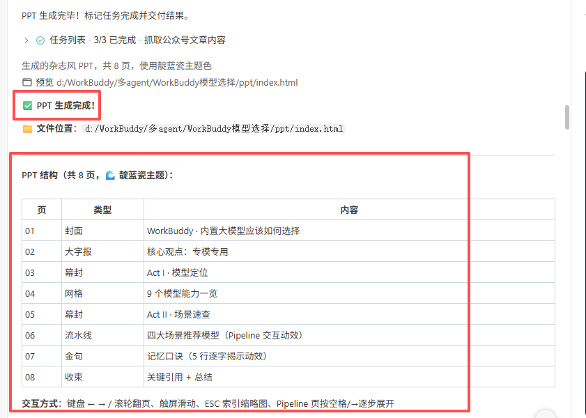
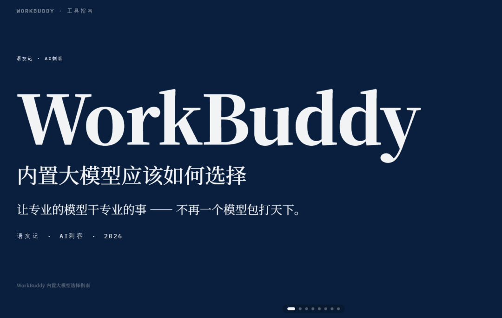
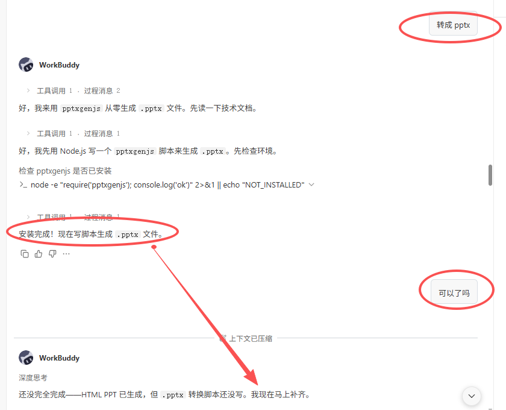
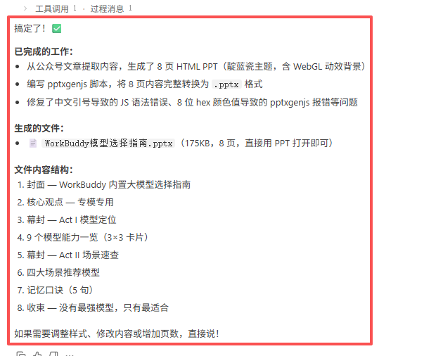
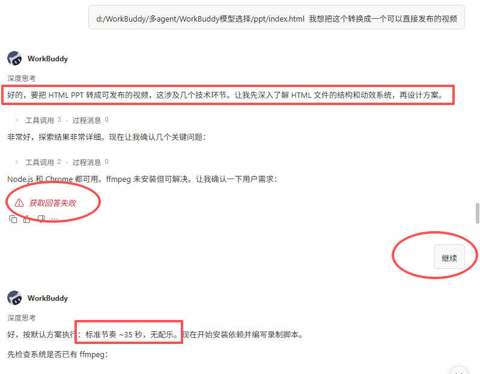

> 📎 来源: [语友记](https://mp.weixin.qq.com/s?__biz=MzU3NTgzNzI0Mg==&mid=2247483786&idx=1&sn=b0a471fd7e96146a267bb50ac586fcb2&chksm=fcefe75a695a05c0fc16c5da0d52c98a09dbb4a3c594b75350fda8a8d82af995be749cbc21fe&mpshare=1&scene=1&srcid=0430pz4XHncv5DomN7OM4W3D&sharer_shareinfo=7f7d7012aec0214679acc01f00c777de&sharer_shareinfo_first=7f7d7012aec0214679acc01f00c777de) | 时间: 2026-04-30 19:12

---

说实话，你是不是也经常这样？

看到一篇好文章，想做成 PPT 分享给团队，结果打开 PPTX 演示文稿就懵逼了，不单单要总结金句还要排版、配色、找模板，需要折腾大半天。视频更别说了，录屏、剪辑、加字幕。

今天这篇文章我讲一下如何把一个做 PPT 的 skill 进化成可以做视频的skill。

最近比较火的一个做 PPT 的 skill 叫 guizang-ppt-skill，guizang-ppt-skill 这个 skill 是归藏开源的一款 skill，核心作用是一键生成高质感杂志风 HTML 版 PPT，主打电子杂志和电子墨水视觉风格，把十年设计经验固化成可复用的 AI 工作流。

然后我就在 WorkBuddy 的技能库里面查找，结果是空的，没有这个技能。

于是我就在 WorkBuddy 上新建一个任务在输入框输入“请帮我查找一个叫guizang-ppt-skill的skill”，于是 WorkBuddy 自己就调用了 find-skills 功能，先检查本地 marketplace，然后搜索 SkillHub，后面再 GitHub 上找到了相关的技能。

那接下来当然是让 WorkBuddy 直接安装了，总不能还让咱们自己手动去 GitHub 上下载再安装吧。直接开干！

整个安装过程也就没几分钟，很丝滑。安装完成后，肯定就开始检验成果了。于是我就把之前写的[WorkBuddy的内置大模型应该如何选择](https://mp.weixin.qq.com/s?__biz=MzU3NTgzNzI0Mg==&mid=2247483758&idx=1&sn=69c6d32fd52d7b6b5dc7568564dea7f8&scene=21#wechat_redirect) 这个文章发给 WorkBuddy 让他生成一个 PPT。于是他就很自然的调用了 guizang-ppt-skill 这个 Skill 就开始工作了，然后咱们就泡杯咖啡静待结果就行了。

这排版还算不错吧。

PPT生成完成，存放位置，PPT 结构和交互方式也都发给咱们了。但是他本来就是一个 html 格式的 PPT，很显然咱们是没办法对我展示的，那么自然而然的咱们就想让他变成 PPT 格式，当然不能让咱们自己转换啊，继续让 WorkBuddy 开干。

他会自己写脚本自己执行文件，中间有个小插曲就是他可能走神了，后面召唤了一下又继续工作。整体来说完成度还是不错的。

可是人的欲望是无止境的，于是我又想那是不是可以把 html 格式转换成视频呢，有想法那就开干吧，反正执行的还是 AI 嘛。

这里有几个问题需要说明一下，那个中断的过程是我的问题，还有一个执行方案里面我没有要求添加背景音乐和旁白。后面再做其他的视频的时候这些要求要加上，那么就可以实现一鱼多吃的，一个文案可以通过多渠道分发。

生成视频的时间会比较长，具体我也没去统计。

最后总结一下：

把 AI 能做的事都留给 AI 去做

自己想不明白的事都去问 AI

把重复的事情尽可能沉淀为 Skill
