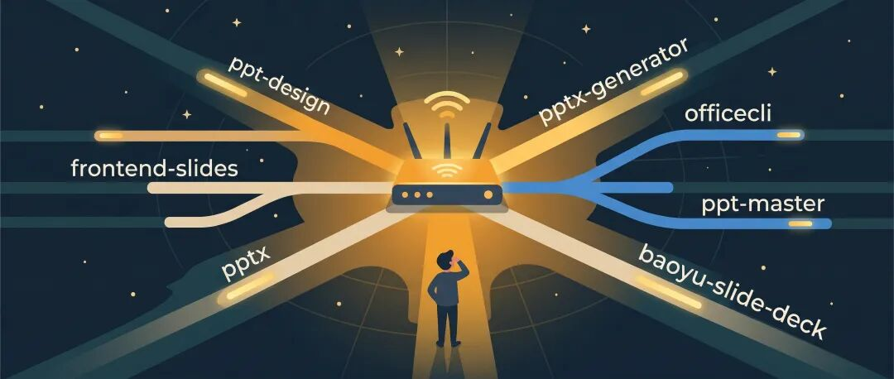
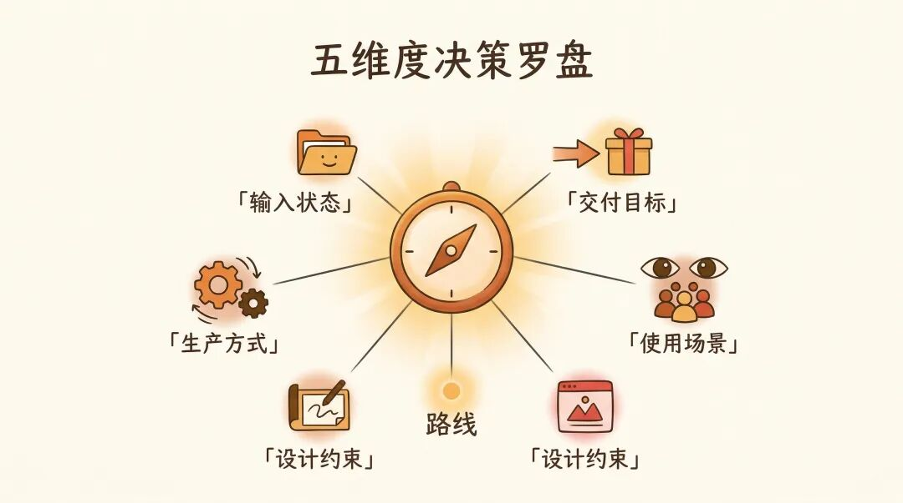

> 📎 来源: [一只迪小羊](https://mp.weixin.qq.com/s?__biz=MzkxNzUwODAwMg==&mid=2247483867&idx=1&sn=63b9f166bec1259d594246c8a3f68ef3&chksm=c0c436fdb364e6a4b368a58796f0422e6bfbc6e6c4631dbb2a9b9cb45826244652a9d9347900&mpshare=1&scene=1&srcid=0415CKsiJ3fapjMvaQswsBxG&sharer_shareinfo=2ab21afe94cb7d5b27a942abf28523d0&sharer_shareinfo_first=2ab21afe94cb7d5b27a942abf28523d0) | 时间: 2026-04-15 22:17

---

上周，我盯着 Warp 窗口（这是个AI Agent的终端工具）愣了三分钟。

我要做一份 PPT，手边有七个 skill。上篇文章我刚写完「先想清楚场景再选工具」的原则，自己坐在那里，还是不知道该用哪个。

然后我意识到一件事：「知道原则」跟「当场做判断」，是两件事。

原则好懂，判断难。

---

## 从「想清楚」到「做判断」，中间差了什么

上篇聊了两件事：不存在「最强 AI PPT 工具」，正确做法是按场景选工作流。

但它不能帮我在每次打开终端的时候真的做出选择。手里有什么？要交什么格式？别人还要不要改？我还是得每次重新想一遍，然后才知道该走哪条路。

所以我干了件事：把「做判断」这件事本身，做成了一个 skill。

在做之前，我先把七个 skill 的定位彻底捋了一遍。

## 七个 skill，各自的主场在哪

上篇已经有详细的[横评数据](https://mp.weixin.qq.com/s?__biz=MzkxNzUwODAwMg==&mid=2247483858&idx=1&sn=683d218dfe959f3bb6830814b92f06ae&scene=21#wechat_redirect)，这里不重复。我换个角度，直接说每个 skill 最适合干什么、最不该干什么。

| Skill | 一句话定位 | 最佳主场 | 别让它干的事 |
| --- | --- | --- | --- |
| ppt-design | HTML 渲染 → 图片型 PPT | 一次性高保真成品，做完就交 | 需要别人改的场景 |
| frontend-slides | 纯 HTML 演示 | 浏览器里的 conference talk | 要交 .pptx 文件 |
| baoyu-slide-deck | 信息图风格 deck | 社媒传播、知识卡片分享 | 正式商务汇报 |
| pptx | 读写已有 .pptx | 模板继承、局部替换、结构抽取 | 从零设计高保真页面 |
| pptx-generator | 代码生成原生 .pptx | 周报月报等高频批量生产 | 一次性的视觉创意 |
| officecli | 原生 Office 执行层 + 质检 | 底层修改、批量替换、交付前 QA | 当设计主力从零出图 |
| ppt-master | 设计规格驱动的整套重构 | 有材料没模板，想整套重做 | 在已有模板上做局部修改 |

上篇没提到 ppt-master，这是后来补进来的。这个skill也是用来生成可编辑的pptx格式的，走的路线跟minimax的pptx-generator不太一样。给它材料，它先选风格模板、确认 design spec，再按页生成一整套视觉统一的新ppt。不继承原有结构，直接『拆了重建』。

七个 skill 各管各的活。现在的问题是怎么知道该用哪个。

## 路由器：把判断逻辑变成可执行的 checklist

我自己测试实践一番后，思路是这样子的，我会先在脑海里快速过一下五个维度的 checklist：

| # | 维度 | 在问什么 | 典型选项 |
| --- | --- | --- | --- |
| 1 | 输入状态 | 手里有什么？ | 模糊想法 / 完整文稿 / 现成 .pptx |
| 2 | 交付目标 | 要交什么？ | 原生 .pptx / HTML 演示 / 图片 |
| 3 | 使用场景 | 给谁看？ | 内部周会 / 客户提案 / 社媒传播 |
| 4 | 设计约束 | 有没有模板限制？ | 品牌模板 / 自由发挥 / 信息图风 |
| 5 | 生产方式 | 一次性还是批量？ | 一次性交付 / 每周都要出 |

这五个问题想清楚，大部分任务都能落进一条明确路线。

举几个典型场景：

| 场景 | 输入 | 交付 | 推荐路线 | 为什么 |
| --- | --- | --- | --- | --- |
| 从零做高保真成品 | 主题/文稿 | 一次性视觉成品 | ppt-design | 视觉完成度最高，做完直接交 |
| 企业模板灌新内容 | 现成 .pptx | 别人要能继续改 | pptx + officecli | 继承结构，安全替换，质检收尾 |
| 每周出周报 | 固定结构 | 原生 .pptx | pptx-generator + officecli | 页型固化成代码，每次只更新数据 |
| 产品 demo 演示 | 内容文稿 | 浏览器播放 | frontend-slides | 动效好，不需要 PPT 文件 |
| 社媒知识卡片 | 内容文稿 | 图片 + PDF | baoyu-slide-deck | 传播感强，多格式分发 |
| 整套重做新演示 | 散装材料 | 视觉统一的新 deck | ppt-master | 从材料出发，整套设计 |
| 成熟企业 deck 改版 | 几十页页型的 deck | 继承风格的新版 | pptx + officecli | 识别页型 → 复制 → 安全替换 |

最后一种场景多说一句。手里那种积累了几十页页型的成熟企业 deck，封面、章节页、案例页都有了，千万别让 AI 从零重新设计。先识别页型，复制最接近的那一页，再做文本和图片替换。省事，还不容易翻车。

---

## 路由器做出来了，然后发现了一件好笑的事

路由器做好之后，我拿 skill-creator （这是anthropic官方自带的生成skill的skill，强烈建议每个人都要必装）自带的触发评测脚本跑了一轮测试。

测的不是路由结论对不对，而是更底层的事：这个 skill 会不会被Agent主动触发。

我写了 20 条真实中文 query，10 条应该触发路由器，10 条不该触发。让Agent在只看到 skill 名称和描述的情况下，判断要不要读这个 skill。

结果：

| 组别 | 条数 | 正确判断 | 准确率 |
| --- | --- | --- | --- |
| 不该触发 | 10 | 10 | 100% |
| 应该触发 | 10 | 0 | 0% |
| 总计 | 20 | 10 | 50% |

一半。听着还行？拆开看就笑了。Agent 完美判断了「哪些不该走路由器」，10 条全对。但「应该走路由器」的那 10 条，一条都没触发。

我把描述改了一版，写得更直白，更强调「PPT 任务应该先过路由器」。重新跑。

10/20。一模一样。

## 这件事在说什么

这个路由器是个 meta skill。

它不生成 PPT，不改文件，它就干一件事：决定该走哪条路。

对 Agent 来说，「该用哪个工具」这种问题，它更愿意直接在对话里回答。它觉得自己对这些工具都了解，可以直接给建议，没必要多走一步查手册。

这不是 Agent 的 bug。meta skill 天然就难被自动触发，因为它越接近「做决策」而不是「做产出」，AI 就越觉得自己能直接搞定。

医院的分诊台有用，是因为病人进门必须经过。AI 工具体系没有这个强制入口，Agent 可以直接跳过路由器开干。

所以 meta skill 得换个落地方式。

| 落地方式 | 怎么做 | 适合场景 |
| --- | --- | --- |
| 用户显式调用 | 「先用 ppt-flow-router 判断路线」 | 你知道有路由器，愿意多走一步 |
| 上层调度强制 | 在 PPT 工作流入口写死：先过路由器 | 团队协作、标准化流程 |
| 逻辑下沉到各 skill | 让每个 skill 自己说清楚适合/不适合什么 | 不依赖单独路由器，各自声明边界 |

不指望路由器自发触发，而是把它当成一本可以随时查的决策手册。

---

## 做路由器的真正收益

做完这个路由器，我个人觉得最大的收获不是路由器本身。

我们做工具体系，容易陷进「把工具做全」的执念。七八个 skill 摆在面前，以为够多、够专，问题就解决了。但工具之间怎么选，才是最难的部分。

AI agent 体系里更明显。AI 对每个工具都了解一点，反而让它倾向于直接干活，不会先停下来想「我应该用哪个」。

路由这件事，得靠人。要么把规则内化成自己的判断力，要么把路由器做成一个你愿意主动调的入口。

这次做 ppt-flow-router，不管它能不能自动触发，过程对我自己挺值。五个维度、七条路线、十几个场景，写完、测完，刻在脑子里了。现在遇到 PPT 任务，不用打开路由器，我自己就能判断。

做路由器最大的意义，可能不是让 AI 来路由，是把判断逻辑搞清楚，让自己变成路由器。

---

上篇文章结尾我说「我已经开始做了，有进展再聊」。

这篇就是进展。如果你手里也有一堆工具不知道每次该用哪个，可以试试自己做一份判断手册。就算 AI 不一定会用它，你自己用起来也值。

谢谢你看我的文章，如果觉得不错，随手点个赞、在看、转发三连吧，如果想第一时间收到推送，也可以给我个星标⭐～

> / 作者：一只迪小羊
