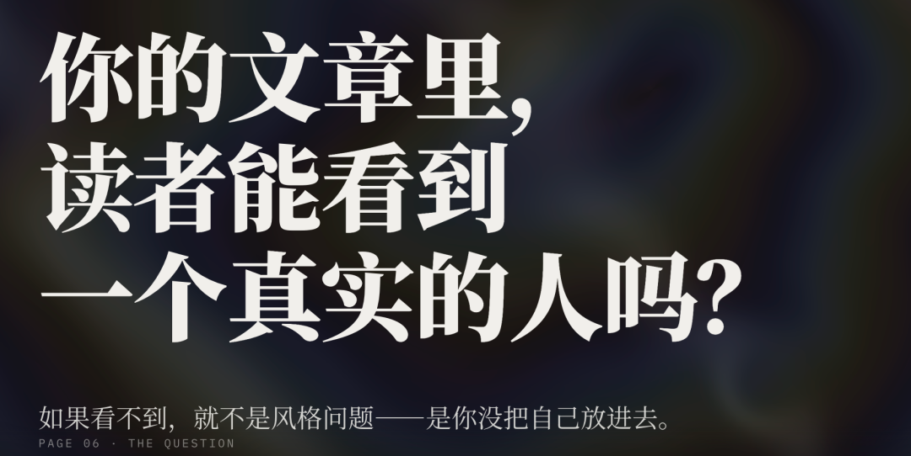
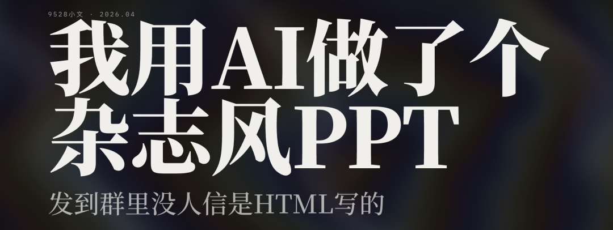

> 📎 来源: [9528小文](https://mp.weixin.qq.com/s?__biz=MzA4ODA3NjUwOA==&mid=2650033288&idx=1&sn=c55a54471da4ae1d380214648e2eedd2&chksm=897de89badcc7bf1ff52ae3a40a7f9c647b67379690cf0bd1b7282d93251ba9d4f6c79606bc5&mpshare=1&scene=1&srcid=0429RB1B2fH6RLdMxGgsgLsD&sharer_shareinfo=4ced29c021c299c0e5c14e08b789b567&sharer_shareinfo_first=4ced29c021c299c0e5c14e08b789b567) | 时间: 2026-04-29 03:39

---

> **导读**：我用AI做了个杂志风PPT,发到群里没人信是HTML写的：昨天有人群里问：有没有什么工具能快速做PPT？不要太花哨的那种，但要好看。

昨天有人群里问：有没有什么工具能快速做PPT？不要太花哨的那种，但要好看。

我顺手甩了一个链接过去，群里炸了。

不是因为效果多震撼——而是因为**那根本不是PPT，就是一个HTML文件，浏览器打开就能翻页。**

## 事情的起因

这两天在GitHub上闲逛，刷到一个项目叫 **guizang-ppt-skill**，作者是个叫歸藏的人（推特 @op7418）。

这哥们有点意思。他做线下分享的时候，从不用Keynote或者PPT，而是用自己写的一套HTML模板——横向翻页，WebGL流体背景，衬线大标题配非衬线正文，看起来像一本电子杂志。

关键是，他把这套东西开源了。

而且还做成了 **Claude Code 的 Skill**，意思是你直接跟AI说"帮我做一份杂志风PPT"，它就按这套模板帮你生成。

我当时就想试试。

## 安装只要一行命令

装 Claude Code 的朋友，终端里跑一行就行：

```
git clone https://github.com/op7418/guizang-ppt-skill.git ~/.claude/skills/guizang-ppt-skill
```

装完之后，Claude Code 会自动识别这个 Skill。你跟它说"做一份杂志风PPT"，它就开始引导你了。

没装 Claude Code 也没关系，你可以直接去仓库里拿 `assets/template.html` 这个文件，浏览器打开就能看到效果。

## 我实际做了一份，说说体验

我给 Claude Code 说了句："帮我做一个关于AI编程工具趋势的5页PPT，用靛蓝瓷主题。"

它先问了6个问题——受众是谁、分享多长时间、有没有素材、有没有图片、想要哪个主题色、有没有硬性要求。

这步我本来想跳过，但想了想还是答了。因为**它问的问题确实有用**——比如"分享时长"这一条，15分钟大概10页，30分钟大概20页，你没想过的话很容易做多或者做少。

然后它开始生成。

大概3分钟，给了我一个完整的HTML文件。

浏览器打开一看——

说实话，我愣了一下。

**不是那种"哇塞"的震惊，而是一种很舒服的感觉。**WebGL背景在封面页微微流动，衬线标题（Noto Serif SC）配非衬线正文（Noto Sans SC），字体层级非常清晰。左右翻页，底部有圆点导航，ESC键能看全部页面索引。

整个东西看起来就是——高级。

不像PPT，不像网页，像一本设计过的电子杂志。

## 但是，说实话有缺点

**第一，图片得自己准备。**

它不会帮你生成图片。模板里预留了图片位置，但图片要你自己放进去。如果你做的PPT图文混排比较多，这一步会比较费时间。

**第二，不适合信息密度高的内容。**

这东西本质上是演讲用的视觉辅助，不是培训课件。你要是想在每页塞满文字和表格，它不合适。它的美学是"克制"——大标题、留白、少量核心信息。

**第三，需要一点点审美。**

虽然有5套预设主题（墨水经典、靛蓝瓷、森林墨、牛皮纸、沙丘），但内容怎么排、每页用什么布局，还是需要你自己判断。作者在SKILL.md里写了一大堆规则，比如"WebGL背景只在封面页透出""图片只裁底部不裁顶部"之类的，这些都是为了保护美感。但你得有意识去遵守。

**第四，要会用 Claude Code。**

这是最大的门槛。如果你不用 Claude Code，就得手动改HTML。对前端开发者来说不难，但对普通人来说可能有点费劲。

## 5套主题我都试了，说说哪个好

1）**墨水经典** — 黑白为主，通用百搭。不知道选啥就选这个。 2）**靛蓝瓷** — 深蓝色调，科技感强。我做的就是这套，适合AI/技术主题。 3）**森林墨** — 深绿色，适合自然/文化/可持续发展主题。 4）**牛皮纸** — 米黄色底，文艺范儿。做文学/人文类分享很搭。 5）**沙丘** — 暖色调，适合设计/创意/艺术类。

切换主题只要改HTML开头6行CSS变量，其他代码不用动。

## 10种页面布局，够用了

它内置了10种布局模板：

• 封面页（大标题+WebGL背景）

• 章节幕封（过渡页）

• 数据大字报（一个数字+说明文字，很适合展示关键指标）

• 左文右图

• 图片网格

• Pipeline流程图

• 悬念问题页

• 大引用页

• Before/After对比页

• 图文混排页

基本上做演讲需要的页面类型都覆盖了。



## 它最适合什么场景？

老实说，不是所有场景都适合。

**最适合的**：线下分享、行业演讲、产品发布、demo day、任何需要"个人风格"的展示。

**不适合的**：培训课件（信息密度不够）、需要多人协作的商务PPT（这是静态HTML，没法协同编辑）、数据报表展示。

我自己觉得，它最大的价值不是替代PPT工具，而是**逼你思考怎么讲好一个故事**。因为每页空间有限，你不得不精炼内容，想清楚每页要传达什么。

## 最后

guizang-ppt-skill 这个东西，不是什么"AI一键生成完美PPT"的神话。它是一个**有明确美学主张的工具**——作者知道自己要什么风格，然后把这套风格变成了可复用的模板。

这点我觉得挺值得尊敬的。

如果你经常做线下分享，或者想做点不一样的演示，值得花半小时试试。

项目地址：https://github.com/op7418/guizang-ppt-skill

*你平时用什么做PPT？试过这种HTML方案吗？评论区聊聊 👇*


