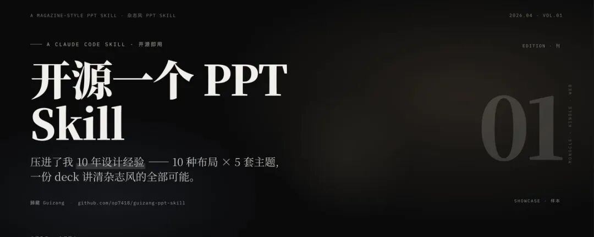
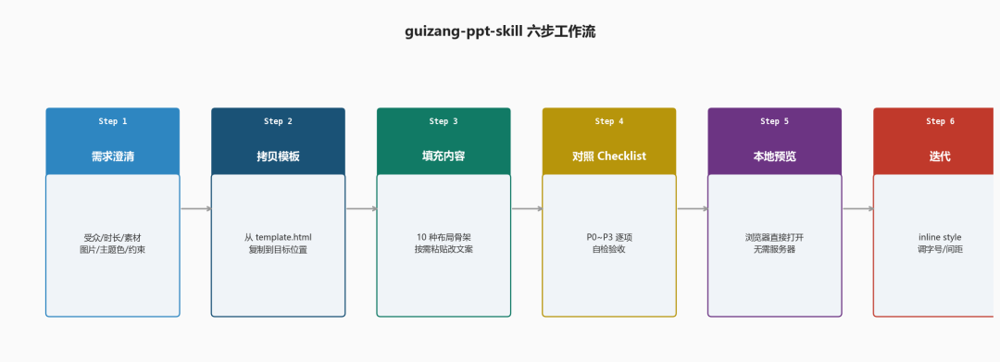
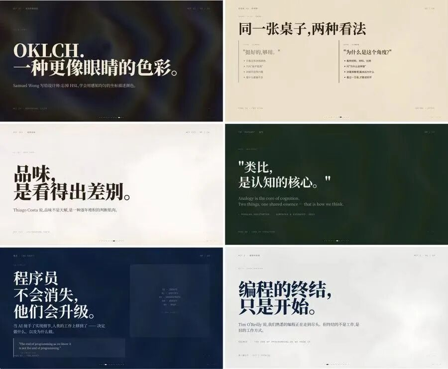

> 📎 来源: [零壹界点](https://mp.weixin.qq.com/s?__biz=MzIxMzk1MzQ0Ng==&mid=2247483835&idx=1&sn=a1d53958b428ed3aa702103f129eae1c&chksm=963d307e7b7e9e91fe3b185dec8fe27419e56800df18dc58759ee287ca0fca5e6c4f2d80084d&mpshare=1&scene=1&srcid=0425nP60K4lm0QZEKOEjsfjS&sharer_shareinfo=46a88b4c5260dea696e00370882b8a1c&sharer_shareinfo_first=46a88b4c5260dea696e00370882b8a1c) | 时间: 2026-04-25 19:29

---

> 本文从**工具机制的视角**出发，拆解开源的 guizang-ppt-skill 的完整工作方式——它是什么、六步工作流怎么约束 Claude 的生成行为、适合哪些场合用、以及这类工具的更大意义。

---

## 1、guizang-ppt-skill 是什么

用 AI 做 PPT，最难控制的不是内容，是审美失控——颜色搭错、字体乱用，一页幻灯片就从演讲道具变成了商务表格。`guizang-ppt-skill` 的解法是直接把选色权拿走：5 套预设主题，选一套用到底，不允许自定义 hex 值，理由写在文档里："保护美学比给自由更重要。"

它的本质不是软件，是一段结构化文档——放在 Claude Code 配置目录里，告诉 Claude 该按什么流程、什么约束来生成 PPT。生成结果是一个**单文件 HTML**：CSS、动态背景、翻页逻辑、字体引用全部内嵌，浏览器直接打开就能演示，不需要安装任何东西。

视觉风格参考的是 *Monocle* 杂志的版式：标题用衬线字体、正文用无衬线字体、时间戳和编号用等宽字体，三套字体对应三个信息层级，规则固定不允许混用。封面和章节页有流体动态背景，正文页背景几乎完全遮住，克制到接近电子墨水的质感，横向翻页，支持键盘方向键、滚轮和触屏。

这个工具开源的起因是在一场线下分享后被问"那个 PPT 用什么做的，能开源吗"。所以把迭代了多轮的演讲制作流程和模板直接打包成 Skill 发了出来。

> **重点**：guizang-ppt-skill 的核心价值是把经过验证的演示设计约束固化进 Claude 的工作流——让 AI 按规矩行事，而不是自由发挥审美。

---

## 2、六步工作流：Claude 主动问你，而不是你猜着写提示词

通常用 AI 做 PPT，结果质量取决于提示词写得有多细——你漏了什么，AI 就自己补什么。`guizang-ppt-skill` 换了方向：把需要细化的问题全写进工作流，让 Claude 主动来问，不等你想清楚。

**Step 1 · 需求澄清**是整个流程的前置保险。Skill 给 Claude 规定了一份 6 问清单：受众和场景、分享时长（15 分钟约 10 页、30 分钟约 20 页）、原始素材、图片情况、主题色选择、硬约束。给了模糊主题，Claude 必须问完这 6 个问题再动手。

图片是 6 问里最容易被忽视的一项。Skill 要求在开始前就定好图片放哪个目录、怎么命名（格式是`页码-语义.jpg`，比如`03-dashboard.jpg`）、规格建议单张不低于 1600px、总大小控制在 10MB 以内。这些如果开始后再改，HTML 里的路径引用会乱。

**Step 2 · 拷贝模板**不是新建文件，是从 Skill 自带的种子模板复制一份到目标位置。模板里预设好了所有 CSS、动态背景脚本、翻页逻辑，Claude 只填内容，不重新搭结构。

**Step 3 · 填充内容**有一个关键前置：在写任何一页之前，必须先把所有页面的深浅主题排好——哪几页深色、哪几页浅色、哪几页是带视觉背景的封面式大页。规则是不允许连续 3 页以上同一色调，整份 PPT 必须深浅交替、大页正文交错。这张节奏表必须先确认，再开始写代码。

**Step 4～6** 是验收和调整：对照检查清单逐项自检，浏览器直接打开预览，用内联样式调字号和间距——模板已经高度参数化，"90% 的调整都是改内联样式"。

> **重点**：六步工作流把用 AI 做 PPT 最常见的两个失败原因——图片路径混乱和颜色节奏平淡——变成了开始前必须对齐的检查项，而不是留到事后发现。

---

## 3、适合线下演讲，不适合培训课件、数据汇报和多人协作

**适合**：线下分享、行业内部讲话、私享会、AI 新产品发布、demo day、带强烈个人风格的演讲。

**不适合**：

- 需要展示大量表格和数据图表的场合——工具没有这类布局，所有页面以文字和图片为主
- 培训课件——每页信息量被刻意控制，学员在幻灯片上找不到足够的参考信息
- 多人协作编辑——输出是静态 HTML，没有评论和版本追踪机制

这个工具的设计目标是视觉冲击配叙事节奏，不是信息密度。演讲时听众的眼睛应该跟着你走，PPT 只是配合说话的背板。如果听众需要低头在幻灯片上记笔记，这个工具帮不上忙。

还有一件准备工作容易被忽视：图片需要提前整理好，按命名规范放到指定目录，Skill 不会处理图片文件。截图多的话，先整理好图片再开始生成。

> **重点**：这个工具专为"一个人，一台电脑，一场线下演讲"优化，在这个场景里极好用，超出这个场景要提前做好预期管理。

---

## 4、把个人演讲经验变成任何人可复用的判断力

Skill 文档里提到了一个参考来源：YC 总裁 Garry Tan 的 "Thin Harness, Fat Skills" 概念——AI 工具的承载层尽可能薄，真正的价值沉淀在 Skills 里：领域知识、操作流程、质量约束。

`guizang-ppt-skill` 是这个模型的一个具体例子。迭代了多轮演讲 PPT，踩了很多坑，这些经验本来只存在于他自己的工作记忆里。打包成 Skill 之后，任何人安装这个 Skill，就能让 Claude 复用同一套约束系统——不是复用文件，是复用判断力。

安装方式本身也是刻意设计的：README 建议的安装方法是把一段话直接发给 AI，列出 3 条 shell 命令，让 AI 自己执行。用 AI 安装 AI 的工具，这套分发路径门槛极低，不依赖任何平台账号，复制粘贴一次完成。

Skill 文档里还有一条贡献说明值得注意：欢迎改进，但优先把踩过的坑写进检查清单的对应级别，而不是扩展功能列表。对一个以美学为核心的工具，这个方向选择比功能数量重要得多。

> **重点**：这个发布是一次"个人经验→社区工具"的完整转化——把经验变成约束系统，把约束系统变成 Skill，开源出去。这个路径比写一篇方法论博文有更长的生命周期。

---

**参考链接**

**GitHub 仓库**：https://github.com/op7418/guizang-ppt-skill
