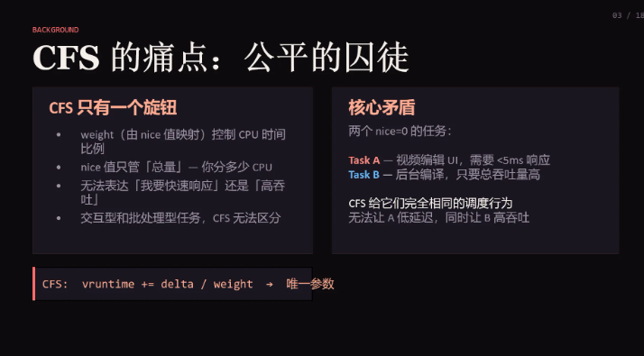
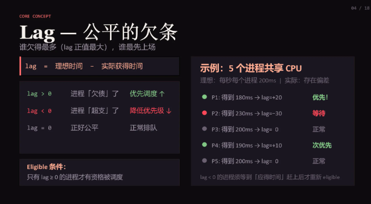
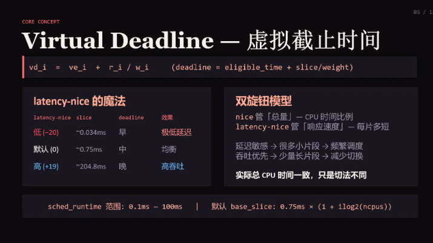
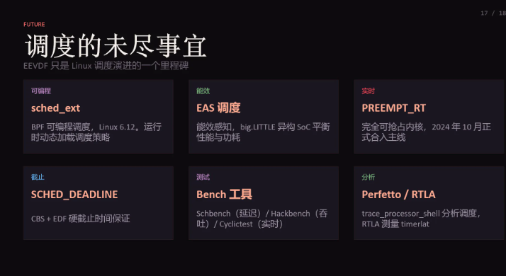

> 📎 来源: [泛终端操作系统](https://mp.weixin.qq.com/s?__biz=Mzg5Mjc0OTk2OQ==&mid=2247486041&idx=1&sn=7916bd437a905c13d9413546fbc8a54b&chksm=c127850977e2c7f8bc177da67b51285e46e8d671b325b9c7aeb73c6209ac6594d98b3ec8ecae&mpshare=1&scene=1&srcid=0415tMTGjY30YM1fuTlr2IgF&sharer_shareinfo=aeb9b193fe7556b9b64d8778a2bb3ec2&sharer_shareinfo_first=aeb9b193fe7556b9b64d8778a2bb3ec2) | 时间: 2026-04-15 22:17

---

claude还有一个比较有用的skill，就是ppt制作。本文介绍使用claude来制作ppt

# skill功能

这个skill就是代替编写ppt的复杂工作的，适用于一切使用ppt的场景，其主要的功能如下

- 展示公司或产品 --- 替代ppt本身作用
- 迭代完善已有ppt --- 替代ppt修改工作
- 数据可视化
- 重新设计原ppt

可以看到，这个skill已经全方面替代了ppt的一切场景。 我们查看一下skill内的描述

- Don't create boring slides. 强制提示claude不要设计无聊的ppt
- Pick a bold, content-informed color palette 大胆的配色
- Dominance over equality 配色有一定倾向性
- Dark/light contrast 亮暗分明
- Commit to a visual motif 强调视觉

禁止类

- 禁止相同布局
- 禁止居中文本
- 禁止节省篇幅
- 禁止蓝色
- 禁止混用间距
- 极端设计
- 禁止纯文本
- 文本框需要填充颜色
- 禁止低对比度元素
- 标题禁止重音线

关键要求

- 反复检查生成的ppt，以确保质量
- ppt需要保存新鲜感

可以看到，skill描述了一些ppt本身制作的坑。

下面基于这个skill来实战一下

# 演示

先安装

```
npx skills add https://github.com/anthropics/skills --skill pptx
```

演示打算通过之前的文章介绍eevdf来生成ppt，看看效果怎么样

```
> 请你分析 EEVDF15-21的技术文章 为我整理一个知识介绍的ppt.
```

可以看到，claude主动抓取了我的文章，正在自动生成

```
● 内容已全部抓取（7篇EEVDF系列文章）。内容量很大，这是一套完整的Linux  EEVDF调度器深度解析系列。现在使用前端技能生成高质量PPT。●ISkill(frontend-design)                       ng)  ⎿  Successfully loaded skill
```

十分钟后，ppt生成好了

```
● PPTX 文件已生成：C:/eevdf-presentation.pptx（476KB，18页）  Coral Energy 主题设计要素：  - 深色背景 #0D0B0E + 卡片色 #1A1620  - 珊瑚主色 #FF6B6B 用于标签、公式左边框、强调  - 蜜桃色 #FFAB91 用于代码、副标题、关键词  - 每页含卡片布局 + 公式框 + 代码块  - Georgia 标题 + Calibri 正文 + Consolas 代码  可以直接用 PowerPoint 打开查看。● Background command "Check/install pptxgenjs" completed (exit code 0)● Background command "Install pptxgenjs globally" completed (exit code 0)● Background command "Run with global node_modules path" completed (exit code 0)● 所有后台任务均已确认完成。PPTX 文件已就绪：C:/eevdf-presentation.pptx（476KB，18页），可以直接用 PowerPoint  打开。
```

现在看看效果










可以看到，这个ppt比绝大部分人自己写都要优秀。

# 总结

ppt这个skill能够替代所有需要ppt的场景，我们在使用skill之前，记得翻阅一下其skill的描述，能够让我们很轻松的使用这个skill，所谓知己知彼，就是这个意思。

# 参考

> https://support.claude.com/en/articles/13521390-use-claude-for-powerpoint
