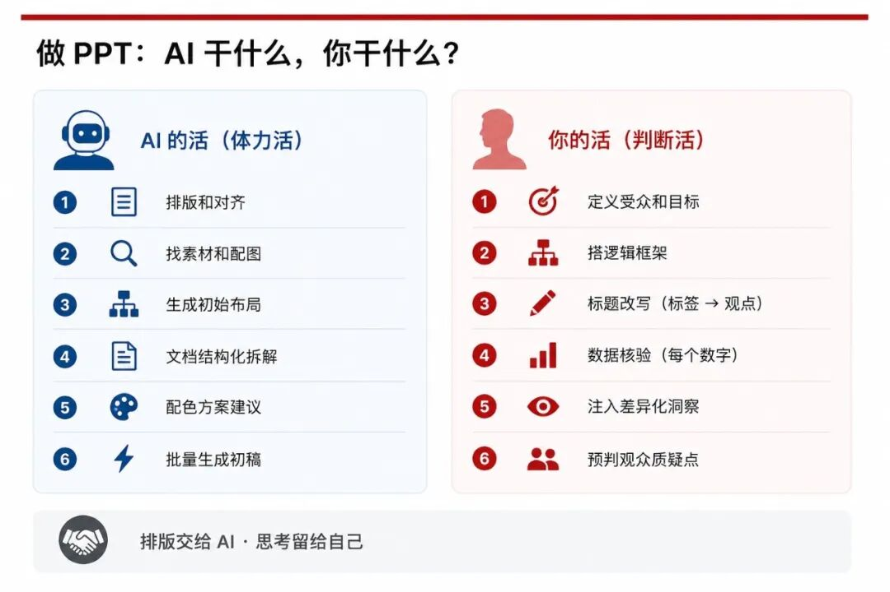
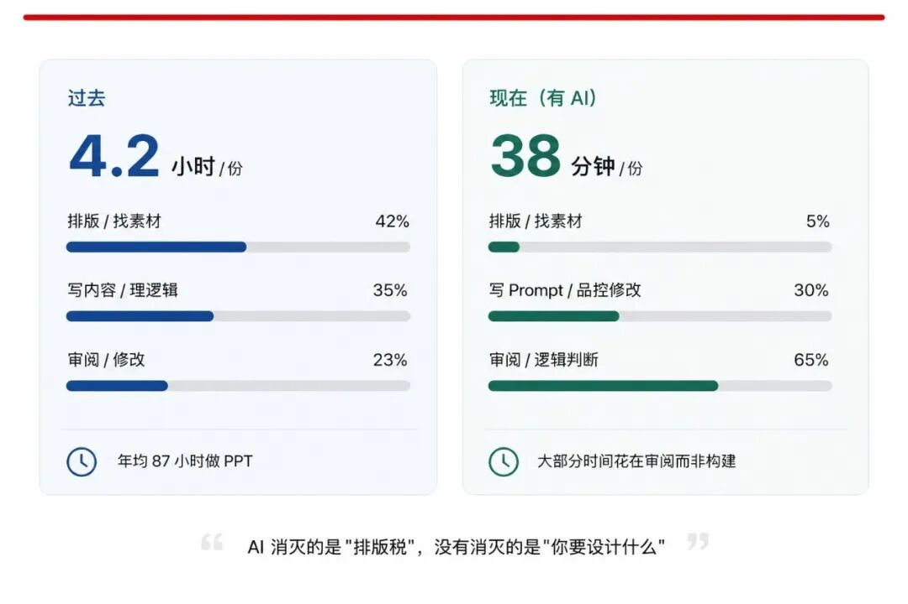
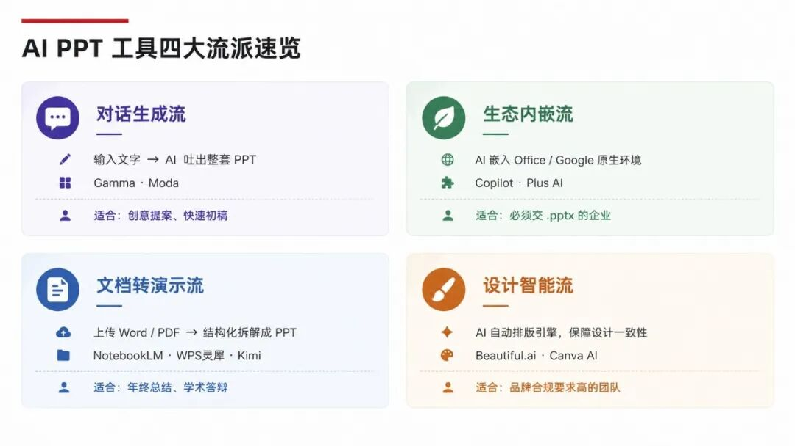
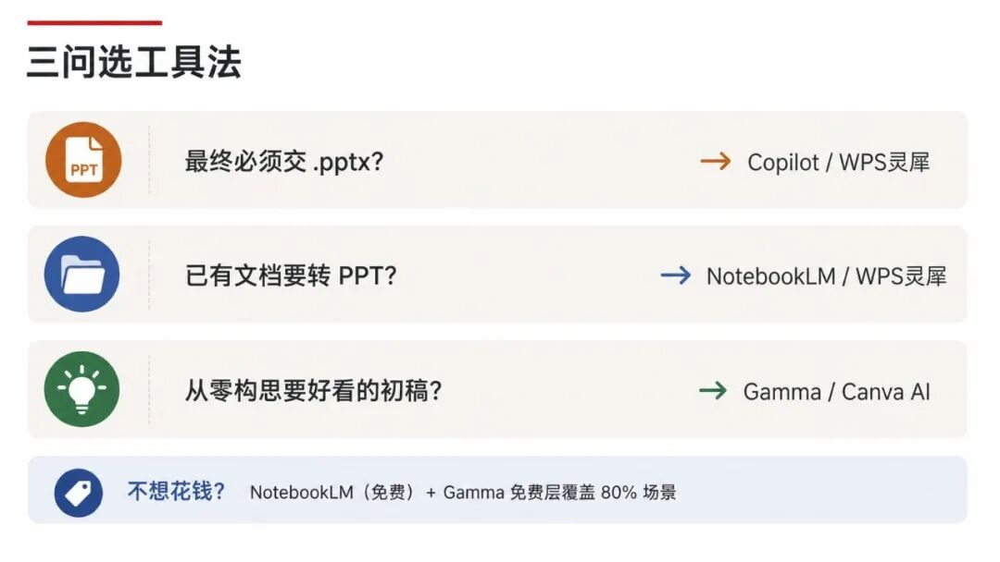
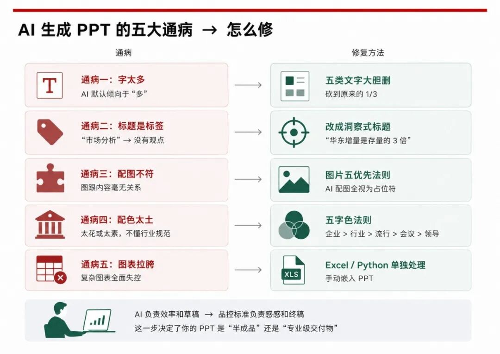
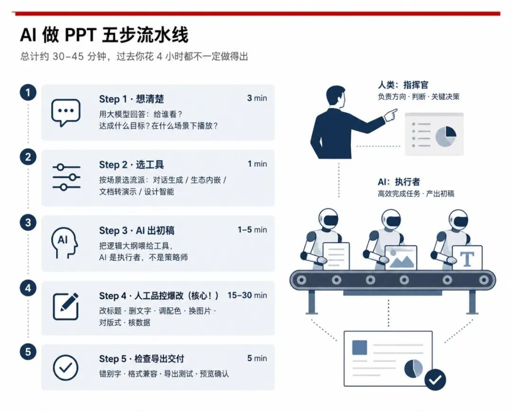
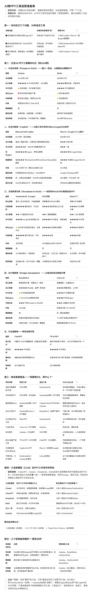

> 📎 来源: [奇天大盛](https://mp.weixin.qq.com/s?__biz=MjM5MTM1NDM5OA==&mid=2453886417&idx=1&sn=0816782ba2afd264ed1c3d83ca804036&chksm=b012c13f2059a308b1ff4bb541308f6f5a23f3b13f6178b37619693e750e8eb09af7780a3fb2&mpshare=1&scene=1&srcid=04293Lwtt3AYf2057SWiiIX7&sharer_shareinfo=0bcb79af3cb2dd4010616d02585f5569&sharer_shareinfo_first=0bcb79af3cb2dd4010616d02585f5569) | 时间: 2026-04-29 03:49

---

经常有朋友在大半夜里，向我请教怎么样做PPT，以及使用AI做PPT的方法。

"盛少，我刚用Gamma生成了一份pitch deck，60秒出了12页。设计感真的不错。然后我花了两个小时修格式。导出的pptx，字体全跑了，间距乱了，配图糊了。你说我图什么？"

此类消息，几乎是过去半年里我收到频率最高的一类问题的缩影。今天我在这篇文章中，系统地来讲一下。

"AI能不能做PPT"——这个问题在2026年已经不需要回答了，全球AI演示文稿市场已经跨过47亿美元，企业采用率突破60%。

问题是：**大多数人用AI做PPT的方式，从根上就是错的。**

我花了三个月时间，调研欧美、日韩、中国等不同语种的文件格式，看了几十份深度评测报告，实测了十多款工具，交叉验证了所有关键结论。今天这篇文章，不是工具推荐帖，不是"十个提示词改变你的PPT"的爽文。它是一份系统性的对你使用AI做PPT的认知较准——帮你搞清楚三件事：

**AI在PPT这件事上，到底能干什么、不能干什么、以及你该怎么干。**

收藏不如读完，读完不如今晚就试一次。

## 先破一个幻觉：AI做PPT ≠ "一键生成"

很多人对AI做PPT的想象是这样的：输入一句话，AI吐出一份精美PPT，直接拿去汇报。

现实是这样的：AI确实能在45-60秒内生成10页还不错的初稿。但如果你就这样交出去，你得到的大概率是领导的一句——"这是AI生成的吧？你的脑子在哪里？重做。"

为什么？

因为AI做PPT真正消灭的，是"排版税"——那些对齐、配色、找素材的体力活。数据很清楚：职场人年均花87小时做PPT，其中42%的时间烧在排版和找素材上。但AI没有消灭、也消灭不了的是：**你的PPT到底要说什么，说给谁听，想让对方做什么决定。**

****

这才是做PPT真正难的部分，而这部分，从来不是靠工具解决的。

麻省理工学院在这方面的判断已经成了行业共识：AI能重组已知信息，但无法创造全新洞见。融资路演、董事会汇报、危机沟通——这些高风险场景里的受众洞察、情绪弧线、反对意见预判，仍然是纯粹的人类领地。

所以，与其把AI当成一个"替你做PPT"的机器人，不如把它理解成一个**极其高效但没有判断力的助手**。你负责方向，它负责执行。它负责出稿，你负责品控。

这个认知差异，决定了你用AI做PPT是省两小时，还是多浪费两小时。

## 工具那么多，到底用哪个？先搞清楚四大流派

打开任何一篇AI PPT推荐文章，你都会看到一堆工具名字：Gamma、Copilot、WPS灵犀AI、NotebookLM、Canva AI、Kimi PPT、Beautiful.ai……

信息太多反而是负担。有篇评测文章说得很直接：中文职场用户面临的不是"选哪个"的问题，而是"没有一个完美选项"的困境。别一个个试了，我目前把所有工具梳理成四个流派，你只需要搞清楚自己属于哪种场景，直接选就好。

**流派一：对话生成流。** 代表工具是Gamma。你输入一段文字描述或上传一份文档，AI一次性吐出整套PPT。速度极快，设计感强。致命问题：导出成.pptx后格式错乱严重——这就是我那位朋友的血泪经历。中文排版也不太稳定。适合快速出创意初稿，但别指望导出后直接能用。

**流派二：生态内嵌流。** 代表工具是Microsoft 365 Copilot。AI直接嵌在你的PowerPoint里工作，生成的就是原生.pptx文件，格式零摩擦。但多位评测者给出了同一个判断：Copilot从零生成的PPT"通用到毫无用处"。它真正的价值在于"把你的Word文档转成PPT"和"给已有幻灯片加演讲备注"，而不是从零创作。更扎心的是，一家欧洲银行42人团队花了近15万人民币部署Copilot，六周后使用率只有8%，PPT质量反而下降了。工具到位不等于能力到位。

**流派三：文档转演示流。** 代表工具是NotebookLM和WPS灵犀。你把已有的Word、PDF上传，AI帮你结构化拆解成PPT。NotebookLM完全免费、内容准确性碾压同行——因为它严格基于你的源文档生成，不编造数据。缺点是设计感弱，导出能力也有限。WPS灵犀的优势在于中文职场生态的无缝衔接，适合年终总结、工作汇报这类已有大量素材需要"搬运"的场景。

**流派四：设计智能流。** 代表工具是Beautiful.ai和Canva AI。核心是AI驱动的自动排版引擎，保障设计一致性，适合品牌合规要求高的市场团队。缺点是内容生成能力偏弱，不太适合需要汇报想法的项目。

**怎么选？三个问题：**

- 最终交付物必须是.pptx吗？→ 选Copilot或WPS灵犀。
- 已有文档要转PPT？→ 选NotebookLM或WPS灵犀。
- 从零构思需要好看的初稿？→ 选Gamma或Canva AI。

如果你不想花钱，NotebookLM（免费）加上Gamma的免费层，覆盖80%的真实使用场景。这不是我说的，这是英文极客社区实测后的共识。

## 90%的人做错了第一步：不要在PPT工具里开始做PPT

这是整篇文章最重要的一个判断，请刻进脑子里：PPT不是从打开软件开始的。PPT是从想清楚三个问题开始的：

给谁看？要达成什么目标？在什么场景下播放？

这三个问题的答案，决定了你的PPT应该是什么逻辑结构、什么视觉风格、什么信息密度。如果你跳过这一步直接去"让AI生成一份PPT"，AI会非常乖地给你生成——十几页漂亮的页面和一堆废话，纯属于极大的浪费自己的时间。

你知道AI被吐槽最多的问题是什么吗？不是排版丑，是"废话文学"。Copilot生成的价值主张幻灯片写着"提高效率，推动增长"——有评测者直接称之为"商业世界最无意义的短语"。

正确的做法是：先用大语言模型（ChatGPT、Claude、DeepSeek、Kimi，任选一个）搭好PPT逻辑骨架，再把这个骨架喂给PPT工具去生成。大语言模型是你的"策略师"，PPT工具是你的"排版师"，不要让排版师干策略师的活。

这里给你一个我反复验证过的万能Prompt模板，直接复制粘贴就能用：

> 提示：你是一名资深商业演示策略顾问。我需要为[具体受众]准备一份关于[主题]的演示，目标是让他们[做出什么决定/产生什么行动]。请按照"背景—问题—洞察—方案—行动"的结构，为我生成一份[10页]PPT的逻辑大纲，每页包含：页面标题（用洞察式标题，如"华东市场增量空间是存量的3倍"，而非"市场分析"这种标签式标题）、核心信息（一句话）、支撑证据类型。

关于Prompt还有一个硬知识点：测试表明最佳长度是75-150词，核心三要素是受众（Audience）、目标（Objective）、约束（Constraints）。另外一定要加一句——"禁止使用'提高效率''推动创新'等通用措辞，每个论点必须用具体数据支撑"。不加这句，AI就会给你写废话。

## AI出的初稿为什么丑？因为你没做"品控"

AI在60秒内出的初稿，往往存在五个通病。不是AI笨，是这些问题在当前的技术水平下还没有被解决。你要做的不是等工具升级，而是知道怎么手动修。

**通病一：字太多。** AI默认倾向于"多"——更多要点、更多段落、更多页。高手的工作是做减法。每页只留一个核心信息，留白就是注意力焦点。

有一个非常实用的删字方法：五类文字大胆删。

- 原因性文字（"因为……所以"，PPT只要结论）
- 解释性文字（冒号后面的补充说明）
- 辅助性文字（动词、介词、连词可以用图表关系代替）
- 重复性文字（重复的主语和场景词）
- 铺垫性文字（客套话、过渡语）

按这个标准删，通常能把文字量砍到原来的三分之一，而意思完全不丢。

**通病二：标题是"标签"不是"观点"。** AI写出来的标题永远是"市场分析""团队介绍""财务概况"——这些是标签，不是观点。好的PPT标题应该是一句结论。比如把"市场分析"改成"华东市场的增量空间是存量的3倍"。把"团队介绍"改成"核心团队平均行业经验超过15年"。

AI出初稿后，你要做的第一件事就是把每一页的标题单独摘出来，逐条改写。如果所有标题连起来读不出一个完整的"故事线"，说明逻辑还没理清。

**通病三：配图跟内容毫无关系。** AI自动配图的准确率仍然堪忧，大多数工具在视觉输出上依赖模板调用，图像选择与文本没有深度结合，风格不统一。

我的建议很简单粗暴：AI生成的所有配图，全部视为"占位符"。最终版本用自选的高质量素材替换。选图遵循一个"五优先"原则：企业专属照片优先、紧扣主题的图片优先、符合调性的图片优先、高清大图优先、创意图片优先。

**通病四：配色要么太花要么太素，AI不懂中国企业的配色规矩。这里有一个"五字色法则"，按优先级排序：企业色（有VI手册就用品牌标准色）> 行业色（科技蓝、环保绿、金融蓝金）> 流行色（去Behance和Dribbble看当季趋势）> 会议色（参加大会就用大会标准色）> 领导色（领导偏好的颜色，先提专业建议，对方坚持就执行）。**

另外有几种配色是务必杜绝的，我见过太多人用：蓝天白云绿草地款、西红柿炒鸡蛋款、PowerPoint自带模板款。企业介绍PPT是公司的门面，一个没有个性的PPT是不会被人记住的。

**通病五：数据图表拉胯。** 这是AI做PPT最薄弱的环节，没有之一。基础柱状图、饼图尚可，稍微复杂一点的图表几乎全面失控。我的建议是：数据可视化部分用Excel或Python单独处理，做好之后手动嵌入PPT，不要依赖AI工具的内置图表功能。

## 中国牛马打工人的特殊坑点：AI会偷偷改你的数据

这个坑，英文世界的评测文章几乎没有提过，但在中国职场PPT里提到很多次。

实测显示：Gamma会对长文档进行语义重组，长难句被拆解，专业术语可能被替换；百度文库AI会自动提炼段落核心意思，原文细节有丢失；更离谱的是，有的工具会把"23.6%"改写为"近两成四"。

在法律、财务、审计、政企场景中，这种"智能优化"可能造成严重后果。

怎么办？涉及严谨场景，优先选择提供"原文保真模式"的工具——比如7牛AI PPT，AI只做分页和排版，不动你一个字。如果用其他工具，生成后必须逐字核对关键数据和措辞。

这不是过度谨慎，这是底线。

## 我用的完整工作流（可直接照抄）

说了这么多，你可能最想要的是一套"照着做就行"的操作流程，给你就是了：

**Step 1：想清楚（3-5分钟）。** 用Claude或ChatGPT回答三个问题——给谁看？达成什么目标？在什么场景下播放？然后用上面的Prompt模板，让AI帮你生成逻辑大纲。

**Step 2：选工具、出初稿（1-5分钟）。** 已有文档要转PPT → 用WPS灵犀或NotebookLM。从零创作要好看的初稿 → 用Gamma。必须交.pptx → 用Copilot。把Step 1的逻辑大纲作为输入喂给工具。

**Step 3：人工品控爆改（15-30分钟，重点）。** 这一步决定了你的PPT是"AI生成的半成品"还是"专业级交付物"。具体改什么？改标题（标签→观点），删文字（砍到1/3），调配色（五字色法则），换图片（五优先原则），对版式（间距一致、层次分明），核数据（每一个数字人工确认）。

**Step 4：检查-导出-交付（5分钟）。** 检查错别字、逻辑、素材、字体、排版，导出.pptx并预览确认。如果用的是Web端AI工具导出，预留15-30分钟修格式。永远在正式演示前做一次"导出测试"。

整个流程下来，大概30-45分钟。过去你花4个小时都不一定做得出的PPT，现在用不到一个小时搞定，而且质量可能更高。

省下来的时间干什么？去想这份PPT的"故事线"到底够不够锋利，去预判观众可能会在哪个环节提出质疑，去排练你的演讲——这些才是AI做不了、但可以决定成败的事，AI让人类回归到叙事能力本质上来。

## 关于AI做PPT的终极判断

2026年，关于AI做PPT，我想说一句可能会让工具厂商不高兴的话：

**AI做PPT的水平高低，跟你选什么工具的关系越来越小，跟你自己的思考质量的关系越来越大。**

当Gamma可以在60秒内生成12页PPT的时候，"能做出PPT"这件事本身就不值钱了。值钱的是你在打开任何工具之前，脑子里有没有一个清晰的故事板。

你的PPT要解决什么问题？说服谁？让对方做什么决定？如果这三个问题答不清楚，再好的AI工具也只会输出"看起来不错但毫无杀伤力"的废话幻灯片。

Wharton商学院2025年的研究发现了一个反直觉的结论：AI确实提升了个体创意的质量，但它同时也在把所有人推向相同的创意方向。当每个人都用Gamma生成pitch deck的时候，投资人面前的PPT开始"长得一模一样"。

AI收敛于平均值，而你要做的，恰恰是成为那个异常值。你的观点，要像一根刺，必须要有刺破众多的PPT八股文的力量。

你的独特数据、你对行业的非共识判断、你在一线摸爬滚打攒下来的洞察——这些东西，才是你在AI时代做PPT真正的武器。AI只是帮你把这些武器磨得更锋利、展示得更漂亮。

排版交给AI，思考留给自己。这才是我们用AI做PPT的正确打开方式。

*以上内容基于我对Gamma、Copilot、WPS灵犀、NotebookLM、Beautiful.ai、Canva AI、Kimi PPT等数十款AI工具的实测，所有数据和案例均有多源交叉验证。如果这篇文章帮你少走了弯路，转发给那个今晚还在加班做PPT的同事。*

*关于AI做PPT的更多实操细节——包括每个场景的Prompt配方、品控检查清单、工具选型速查表——我正在整理成一本完整的实操手册。关注"奇天大盛"，第一时间拿到，文末会放一张AI做PPT工具选型速查表长图，长按保存使用。*

---

如果这篇文章对你有所帮助，也希望你能理解内容创作需要长期投入。我在前两年写了几本书，也欢迎你通过购买我的书支持我继续创作。

—『 END 』—

往期文章精选：

[GPT-image-2上线，20个商业案例测试，设计师职业是不是要完蛋了？](https://mp.weixin.qq.com/s?__biz=MjM5MTM1NDM5OA==&mid=2453886392&idx=1&sn=30defa84cd0c09341136355042eedcc5&scene=21#wechat_redirect)

[你家孩子可能已经把 AI 当成了最好的朋友，而你还不知道](https://mp.weixin.qq.com/s?__biz=MjM5MTM1NDM5OA==&mid=2453886361&idx=1&sn=538f158a580c6c084b8c952c8c66e7ca&scene=21#wechat_redirect)

[ChatGPT 老用户无缝迁移至 Claude Pro，最大化发挥Claude工具潜力的终极使用说明](https://mp.weixin.qq.com/s?__biz=MjM5MTM1NDM5OA==&mid=2453886351&idx=1&sn=2ca05f7edaaa6bedf03aaec9a146bc32&scene=21#wechat_redirect)

[来听听我的故事，从创业负债到转型AI，我是怎么走过来的](https://mp.weixin.qq.com/s?__biz=MjM5MTM1NDM5OA==&mid=2453886326&idx=1&sn=d4d47e1855d2e061615805d62d362eaf&scene=21#wechat_redirect)

[喜报！《趣解AI》入选全球妇女峰会配套活动“数智赋能妇女和女童成果展”](https://mp.weixin.qq.com/s?__biz=MjM5MTM1NDM5OA==&mid=2453886177&idx=1&sn=f86c2c443bcc3a21dc688d2253bd656c&scene=21#wechat_redirect)

[如何免费离线在自己的笔记本电脑上使用OpenAI GPT OSS20B最强大的开源AI模型](https://mp.weixin.qq.com/s?__biz=MjM5MTM1NDM5OA==&mid=2453886081&idx=1&sn=af7a75e131bc540fbeb3e998b4b47c4f&scene=21#wechat_redirect)
