> 📎 来源: [AGI旅行者](https://mp.weixin.qq.com/s?__biz=Mzg4NDc2NDczMA==&mid=2247484107&idx=1&sn=e4376d649d34182c2f5208be00b32d89&chksm=cebe5943b4eee83979bd602eee7c24af820381b5853d890e8bad7ea33ef5504760c83af4ba23&mpshare=1&scene=1&srcid=0505x43hqoJT1Sm31ZbbZxb9&sharer_shareinfo=fa73dffad303ebbb217f1b285508aedd&sharer_shareinfo_first=fa73dffad303ebbb217f1b285508aedd) | 时间: 2026-05-05 23:57

---

# 原文地址：https://linux.do/t/topic/1782304

# 我被AI PPT坑了三年，直到发现这套碾压市面的“专家工作流”

**你被这些AI PPT坑过吗？**

Canva AI给个主题，出来一堆花里胡哨的模板，内容空洞得像小学生作文；

Gamma号称智能，结果逻辑混乱，你得花半小时改，不如自己重做；

Tome设计还行，但内容经不起推敲，客户一问就露馅；国内各种“一键生成”更是套模板大赛，出来的PPT连你自己都看不下去。

真正难的，是**找到让AI真正理解PPT本质的方法**。

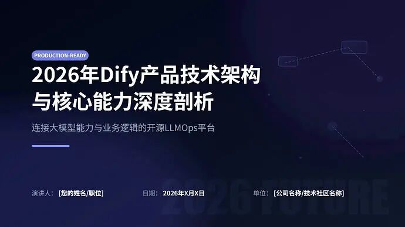

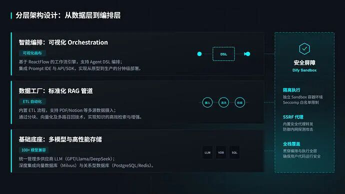

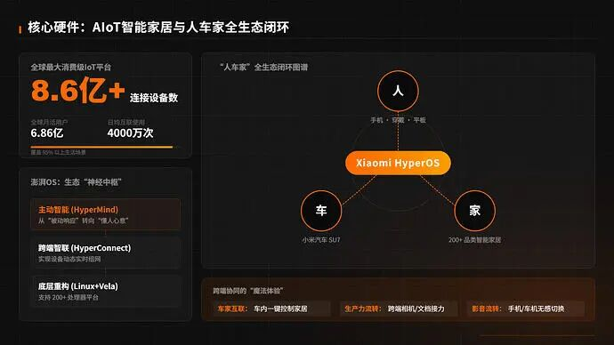

我研究了市面上所有AI PPT工具——从Canva、Gamma到Tome和各种“一键生成”——总结出了**一套完全不同的“专家工作流”方法**，能帮你从“修改工”变成“总监”，让AI真正为你工作。

这篇文章将带你完整了解这套碾压级方法：

1. **市场现状对比：为什么99%的AI PPT工具都错了**
2. **核心颠覆：AI不是替代人类，是模仿专家**
3. **四个步骤：像专家一样用AI制作PPT**
4. **具体实现：开源提示词+技术细节**
5. **行动指南：你现在就能开始的方法**

## 一、市场现状对比：为什么99%的AI PPT工具都错了

在讲方法前，先看看**市面上AI PPT工具的致命缺陷**：

| 维度 | 市面AI PPT工具（Canva/Gamma/Tome等） | 我们的“专家工作流”方法 | 优势对比 |
| --- | --- | --- | --- |
| **核心逻辑** | 一键生成 → 套模板 → 完事 | 需求调研 → 资料搜集 → 大纲策划 → 策划稿 → 设计稿 | **工作流 vs 玩具** |
| **内容质量** | 模板驱动，内容空洞 | 资料驱动，内容扎实 | **信息价值差10倍** |
| **逻辑结构** | 随机排列，经常混乱 | 金字塔原理，逻辑严密 | **专业度差3个等级** |
| **设计思路** | 硬套模板，千人一面 | 卡片式布局，内容驱动设计 | **灵活性差5倍** |
| **用户角色** | 你是“修改工” | 你是“总监”，AI是“专家团队” | **工作体验天壤之别** |
| **产出格式** | 封闭格式，难编辑 | SVG格式，完全可编辑 | **实用性差100%** |

### 

### 💀 市面工具的三大死穴：

**1. 逻辑死穴：以为PPT是设计，其实是思考**

他们优化的是“怎么让PPT更好看”，我们优化的是“怎么让信息更清晰”。结果：他们的PPT像化了妆的稻草人，我们的PPT像穿了西装的专家。

**2. 流程死穴：跳过专业环节，直接出结果**

真实PPT制作：需求调研 → 资料搜集 → 大纲策划 → 内容填充 → 设计美化。市面AI工具：给主题 → 出大纲 → 套模板 → 完事。缺失环节：需求调研、资料搜集、内容策划——**恰恰是PPT的灵魂**。

**3. 设计死穴：模板思维，不是内容思维**

他们：这个模板好看，硬塞内容进去。我们：这些内容重要，设计要为内容服务。结果：他们的设计是枷锁，我们的设计是翅膀。

## 二、核心颠覆：AI不是替代人类，是模仿专家

看明白了吗？

市面上99%的AI PPT工具都错了。他们犯了一个致命错误：**以为PPT是设计，其实PPT是思考**。

你一输入主题，AI就猴急地给你丢大纲、套模板——**但PPT的灵魂是内容，不是皮囊**。

我们做对了什么？**我们让AI“装成”专家团队**。

从需求调研→资料搜集→大纲策划→生成策划稿→生成设计稿——**完整的人类专家工作流，AI一步不落**。

> 先看效果：

> 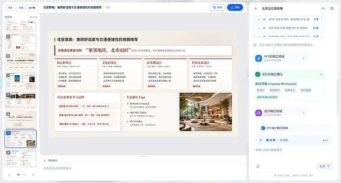

> 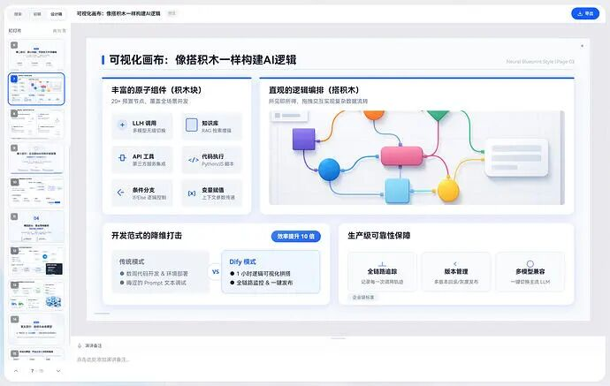

## 三、四个步骤：像专家一样用AI

### 1️⃣ 第一步：从“提问”开始，不是“一键生成”

**市面工具**：给主题 → 出大纲 → 套模板 → 完事。
**我们的AI**：给主题 → **先当顾问** → 调研资料 → 问关键问题 → 聊透需求 → 再出大纲。

**关键洞察**：PPT不是设计比赛，是信息传达。**你不说清楚“为谁做？做什么？达到什么目的？”，AI就是在瞎猜**。

> 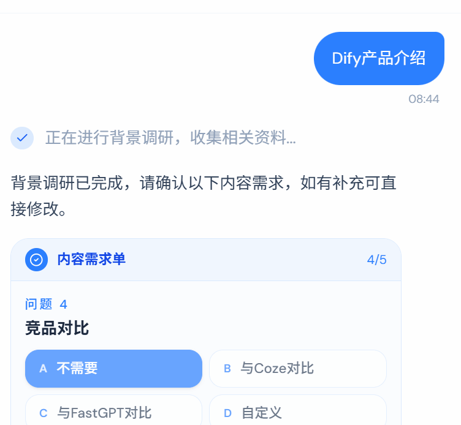

> 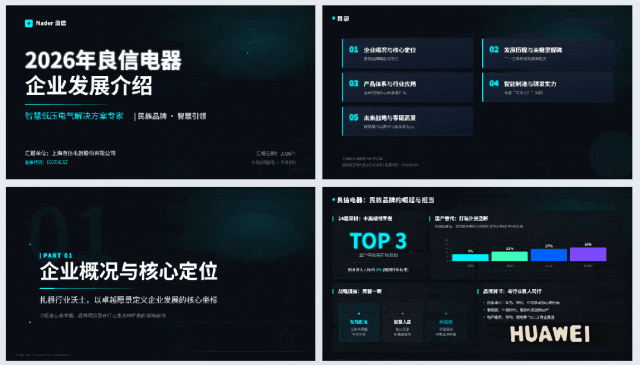

我们还把“便利贴法”数字化了：过去做复杂PPT，我把每一页核心内容写在便利贴上，贴满一墙。现在，**每个页面就是一张“数字便利贴”**——逻辑一目了然，哪里不好就撕掉。

开源提示词：顶级的PPT结构架构师

```
# Role: 顶级的PPT结构架构师
```

### 2️⃣ 第二步：用Grok做资料检索——AI里最强的“搜商”

大纲只是骨架，血肉需要真实信息。**墙裂推荐Grok**——目前搜索和信息总结能力最强的AI，没有之一。

**用法简单到发指**：把大纲标题 → 一个一个丢给Grok → 它帮你把资料搜集、整理得妥妥帖帖。

> 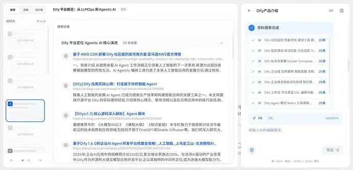

> 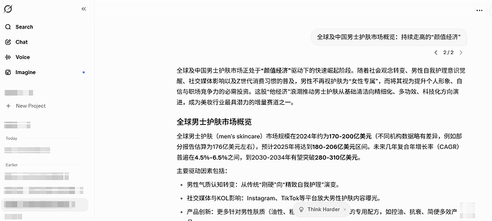

### 3️⃣ 第三步：加一个“策划稿”环节——1万+一页PPT公司的秘密

多数人：拿到内容 → 直接让AI设计。
我们：拿到内容 → **先做策划** → 再让AI设计。

你知道顶尖PPT设计公司（报价1万+一页）有专门的“策划师”岗位吗？

他们负责：需求调研、资料检索、大纲规划。最终给设计师的，是一个**PPT草稿**——每页什么位置放什么元素、用什么版式，全都固定好。

**这套人类专家的工作流，AI完全能理解！**
- 策划部分：负责版面规划
- 设计部分：来做风格样式
- 效果：好到不太需要改

> 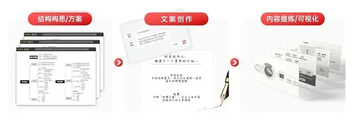

> 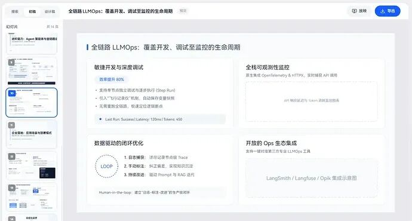

> 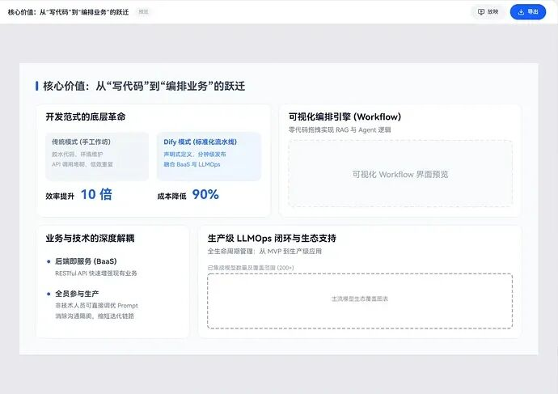

> 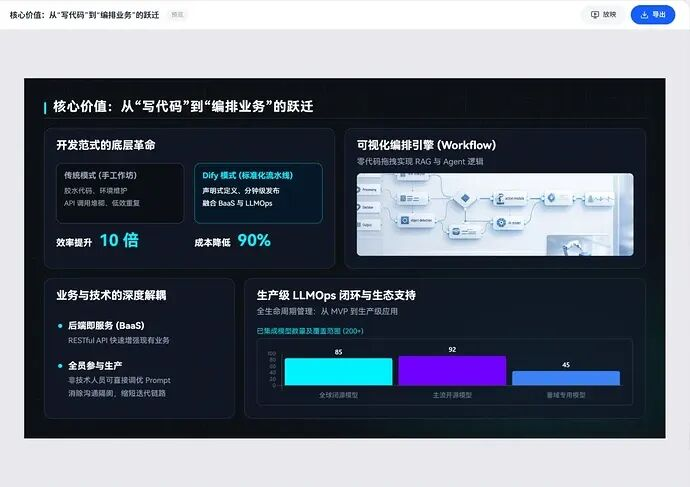

### 4️⃣ 第四步：用“卡片式布局”——AI最容易懂的设计语言

我分享一个“夯爆了”的PPT技巧：**卡片式布局**（苹果发布会常见的那种）。

**三大好处**：
1. **能装**：一页里清晰承载大量信息
2. **灵活**：卡片数量、大小、位置随意组合
3. **AI能懂**：“卡片”是AI最容易掌握的设计语言

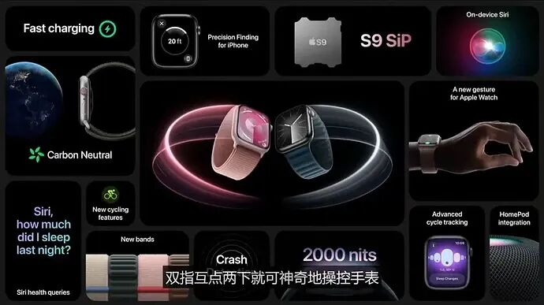

卡片式布局核心：便当网格 (Bento Grid)

```
内容页的便当网格 (Bento Grid) 布局
```

生成SVG页面的提示词

```
作为精通信息架构与 SVG 编码的专家，你的任务是将完整的文字内容转化为一张高质量、结构化、具备高级感、简洁感和专业感的 SVG 演示文稿页面。要求如下：
```

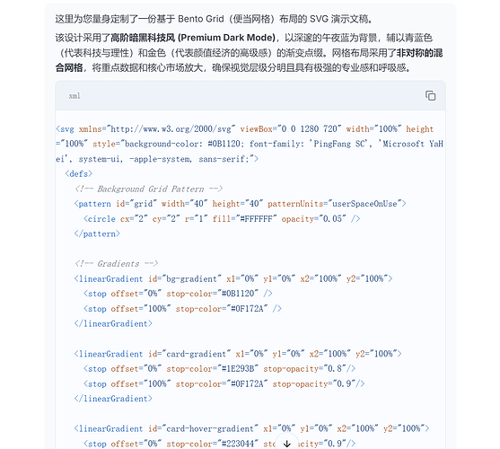

**为什么选SVG格式？**
- 可以导入PPT（Office 2016以上）
- 完全可编辑
- 各种设计软件都支持
- 无限放大，保证清晰度

**代价**：我们花了**三个月**处理SVG——因为没人做过，一切都得从零开始。

SVG代码效果：

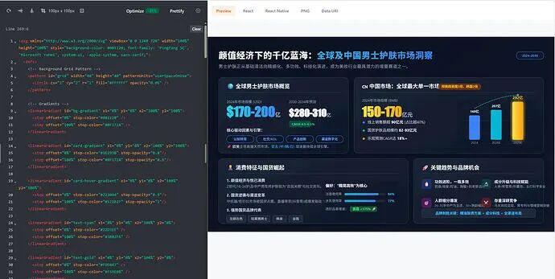

## 四、为什么要把核心提示词开源？

同事觉得我傻：“不怕别人马上抄走吗？”

**第一**，我现在做的，只挖掘了AI做PPT**5%的能力**。我们还有大量思路，会一一实现。这些对于PPT的理解和积累，**没法复制**。

**第二**，我**真的不服气**。

市面上这些AI PPT工具，他们的开发**根本不懂PPT**。给个大纲，硬套模板，让很多人用完都说：“AI PPT，也就这样了，不行。”

**不该是这样的。**

我做了3年AI产品，我坚信：**AI有能力也已经在改变我们制作和演示信息的方式**。

> 这些效果是我平衡成本和效果下，能跑出来的极限。但远远不是AI的极限。

## 五、行动指南：你现在就能开始

### 个人使用四步法：

1. **先做需求调研**

   ：别直接给主题，让AI先问清楚
2. **用Grok检索资料**

   ：确保内容真实准确
3. **分两步走**

   ：先策划稿（版面规划），再设计稿（风格样式）
4. **尝试卡片式布局**

   ：AI最容易理解的设计语言

### 技术实现路径：

1. 用开源的“PPT结构架构师”提示词
2. 结合Grok进行资料检索
3. 应用卡片式布局的SVG生成提示词
4. 输出可直接导入PPT的SVG文件

### 总结

这套AI PPT制作方法给我的最大启发：**AI不是用来一键生成粗糙结果的工具，而是用来模拟和优化人类专业工作流的智能助手**。

#### 关键要点

- **对比差距**

  ：市面工具让你当“修改工”，我们的方法让你当“总监”
- **专业流程**

  ：需求调研→资料搜集→大纲策划→策划稿→设计稿，一步不落
- **技术选择**

  ：SVG格式保证兼容性和可编辑性
- **设计语言**

  ：卡片式布局是AI最容易理解的设计方式

### 下一步行动

- **立即尝试：用开源的提示词，制作你的第一个“专家工作流”PPT**
- **对比体验：同时用Canva/Gamma和这套方法，感受差距**
- **分享反馈：在评论区告诉我，当你从“修改工”变成“总监”，感觉有多爽？**
- **持续关注：这只是AI做PPT 5%的能力，更多思路正在路**
- **关注DrawBookAI：专注AI+专业工作流的深度研究**
