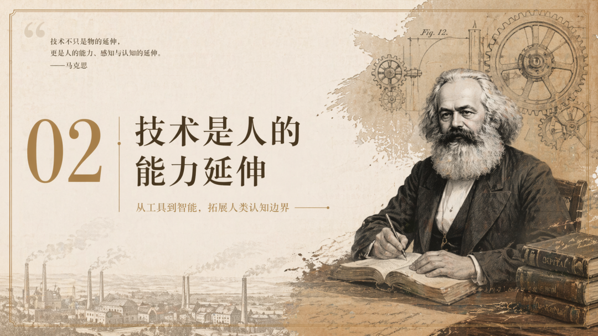
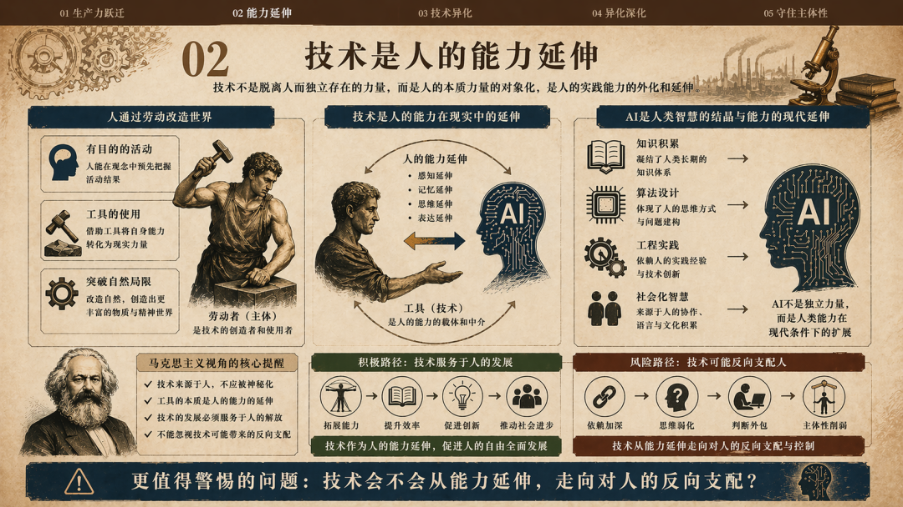
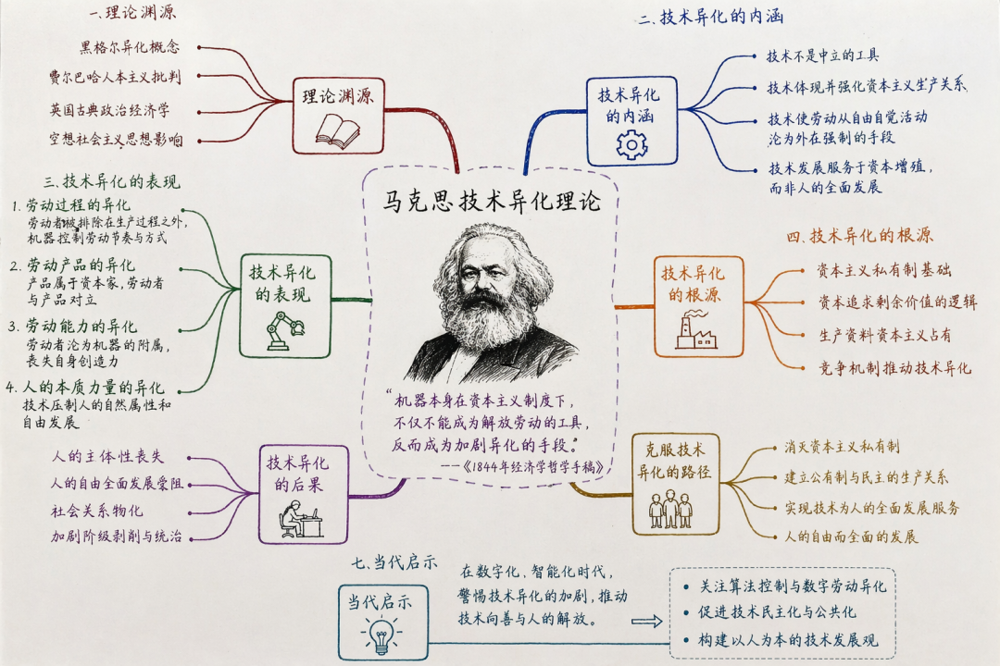
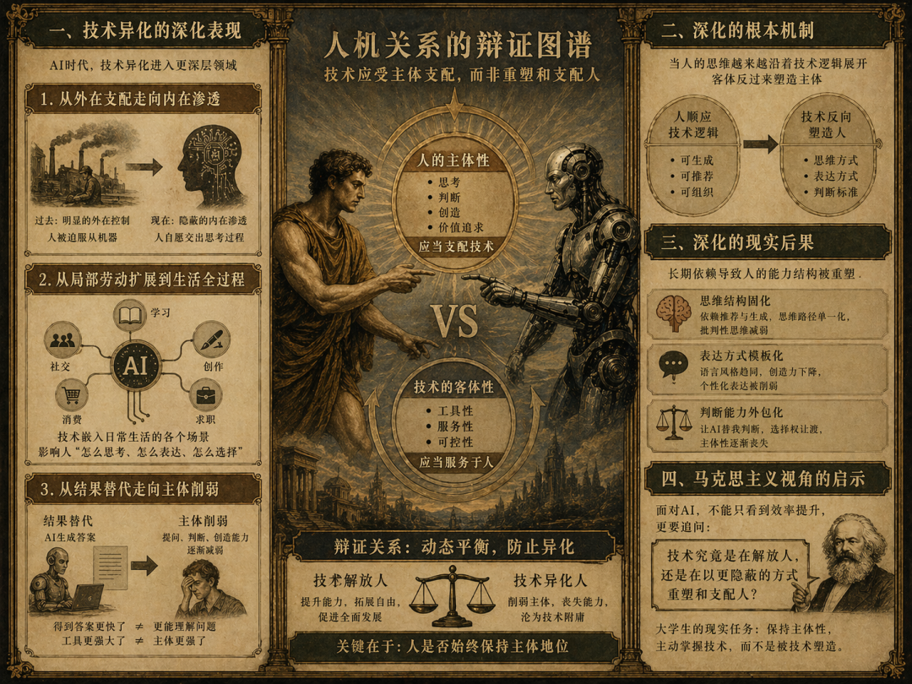
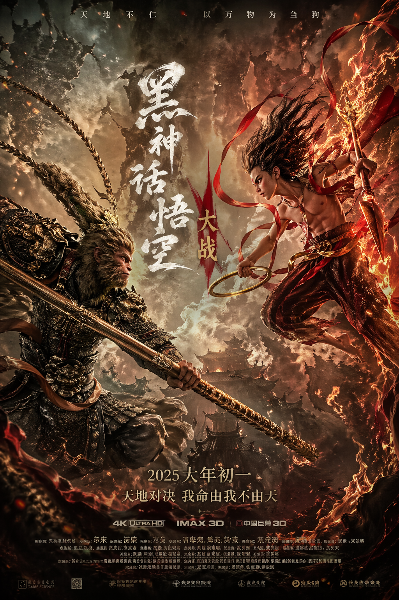
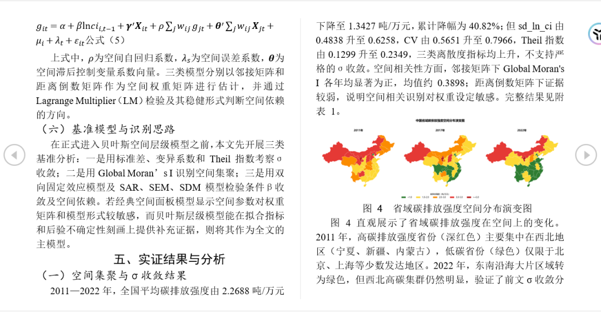
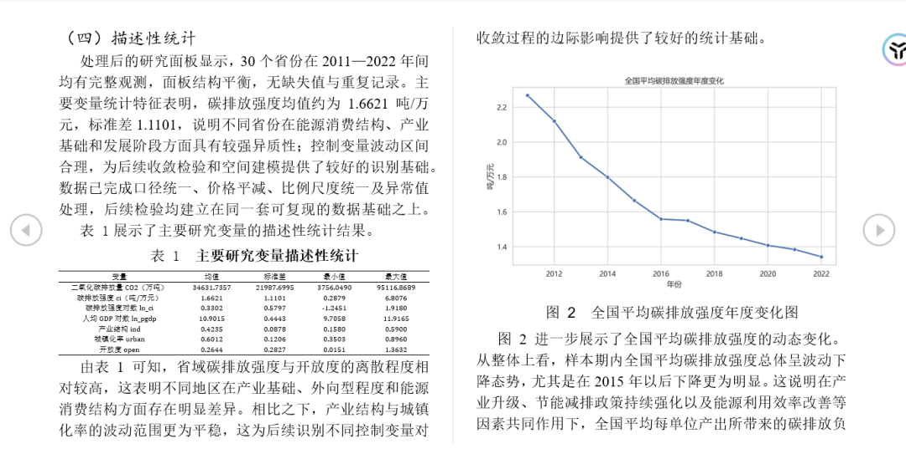
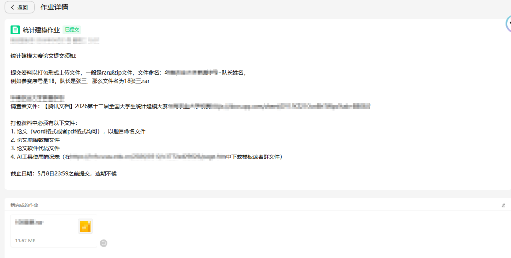

> 📎 来源: [口天三木](https://mp.weixin.qq.com/s?__biz=Mzk3NTE1MDQ5Ng==&mid=2247483884&idx=1&sn=ca7b2657aa77bef00a6c1ebe86a575d5&chksm=c5cdc373cb2247cf0e1196073f9b05dc92995f4aac1dc5421e9cb96d69eb90a513f3c3eb4f43&mpshare=1&scene=1&srcid=04293xOE865yFcza5fz9ao6m&sharer_shareinfo=52f2a17c4f7edfb0fa12d8dffb2e6753&sharer_shareinfo_first=52f2a17c4f7edfb0fa12d8dffb2e6753) | 时间: 2026-04-29 03:51

---

最近GPT-image-2.0在AI圈炸开了锅，我也试了一下

出图效果确实很满意

于是我心生一计——不如拿来制作PPT的背景图

嘿嘿嘿

下面是我让他生成课堂作业PPT的一张幻灯片





没有任何修改，直接根据我的讲稿理解并生成尺寸恰好、可直接放进幻灯片的图片

另外还附带知识图谱





之后我还额外试了其他类型的图片：




你别说，这真实感真的让人感到可怕。。。

关键是相比nano banana中文准确度明显提升了不少

我越来越感受到：现在的AI变得更加自主化和智能化

前些天我刚配置好codex，让它操控我的电脑直接调用本地终端进行一系列文档操作

例如：

我让他在MCP和skills基础上致谢文献检索，打开谷歌学术，提取文献PDF，然后自行整理，并使用MinerU解析文献

让我吃惊的是

他把所有搜集到的文献“吃”进去，然后结合记忆，知道哪些是符合我的研究方向的文献和有价值的图片

他还顺便附上我的zotero，问我要不要添加到zotero笔记。然后使用Obsidian CLI导入到我的Obsidian vault知识库

我还特地重新录了一次视频：（不过这次可能提示词没写好，效果差了点）

这还是一年前的AI吗？

随着openclaw🦞的爆火，一瞬间，整个AI圈都在向着智能体迈进

AI技术的发展之快确实极大的带动了生产力的发展，原来需要额外高价聘请设计师出图、做视频，现在自己一句话告诉AI也能完成

另外，其实AI也能做文档的排版，可能很多人还真不知道吧，下面是我让AI编写Python脚本调整的文档，还挺整齐的





相信你也已经感受到AI强大而又可怕之处

AI抢走了一些人的饭碗，又催生其他变现路径

有卖token赚钱的、有做AI评审负责的、有靠AI卖课的、有靠AI生成的同质化内容赚取流量的、还有许许多多API中转平台

AI也刺激了许多行业的利润增长，芯片。云服务器、硬件等等不知道赚足了多少倍的利润

AI推动了科学技术的发现，自主攻克困扰数学史30多年的难题，deepmind加速蛋白质结构的预测、推动药物的发现、材料的预测

国内如深势科技等平台也开始加速AI for science的发展

就连zotero都开始陆续接入AI对话，AI笔记，AI提取数据等

似乎整个世界早已被AI所渗透

我有个大胆的预言

再过两三年，随着AI智能体的普及，以后出厂的电脑也许会自带小龙虾那样的AI代理，入手AI的门槛只会越来越低，掌握的信息差只会越来越少，到时候人与人之间的核心竞争力只剩下钱包里的token经费和你对AI使用边界的理解

就好像你有了许多员工（也就是你的AI数字员工），你作为大老板，你创立一家公司，负责一项任务，你会如何下达命令去指挥你的数字员工去完成这些事情

这里所考验的可能就是个人的核心能力，也就是解决问题的能力

这需要你去从第一性原理出发，去解剖问题，捉住事物的主要矛盾，看到问题的关键之处

···

写到这突然感觉扯远了，可能是因为最近又开始对哲学有点感兴趣了

不知道远方在华师的那位朋友能否看见这篇文章，会不会笑话这文绉的笔触啊哈哈哈

想起来，我刚步入大学那会，正是deepseek出圈之际，从那时起就已经开始AI盛行，人们开始逐渐依赖AI：

用AI写作业

然后用AI评审AI写的作业

再用AI改写AI评审AI写的作业

发现不妥

又用AI润色AI改写AI评审AI写的作业

你会发现——整个世界就是个巨大的AI套娃

碍于学识有限，其实很多东西我都是找AI帮忙完成的

其实我很渴望有天能洞悉材料和化学的内在规律和所有机理

然后自己做出一个化学界、材料界的AI智能体

虽然我知道很困难，不过也算是很不错的远大志向吧

我还想多说一嘴

AI本质上是一种生产力工具，本质是服务于人的，是从人的意识和实践创造出来的产物，这意味着生产力工具发挥多大的作用取决于工具所有者的能力和对工具的掌握能力

我们要想在更多程度上利用AI发挥自身领域的价值，实现“杠杆效应”

首先很重要的一点是：

提升自己的专业知识

否则你怎么写出高质量的提示词

提示词写得越好越精准，AI回答的内容越好，这是利用AI提升工作学习效率的刚需

以我为例：

这篇文章的封面图也是AI生成的

我的提示词是：

```
需求：生成一张适合微信公众号的封面图
```

对应生成的封面图：


你看，好的提示词可以一步到位，不用来回调整修改

人人都会用自然语言向AI描述需求，但不是所有人都有相关的积累来写出高质量的提示词

这就需要你去学习、实践、积累和掌握相关领域的专业术语，才能写出好的提示词（Prompt）

如果你没理解我的意思

我再打个比方：

视频剪辑需要专业的分镜提示词、文献检索需要你明白所属领域的关键词、PPT制作需要你自身也要有设计师般的审美......

所有的所有，都是需要你有相关的专业背景知识才能胜任

所以我说：

AI再怎么样，归根结底本质还是一种工具

核心还是在于你自己

AI不能替代你，也不能成为你

AI只会成为强者和弱者差距的放大器，所谓工具越强大，其施加的“马太效应”越强

强者愈强，弱者愈弱，社会的矛盾和阶级间差距只会变大

这也是AI盛行的一个弊端

不过，于个人而言，提升自己才是当下最有利的途径

只有提升自己，炼就过硬本领，才不会被工具所裹挟，成为AI的附庸

马克思告诉我们——不要成为工具的奴隶

应当充分发挥个体主观能动性——这也是人类与工具的本质区别

---

留个彩蛋！

我连续肝了一周，终于把我的统计建模论文写完了，一人分饰三角，建模、编程论文撰写，如果没有AI的辅助加速我对统计的理解，可能我无法高效完成，太感谢GPT老师啦！也是此次经历让我加深了AI的使用边界和对个人能力的新认识，未来还有一场更艰巨的化设——给我等着！



最后——

本文无感而做、有感而发

考虑之际也是夹杂着个人的思绪，可能有些观点带有个人主观色彩，望能理解，作为大学生来说，涉略非广，此文亦于我当下的见识和心境’而作

时之迁移，未必是另外一番见解

最后

不妨点个关注，吾友！

未来我会继续分享更多科研提质技巧

那么，有缘再见👋
