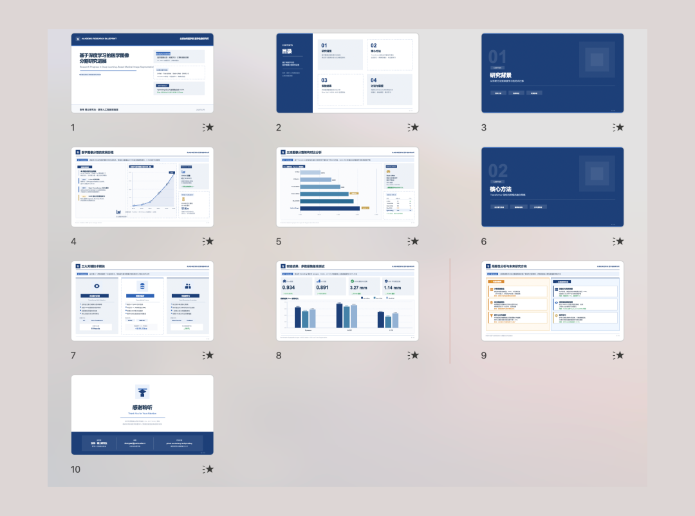
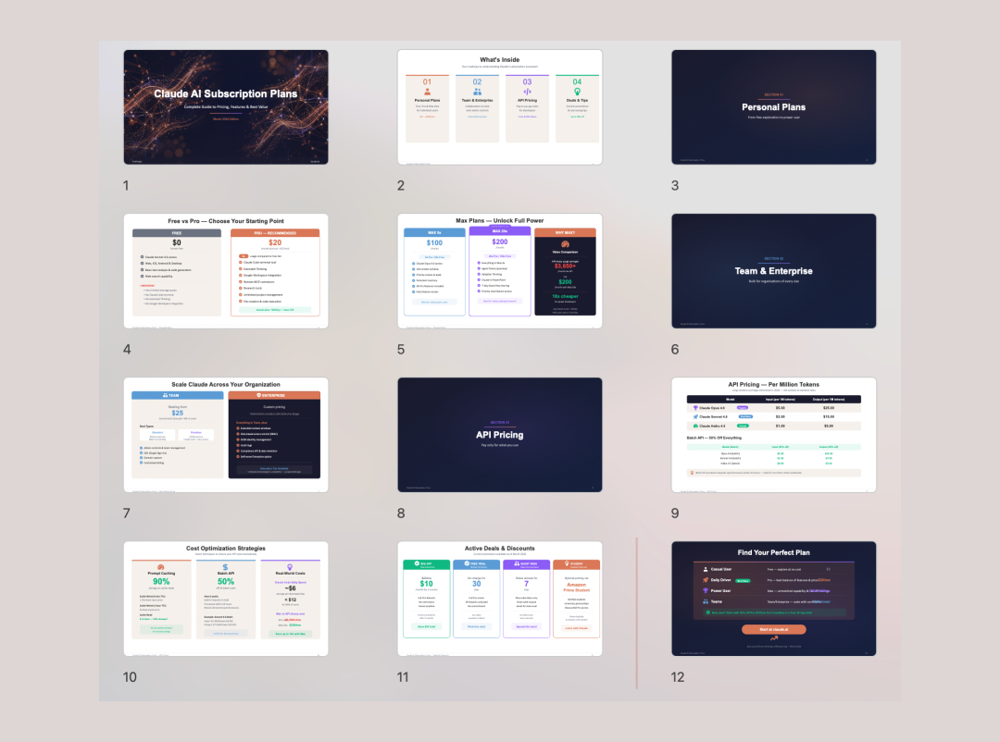
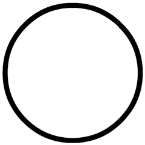

> 📎 来源: [陪陪源码网](https://mp.weixin.qq.com/s?__biz=MzIyODM5MzQwNA==&mid=2247485487&idx=1&sn=35d05b5b7646f138773ff0410a6ad723&chksm=e98039323a81767fd88650b50163e8ad763eed5d603c7acac98bc3e16a43b856c4e75b14f9cc&mpshare=1&scene=1&srcid=0430JCailHdsosM3Ph5VQHqc&sharer_shareinfo=a8bb16b284934d436737070c7cc53220&sharer_shareinfo_first=a8bb16b284934d436737070c7cc53220) | 时间: 2026-04-30 19:38

---

先说一个很扎心的事实——

**市面上绝大多数号称"AI一键生成PPT"的工具，生成的都不是真正的PPT文件。**

你可能遇到过这种情况：花了一下午调试，终于生成了一份看起来不错的PPT，结果到演示现场发现有个错别字，点了一下文本框——整页图直接飞了。

因为整页都是一个截图，根本不是真正的文字。

这其实就是我做这个东西的起因。

## 为什么会有这个东西

我工作里需要经常做PPT，也试过市面上几乎所有AI PPT工具。

但是用下来就四个字：**都不对劲**。

有的要你充会员才能导出高清版本，有的生成的文件换个电脑就变形，有的说是PPT结果打开是一张一张的图，关键元素根本改不了。

最让我崩溃的一次是有个重要客户，我在酒店用手机改了份PPT，发现某个数据错了，想改却点不动——因为整页是一张图。

我就想：**有没有一个方案，能让AI真正理解PPT文件格式，生成真正可编辑的PPTX？**

然后我就开始自己搞了。

## 我做的是什么东西

**简单说：丢进去一份PDF、Word、网页链接或者文字，拿回来一份原生可编辑的PowerPoint。**

什么叫"原生可编辑"？

就是每一个形状、每一个文本框、每一个图表，都是PowerPoint原生的DrawingML格式。不是截图，不是图片，不是网页转存。

在PowerPoint里打开，想改哪个字就点哪个字，想换颜色就换颜色，想调位置就调位置——跟你自己一页页手工做出来的一模一样。

👇 看个实际效果：

从一篇微信公众号文章自动生成12页PPT，每个文本框都可以直接点击编辑

对比一下市面上AI PPT工具的四种形态，你就知道区别了：

| 类型 | 原理 | 能逐元素改吗 |
| --- | --- | --- |
| 模板填空型 | 套预设模板填内容 | 部分可以 |
| 图片拼接型 | 一页一张大图拼成PPTX | ❌ 改不了 |
| HTML演示型 | 生成网页演示 | ❌ 不是PPT |
| 我这个方案 | 真形状、文本框、图表 | ✅ 每个都能改 |

**前三种是市面上常见的，第四种是我做的。**

## 具体能做什么

支持多种格式的输入：

📄 PDF研究报告 → PPT简报

📝 Word文档 → 汇报PPT

🔗 微信公众号文章链接 → 演示PPT

✏️ 纯文字/Markdown → 快速生成PPT

🖼️ 图片素材 → 配PPT

AI会根据内容自动匹配风格：

| 风格 | 适合场景 |
| --- | --- |
| **杂志风** | 品牌宣传、生活方式类内容 |
| **学术风** | 论文答辩、研究报告 |
| **暗色艺术风** | 发布会、艺术展览 |
| **自然纪录风** | 摄影作品、旅行记录 |
| **科技/SaaS风** | 产品介绍、功能说明 |
| **发布会风** | 新品发布、重要演讲 |

风格自动匹配，不需要你操心设计。

还支持：

🎬 页面转场动画（真正的PowerPoint动画）

✨ 逐元素入场动画（全自动播放，不用点鼠标）

🤖 AI生成配图（配合AI绘图模型）

📐 多页数自适应调整

## 为什么你值得试试

1. 生成的PPT是真的

不是在PPT里放图片，不是网页转存。生成的.pptx文件每一个元素都是真的，在PowerPoint里全都能改。

2. 数据不出本地

你的文件全部在你自己的电脑上处理，不会被上传到任何第三方服务器。

3. 不像传统工具那样限制你

不会被绑死在某个工具上。支持多种AI模型驱动——Claude、GPT、Gemini都可以。换哪个大模型，你说了算。

4. 一个人也能做出专业水平的设计

AI自动做排版、配色、字体配搭，不需要你学设计。你只需要提供内容，剩下交给我这个方案。

## 实际生成的风格预览

📰 杂志风 — 暖色调，大图排版

📊 学术风 — 严谨结构，数据图表

🎬 暗色艺术风 — 电影感深色背景

🌿 自然纪录风 — 沉浸式摄影

💻 科技/SaaS风 — 白底卡片，产品说明

🚀 发布会风 — 高对比度，参数突出

## 想用的话，两种方式

方式一：自己搭

如果你有Python基础，可以自己配置环境跑起来。需要：

• Python 3.10+

• 一个支持AI Agent的编辑器（Cursor/VS Code+ Copilot等）

• AI模型API

方式二：我直接帮你做

**如果你不想折腾配置，直接把资料发给我，我来帮你生成。**你拿到的是一个可以直接打开的.pptx文件。

感兴趣的可以逛逛 **www.ppcodes.cn**，或者关注“陪陪源码网”这个公众号，我会不定期分享一些项目搭建踩坑经验和行业观察。

有问题也可以直接找我聊，同行交流，互相学习。

**上述完整资料领取步骤：****1.右下角****“点赞+推荐”**

**2.评论区留言****"资料不错"**

**3.点关注（联系陪陪小助手 **340097480**）**

点击**阅读原文**获取源码演示地址
