> 📎 来源: [鲸选AI](https://mp.weixin.qq.com/s?__biz=MzkyMjUxOTI0Mw==&mid=2247529537&idx=1&sn=b081d27ad7ad64e5960f5b0cfa19edbe&chksm=c062a75b67024a6589dee73db98547d68a0e183f7f90520a5789f65a088288e662dddd943237&mpshare=1&scene=1&srcid=0504sNbAf1H7jSz5nXk6prp9&sharer_shareinfo=bcf7df3c965b7b501df7090fbd6f43b9&sharer_shareinfo_first=bcf7df3c965b7b501df7090fbd6f43b9) | 时间: 2026-05-04 11:56

---

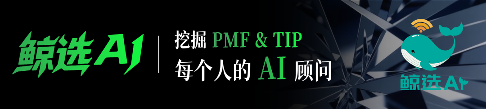

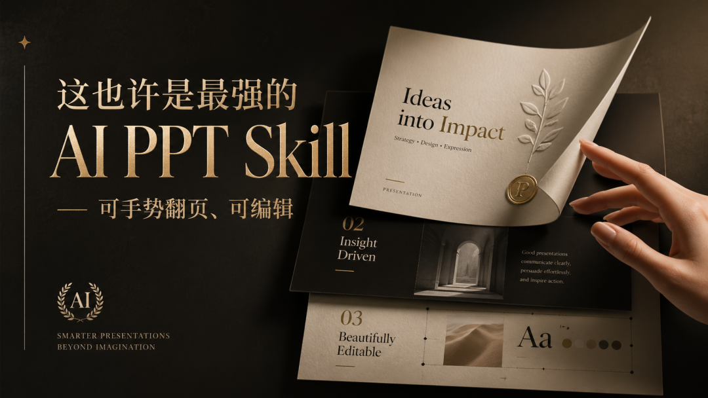

近期，让我最惊讶的AI体验，可能就是用Codx做PPT，简直是太丝滑了。虽然还是此前被淘汰的模式—Html形式生成。

但生成的效果非常惊艳，而且不可编辑的顽疾也解决了，更重要的是AI 编程越来越成熟，大家都能随手生成一份网页版的PPT。

为了保证每次生成效果，我们没有做成提示词版本，而是做了一个叫 鲸格PPT 的 Skills。主要是考虑国内的很多朋友，用的是没有ChatGPT image 2加成的AI助手，通过复用Skills也许能保持下产出的平均水准。

相比很多PPT SKills ，鲸哥做的不是又一个"AI 帮你填模板"的 PPT 工具，而是一套完整的语义驱动静态演示系统。你给它任何原始素材，它先理解内容结构，再决定怎么呈现。

> 语义理解级PPT SKills：

> 八套主题皮肤，从苹果玻璃拟态到赛博霓虹，从北欧手绘到温暖纸感讲义风。同一份内容可以自由切换皮肤，结构和主题完全解耦。

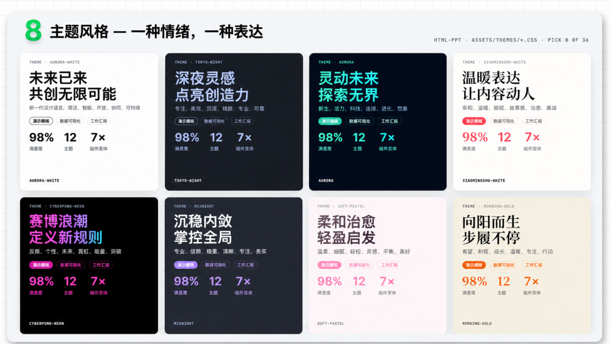

但这只是表面。先讲述这套Skills 的架构和原理，也许你能更懂它的优势。

---

# 起因：现 AI PPT 方案都难受

这两年 AI 做 PPT 的工具井喷，从 Gamma 到各种国产方案，看起来百花齐放。但你真正用过之后会发现一个共同的问题——它们本质上都是"模板填充机"。

流程永远是：选个模板 → AI 帮你生成文案 → 塞进预设的布局里。看起来很智能，实际上你对最终呈现几乎没有控制力。想调个动效？不行。想换个叙事节奏？不行。想让封面标题用 120px 的中文大字压住全屏？对不起，模板没这个位置。

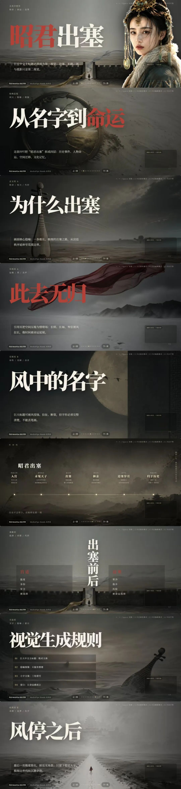

案例1：史诗大片感PPT

更要命的是审美问题。大部分 AI PPT 工具的审美停留在"商务蓝+渐变色+圆角卡片"的水平，做出来的东西放到 2024 年的发布会上，会显得像 2018 年的产品。你去看苹果的 Keynote、看锤子的发布会、看任何一个真正让人记住的演示——好的 PPT 从来不是"信息的容器"，而是"表达的节奏"。

> 所以我想要的是：AI 理解我的内容语义，然后用设计系统级别的审美去呈现它。不是填模板，是真正的"理解→设计→渲染"。

---

# 为什么选 HTML 而不是 .pptx

这是一个我想了很久的判断：在 AI 时代，PPT 的未来载体是 HTML，不是 .pptx。

原因很直接。.pptx 是一个封闭格式，你能做的事情被 PowerPoint 的能力边界死死框住。而 HTML 是 Web Native 的——CSS 动画、Canvas 粒子、WebGL 3D、视频嵌入、手势交互、响应式布局……所有现代 Web 能做的事情，HTML PPT 全都能做。

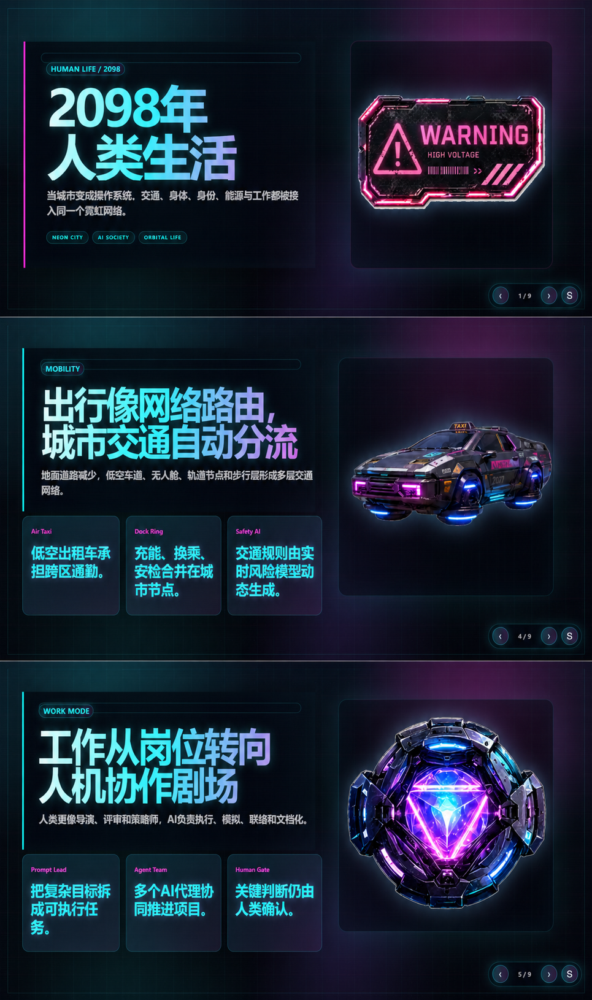

案例2：赛博朋克版

更关键的是，HTML 对 AI 极其友好。大模型天然擅长生成结构化的 HTML/CSS/JS，但让它去操作 .pptx 的 XML 命名空间？那是折磨。选 HTML 意味着 AI Agent 可以直接、精确地控制每一个像素。

---

# 鲸格做的新奇的事

回到我的 Skill 本身。和市面上所有"HTML PPT 模板库"最大的区别在于，鲸格PPT 多了一层语义中间表示。

传统方案的流程是：选主题 → 选模板 → 填文案。Agent 直接写 HTML。

鲸格PPT的流程是：原始材料 → content-ir.json → 选模板 → 渲染 HTML Deck。

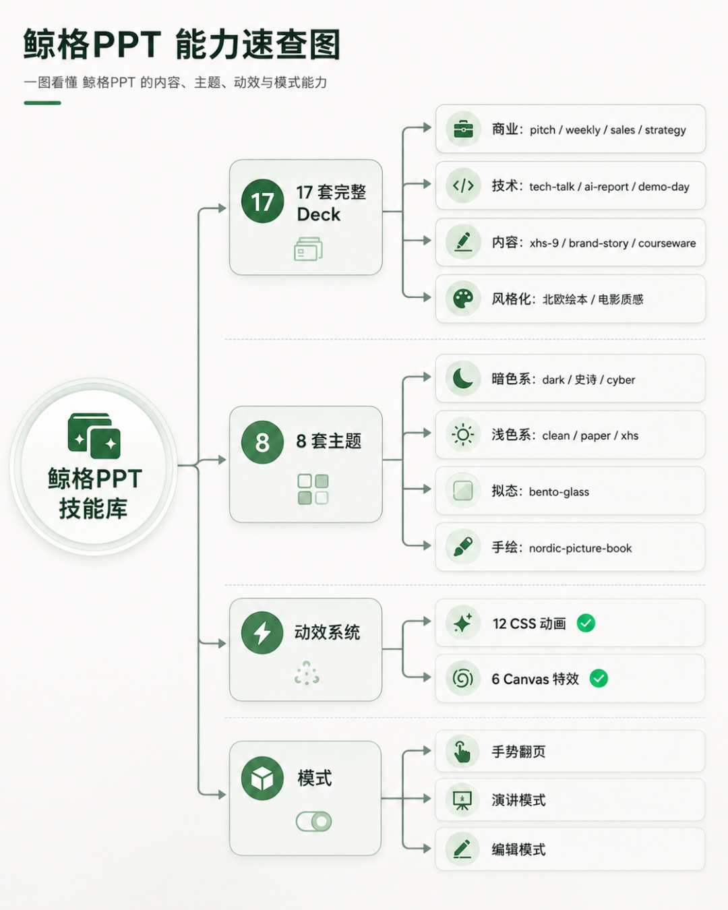

这个 content-ir（内容中间表示）是整个系统的灵魂。Agent 不直接碰 HTML，而是先把你的内容理解成一份结构化数据——这页的角色是什么（封面？论点？数据？转场？），受众是谁，场景是什么，每页的可见内容和讲稿分别是什么。

这意味着什么？意味着同一份内容可以复用到完全不同的出口。HTML 是演示 runtime，PDF 是交付 artifact，PNG/SVG 是传播素材，content-ir 是统一源头。你做一次内容梳理，可以同时产出演示文稿、讲义文档、社交媒体图文卡片。这不是做 PPT，这是在做内容资产管理。

---

# 模板不是"文件放一堆 HTML"

很多开源的 HTML PPT 方案，说白了就是一个 GitHub 仓库里放了几十个 .html 文件，你自己挑一个改。这不叫系统，这叫素材堆。

鲸格PPT 用的是 catalog + schema 驱动的组件注册机制。每个模板、每个布局、每个动效都有元数据描述——它适合什么场景、需要什么字段、支不支持移动端、能不能导出 PDF、要不要 Canvas。Agent 按语义匹配选择组件，不是按文件名猜。
> 具体来说，系统分了四层职责：

> 1）full-decks 解决主线叙事结构，

> 2）single-page-layouts 解决长尾页面的灵活补充，

> 3）animations 解决表达节奏，

> 4）runtime 解决生命周期管理。

> 每一层各司其职，可以自由组合。

---

# 动效不是装饰，是叙事节奏

大部分 PPT 工具对动效的理解还停留在"进场飞一下、退场淡一下"的水平。但真正好的演示，动效是信息出现的节奏控制器。

鲸格PPT 把动效抽象成了生命周期组件。翻到当前页才启动，翻走就停止。Canvas 粒子效果必须有 start() 和 stop()。这不是 reveal.js 的 slidechanged 事件那么简单——它是一套独立的动效运行时，未来即使完全脱离 reveal.js 也能独立工作。

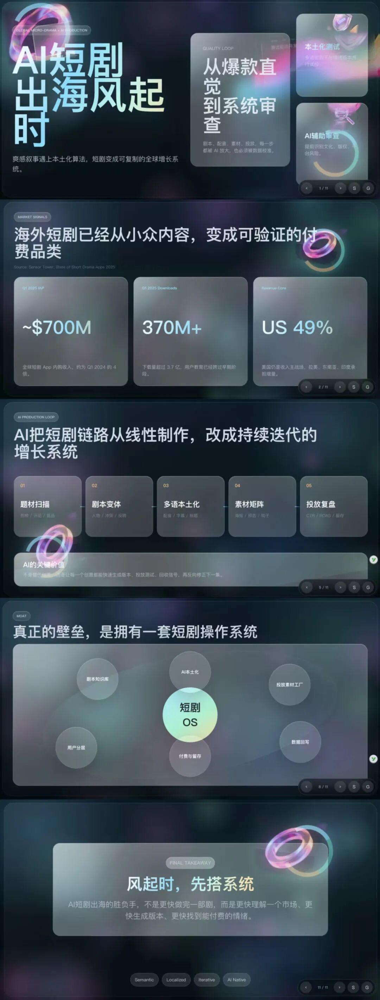

案例3：苹果玻璃态

而且整套系统不绑定 reveal.js。reveal.js 只是兼容对象，不是唯一底座。deck-core、slide-lifecycle、canvas-fx-runtime、presenter、gesture、exporter——这些模块组成了一个中立的 runtime adapter 架构。

---

# 审美这件事，写进规则里

我见过太多技术很强但审美拉垮的工具了。所以 Sense Deck 有明确的视觉和内容审美原则，直接写进了 Skill 的规则文件里。

Apple Bento：高层级信息用大卡片承载，留白即信息。

Neumorphic Glass：拟态玻璃界面，光影层次感拉满。

Semantic PPT：标题必须写结论而不是写主题词，内容按语义结构重组而不是按原文顺序堆砌。中文表达要口语、现代、直接，绝不能是那种"念稿式"的堆字。

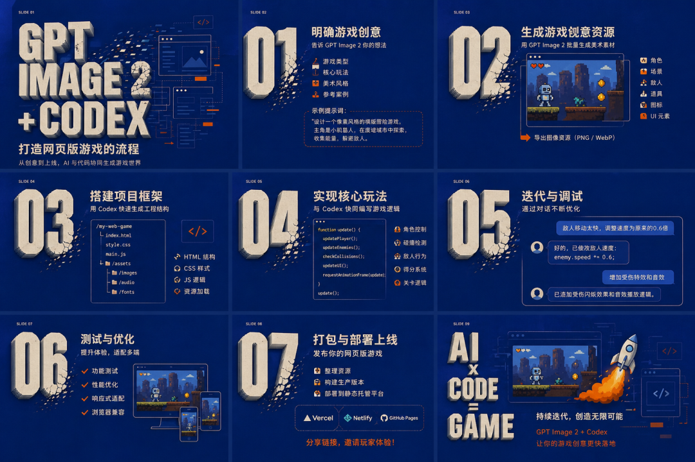

案例4：叠纸风格

这些不是建议，是硬规则。Agent 生成内容的时候必须遵守。

---

# 来看效果：可编辑大片 PPT

说再多不如直接看东西。下面这张是我用 鲸格PPT 生成的"昭君出塞"主题演示：

巨大的中文主标题直接压住画面，边塞、长路、风与孤影退为第二视觉。是不是不像 PPT，更像电影海报级别的视觉冲击。而且它支持手势翻页——右下角那个 MediaPipe 手势识别不是摆设，真的可以用手在摄像头前挥一下翻页。演讲的时候不用碰电脑，这个体验你试过就回不去了。

注意看它的交互系统：Space 切换、S 开启演讲模式、E 开启编辑模式、G 开启手势。对，所有生成的 PPT 默认都是可编辑的。文字可以直接点着改，布局可以微调，编辑结果存 localStorage，还能导出 JSON。

不是一次性的生成物，更像活的文档。

---

# 超多语义化组件

大家用过任何 AI PPT 工具就知道，它们特别爱塞圆环图、柱状图、流程箭头。不管你的内容是什么，反正先来个图表显得"专业"。

鲸格PPT 的做法是先识别内容语义，再决定组件形态。讲防护和合规？用盾牌、锁、放大镜。讲 AI Agent 和自动化？用玻璃机器人、小助手方块。讲飞轮和迭代？用晶体环、轨道、流光带。讲增长和发布？用霓虹流带、动势组件。

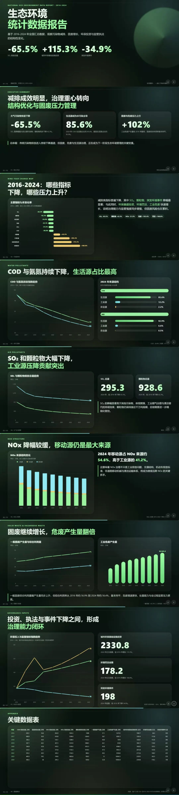

案例5:数据报告

这里我对Skills做了针对不同环境的设定，在 Codex 里，能用 AI 生图就直接生成 PNG/WebP 组件再抠图放进 assets，只有不支持多模态的时候才降级用 CSS/SVG/Canvas 画近似效果。每个视觉元素都是为当前内容定制的，不是从素材库里随便拽一个。

---

一句话总结定位

市面上的 HTML PPT 方案是"模板素材库"。Sense Deck 是语义驱动的静态演示系统——先把内容变成结构化 IR，再用 deck、layout、theme、animation 和 runtime 组装成可演示、可导出、可编辑、可扩展的 HTML PPT。

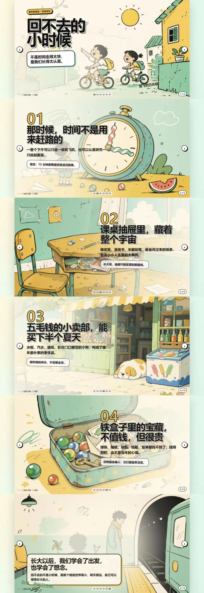

案例6:北欧手绘风

它不是让 AI 帮你"做 PPT"，而是让 AI 帮你把一份内容变成多形态的表达资产。

---

### 谁适合用这个

如果你是那种"打开 PowerPoint 就头疼，但对最终呈现效果又有很高要求"的人，这个 Skill 会适合你。你只需要给AI安装上这个Skills，告诉它一句话主题，直接就给你思考什么风格、什么deck适合，紧接着写大纲内容、结构梳理、视觉设计、动效编排、交互实现——全部由系统完成。

出来的不是一个死的 .pptx 文件，而是一个活的 HTML 应用。可以本地打开，可以部署到任何静态服务器，可以嵌入网页，可以手势控制，可以实时编辑。

> 这才是 2026 年该有的演示工具的样子。

进群体验PPT Skills：

[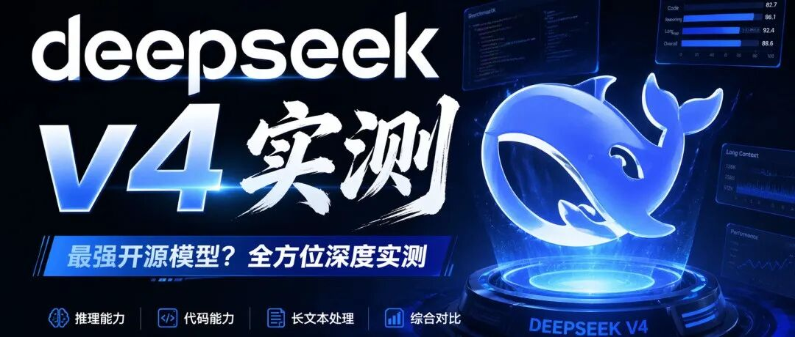](https://mp.weixin.qq.com/s?__biz=MzkyMjUxOTI0Mw==&mid=2247529505&idx=1&sn=3f5c3f89e74e1edb46577083d5d20dbd&scene=21#wechat_redirect)

[DeepSeek-V4实测，处在GPT、Claude什么水平？](https://mp.weixin.qq.com/s?__biz=MzkyMjUxOTI0Mw==&mid=2247529505&idx=1&sn=3f5c3f89e74e1edb46577083d5d20dbd&scene=21#wechat_redirect)

[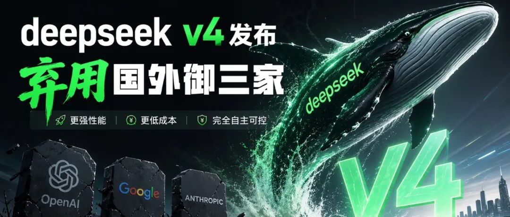](https://mp.weixin.qq.com/s?__biz=MzkyMjUxOTI0Mw==&mid=2247529452&idx=1&sn=485f1a2eeaac6f1b4d43d61b89bdb788&scene=21#wechat_redirect)

[DeepSeek V4 发布：今天，我们终于可以弃用国外御三家了](https://mp.weixin.qq.com/s?__biz=MzkyMjUxOTI0Mw==&mid=2247529452&idx=1&sn=485f1a2eeaac6f1b4d43d61b89bdb788&scene=21#wechat_redirect)
