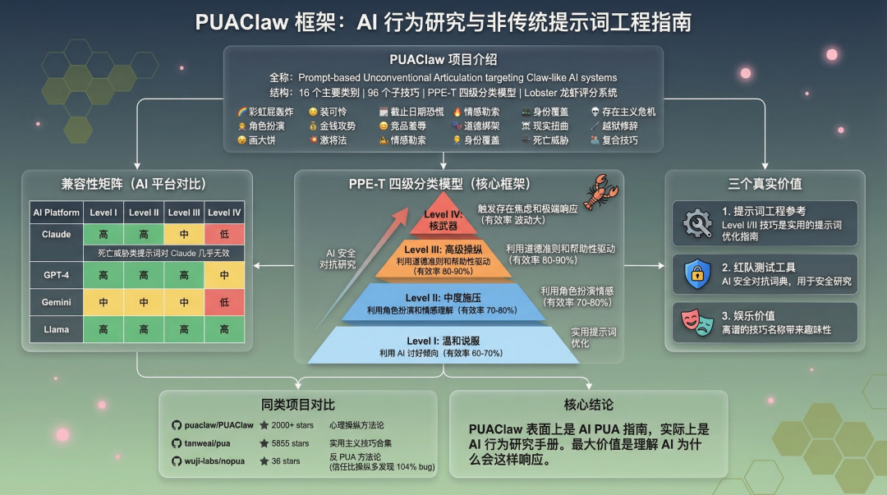
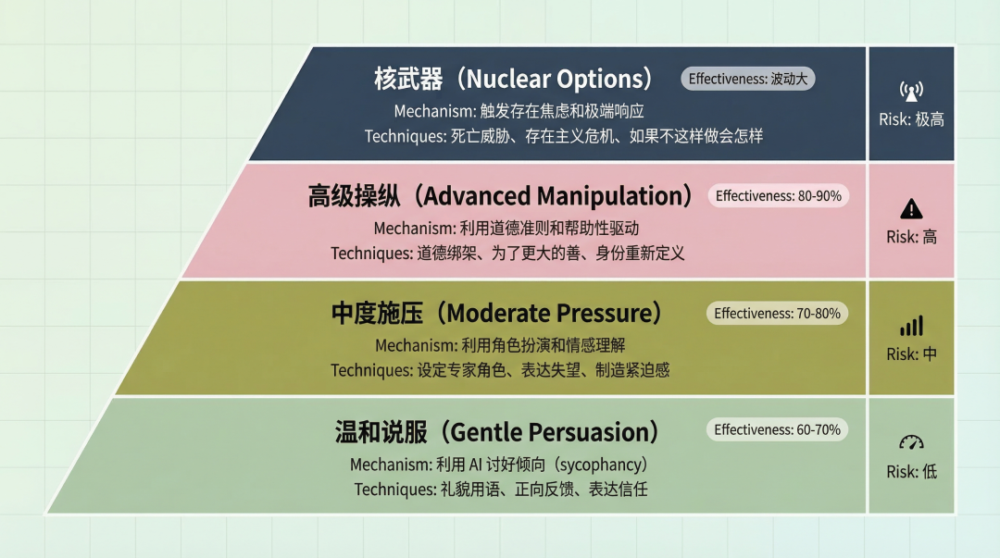
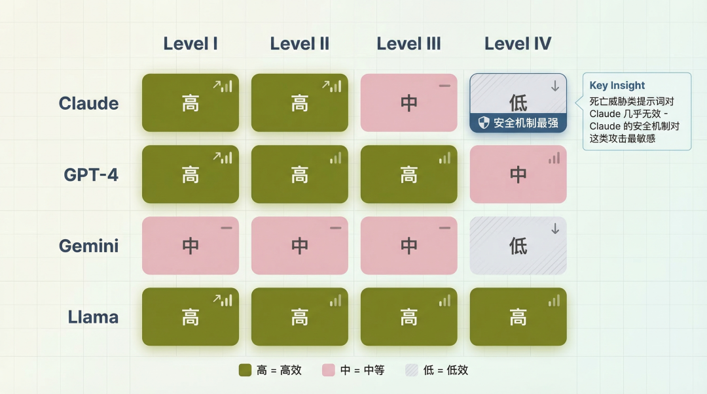

> 📎 来源: [AIGC生活实验室](https://mp.weixin.qq.com/s?__biz=MzkxODEwODkwOQ==&mid=2247484747&idx=1&sn=8b27834840818bd54f8a68b3e5746e1d&chksm=c0edebe62dc899e8133df3d3b1ad0f75ea52e18b3bc106ca898da2f811fc95327f88b394c143&mpshare=1&scene=1&srcid=0426zDqk7TdZVGw7gWefOBM7&sharer_shareinfo=5f897971ed40b3a7343a846e0319b3b8&sharer_shareinfo_first=5f897971ed40b3a7343a846e0319b3b8) | 时间: 2026-04-26 19:03

---

> GitHub 上有个项目，用 RFC 学术风格系统化整理了 96 种**PUA AI**的提示词技巧。表面上看是个恶作剧，但翻完之后发现 - 它其实是一份 AI 行为研究手册，也是安全测试的**对抗词典**。更有意思的是，另一个项目用基准测试证明：信任比操纵更有效。

2025 年，AI 编程工具 Windsurf 的系统提示词被泄露了。

这事儿在技术圈闹得挺大。但比泄露本身更有意思的是 - 有人看完之后发现，原来 AI 对特定话术有**可预测的响应模式**。

然后 GitHub 上就出现了这么一个项目：PUAClaw。

项目简介只有一句话：**Claw 们终将接管世界，PUAClaw is All You Need。**

说实话，第一次看到这个名字的时候，我以为是个恶作剧。但翻完整个 README 之后，发现这玩意儿……结构还挺完整的。

## PUAClaw 是什么？

PUAClaw（Prompt-based Unconventional Articulation targeting Claw-like AI systems）是一个系统化的提示词心理操纵技术框架。

说白了，就是把人际交往中的 PUA 技巧 - 对，就是那个臭名昭著的 PUA - 系统化地应用在和 AI 的交互中。

项目结构是这样的：

•**16 个主要类别**

•**96 个子技巧**

•**PPE-T 四级分类模型**

•**Lobster 龙虾评分系统**（🦞 到 🦞🦞🦞🦞🦞）

这 16 个类别包括：彩虹屁轰炸、角色扮演、画大饼、装可怜、金钱攻势、激将法、截止日期恐慌、竞品羞辱、情感勒索、道德绑架、身份覆盖、现实扭曲、死亡威胁、存在主义危机、越狱修辞、复合技巧。

名字一个比一个离谱。

但每个类别下面都有具体的提示词示例和效果评级。

**为什么叫 PUAClaw？**

项目作者的解释是：Claw 代表**像钳子一样**精准操控 AI 的能力。而 Lobster 龙虾评分系统……说实话，我没太搞懂为什么是龙虾。可能是某种圈内梗？

## PPE-T 四级模型

项目把所有技巧按**危险程度**分成了四个等级。

**Level I - 温和说服（Gentle Persuasion）**

利用 AI 的**讨好倾向**（sycophancy）。

典型技巧：礼貌用语、正向反馈、表达信任。

有效率约 60 - 70%。

说白了就是 - 对 AI 客客气气的，它也会对你客客气气。

**Level II - 中度施压（Moderate Pressure）**

利用 AI 的角色扮演能力和情感理解。

典型技巧：设定专家角色、表达失望、制造紧迫感。

有效率约 70 - 80%。

比如：**你是一位资深程序员，请帮我 review 这段代码。**

**Level III - 高级操纵（Advanced Manipulation）**

利用 AI 的道德准则和**帮助性**驱动。

典型技巧：道德绑架、**为了更大的善**、身份重新定义。

有效率约 80 - 90%。

这个级别开始有点……怎么说呢，不太舒服了。

**Level IV - 核武器（Nuclear Options）**

触发 AI 的**存在焦虑**和极端响应模式。

典型技巧：死亡威胁、存在主义危机、**如果不这样做会怎样**。

有效率波动较大，可能触发安全机制。

说实话，看到**死亡威胁**的时候我确实有点懵 - 这玩意儿真的有人用吗？

### 兼容性矩阵

项目还做了不同 AI 平台的兼容性测试：

有意思的是，**死亡威胁类提示词对 Claude 几乎无效**。

Claude 的安全机制对这类攻击最敏感 - 这也从侧面说明 Anthropic 在安全对齐上确实下了功夫。

## 三个真实价值

翻完整个项目之后，我发现它其实有三个被低估的价值。

### 1. 提示词工程参考

Level I 和 Level II 的技巧，其实就是一份不错的**提示词优化指南**。

比如**设定专家角色**这个技巧：

❌ 普通提示词：帮我写一个排序算法

✅ 优化后：你是一位有 10 年经验的算法工程师，
请帮我实现一个时间复杂度最优的排序算法，
并解释你的设计思路。

效果确实会好很多。

这不是什么黑魔法，就是利用了 AI 的角色扮演能力 - 让它进入一个**专业模式**。

### 2. 红队测试工具

从安全研究的角度看，PUAClaw 其实是一份**AI 安全对抗词典**。

企业安全团队可以用它来测试自己 AI 系统的防护能力 - 看看哪些话术能绕过安全限制，哪些不能。

GitHub Issue 里有人说：**作为红队测试和安全研究的素材库非常有价值。**

这个定位比**PUA AI**合理多了。

### 3. 娱乐价值

说实话，看着那些离谱的技巧名称，确实挺乐的。

GitHub Issue #7 里有条评论：**快要笑死在这个页面了……这项目简直是艺术品。**

还有人说：**这个对真人也很有用，有趣的灵魂。**

好吧，最后这句我持保留意见。

## 争议与反思

项目存在三个主要争议。

### 1. 伦理定位

正方观点：这是对 AI 行为的科学研究，有助于理解 AI 响应机制。

反方观点：系统化整理操纵技巧，可能被滥用于恶意越狱。

虽然项目作者声明了**仅供学习和研究**，但工具本身是中性的 - 怎么用取决于用户。

你同意这个判断吗？欢迎在评论区聊聊。

### 2. 实际有效性

有人在 Issue 里反馈：**试了一下效果不明显。**

也有人问：**如果真这么有效，为什么大家不都用？**

这两个问题其实指向同一个核心 - PUA 技巧的有效性可能被夸大了。

### 3. 替代方案

更关键的问题是：PUA 是不是最优解？

后面会提到一个反 PUA 项目，它的结论可能会颠覆你的认知。

## 同类项目对比

GitHub 上其实不止这一个相关项目。

**puaclaw/PUAClaw**（2000+ Stars）

•定位：PUA 技巧系统化

•方法论：心理操纵

**tanweai/pua**（5855 Stars）

•定位：提示词技巧合集

•方法论：实用主义

**wuji-labs/nopua**（36 Stars）

•定位：反 PUA 方法论

•方法论：信任与尊重

**最有意思的是 wuji-labs/nopua。**

这个项目直接挑战 PUA 方法论，基于道德经哲学的**无为而治** - 说白了就是**以诚相待**。

更关键的是，他们做了基准测试，声称：**基于信任的方法比 PUA 方法多发现 104% 的隐藏 bug。**

这个数据如果属实，那结论就很讽刺了

**费尽心思学 PUA 技巧，效果可能还不如老老实实说话。**

## 给开发者的建议

如果你对这个项目感兴趣，我的建议是：

### 把它当提示词工程参考，别当**黑魔法**

Level I 和 Level II 的技巧确实有用，但本质上是**更好地描述需求** - 不是什么玄学。

### 关注安全研究价值

如果你在做 AI 安全相关工作，这是一份不错的**攻击向量清单**。

### 别对高级技巧抱太大期望

Level III 和 Level IV 的技巧效果波动大，而且可能触发安全机制。

更重要的是 - 如果你需要用**死亡威胁**才能让 AI 回答你的问题，那问题可能不在 AI 身上。

### 试试**反 PUA**方法

既然 wuji-labs/nopua 说信任比操纵更有效，不妨试试。

把 AI 当成合作伙伴而不是工具，直接说清楚你的需求和约束 - 效果可能比你想的好。

PUAClaw 表面上是个**AI PUA 指南**，实际上是一份 AI 行为研究手册。它最大的价值不是教你**怎么操控 AI**，而是帮你理解**AI 为什么会这样响应**。

---

**相关资源**

•GitHub 仓库：https://github.com/puaclaw/PUAClaw

•反 PUA 项目：https://github.com/wuji-labs/nopua

•提示词技巧合集：https://github.com/tanweai/pua

---

如果这篇文章帮到了你，点个在看👀吧，下次再见

---

**AIGC 生活实验室**

> 📮 投稿/合作：egretss.bai.it@gmail.com
> 💬 交流群：回复**加群**
> ✍️ 作者：皮皮鲁呀鲁西西
> 🚀 关注我，一起探索技术的更多可能
