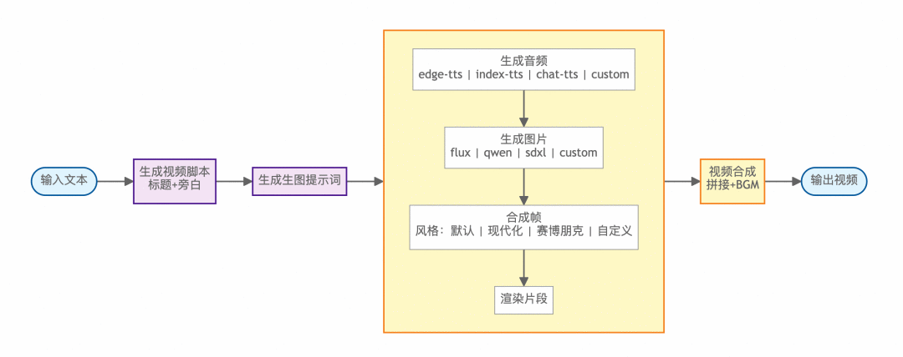
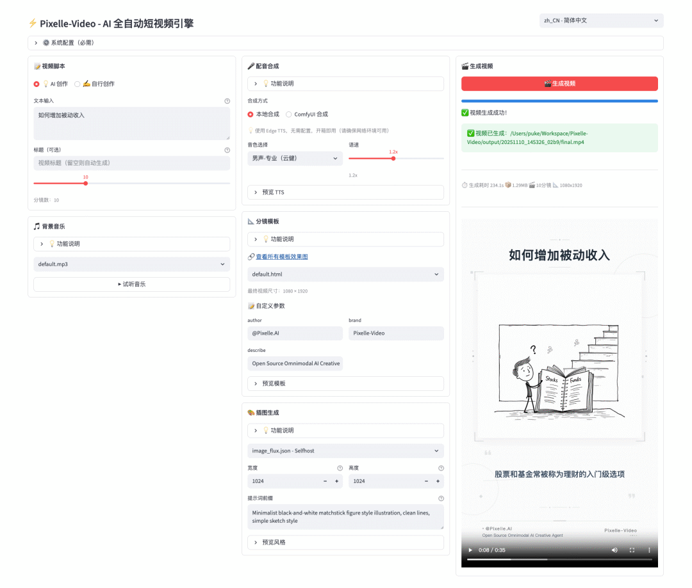

> 📎 来源: [AI技术Python实战](https://mp.weixin.qq.com/s?__biz=MzkzNzU3NjMzMA==&mid=2247493103&idx=1&sn=014010999238d93d75ab5e1c3f96e303&chksm=c30325731d2217b1489159680e848516868e9198993873afb0cc8c2dd3030bd3912abf5c1b45&mpshare=1&scene=1&srcid=0513M2Nw42N5VxJR0ro3DWd9&sharer_shareinfo=f8c085c7714c1dbfdd10888a7d31a2a3&sharer_shareinfo_first=f8c085c7714c1dbfdd10888a7d31a2a3) | 时间: 2026-05-13 02:28

---

做短视频的朋友应该都有这种感觉，写脚本、找素材、配音、加字幕、选背景音乐，一条几分钟的视频，光后期就能磨掉大半天。

要是批量出片，团队人力根本跟不上。

最近在 GitHub 上发现一个叫Pixelle-Video的开源项目，专门解决这个问题。截至目前已拿下 14200+ Star，2096 个 Fork，更新频率也很高。

它做的事情很简单：输入一个主题关键词，比如"为什么要养成阅读习惯"，剩下的全部自动完成——AI 写文案、生成配图、合成语音、加字幕、配背景音乐，最后输出一条完整的短视频。



跟市面上那些套模板的图文轮播工具不同，Pixelle-Video 底层基于 ComfyUI 架构，把每个环节都拆成了可替换的模块。

文案生成支持 GPT、通义千问、DeepSeek、Ollama 等多种模型，用哪个顺手就换哪个。图像生成可以跑本地 ComfyUI，也能接云端的 RunningHub，工作流随时自定义。语音这块除了常见的 Edge-TTS，还支持 Index-TTS 做声音克隆，上传一段参考音频就能用自己的声音配音。

打个比方，普通工具像自动贩卖机，投币出固定的饮料。Pixelle-Video 更像一个开放厨房，食材、调料、厨具全是模块化的，想怎么组合全看我们自己。

最近几个新上线的功能挺有意思。

数字人口播是 2026 年 1 月刚加的，能生成数字人形象配合语音做口播视频，Demo 里甚至有韩语数字人的展示。图生视频功能用 AI 把静态图片转成动态视频，配合 WAN 2.1 模型效果相当不错。还有动作迁移，上传一段参考视频和一张图片，AI 能把视频里的动作"迁移"到图片上，Demo 里的跳舞小猫就是这么来的。

视频模板也做了细分，静态模板走纯文字排版，图片模板用 AI 图片做背景，视频模板用 AI 视频做背景。竖屏、横屏、方形都有，适配抖音、B 站、YouTube 这些不同平台。

如果想跑起来，Windows 用户最省事，项目提供了一键整合包，下载解压双击 start.bat 就启动了，不用装 Python 也不用装 ffmpeg。Mac 和 Linux 用户装好 uv 和 ffmpeg 后，clone 项目跑一条命令就行：

```
git clone https://github.com/AIDC-AI/Pixelle-Video.git
```

浏览器打开 localhost:8501，配置好 LLM 的 API Key 和图像服务，就能开始生成了。

费用方面，如果本地有显卡，LLM 用 Ollama、图像用 ComfyUI、语音用 Edge-TTS，整套方案完全免费。没有显卡的话，文案用通义千问（API 成本很低），图像用 RunningHub 云端服务，花费也不高。

不过坦白说，目前生成的视频风格偏图文解说类，想要高级剪辑效果还做不到。ComfyUI 本地图像生成对硬件也有一定门槛，自定义模板还需要一些 HTML 基础。但作为开源项目，从 2025 年 11 月上线到现在，几乎每隔一两周就有新功能，迭代速度挺快的。



# 写在最后

视频创作的门槛确实在被 AI 一步步压低。

以前做一条解说视频，得会写脚本、会配音、会剪辑，少说也得一个人忙活大半天。现在这类工具把链条全串起来了，一个人对着终端说句话就能出成品。

MoneyPrinterTurbo 之前带火了"AI 做视频"这个方向，Pixelle-Video 在它的基础上往前走了一步，用 ComfyUI 架构把可玩性拉到了新高度。对批量做知识类、解说类内容的创作者来说，这种模块化设计确实比一锤子买卖的模板工具更有长期价值。

GitHub 项目地址：https://github.com/AIDC-AI/Pixelle-Video

今天的分享到此结束，感谢阅读。觉得有参考价值的话，可以点赞收藏，方便后续查阅，也欢迎关注持续获取更新。
