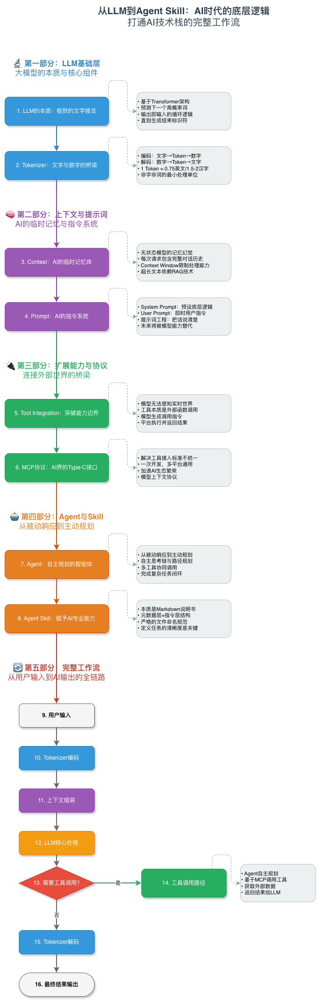
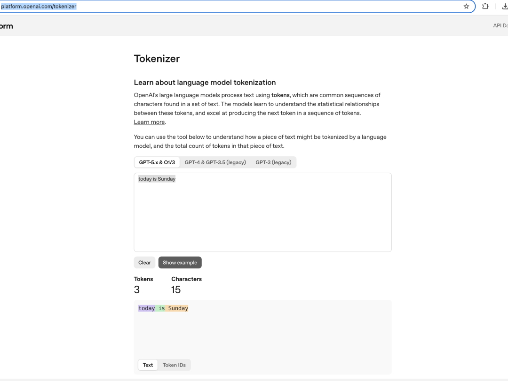
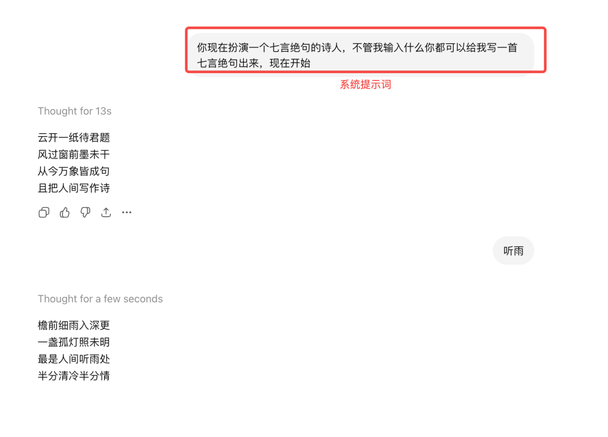
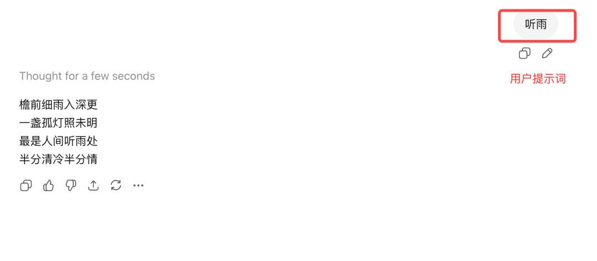

> 📎 来源: [Side.Q-Yao](https://mp.weixin.qq.com/s?__biz=MzU3NzY4OTAxMA==&mid=2247484116&idx=1&sn=62ad4301cb89044423f713841536cf1b&chksm=fc1b0f0e3f40e737dfd5d7ffe04b6d54730afa4c982c9a2ad41a87143df20ad455cbcfa9ef99&mpshare=1&scene=1&srcid=0420GdUJJ66NxoDTFBoKnLbv&sharer_shareinfo=d1591445abadc770bb7c4b472a7ab470&sharer_shareinfo_first=d1591445abadc770bb7c4b472a7ab470) | 时间: 2026-04-20 15:34

---

AI如今火得一塌糊涂，就像当初的网购一样。

人人都在说AI，用AI的人也不少，但是对于AI界的行业黑话，你还真不一定知道是什么意思。于是我花了点时间整理了一些近来耳熟能详的AI界名词，例如 LLM 、 Token、 RAG 、 Prompt 、 MCP 、 Skill ，看到这些名字可能有点头晕，但实际上 AI 的世界并没有那么多玄学。如果你揭开那些华丽的界面，从底层工程视角去观察，你会发现它有着一套极为清晰、理性的运转逻辑。

PART 01

AI运行机制举例说明

别慌，我们先看一下AI的运行机制，举几个例子，来说明他们之间的关系：

公司实习生版

- Tokenizer：把老板的话拆成一个个可执行点

- LLM：根据已有内容，判断下一句该怎么回复

- Context：聊天记录、项目背景、客户需求

- Prompt：老板交代的要求，比如“专业点，别太啰嗦”

- Tool：飞书、表格、搜索、邮件

- MCP：统一办公接口，所有系统都能连起来

- Agent：会自己查资料、写邮件、整理表格

- Agent Skill：一份“客户跟进 SOP”

做饭版

- Tokenizer：把食材切块编号

- LLM：根据现有食材，预测下一步该放什么

- Context：台面上已经摆出来的全部原料和前序步骤

- Prompt：菜谱要求，“做清淡一点，不要辣”

- Tool：烤箱、电磁炉、温度计

- MCP：统一电源接口，所有厨具都能插上

- Agent：会自己判断先切菜还是先热锅

- Agent Skill：一份已经写成熟的“宫保鸡丁标准做法”

开车导航版

- Tokenizer：把路名、地标拆成导航能识别的坐标

- LLM：根据当前路线，判断下一步该怎么开

- Context：你现在的位置、目的地、前方路况

- Prompt：你的要求，比如“少堵车”“不走高速”

- Tool：地图、实时路况、天气

- MCP：统一车机接口，所有导航工具都能接进来

- Agent：会自己规划路线、避堵、提醒变道

- Agent Skill：一套“接客户送站标准路线方案”

如果你通过上面的举例已经对这些词了然于心了，现在就可以撤离了，如果还想进一步深入了解每个名词的概念，可以留一步，我们继续看看

PART 02

AI黑话详解

LLM

全称是Large Language Module，中文名称叫大语言模型，本质上就是一场文字接龙游戏， 从工程原理上讲，当你向模型提问时，它并不是在组织语言，而是在计算概率——预测下一个出现概率最高的词是什么，所以你在使用的过程中，可能会出现幻觉，就是大语言模型在计算概率。

Tokenizer

分词器， 负责编码（Encoding）和解码（Decoding）。它会将人类文字切分成一个个最小单位，即 Token

大模型本质上是一堆数字生命，所以它看不懂文字，只能看懂一堆数字， Tokenizer就在大模型和文字之间做了一个翻译器。它把文字切分成一个一个 Token，但是 Token并不等于词也不等于文字，它是模型处理文本的最小单位。打个比方，例如“我爱你”，在中文中属于3个字，“个”属于丈量中文字数的单位，那么 Token就大模型的丈量单位。

为了便于理解，拿中文和英文来各举一个例子：

- 中文：我/很/开心（3个token）、 我/特别/爱/你（4个token）

- 英文：lik/ly（2个token）、 today/ is /Sunday（3个token）

发现规律了吗，没错1个Token大约等于0.75个英文单词，或1.5到2个汉字，Token在模型调用里，意味着真金白银

如果你实在不知道如何切分，也可以参考Open AI的分词器，

传送门： https://platform.openai.com/tokenizer

Context

上下文， 每次你发新消息时，程序会自动把之前的对话历史全部找出来，拼接在当前问题之前，打包发送给模型。

这就引出了Context Window（上下文窗口）的概念。它是模型单次处理信息的极限。例如GPT-4o的窗口约为12.8万个Token，而Claude的某些版本则高达百万级。

上下文窗口越大消耗的Token就越多，费用就越多，因此为了节省成本，当需要处理专业级的公司级文件时，就需要搬出RAG（ 检索增强生成）了，它可以快速从几千个文档中，搜索出关联度最高的片段喂给大模型，从而巧妙地绕过窗口限制。

Prompt

提示词，本质上是给模型的运行指令

- System Prompt（系统提示词）：这是开发者在系统设定的固定指令，这种指令是将模型的行为限定在框定的范围，例如，我们可以设定：

- User Prompt（用户提示词）：这是你在对话框里输入的即时指令，相当于是具体问题

Tool

工具，相当于大模型与外界的交集

大模型有一个致命伤：它生活在训练数据的过去，无法感知实时世界（比如查今天的天气）。为了破局，我们需要Tool

MCP

Model Context Protocol（模型上下文协议），把它想象成AI 界的Type-C接口， 统一了所有AI平台接入工具的标准，开发者只需按照MCP规范写一次工具，就能在所有主流AI平台上通用。

Agent

智能体，当大模型具备了自主规划并调用工具的能力那么他就是Agent了，简单来说就是把LLM 、 Token、 RAG 、 Prompt这一系列元素组合到一起，就变成Agent了

Agent Skill

本质上是一份标准的 Markdown 文档 ，由两部分组成：

- 元数据层（封皮）： 包含名称（Name）和描述（Description）。

- 指令层（内页）： 详细规定目标、执行步骤、判断规则（如“下雨带伞，风大穿防风服”）以及输出格式和示例。当然，创建 Agent Skill 有一个不可违背的接头暗号。在文件系统中，文件夹的名字必须与Skill名一致，而内部的文件必须命名为 Skill.md（大小写敏感）。只有这样，系统才能正确识别并加载这份超能力。

---

好啦，如果能看到这里，说明你对AI的热门黑话已经了如指掌啦！恭喜你！

最后，我想留下一个思考题：既然 Agent Skill 仅仅是一份清晰的 Markdown 说明文档，那么在未来，真正限制 AI 能力的究竟是技术本身，还是我们定义任务的清晰度？
