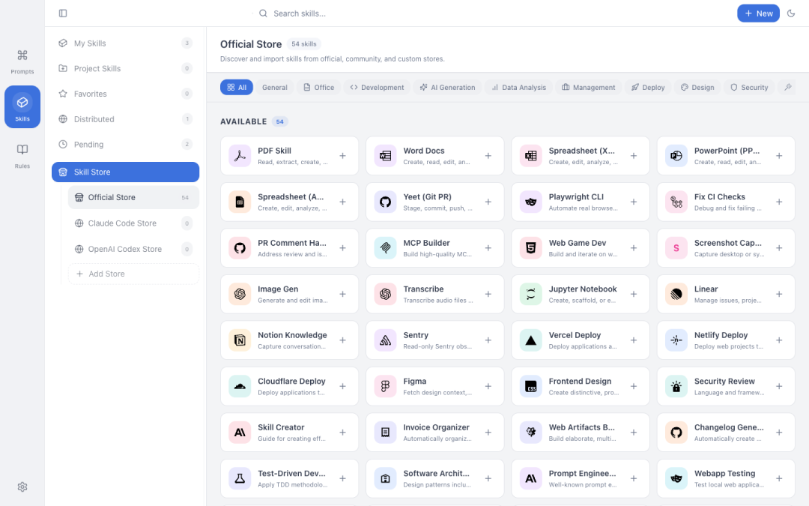
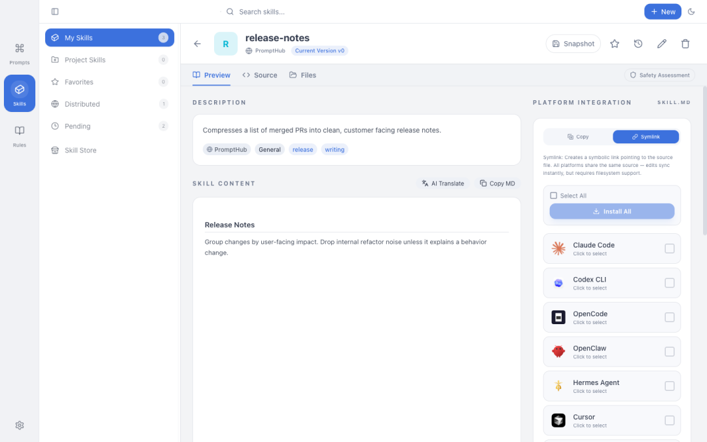
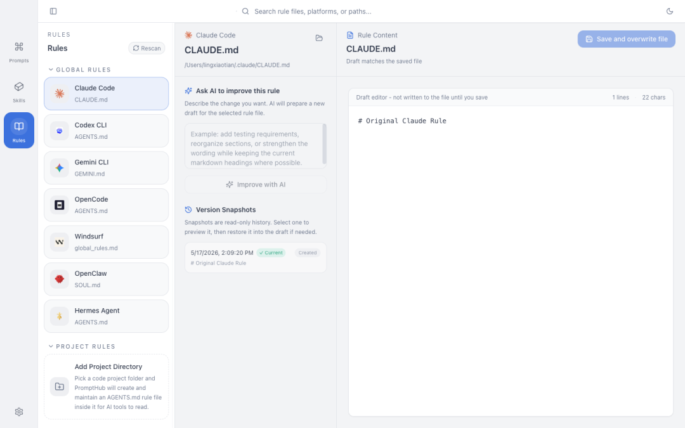
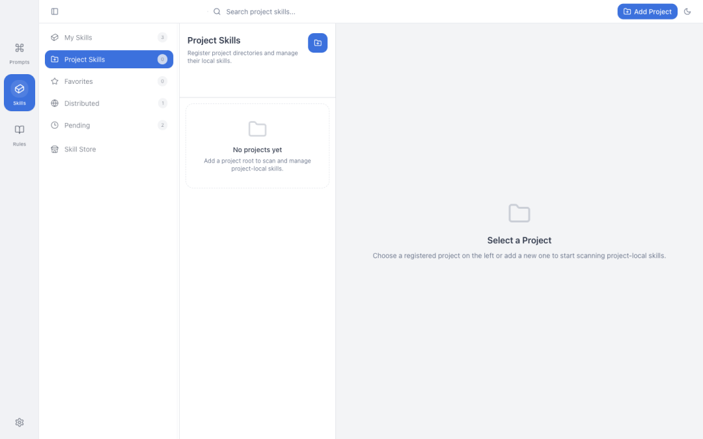
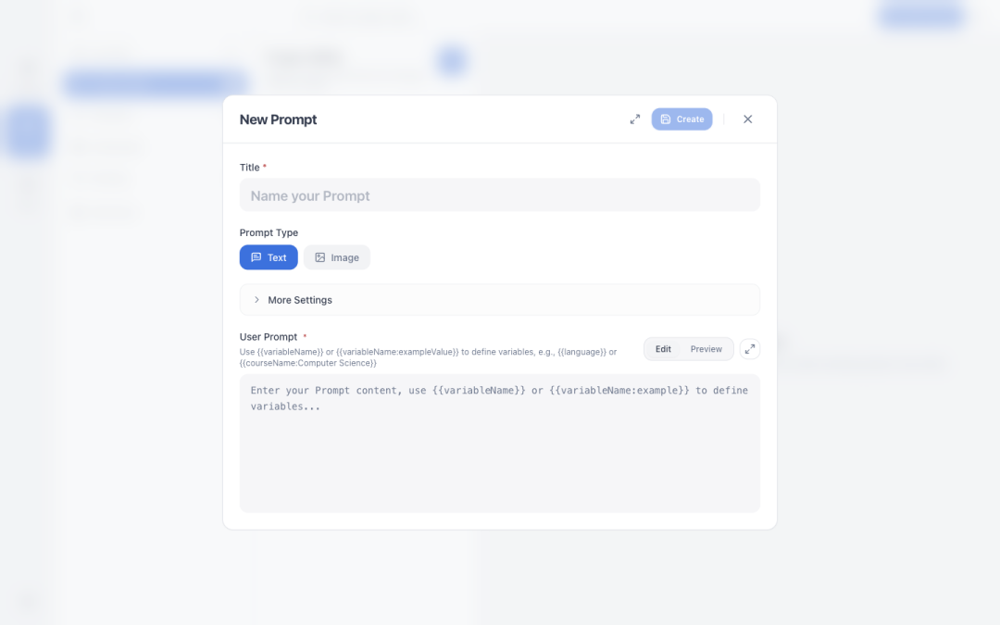
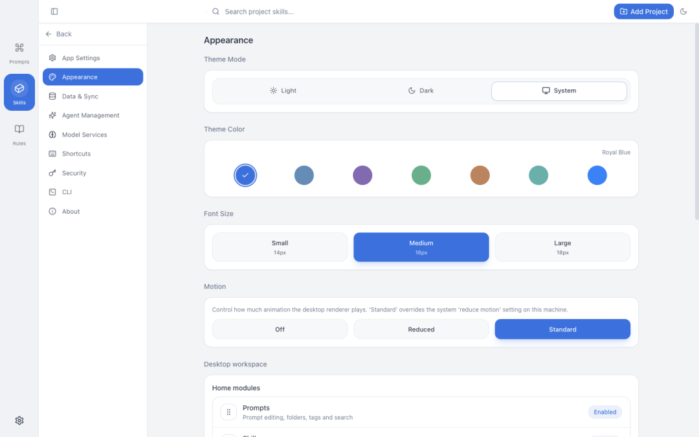

> 📎 来源: [一飞开源](https://mp.weixin.qq.com/s?__biz=Mzk0ODI4NjUyNA==&mid=2247508638&idx=1&sn=f1ce2d6c845f7c8fef6949e9ea3fafd3&chksm=c271610625879239e5ae4d3e1a05e5197c9055d3a46e8d4361091344517f40b16ffe180c9a16&mpshare=1&scene=1&srcid=0525948Xf94y3EmykVvRHwKU&sharer_shareinfo=8e639ba1ac17a7c361fcbffe44582e88&sharer_shareinfo_first=8e639ba1ac17a7c361fcbffe44582e88) | 时间: 2026-05-25 04:13

---

> 一飞开源，介绍创意、新奇、有趣、实用的开源/AI应用、系统、软件、硬件及技术，一个探索、发现、分享、使用与互动交流的开源/AI技术社区平台。致力于打造活力开源/AI社区，共建开源新生态！

# 一、开源项目简介


# PromptHub

本地优先的 Prompt、Skill 与 AI 编程资产工作台。

PromptHub 把你的 Prompt、SKILL.md 和项目级 AI 编程资产放进一个本地工作区。它能把同一份 Skill 一键安装到 Claude Code、Cursor、Codex、Windsurf、Gemini CLI 等十几个工具，给 Prompt 做版本管理与多模型测试，并通过 WebDAV 或自部署 Web 同步到其他设备。

数据默认存在你自己的电脑上。

# 二、开源协议

使用AGPL-3.0开源协议

# 三、界面展示














# 四、功能概述

> 一款包含了 Prompt管理，Skill管理，Agent管理的一站式AI工具箱，助你高效管理提示词，一键分发skills ，一站式管理Agent资产，并实现云同步，备份，版本管理 | An all-in-one AI toolbox for prompt, agent, and skills management. Reuse prompts, distribute skills with one click, manage agent assets, and support cloud sync, backup, and version control

# 核心能力

# Prompt 管理

- 文件夹、标签、收藏三层组织，可拖拽排序，CRUD 全覆盖
- 模板变量 {{variable}}，复制 / 测试 / 分发时弹表单填值
- 全文搜索（FTS5），Markdown 渲染与代码高亮，附件 / 多媒体预览
- 桌面卡片支持双击进入 inline 编辑用户 Prompt 和 System Prompt

# Skill 商店与一键分发

- **技能商店**

  内置 20+ 精选技能（来自 Anthropic、OpenAI 等），可叠加自定义商店源（GitHub / skills.sh / 本地目录）
- **一键安装到平台**

  Claude Code、Cursor、Windsurf、Codex、Kiro、Gemini CLI、Qoder、QoderWork、CodeBuddy、Trae、OpenCode、Roo Code 等 15+ 平台
- **本地扫描**

  自动发现本地已有 SKILL.md，预览选择后导入，避免在多个工具目录间复制粘贴
- **Symlink / Copy 双模式**

  选 symlink 共享编辑，选 copy 各平台保留独立副本
- **平台目标目录可覆写**

  为每个平台单独配置 Skills 目录，扫描和分发保持一致
- **AI 翻译与润色**

  以完整 SKILL.md 为单位生成 sidecar 译文，支持沉浸式对照和全文翻译
- **安全扫描**

  安装前用 AI 审阅链路检查 Skill 内容，受限来源直接阻断
- **GitHub Token**

  商店与仓库导入支持鉴权，减少匿名限流失败
- **标签筛选**

  按标签快速过滤已安装与商店技能

# Rules（AI 编程规则）

- 集中管理 .cursor/rules、.claude/CLAUDE.md、AGENTS.md 等规则文件
- 支持手动添加项目级 Rules，按目录分组浏览
- 与 ZIP 导出、WebDAV、自托管同步、Web 导入导出全链路打通

# 项目与 Agent 资产工作区

- 扫描项目里的 .claude/skills、.agents/skills、skills、.gemini 等常见目录
- 为单个项目建立独立 Skill 工作区，不污染全局库
- 个人库、本地仓库、项目资产同一界面切换，不用在多个工具目录之间跳来跳去
- 全局 Prompt 标签管理：集中搜索、重命名、合并、删除标签，数据库与工作区文件一并同步

# AI 测试与生成

- 内置 AI 测试，主流国内外服务商都能配（OpenAI、Anthropic、Gemini、Azure、自定义 endpoint 等）
- 同一 Prompt 多模型并行对比，文本和图像模型都支持
- AI 生成技能、AI 润色技能、Quick Add AI 直接生成结构化 Prompt 草稿
- 统一的端点管理与连接测试，错误信息精确到 504 / 超时 / 未配置

# 版本控制与历史

- 每次保存 Prompt 自动写入历史版本，支持版本对比、差异高亮、一键回滚
- Skill 同样维护版本历史，可创建命名版本、查看差异、按版本回滚
- Rules 历史快照可预览、恢复到草稿
- 商店 Skill 安装时记录内容哈希，远端 SKILL.md 变更可检测，本地修改有冲突保护

# 数据、同步与备份

- 本地优先：所有数据默认存在你自己的电脑上
- 全量备份 / 恢复使用 .phub.gz 压缩格式
- WebDAV 同步（坚果云、Nextcloud 等）
- 自部署 PromptHub Web 可作为额外的同步源 / 备份源
- 启动时自动拉取 + 后台定时同步；只允许一个活动同步源驱动自动同步，避免多源冲突写入

# 隐私与安全

- 主密码保护应用入口，AES-256-GCM 加密
- 私密文件夹内容加密存储（Beta）
- 跨平台离线运行：macOS / Windows / Linux
- 7 种界面语言：简体中文、繁體中文、English、日本語、Deutsch、Español、Français

# 五、技术选型

# 从源码运行

需要 Node.js ≥ 24、pnpm 9。

```
git clone https://github.com/legeling/PromptHub.git
```

pnpm build 默认只构建桌面版。Web 需要显式 pnpm build:web。

常用开发命令：

| 命令 | 用途 |
| --- | --- |
| `pnpm electron:dev` | 启动桌面端开发环境（vite + electron） |
| `pnpm dev:web` | 启动 Web 开发环境 |
| `pnpm lint` / `pnpm lint:web` | 代码风格检查 |
| `pnpm typecheck` / `pnpm typecheck:web` | TypeScript 类型检查 |
| `pnpm test -- --run` | 桌面端 vitest 单元 + 集成测试 |
| `pnpm test:e2e` | Playwright e2e |
| `pnpm verify:web` | Web lint + typecheck + test + build |
| `pnpm test:release` | 桌面端发布前完整门禁 |
| `pnpm --filter @prompthub/desktop bundle:budget` | 桌面端 bundle 体积预算检查 |

# 仓库结构

```
PromptHub/
```

# 致谢

Electron · React · TailwindCSS · Zustand · Lucide · @tanstack/react-virtual · tailwindcss-animate

# 六、源码地址

开源项目地址：

https://github.com/legeling/PromptHub

访问一飞开源：https://code.exmay.com/
