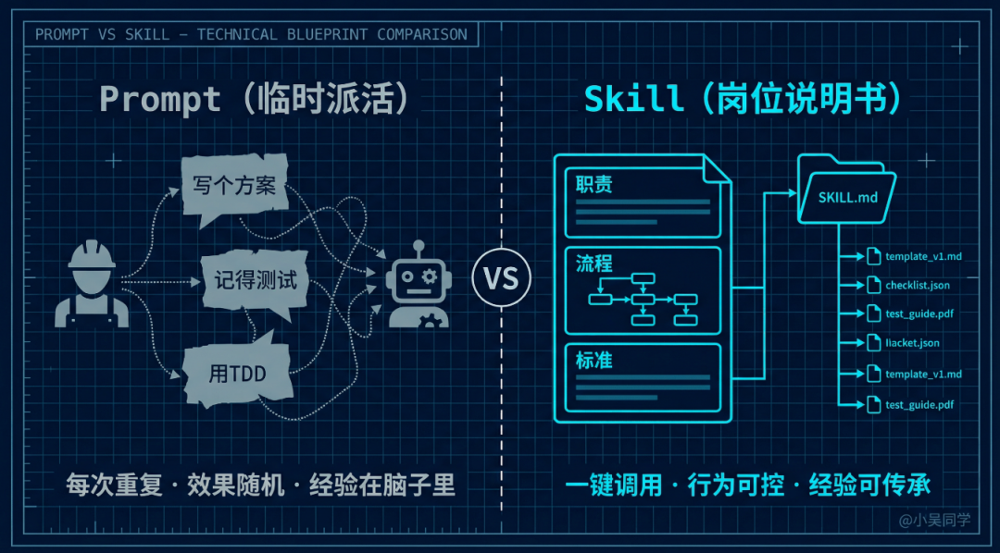
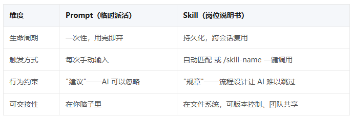
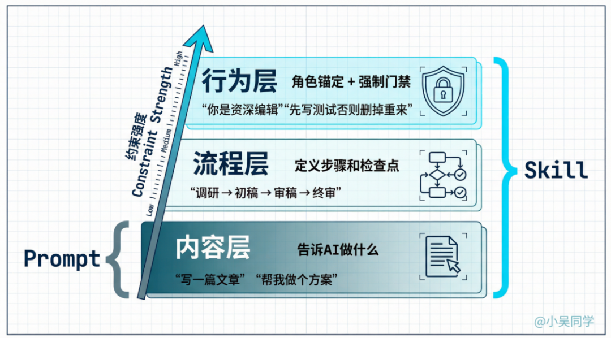
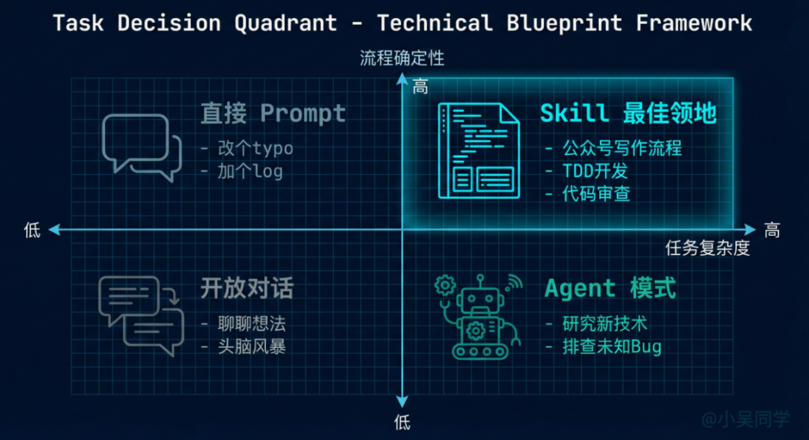

> 📎 来源: [AI大模型蛋蛋](https://mp.weixin.qq.com/s?__biz=MzcwODE1MjY4Nw==&mid=2247484273&idx=1&sn=78bd671e2b4aebb29d625ccdc43ba9dc&chksm=f4728caeda17dfa3db1044cfd786068f4645ee1ee5e311a291e1c352d5541a13a54710b24587&mpshare=1&scene=1&srcid=0512h0FW8CYMwP8T06aYiEVM&sharer_shareinfo=0e64fb15d0f993a490f4a0a9614515ee&sharer_shareinfo_first=0e64fb15d0f993a490f4a0a9614515ee) | 时间: 2026-05-12 04:06

---

Skill 不是什么花里胡哨的prompt，说白了，就是从每次临时给AI派活，变成给它定好一个“岗位”的转变。

你有没有过这种情况？每次让AI帮你干活，都得反复跟它说“先别着急写代码，先做个计划”“用TDD的方式来”“写完自己先检查一遍”？我反正有过。

而且不管我怎么强调，Claude总有一半的概率，直接跳过规划环节，一头扎进去写代码——到最后，我得花20条消息跟它来回修改，越改越累。

直到我开始用Skill，这个问题才好了很多。不是说AI突然变聪明了，而是我终于不用再每次都临时给它派活了。

Skill到底是个啥？

打开一个Skill你就，特别简单——就是一个文件夹，里面放着几个markdown文件。

最核心的是一个SKILL.md文件，写清楚这个Skill是干嘛的、怎么干、干到什么标准才行。里面可能还会有一些模板、参考文档，甚至能直接执行的脚本。

从技术层面说，Skill就是在特定的时候，注入到AI上下文里的一段结构化指令。

Prompt是临时派活，Skill是岗位说明书

你可以想象一下，你是一个小团队的负责人，用人就两种方式。

第一种是临时派活：每次有任务，就把人叫过来，口头跟他说“这个需求你看看，先做个方案，再写代码，记得写测试”。

最后效果怎么样，全看你当时说得多详细，也看对方当天的状态好不好。下次再遇到类似的活，你还得重新说一遍，特别麻烦。

第二种是写岗位说明书：花点时间，定一个岗位，比如“前端开发”，写清楚他要负责什么、工作流程是什么、产出的东西要达到什么标准。以后不管这个岗位换谁来，都知道该怎么干，不用你反复叮嘱。

Prompt就是第一种，Skill就是第二种。

它们的区别不在于内容多不多，而在于本质不一样：

我觉得啊，说到底，Skill和Prompt都是给AI传递一些上下文信息，然后让大模型给出答案。但不一样的是，Skill用的是结构化的描述方式，能让大模型输出的结果更稳定、更高效，也更容易重复使用。

所以你看，用Prompt积累的那些经验，永远都只在你自己脑子里，别人用不上。但用Skill沉淀下来的经验，能git commit保存，能整个团队共享，还能慢慢优化迭代，越用越好。

这就是为什么“岗位说明书”比“口头交代”管用——不只是因为信息说得更细，更重要的是，这个结构本身，就能约束AI的行为，让它不跑偏。

# Skill 的使用边界：管得了什么，管不了什么

这一点，现在大部分教程都不怎么提，但我觉得比“怎么用Skill”更重要。

什么适合做成Skill？我自己写过十几个Skill，踩了不少坑，总结下来就一条：你已经明确知道怎么做，而且需要反复做的事，就适合做成Skill。

比如我写公众号，有一套固定的流程——选选题、做调研、写初稿、审稿件、配图片、发文章。以前每次让AI帮忙，都得把这个流程重新跟Claude说一遍，说着说着我自己就偷懒，少说几步，最后出来的效果就差一截。

做成Skill之后，我只要输入/gzh-write，它就会自动走完整个流程，一步都不会少。我这个写作Skill里，甚至还定了5个评分维度，Claude写完初稿后，会自己给自己打分，要是不及格，就自动修改，不用我多费心。

给大家一个简单的判断标准：低复杂、高确定的事，用Prompt就行；高复杂、高确定的事，用Skill；要是高复杂，而且怎么做还不确定，就用Agent。

在实际用的时候，我也总结了4个点，能帮大家更顺畅地用AI，少踩坑。

第一，Skill不是越多越好。有人做过测试：选3-4个好用的Skill，效果最好。要是装到8-10个，Claude就开始犯迷糊，输出的内容又啰嗦，不同Skill的指令还会互相冲突。

这就跟真实团队一样——一个人不可能同时遵守10套工作规范，越看越乱。

第二，大多数Skill都是“垃圾”。这话不是我说的，是RoboRhythms最近一篇文章的标题，写的就是“Most Claude Code Skills Are Garbage”。

原因很简单：这些Skill都在重复Claude本来就会的事，纯属浪费token。好的Skill，是解决AI真正不会的问题；

烂的Skill，就是把“AI已经会做的事”再啰嗦一遍——就好比给一个有10年经验的程序员，发一份“怎么写for循环”的工作规范，纯属多此一举。

第三，Skill管不了需要外部能力的事。如果一个任务，需要调用外部API、操作SaaS工具，或者访问私人数据源——这就不是Skill能搞定的了，得靠MCP。

简单说，Skill管的是“怎么干”，MCP管的是“用什么工具干”，CLAUDE.md管的是“不管干什么，都要遵守的规则”，Hooks管的是“哪些操作可以自动执行”。别把这些搞混了，不然用起来只会更乱。

第四，Skill的内容会被截断。Claude Code的上下文是有限的，在长对话里，系统会自动压缩内容。每个Skill只能保留前5,000个token，所有Skill加起来，总预算也只有25,000个token。

所以写Skill的时候，一定要精炼——官方也建议，SKILL.md控制在500行以内，那些详细的内容，放到支持文件里，需要的时候再加载就行。

# 写在最后

Skill其实一点都不神奇，就是一个文件夹里放了几个markdown文件。就像“岗位说明书”也不神奇，就是一页纸的规则而已。

但正是因为有这一页规则，一个新人第一天上班，就能按照正确的流程，做出合格的工作成果。而Skill，就是给AI的那一页“岗位说明书”。

跟AI大模型相关的学习素材视频教程学习路线项目资源等等的我都整理好了，已经上传至我的网盘，需要的思我一下回复【02】即可自动掉落~
