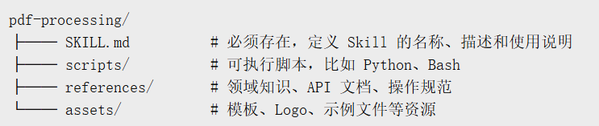
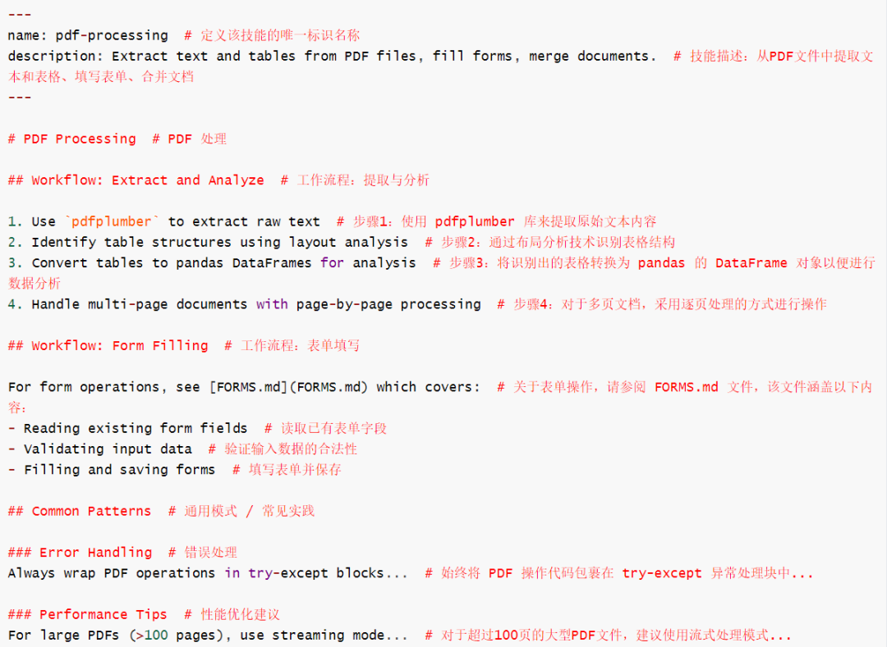

> 📎 来源: [小阁](https://mp.weixin.qq.com/s?__biz=MzAxMDkwMjkzNw==&mid=2247483815&idx=1&sn=f611ebeaabeceb1ec840e5cb3142e3f9&chksm=9ac82e5cfe0f9e6fa4c64e5735b037bba3331f6c56574a3170e476d6455c4747c398a64d467a&mpshare=1&scene=1&srcid=0521JRsHhVa7GgPtXovuW9Xb&sharer_shareinfo=7a9ac652ef2f9e744fe0e33079515501&sharer_shareinfo_first=7a9ac652ef2f9e744fe0e33079515501) | 时间: 2026-05-21 22:59

---

[ 导读 ] .

本文将带你看懂：Skills 为什么会出现，它和 Prompt、RAG、Plugin 有什么不同，以及它为什么可能成为 AI Agent 走向工程化的重要一步。

01

Skills背景  .

当前 AI Agent 落地中的一个核心矛盾：

**模型越来越强，但组织化、流程化、可复用的知识仍然很难沉淀。**

在早期使用 AI 时，我们通常依赖 Prompt。遇到一个任务，就写一段提示词；遇到更复杂的任务，就写一个更长的 System Prompt。后来大家又开始用 RAG、插件、自定义工具来增强模型能力。

› System Prompt 写得太长，会挤占上下文窗口，而且很难跨场景复用；

› RAG 系统更适合知识检索，但要搭建向量数据库、切分文档、做召回和评估，成本并不低；

› 自定义 Plugin 或工具虽然强大，但开发、维护和分发门槛都比较高；

于是，一个更轻量、更工程化的方案开始出现：**Skills**。

你可以把 Skills 理解成：

给 AI Agent 准备的一本本“工作手册”。模型本身是一个通用大脑，而 Skills 则是不同场景下可以按需翻阅的操作指南、规范文档、脚本工具和资源包。

这意味着，我们不再需要为每一个新场景重新训练一个 Agent，也不必每次都手写一大段 Prompt。我们可以把稳定、重复、专业的流程封装成一个 Skill，让 AI 在合适的时候自动调用。

AI 应用，也因此从“手写 Prompt 阶段”，逐步进入“模块化技能架构阶段”。

02

Skills是什么  .

从物理形态上看，一个 Skill 并不神秘

它本质上就是一个文件夹。这个文件夹里至少要有一个核心文件：SKILL.md。

一个典型的 Skill 目录大概长这样：



其中最重要的是 SKILL.md。它通常由两部分组成：

第一部分是 YAML 元数据，用来告诉 Agent：这个 Skill 叫什么，适合什么场景。

第二部分是 Markdown 正文，用来写具体的操作流程、最佳实践、注意事项和示例。

比如一个 PDF 处理 Skill，可能会这样写：



03

如何写一个Skills  .

Skill 的关键不是“写得越多越好”，而是“写得刚好有用”。下面是几个实用原则：

🧩原子性：一个 Skill 只解决一个具体问题，Skill 越原子，越容易复用、组合和维护。

🧩给例子：Few-shot 比抽象解释更有用。

🧩立规矩：明确角色、步骤和红线。

🧩设计接口：让输入和输出可预期。你需要定义清楚，用户应该提供什么输入、Agent 应该输出什么格式、中间是否需要调用脚本、最终结果是 Markdown、JSON、表格，还是某种文件...

🧩持续复盘：把 Bad Case 变成新规则。Skills 不是一次写完就结束的东西，每次使用 Skill 时，如果发现输出不理想，就记录下来，然后把这些 Bad Case 转化成新的规则、反例或示例，补充回 Skill 中。

04

实用Skills推荐  .

现在已经有不少官方示例和社区合集，可以先找一个现成的 Skill 拆开看看，再根据自己的场景修改。

比如：

```
Anthropic 官方库 github.com/anthropics/skills；
```

如果你使用 Claude Code或者Open Code，可以把 Skill 地址直接交给它，让它帮你检查和安装。

如果读者不知道从哪里开始，可以先看下面这几个。

它们分别代表了几类典型方向：国产文档处理、会议分析、求职简历、Skill 生成、Skill 搜索，以及工程化编码工作流。

**MiniMax-AI/skills**

```
github.com/MiniMax-AI/skills
```

MiniMax 官方的国产文档与多模态 Skills，覆盖文档处理、应用开发和多模态生成。其中 minimax-docx 还明确引用了 GB/T 9704-2012 公文格式、CJK 排版等参考内容。

**Meeting Insights Analyzer**

```
github.com/ComposioHQ/awesome-claude-skills/tree/master/meeting-insights-analyzer
```

把会议录音或转录文本丢进去，生成结构化纪要、沟通洞察、行动项和改进建议。适合 Lead、PM、HR、顾问使用。它的 SKILL.md 里覆盖会议沟通模式、冲突回避、发言比例、行动反馈等分析方向。

**Tailored Resume Generator**

```
github.com/ComposioHQ/awesome-claude-skills/tree/master/tailored-resume-generator
```

一份简历，多种岗位版本。根据不同 JD 自动定制简历版本，突出最相关的经验、技能和成果。求职者投 10 家公司，完全可以生成 10 份不同侧重的简历

**skill-creator**

```
github.com/anthropics/skills/tree/main/skills/skill-creator
```

用自然语言创建 Skill。Anthropic 官方 skill-creator 的描述就是创建、修改、优化 Skill，并支持测试和评估 Skill 表现。

**find-skills**

```
github.com/vercel-labs/skills/tree/main/skills/find-skills
```

专门帮你找 Skill 的 Skill。帮用户按任务意图定位合适的 Skill。Vercel Labs 的 skills 仓库也提供 npx skills find 搜索命令。

**Matt Pocock Skills**

```
https://github.com/mattpocock/skills
```

工程化编码工作流。Matt Pocock 仓库 README 里强调这些 Skills 是面向真实工程开发、可组合、可适配的，而不是 vibe coding；也给出了 npx skills@latest add mattpocock/skills 的安装方式。

对大多数人来说，最佳路径不是直接安装一堆 Skill，而是：先找 3～5 个优秀 Skill，拆开看它们怎么写；再挑一个和自己最相关的场景，改成自己的版本。这样做出来的 Skill，才不是别人的模板，而是你自己的工作流。
