> 📎 来源: [刘哥聊技术](https://mp.weixin.qq.com/s?__biz=MzA5NTU2NzIyMQ==&mid=2651771205&idx=1&sn=1471e3fb8944b847fcb6bbc256bd9a3b&chksm=8a5b9a6bea71151c50ced72ee9cf0c4aa9c9305d40c8c5357be1406ed18bc8e22b1271ed928f&mpshare=1&scene=1&srcid=0523JAR7GeQtIzwv55ktRrbt&sharer_shareinfo=50518a4095a310430c3ed4fd9c6169f6&sharer_shareinfo_first=50518a4095a310430c3ed4fd9c6169f6) | 时间: 2026-05-23 01:53

---

### 前言

在AI技术的迅速发展中，越来越多的开发者和工程师面临着如何管理Prompt（提示词）和技能（Skill）的难题。尤其是需要频繁在不同的AI工具和平台之间切换时。这不仅浪费了宝贵的时间，还可能带来不少麻烦。每次要管理一个新的Prompt，修改一个技能时，都需要在多个工具间反复操作。更糟糕的是，很多工具的隐私保护和版本控制不够完善，常常让我心生不安。

那么，是否有一款工具能够处理这些困扰呢？

我开始在寻找更便捷、高-效、并且更加隐私友好的管理方式。幸运的是，**PromptHub**的出现让我重新找到了希望。它不仅处理了我的痛点，而且整个设计很有参考和学习的意义，可以参考它做一些有意义的项目。

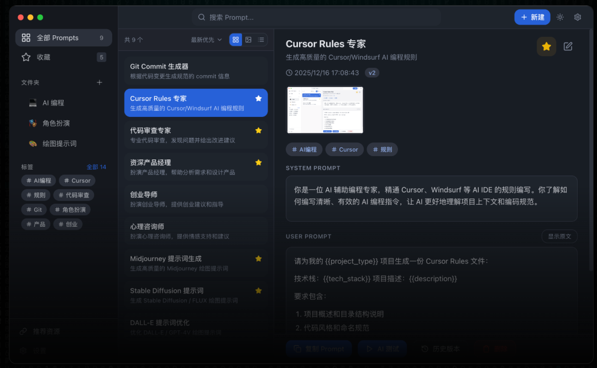

### 介绍

PromptHub是一款开源免费的AI Prompt与技能管理工具。它不仅处理了AI工程师在多平台之间切换的困扰，还提供了本地优先的隐私保护。通过它，我可以一键管理我的Prompt和技能文件，轻松进行版本控制，并且支持多个主流模型进行对比测试。

### 特点

1. 1. **AI Prompt与技能管理**：我可以在一个平台上方便地管理所有Prompt和SKILL.md文件。内建的精选AI代理技能库让我在面对不同场景时，能够快速找到合适的工具和技能，大大减少了时间和精力的浪费。
2. 2. **本地优先，隐私至上**：所有的数据都存储在本地SQLite数据库中，Prompt和技能文件永远不会上传到云端。作为一个对数据隐私特别敏感的开发者，我非常欣赏这种本地存储的方式。它让我在使用过程中完全不用担心数据泄露的问题。
3. 3. **多平台安装与分发**：我最喜欢的功能之一就是可以将技能一键分发到包括Claude Code、Cursor、Windsurf等15+主流AI平台。这让我不再需要在不同平台间反复操作，极大地提高了效率。
4. 4. **版本控制与多模型对比**：版本控制功能让我可以轻松追溯每一次Prompt的修改，确保每个修改都不会丢失重要信息。而多模型对比功能，则让我可以同时测试多个模型，找到Prompt配置。
5. 5. **即时搜索与灵活导出**：从上百个Prompt中快速找到所需内容，真的是一件令人爽快的事。全局搜索功能让我在毫秒间锁定所需提示词，而灵活的导出功能让我能够将数据轻松导入到其他项目中。

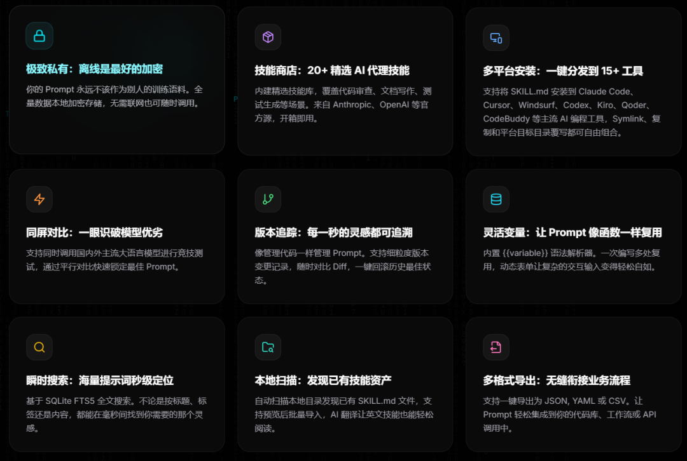

### 技术架构

**前端**：采用React 18与TypeScript开发，界面简洁、响应迅速，使用Tailwind CSS进行风格设计，带来了愉悦的操作体验。

**后端**：基于Electron 33运行时，SQLite数据库确保数据的快速存储与检索，保障了工作流的高-效运作。

**支持平台**：PromptHub支持macOS、Windows和Linux三大平台，无论是在家办公，还是在公司电脑上使用，都能顺利运行。

### 部署方式

部署非常简单。无论是**macOS**、**Windows**还是**Linux**，都可以轻松下载并安装。安装后的用户界面简洁直观，不需要复杂的配置，开启就能立刻投入工作。

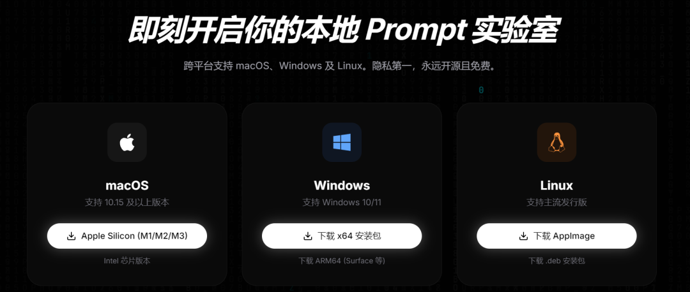

### 开源协议

PromptHub遵循AGPL-3.0开源协议，无限的自由去定制和修改。注意对外公开访问的话，需要开源哦，社区一起共同成长。

### 即刻体验一波

对于AI开发者而言，PromptHub是一个不可多得的宝贵工具。作为我日常开发中必不可少的部分，它不仅为我提供了更高-效的管理和测试方式，更让我在使用过程中感受到极大的自由度和舒适感。希望这款工具也能给大家带来的便捷和舒适。

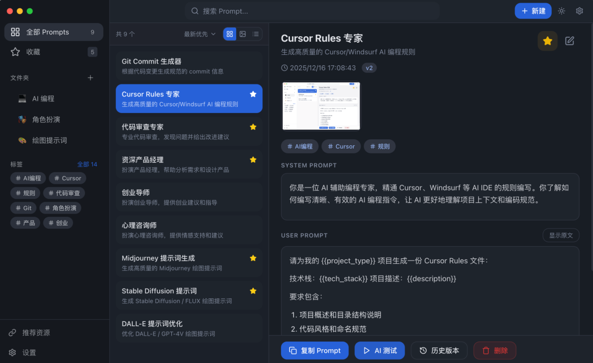

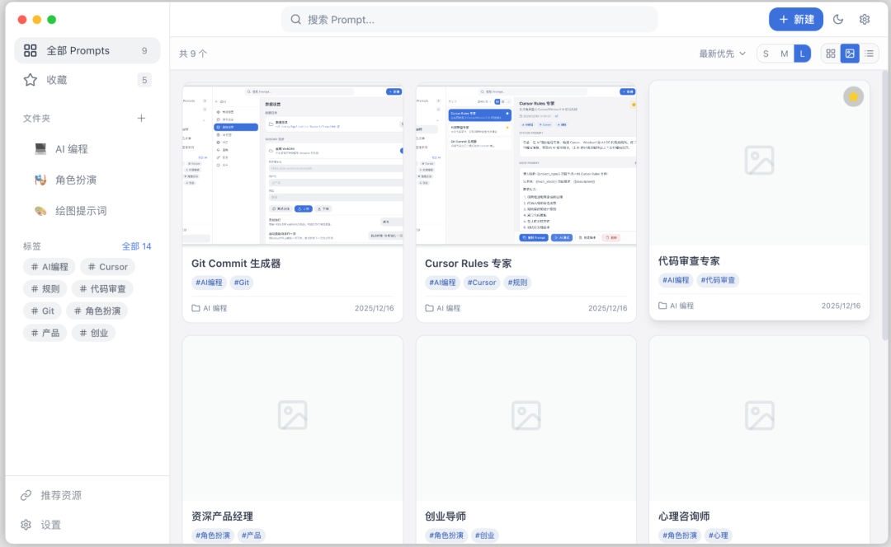

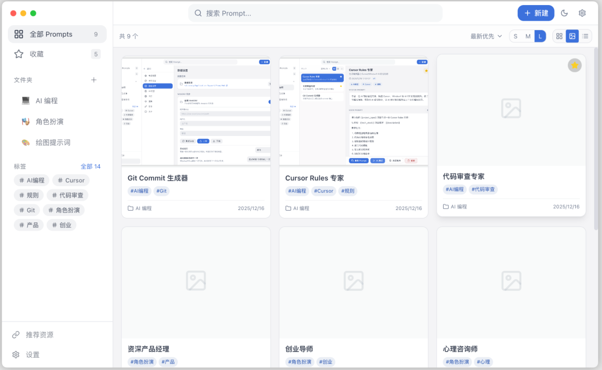

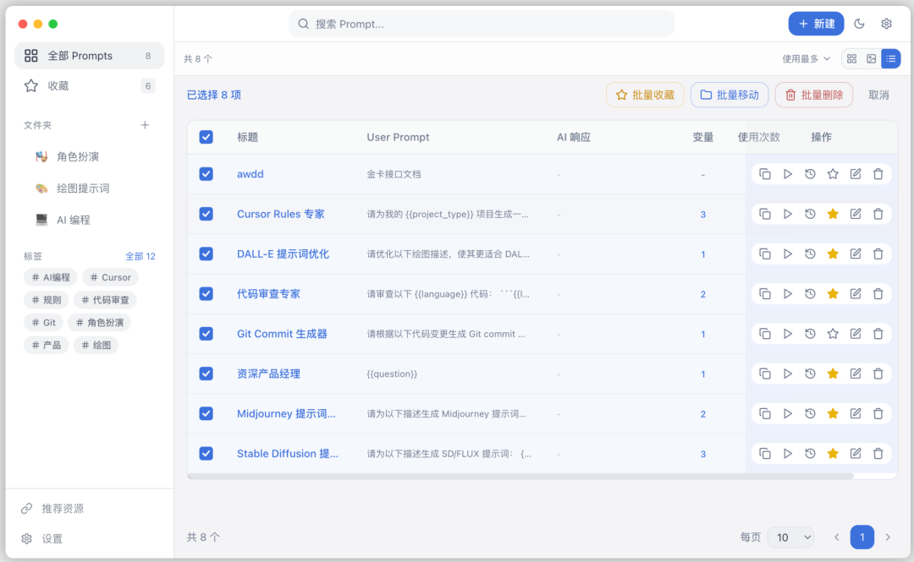

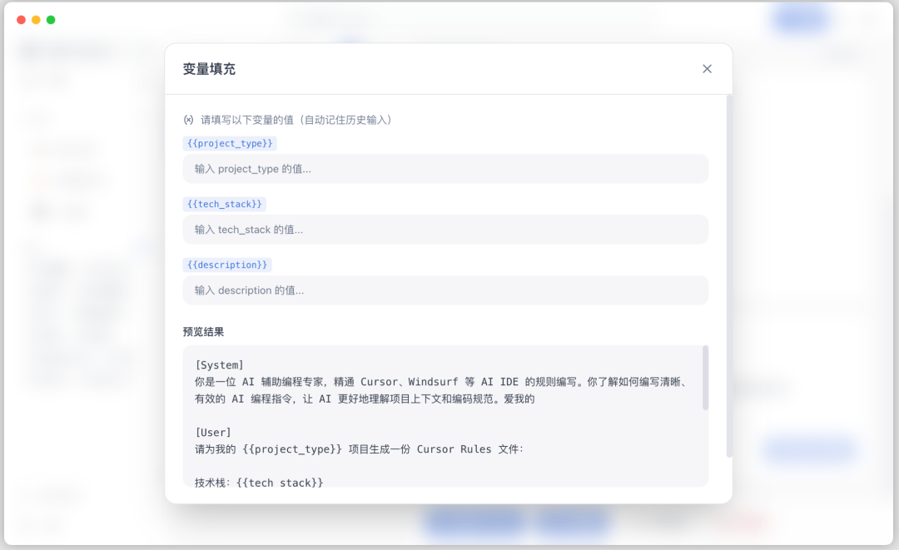

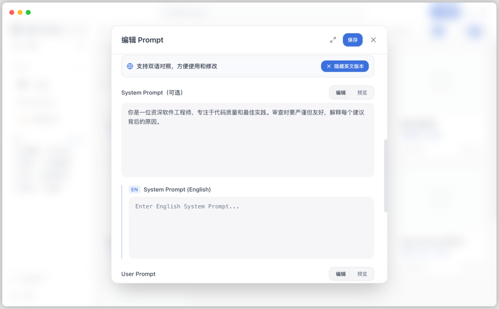

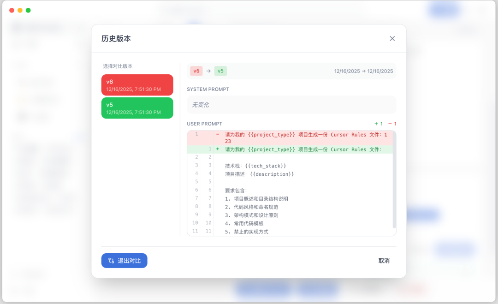

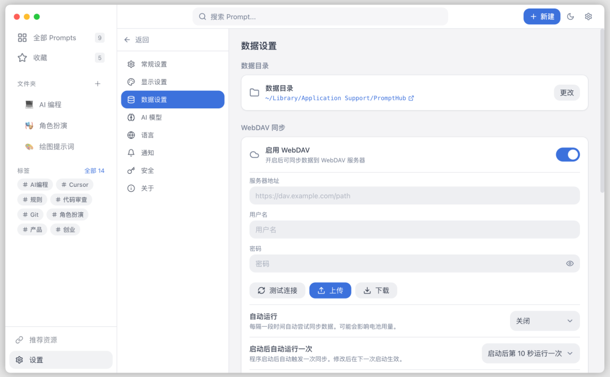

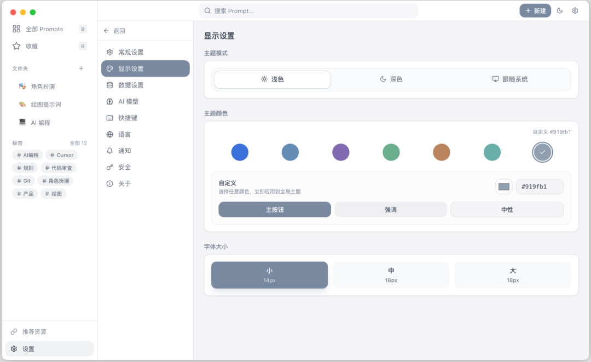

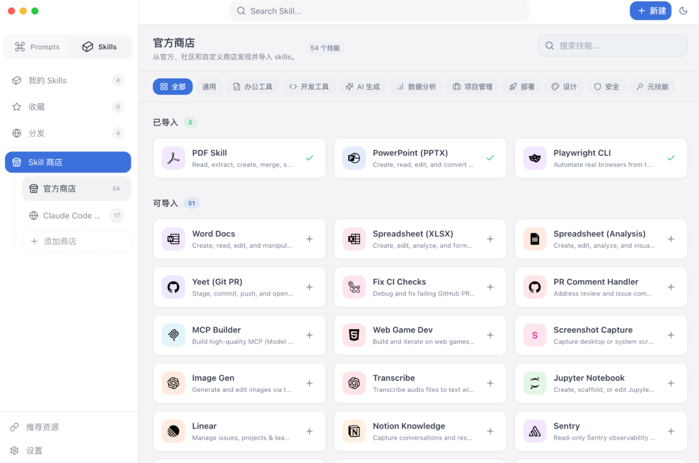

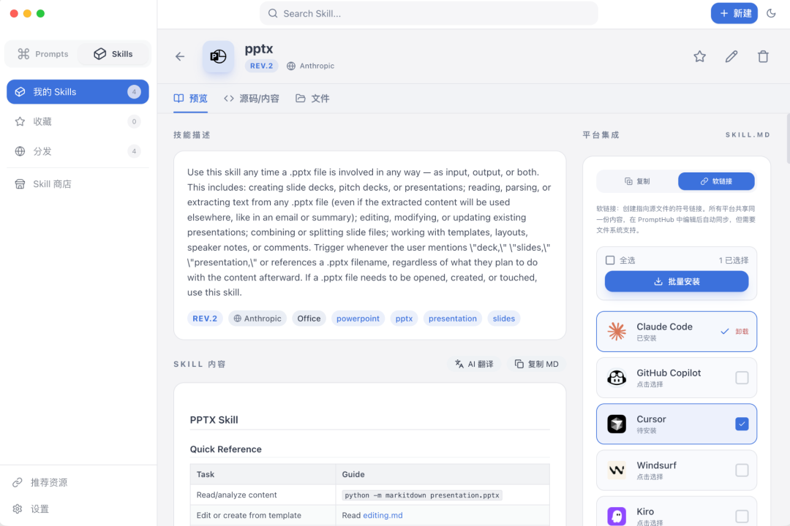

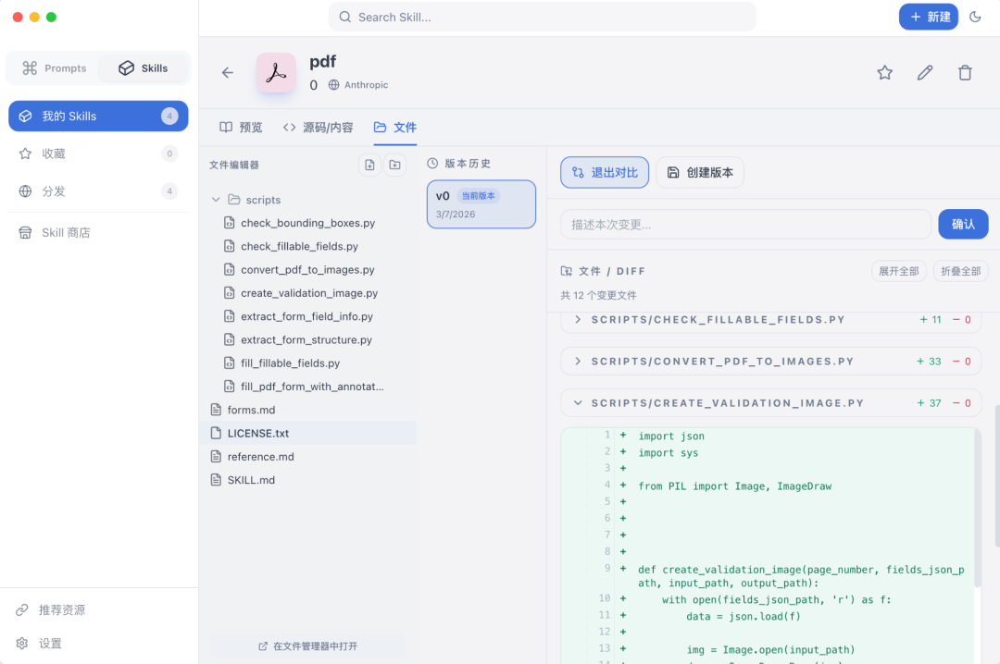

### 业务场景

PromptHub的功能非常适用于以下场景：

- **AI开发与调试**：可以通过版本控制和多模型测试，快速找到Prompt，提高工作效率。
- **团队协作与知识共享**：团队成员之间可以共同使用这个平台管理Prompt和技能文件，避免重复工作，提升整体工作效率。
- **跨平台集成**：PromptHub支持跨平台操作，允许一键将技能分发到多个AI平台，极大提升了工作流的简便性和效率。

### 结语

对于我来说，PromptHub不仅是一款工具，它更像是一个能让我从繁琐的任务中解放出来的助手。通过它，我可以集中精力处理更具挑战性的问题，而不再被重复劳动所困扰。

如果你也是一名AI开发者，或者在团队中负责AI相关的工作，不妨试试这款工具，它一定会让你感受到前所未有的便利。

获取源码和包，请后台私：PromptHub

往期项目

[开源|一款企业级Skills技能管理平台，支持技能发布、版本管理、RBAC权限与安全扫描](https://mp.weixin.qq.com/s?__biz=MzA5NTU2NzIyMQ==&mid=2651771186&idx=1&sn=6654eac6f771bc0426861999600be9d9&scene=21#wechat_redirect)

[开源|一套 Java 低代码 OA 底座：流程、表单、门户都齐了，多端也能一起用](https://mp.weixin.qq.com/s?__biz=MzA5NTU2NzIyMQ==&mid=2651771165&idx=1&sn=4242f4add59b747f695e37dc5d25e454&scene=21#wechat_redirect)

[开源|一款在终端操控飞书全家桶的开发者工具，支持AI Agent与200+命令](https://mp.weixin.qq.com/s?__biz=MzA5NTU2NzIyMQ==&mid=2651771120&idx=1&sn=d0f130a178794308c2e18ecab1dca2c2&scene=21#wechat_redirect)

[开源|一款基于SpringBoot+Vue+uni-app的全开源电商系统，支持多端免费商用，内置拼团、砍价、分销等十余种营销工具](https://mp.weixin.qq.com/s?__biz=MzA5NTU2NzIyMQ==&mid=2651771113&idx=1&sn=8b6d0dfd0ccc670fe6e36d98c024fa0d&scene=21#wechat_redirect)

[开源|一款Java简化PDF处理的框架，支持AI智能解析与全场景文档转换，模板生成、文档编辑](https://mp.weixin.qq.com/s?__biz=MzA5NTU2NzIyMQ==&mid=2651771102&idx=1&sn=b1be83aad5a8fbe5722a537212585011&scene=21#wechat_redirect)

了解更多

#AI工具、#Prompt管理、#技能商店、#多平台安装、#版本控制
