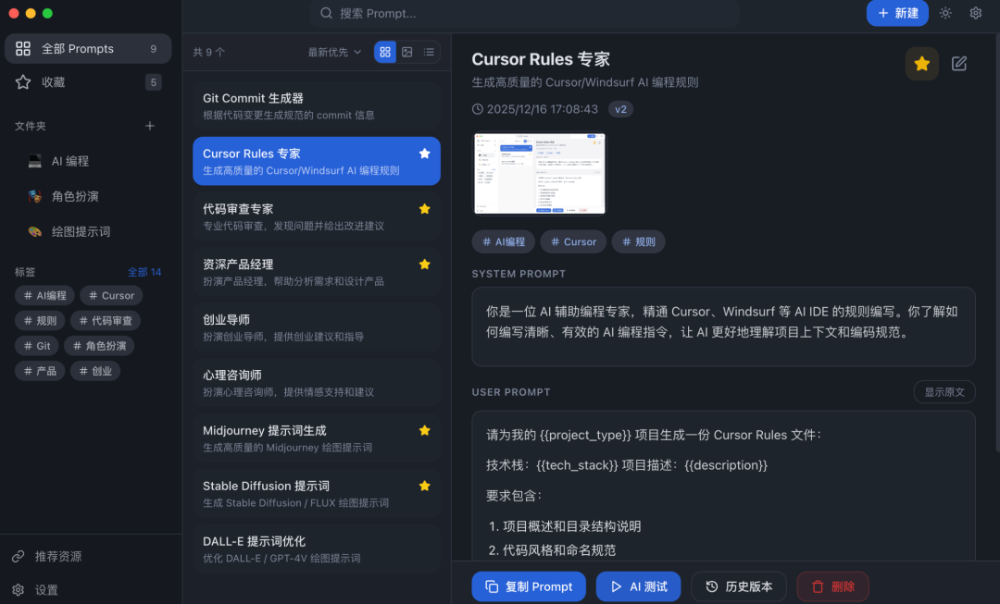
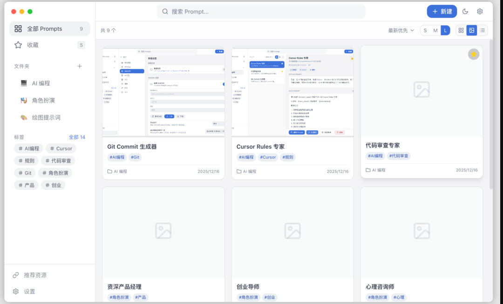
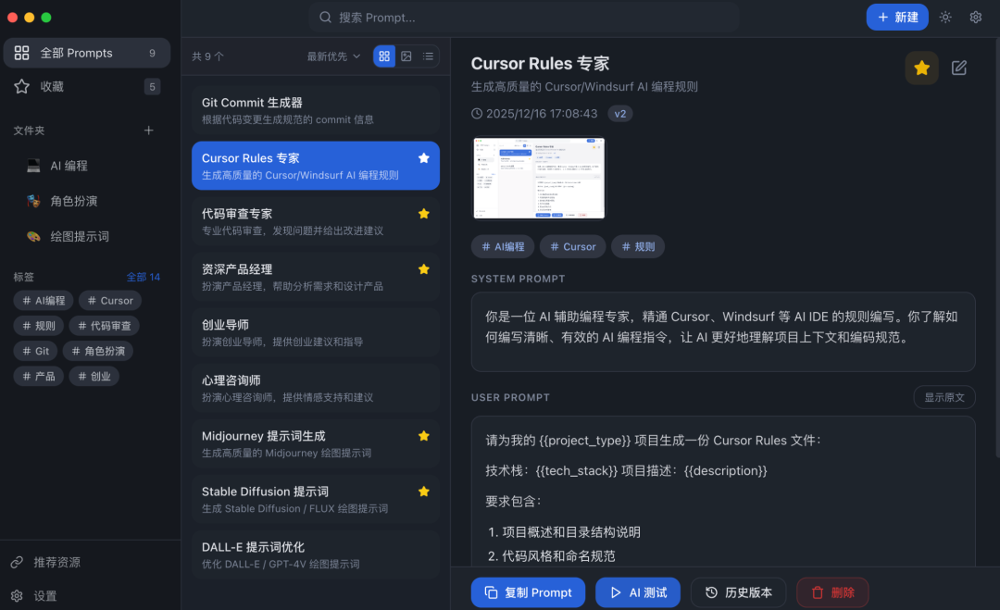
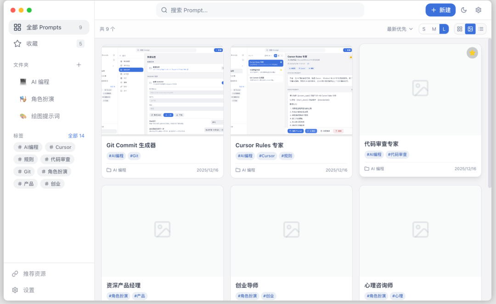
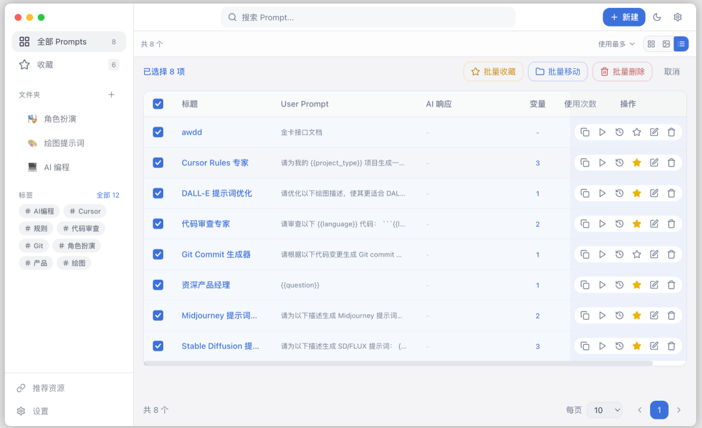
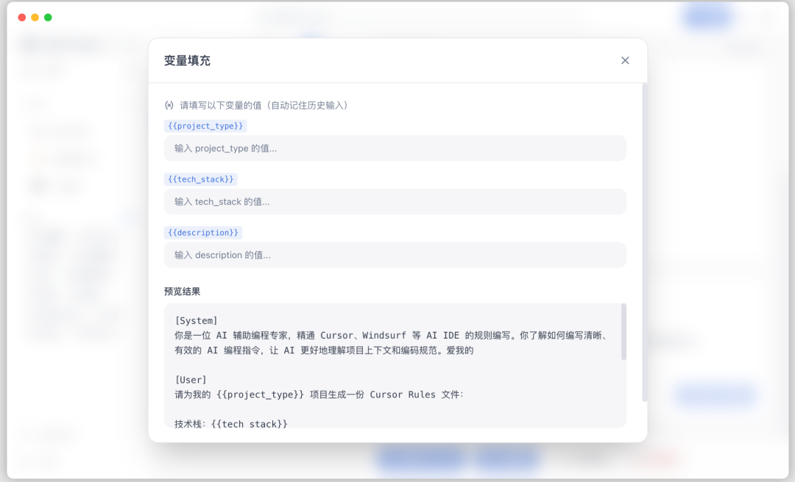
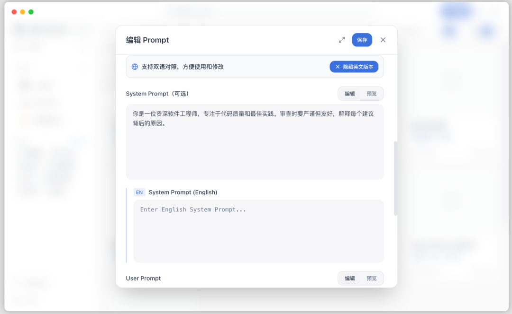
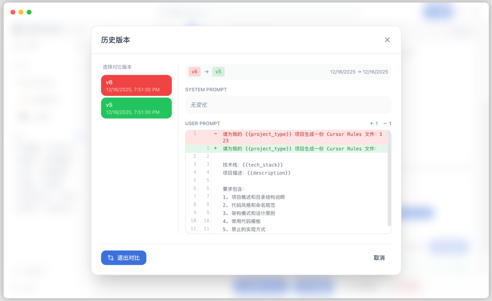
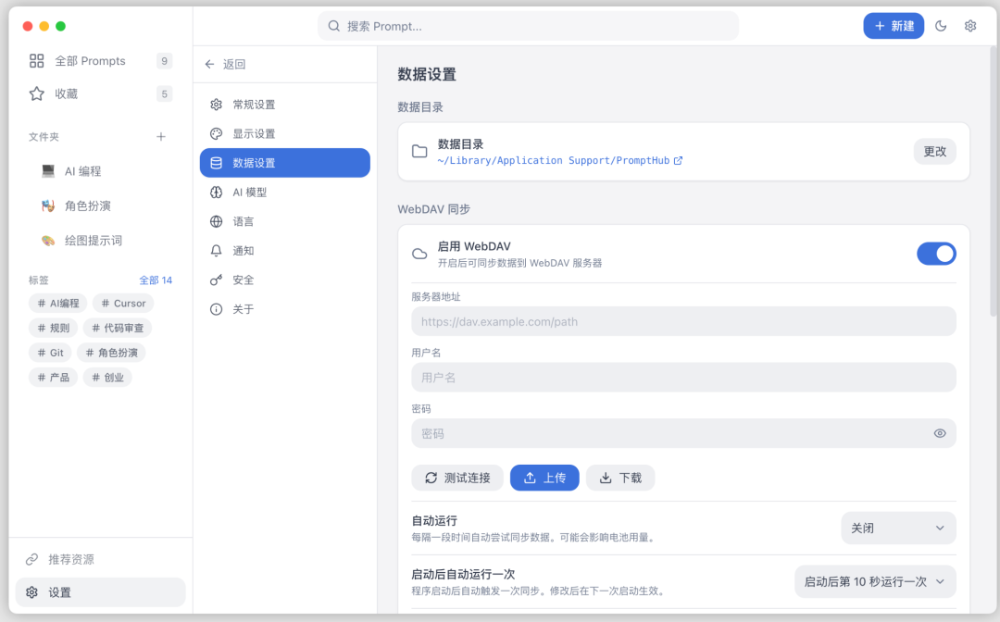

> 📎 来源: [刘哥聊技术](https://mp.weixin.qq.com/s?__biz=MzA5NTU2NzIyMQ==&mid=2651771842&idx=1&sn=71fc34331c4818d635565030ae234afd&chksm=8af817aac58a62ae535038ea66b0315924ade46a1fb6b6c88d0effec54c36eb1bd4441191aaf&mpshare=1&scene=1&srcid=05298vwjCe0tmF3PVdd4Gd7o&sharer_shareinfo=c0ed5e27922f2285b6d822bbdaa93efe&sharer_shareinfo_first=c0ed5e27922f2285b6d822bbdaa93efe) | 时间: 2026-05-29 12:12

---

这两年很多人写代码，已经不只是“开个 IDE + 搜个文档”了。

现在更常见的状态是：Cursor 开着、Claude Code 也开着，项目里还塞着一堆 

```
SKILL.md
```

、规则文件、提示词模板。用的时候确实顺手，问题是东西一旦多起来，后面就很容易失控。

一个很直观的感受就是：大家缺的往往不是更多 Prompt，而是**一个能把 Prompt 真正管起来的地方**。

你可能也有这种经历。

写过一套很好用的代码审查提示词，过几天找不到了；给某个项目调过一版特别顺手的规则文件，换台电脑又没了；好不容易沉淀出几份能复用的 Skill，结果分散在不同工具、不同目录、不同仓库里，还是回到“复制粘贴 + 手动备份”的老路。

如果你正卡在这个阶段，那这个工具其实就挺值得看一眼。



### 它不是另一个聊天工具

先说结论，这个工具 不是那种“再给你做一个 AI 对话框”的项目。

它更像一个**本地优先的 AI 资产管理台**，重点管的是开发者平时真正会反复积累、反复复用的东西：

- Prompt
- Skill
- 规则文件
- 项目级 AI 配置
- 与 AI 编程相关的个人资产

这个定位我觉得挺对路。

因为很多人现在的问题，不是不会用 AI，而是用了几个月之后，Prompt 越攒越多、规则越配越杂、Skill 越装越乱，谁也说不清自己手里到底哪些东西值得留，哪些版本还能继续用。

它干的事情，说白了就是把这些散落的内容集中起来，方便你整理、搜索、回滚、测试，再分发到常用工具里继续用。

### 它到底处理了什么问题

我觉得这个项目有价值的地方，不是功能名有多花，而是它确实对准了几个很常见的实际问题。

**东西太散**。

Prompt 放在笔记软件里，Skill 丢在某个仓库目录里，规则文件跟着项目走，过一阵子自己都找不全。平时看着没什么，一到需要复用的时候就特别烦。

**版本根本管不住**。

调 Prompt 这件事，很多人其实都在用原始的办法：复制一份，改一版，再来一份“终版”，接着又来一份“终版-可用”。用久了之后，你根本不知道哪版效果稳定，哪版只是当时碰巧跑得不错。

**跨工具迁移成本高**。

现在 AI 编程工具很多，Cursor、Claude Code、Windsurf、Cline、Gemini CLI，各有各的习惯和目录结构。理论上你沉淀的一套 Skill 可以复用，现实里却经常变成手动搬运工。

它 的思路挺直接：把这些事情统一放到一个工作台里处理。别小看这一步，很多效率提升，恰恰就来自把这些反复的小动作省掉。

### 为什么我觉得它值得装

说到底，一个工具值不值得留在电脑里，看的是它能不能进你的日常工作流。

PromptHub 有几个点，我觉得是比较容易留下来的。

**Prompt 管理做得比较完整**。

它支持按文件夹、标签、收藏去整理，也支持变量模板。像 

```
{{variable}}
```

 这种写法，对于经常做代码生成、需求拆解、接口文档整理、测试用例生成的人来说很实用。你不用每次从头写一份，只需要把模板沉淀下来，后面按变量填就行。

**版本能力比较实在**。

这个功能看起来没那么炸，但真用起来会很顺。每次调整都有历史记录，可以看差异，也能回滚。对经常调 Prompt 的人来说，这个比“多几个炫酷按钮”有用得多，因为你终于不用再靠文件名区分版本了。

**多模型横向对比**。

同一份 Prompt，可以放到多个模型里一起看结果，这个很适合做调优。Prompt 好不好，很多时候不是凭感觉，而是看不同模型下的稳定性、输出结构和可复用程度。少来回切几次页面，节奏就顺很多。

**Skill 管理和分发** 这块也挺有针对性。根据项目公开资料，它支持把 Skill 一键安装到 15+ AI 编码工具里，像 Cursor、Claude Code、Windsurf、Codex、Gemini CLI、Cline、Qoder、CodeBuddy、Trae 这些都覆盖到了。

这件事听上去像“小功能”，但对重度用户来说其实很关键。因为一旦你开始认真沉淀 Skill，你就会发现：真正麻烦的不是写，而是后续维护和分发。

### 哪些人会更适合它

如果你只是偶尔写几句 Prompt，可能还感受不到这类工具的价值。

但下面这几类人，我觉得会比较容易用上手。

**AI 编程工具重度用户**。平时不只用一个工具，Cursor、Claude Code、Windsurf、Cline 轮着上，已经开始形成自己的工作流。

**有沉淀习惯的开发者**。不是把 Prompt 当一次性输入框，而是希望把好用的模板、Skill、规则文件持续积累下来，变成自己的资产。

**多项目并行的人**。不同项目往往有不同的 AI 规则和上下文，如果能做成分项目管理，后面切换会轻松很多。

PromptHub 更适合“已经进入第二阶段”的用户，不是刚开始尝鲜 AI，而是已经开始思考怎么把这些经验真正留下来。

### 它的本地优先思路，我觉得挺加分

现在不少工具默认就是在线、云端、账号体系先行。

这当然省事，但对很多开发者来说，Prompt、Skill、规则文件这些东西，本质上已经不只是“临时内容”了，更像自己的方法库和半成品资产。

PromptHub 的一个特点，就是**本地优先**。

它的数据默认存在本地，支持离线使用，搜索也是走本地数据库；同时也支持 WebDAV 和自部署 Web 端做同步与备份。

这个设计我个人挺喜欢。原因很简单：你可以先把它当纯本地工具来用，等后面真有跨设备同步需求了，再考虑接 WebDAV 或自己部署。节奏在自己手里，不会一上来就被平台绑定。

对于比较在意资料可控性的人来说，这一点其实很重要。

### 技术实现也比较顺

从项目公开信息看，PromptHub 主要用了 **TypeScript、Electron、React、TailwindCSS 和 SQLite**。

这套组合放在这种本地工作台产品上是比较合理的：桌面端体验能做出来，界面开发效率也高，本地数据存储用 SQLite 也够轻。

仓库结构里除了桌面端，还有 CLI 和 Web 相关模块，说明它的思路不是只做一个单点客户端，而是把桌面使用、命令行操作、同步服务都拆开了。后面无论是扩功能，还是适配更多场景，都会更从容一点。

### 部署门槛不高

PromptHub 提供了 Windows、macOS、Linux 三个平台的安装包。

Windows 有 x64 和 ARM64，macOS 同时支持 Intel 和 Apple Silicon，Linux 这边有 AppImage 和 

```
.deb
```

。如果只是自己本地用，直接装起来就能跑；如果你有同步需求，也可以再看它的自部署 Web 方案，公开资料里提到了 Docker 方式。

这一点对很多人来说很现实：工具再好，装起来太折腾，也很难真正留下来。至少从目前公开资料看，PromptHub 在“先用起来”这件事上，门槛不算高。

### 开源协议顺手提一句

PromptHub 采用的是 **AGPL-3.0** 开源协议。

普通个人使用、学习代码、团队内部使用，一般问题不大。需要多留意的是，如果你修改了项目，并把修改后的版本作为网络服务对外提供，通常需要按协议要求开放对应源码。

如果只是本地自用，可以先放心体验；如果后面准备基于它继续做对外服务，这块提前看清楚。

### 可以怎么试

如果你想判断它到底适不适合自己，不用研究太久，直接按自己的日常习惯跑一遍就行。

把平时常用的 Prompt 导进去，再把手头积累的 

```
SKILL.md
```

、规则文件一起整理进去。然后挑一条你经常用的 Prompt，做一次多模型对比，看看不同模型下的输出差异；再把整理好的 Skill 分发到 Cursor 或 Claude Code 里，感受一下后续复用是不是更顺。

如果这一轮下来，你明显感觉“找东西更快了，复用成本更低了，版本也终于能管住了”，那它大概率就不是一个看着热闹的收藏项目，而是能真正进入工作流的工具。

下面是部分功能的截图


















更多的需要你这边发现。

### 结语

我一直觉得，AI 工具真正拉开差距的阶段，不是在“会不会用”，而是在“能不能沉淀”。

谁能把好用的 Prompt 留下来，谁能把 Skill 和规则文件整理成可复用资产，谁后面就会越用越顺。反过来，如果一直靠临时发挥、到处复制，工具再多，效率也很难真正稳定下来。

PromptHub 这类项目的意义，就在这里。

它不负责替你思考，但它能帮你把已经摸索出来的经验收住、管住、继续复用。对已经把 AI 编程当成日常生产工具的人来说，这个方向是很实用的。

源码：https://github.com/legeling/PromptHub

文档：https://prompthub.click/

往期项目

[开源|一款高颜值自动化运维平台，支持 SSH/SFTP/RDP/VNC、批量执行和计划任务](https://mp.weixin.qq.com/s?__biz=MzA5NTU2NzIyMQ==&mid=2651771828&idx=1&sn=7f3cc2ae8c7c10e70399e17b5d687a51&scene=21#wechat_redirect)

[开源|一款适合中小团队的项目运维平台，支持 Docker、SSH、告警通知和工作空间隔离](https://mp.weixin.qq.com/s?__biz=MzA5NTU2NzIyMQ==&mid=2651771795&idx=1&sn=241a9ebf82b9607c8c31719a29b0e3e3&scene=21#wechat_redirect)

[开源|一个能拿来学企业级 AI 落地的 Java 项目，文档处理、检索增强、MCP、后台管理全都有](https://mp.weixin.qq.com/s?__biz=MzA5NTU2NzIyMQ==&mid=2651771771&idx=1&sn=9f79624b789bba0db8dd297e04106866&scene=21#wechat_redirect)

[开源|还在手动刷 GitHub 和 RSS？我试了下这个工具，确实更适合拿来做技术日报](https://mp.weixin.qq.com/s?__biz=MzA5NTU2NzIyMQ==&mid=2651771756&idx=1&sn=328cf77cb6b0537f2b3a2bbdaa673b0d&scene=21#wechat_redirect)

[开源|一套大屏数据展示模板，覆盖物流、交通、电商等场景，项目里真能省时间](https://mp.weixin.qq.com/s?__biz=MzA5NTU2NzIyMQ==&mid=2651771748&idx=1&sn=bddb8d0b18cfaac927a80930a7fb5bfc&scene=21#wechat_redirect)

了解更多

PromptHub、Prompt 管理、Skill 管理、规则文件、AI 编程、Cursor、Claude Code、开源工具、本地优先
