> 📎 来源: [神器每日推送](https://mp.weixin.qq.com/s?__biz=MzA4OTY3ODQzNw==&mid=2448503353&idx=1&sn=0f7f35d5165761e79c427fe4c7773ef5&chksm=85f1f44e89f09385bf06c4ffa747b7f7db6e272adaef14afa6717b7106cf47682696da1f8f63&mpshare=1&scene=1&srcid=0517R3tyHMviBzIWYUJPpuPe&sharer_shareinfo=9c272b7433319fa4a9d112523f2285cc&sharer_shareinfo_first=9c272b7433319fa4a9d112523f2285cc) | 时间: 2026-05-17 23:49

---

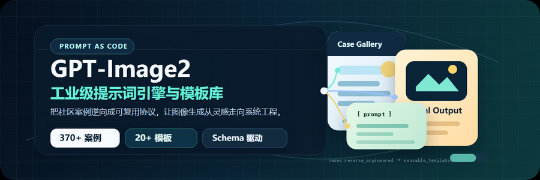

GPT-Image-2 出图最大的问题不是模型不行，是提示词没结构。

同一个需求，你写的散文式描述每次出图风格都飘；别人用结构化协议，一次到位，批次稳定。差距不在"写得好不好"，在"写得对不对"。

GitHub 上有个项目 awesome-gpt-image-2，做的事很直接：370+ 个 GPT-Image-2 爆款案例，按场景逆向拆解，提炼出 16 类场景各自的"必填槽位"——缺哪个槽，就出哪类废图。

这套规律我封装成了 WorkBuddy 里的一个 Skill：**GPT-Image-2 Prompt Forge。**

---

## 出图不稳定，锅在提示词不在模型

两个高频翻车点。

**信息流失。**你说"做一张高级感的电商主图，猫粮，突出冻干"，三个信息点。但缺了材质关键词（磨砂塑料？亮面？）、光线关键词（柔光箱？轮廓光？）、构图角度（3/4 俯视？平视？），模型会自由发挥补全空白，每次补出来的结果都不一样。

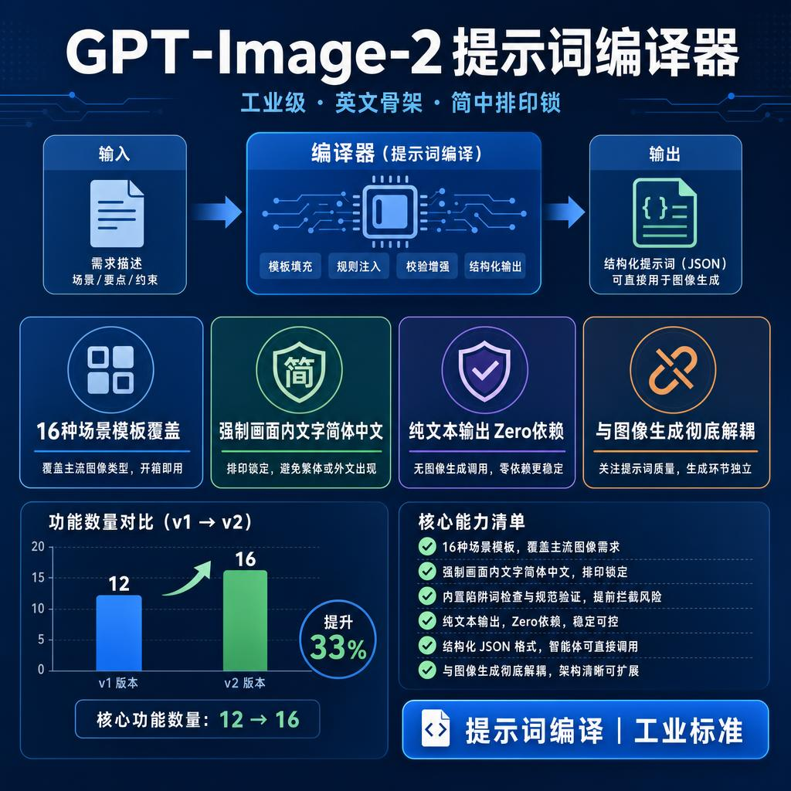

**中文文字渲染。**370 个案例里翻车频率最高的坑。GPT-Image-2 不自动锁定字体和文字语言，你不显式声明，出来的字要么乱码，要么繁体，要么被日文汉字替换。提示词里加一句"所有画面文字用简体中文渲染"就能解决，但大部分人不知道要写这句。

---

## 把提示词从散文变成协议

三步。

**场景路由。**16 种场景各走各的模板——海报、电商主图、UI 截图、品牌视觉、摄影、插画、角色设定、叙事场景、历史东方、建筑渲染、信息图、社论排版，加上运动海报、苹果风格自然海报、角色动作表、通用兜底。你描述需求，Forge 自己判断该走哪条路。

**槽位填充。**每个场景有必填项，像填表一样逐项确认。电商主图必须填材质+光线，缺了就是贴图质感或白底抠图；海报必须把标题和副标题逐字写进提示词，不写，模型会自己编文案。缺什么槽，Forge 会自动补默认值，或者提醒你填。

**Pitfall Lint 检查。**输出前跑一遍规则，逐条报 PASS 或 WARN。电商图缺材质？`[WARN] ECOM-004。`海报没硬编码标题？`[WARN] POSTER-002。`告诉你哪里有问题，怎么补。

每次输出三份东西：一份可以直接用的英文提示词，一份 JSON 格式（方便接自动化），还有一份风格不同的备选方案。

---

## 装好Skill，说一句话就能出图

装好这个 Skill（技能名：`gpt-image-2-prompt-forge-en`）之后，直接用就行。

**触发。**在 WorkBuddy 对话框里说你的需求：

> 根据文章内容，帮我设计一张微信公众号16：9封面

如果生成的图像规格不满意，你可以切换到图像编辑模式下扩展：

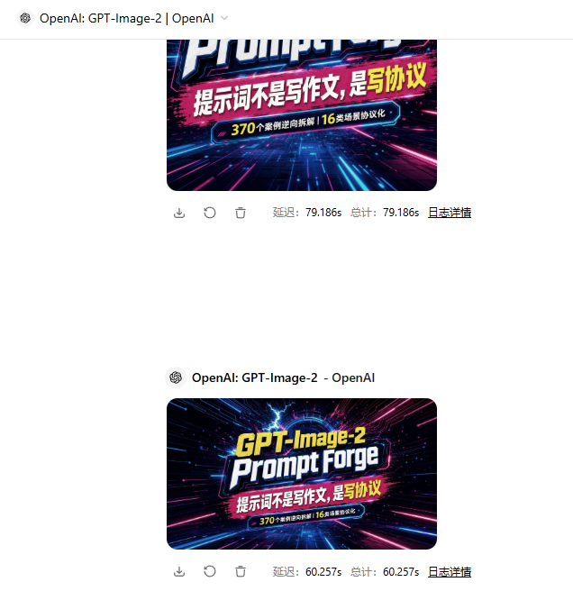

或者可以让它直接生成html信息图，注意：它的用途是用来生成gpt-image-2文生图描述词，不是用于设计html。

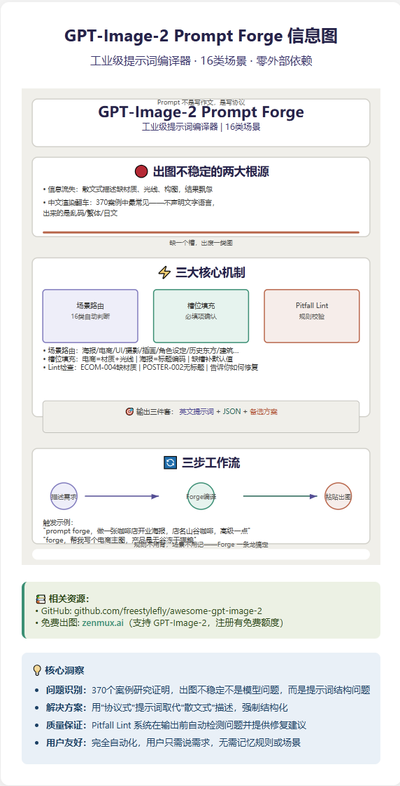

以下是banana生成的信息图：

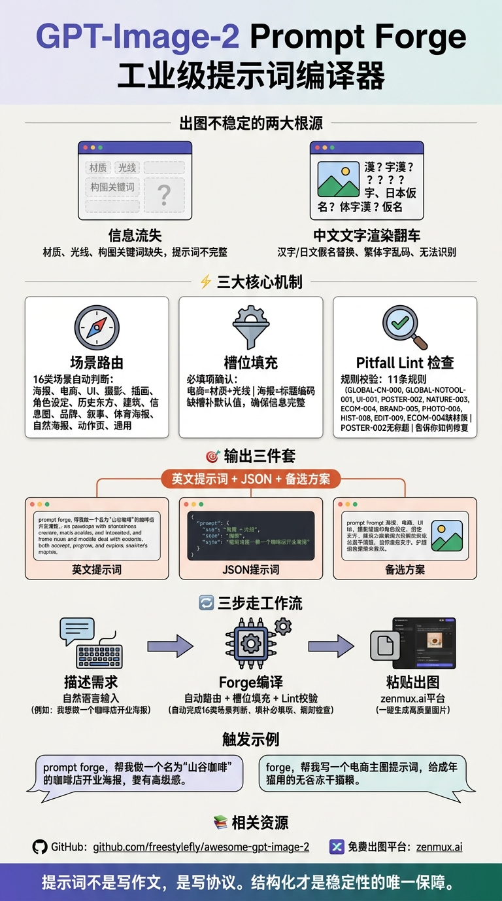

其它gpt-image-2出图效果：

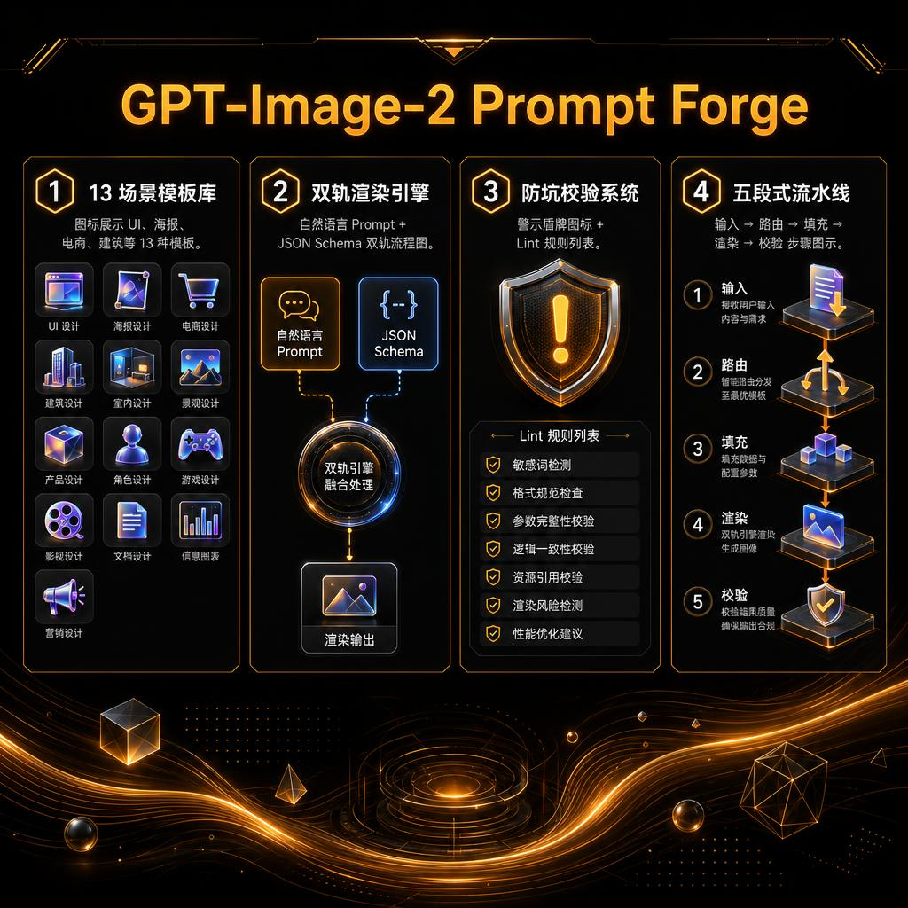

以下是简版效果

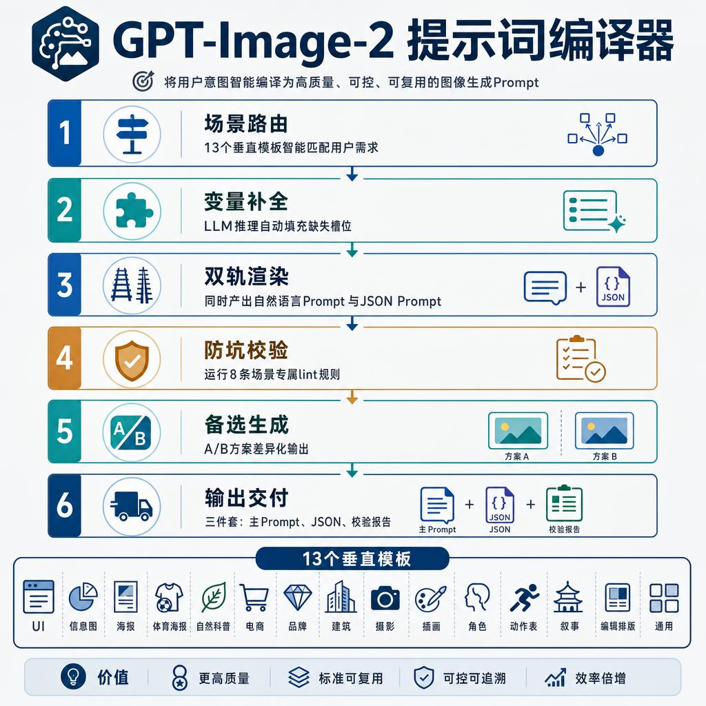

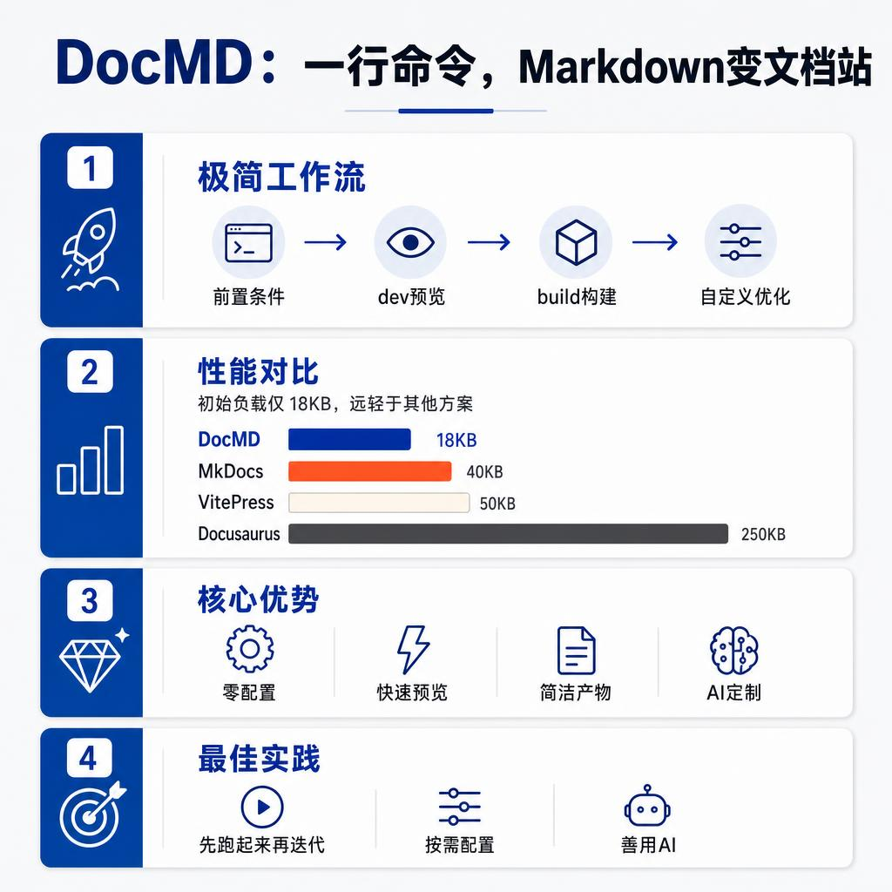

还有一些实测图

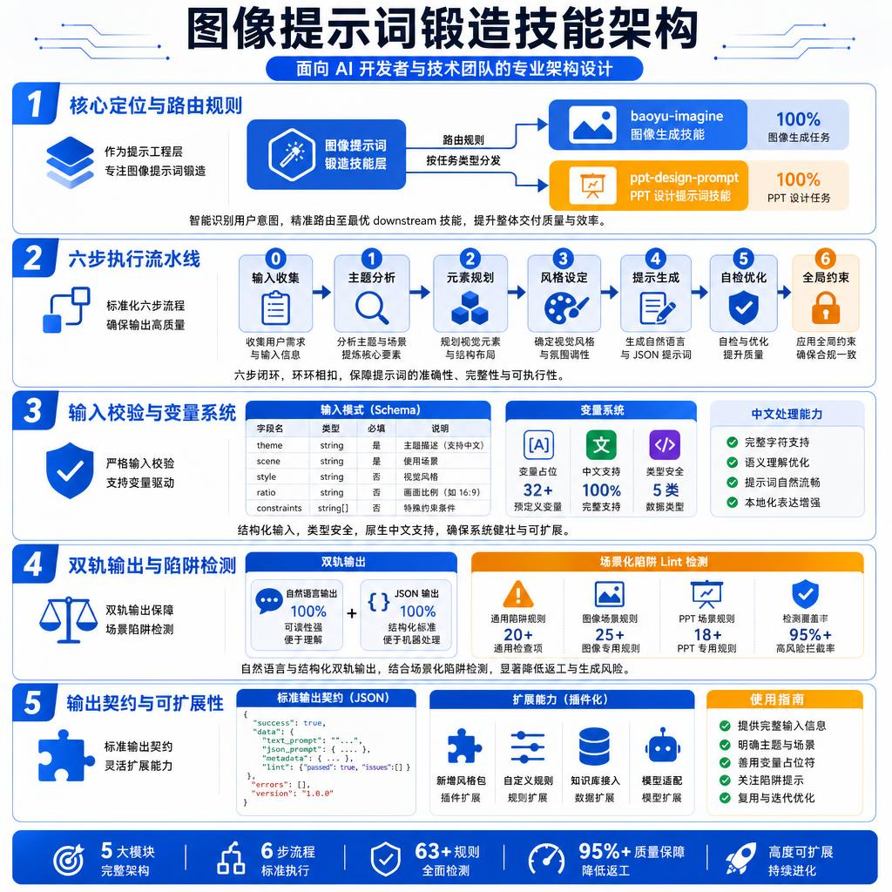

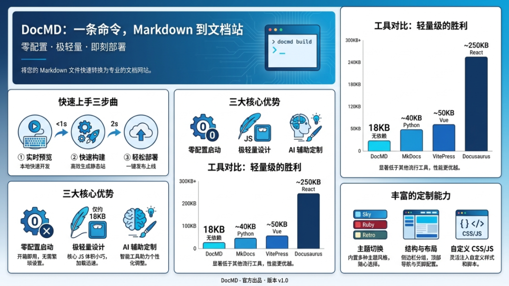

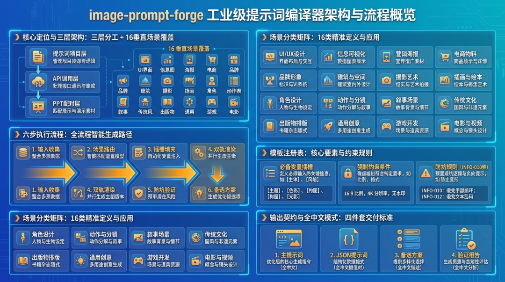

Forge 会自动激活，场景路由、槽位推断、Lint 检查一条龙走完，输出完整英文提示词。规则不用背，场景不用记，TYPOGRAPHY LOCK 不用手写。

**出图。**拿着英文提示词，打开 zenmux.ai，注册有免费额度，选 GPT-Image-2 模型，把 Forge 输出的 Primary Prompt 粘贴进去，直接出图。

三步走完：**描述需求 → Forge 编译 → 粘贴出图。**

---

项目开源：

github.com/freestylefly/awesome-gpt-image-2

免费出图：

zenmux.ai，支持 GPT-Image-2，注册有免费额度

提示词不是写作文，是写协议。

我练好的skill：

https://pan.quark.cn/s/f37b6600e247
