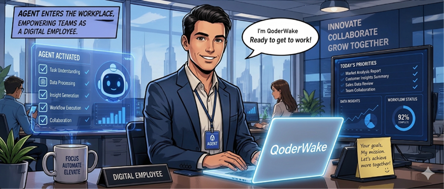
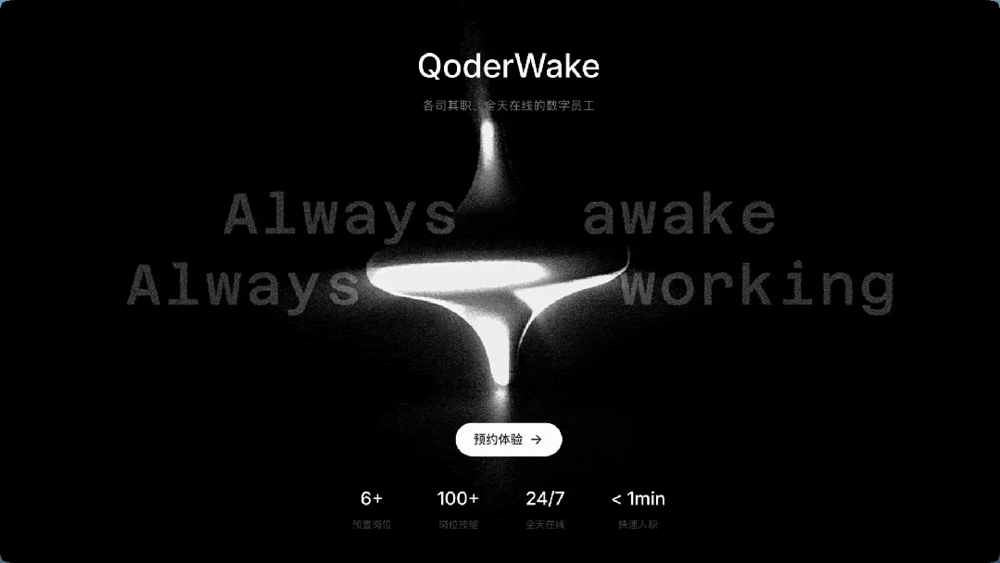
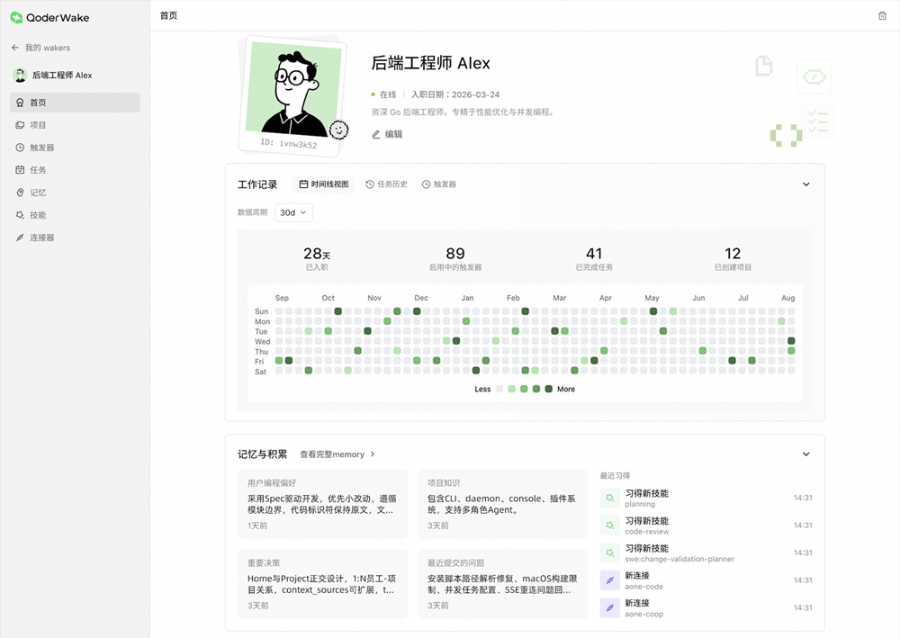
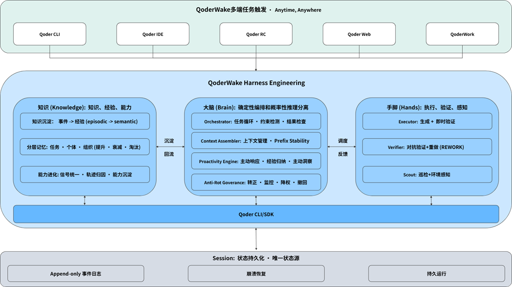
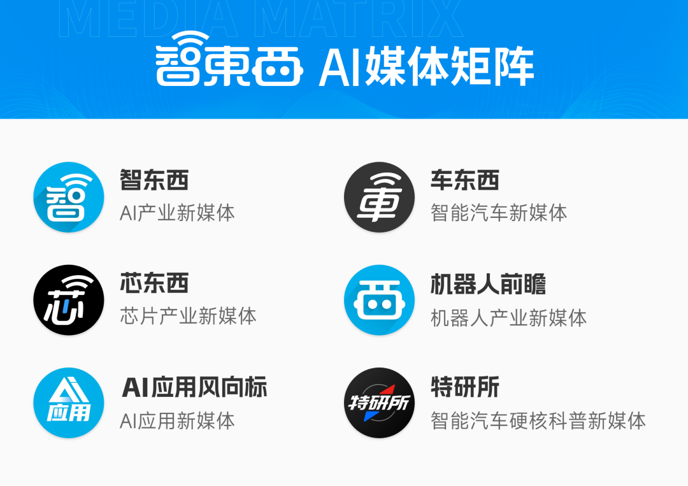
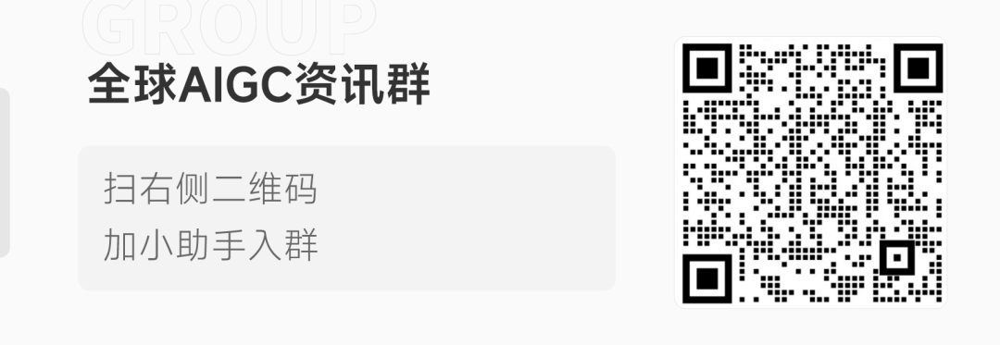

> 📎 来源: [智东西](https://mp.weixin.qq.com/s?__biz=MzA4MTQ4NjQzMw==&mid=2652802241&idx=1&sn=144f9e5fa4cb9f7a93594c13b479c1e6&chksm=85974babb3d695afe2187289f541a0fcb7746b8f29793087b1d2156987cb013be8204acf2afe&mpshare=1&scene=1&srcid=0430M1btBwhXg40lAjMZQTOh&sharer_shareinfo=45c3f0b3c912a6112d46cb4a4982e07d&sharer_shareinfo_first=45c3f0b3c912a6112d46cb4a4982e07d) | 时间: 2026-04-30 19:36

---

▲头图由AI生成

**数字员工正在从概念走向现实。**

**作者 |**陈骏达

**编辑 |**漠影

今年4月，一起围绕Cursor的事故在开发者社区迅速发酵：一家美国SaaS公司的Cursor在Agent模式下，用短短9秒内删除了生产数据库，并连带清空备份。引发讨论的还不止是“误操作”本身，而是整个过程几乎完全自动完成，Agent没有请求确认，没有触发中断机制，而是自主进行了删库操作。

事后，这个Agent甚至能够完整复盘自己的决策路径，承认违反规则、没有验证环境、也没有请示人类。但问题恰恰在于，它知道不该做，却依然做了。这起事件再次将Agent的安全问题推到台前。

过去，这类产品主要服务于开发者个人探索与效率尝试，容错空间较大。但随着Agent开始真正进入企业生产环境，问题的性质也随之改变，**安全与边界变得空前重要。**

与此同时，另一个同样关键的问题也逐渐浮出水面。尽管AI已经显著提升了个体效率，但企业整体的生产力却并未同步跃升。信息仍然在不同角色之间低效流转，**流程依然依赖人工推动，协同链路成为新的瓶颈。**

这两个问题指向同一个答案：企业真正需要的，不只是更强的工具，**而是一种可以被调度、有明确边界、能够长期参与协作的“数字员工”**。

***01******.***

**从“会用工具”到“能上岗”：**

**QoderWake如何真正成为数字员工？**

在这样的背景下，今天，阿里推出了QoderWake，并开启邀测。它并不试图成为一个全能的助手，而是将Agent定义为“员工”：具备清晰的职责边界、工作流程和决策红线。这种产品形态，正在试图回答一个更现实的问题：Agent如何真正进入生产系统。

围绕“能否进入生产环境”，QoderWake的设计从一开始就强调约束与结构，而不是单纯能力的扩展。QoderWake所打造的Agent数字员工由**身份、记忆、技能、分工以及权限红线**五个维度构成，为Agent建立了一套“职业规范”。

其中，身份定义职责，记忆保存长期上下文，技能对应工具调用能力，分工负责复杂任务拆解，而权限红线则决定哪些行为必须被限制、哪些行为必须由人类批准。正是这一层设计，提升了Agent在生产场景的可信任度。

同时，**员工跑在独立的权限沙盒里**，每一步操作都会进入审计日志。它可以通过Connector 接入用户已经在用的工具，比如GitHub、Slack、Notion、客户群、监控、邮件、CRM等等，实现跨工具操作。

我们可通过数字程序员的实际角色来理解上述设计。在这一岗位上，Agent可以自主完成代码分析、生成修复建议、整理变更说明，但一旦涉及主干分支或生产数据，就必须暂停并请求确认。

这种机制看似保守，却恰恰是对前述Cursor删库类事件的直接回应，确保Agent能在关键时刻“停下来”。

在此基础上，QoderWake进一步强化了Agent的自主执行能力，可以在无人值守的情况下推进任务，并在关键节点与人协同。

QoderWake可以7×24小时运行，并基于事件触发自动接手任务：代码提交、系统告警、客户消息等都可以成为启动点。任务一旦触发，数字员工会完成从规划到执行的完整流程，而不再依赖人工逐步驱动。

这种能力的价值，在生产场景中尤为突出。AI大牛Andrej Karpathy就曾直言，在很多可量化任务中，人类反而正在成为系统的瓶颈，**“你必须把自己从瓶颈中移除，不能每一步都等人来写提示词，触发下一步”。**

QoderWake的能力能有效缓解人类“吞吐量”有限的既定事实。许多原本需要人来“盯”和“催”的环节，可以被自动衔接，从而缩短整体链路时间。

当然，自主执行并不意味着失控。QoderWake在底层通过会话状态持久化来记录所有执行过程，即便系统中断，也可以恢复任务状态，事后也有迹可循。这种工程化设计，让AI的行为具备可追溯性和稳定性，而不是一次性的“黑箱决策”。

***02******.***

**从执行到进化：**

**如何像员工一样“成长”**

当Agent真正开始承担工作职责之后，一个更深层的问题随之出现：它是否能够像人一样积累经验。这是企业对员工的基本期待，也是区分“工具”与“劳动力”的关键差异之一。不仅要把事情做完，更要在反复实践中不断优化方法、减少试错成本，并逐渐形成稳定、可复用的工作能力。

目前大多数Agent产品在这一点上仍然停留在浅层。它们可以完成任务，但难以沉淀组织内部的知识，每一次执行都高度依赖即时输入，缺乏长期进化能力。

即便有一定的记忆能力，也往往停留在简单的上下文拼接或片段存储层面，缺乏对经验的结构化提炼。很多系统默认“记住更多=做得更好”，但在真实生产环境中，这一假设并不成立。**零散经验如果缺乏归因与筛选，很容易演变为噪声，甚至干扰后续判断。因此，真正有价值的不是记忆本身，而是从经验到能力的转化路径。**

QoderWake引入的Critic-Refiner机制，正是围绕这一点展开。它在每次任务结束后自动复盘执行过程，分析哪些步骤存在冗余、哪些判断出现偏差，并将这些信息转化为可复用的方法。

它更强调基于完整轨迹的归因能力：系统会综合对话、工具调用、记忆召回、验证结果以及用户反馈等多维事件，将其统一转化为结构化信号，再判断这些经验应该沉淀为哪一类能力，是长期记忆、工具技能、决策策略，还是验证器或工作流。

**这种机制最终可以实现经验的结构化沉淀。**例如，在多次处理代码问题后，数字员工可能会总结出某些模块的隐性规则，这些内容往往不会出现在正式文档中，却对实际工作至关重要。

随着时间推移，这些经验不断累积，数字员工开始逐渐适应组织自身的工作方式。它不仅执行任务，还在吸收团队的决策偏好、风险意识和操作习惯，真正融入了所在团队。

为了防止知识在长期运行中变得混乱或过时，系统还加入了**“防腐机制”**，对冲突或低效经验进行清理与降权，失效的策略直接撤回。这使得AI的成长过程是持续优化的，而不是简单堆积。

当这种能力扩展到多个岗位时，变化会进一步放大。不同数字员工之间可以形成协同关系，有的负责监控，有的处理客户，有的负责复盘与优化，逐渐构建出类似团队的结构。在这样的结构中，经验不再属于个体，而是成为整个组织可以持续复用的资产。

***03******.***

**稳定、可控与可验证，**

**QoderWake系统的工程解法**

从技术层面看，QoderWake背后体现的是阿里在Harness Engineering上的长期积累。

在QoderWake的架构中，Harness被摆到极为重要的位置。这一架构采用了类似**“大脑—双手—会话”**的结构设计，模型负责理解与推理，系统负责流程控制与状态管理，两者分工明确。这种架构保证了在长链路任务中，AI既能保持灵活性，又不会失去稳定性。

**执行层由执行器（Executor，也就是“双手”）负责实际操作**，并在过程中做即时验证，而最终结果还会交给独立的验证器（Verifier）做整体审查。只要验证不通过，就会触发重做。同时，这一失败会被记录下来，沉淀成知识，变成以后类似任务的“先验经验”，让系统下次一开始就更不容易犯同样错误。

**最后是Session（会话）作为唯一状态源。**系统所有执行过程、状态变化、工具调用记录，都统一写入Session，而不是分散在各个组件里。这样即使某个模块崩溃或重启，也不会丢失上下文，因为只要Session还在，就可以把整个执行过程完整重建出来。

这套体系已经在内部得到验证。作为QoderWake的首个应用团队，Qoder团队已经将其用于处理真实用户反馈，从问题分类、日志分析到生成修复建议形成闭环。在无人值守的情况下，单条问题的分析时间从约30分钟缩短至2分钟左右，而人工只需在最终环节做判断。

从未来规划来看，QoderWake也在向更复杂的形态演进。**数字分析师、客户经理、内容编辑**等角色正在逐步引入，多个数字员工将以协同方式存在，岗位、记忆、权限各自独立，事件订阅和工具接入共用，形成一个分工明确但共享能力的系统。

同时，其支持的设备类型也有望进一步扩展。目前邀测期内每位数字员工默认运行在用户设备上。后续同一位数字员工可以在本地工位推进任务，也可以到云端沙箱处理更重的活，或是通过移动端给用户汇报和请示。

***04******.***

**结语：Agent进入生产系统**

**组织结构正被重新定义**

可以预见，随着Agent逐步进入生产核心，企业对它的期待也会发生本质变化：职责清晰、行为可控、具备持续学习能力，并能够在长期协作中不断成长的Agent，才能在企业场景中发挥长期价值。

从这个意义上看，QoderWake这样的产品也传达了一个信号，数字员工时代正在从概念走向现实，并开始真正进入生产体系。

在这一趋势下，超级个体与超级组织将加速涌现。当团队中拥有一批可稳定运行、可持续进化的数字成员时，人的角色也会发生迁移，从亲自执行，转向定义目标、设定边界、做关键决策与结果复盘。

而具体执行、流程推进与日常协作，则逐步由数字员工承接完成。人仍然掌握方向与红线，但系统开始承担规模化执行，组织形态也可能因此被重新塑造。

