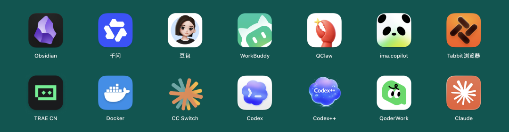
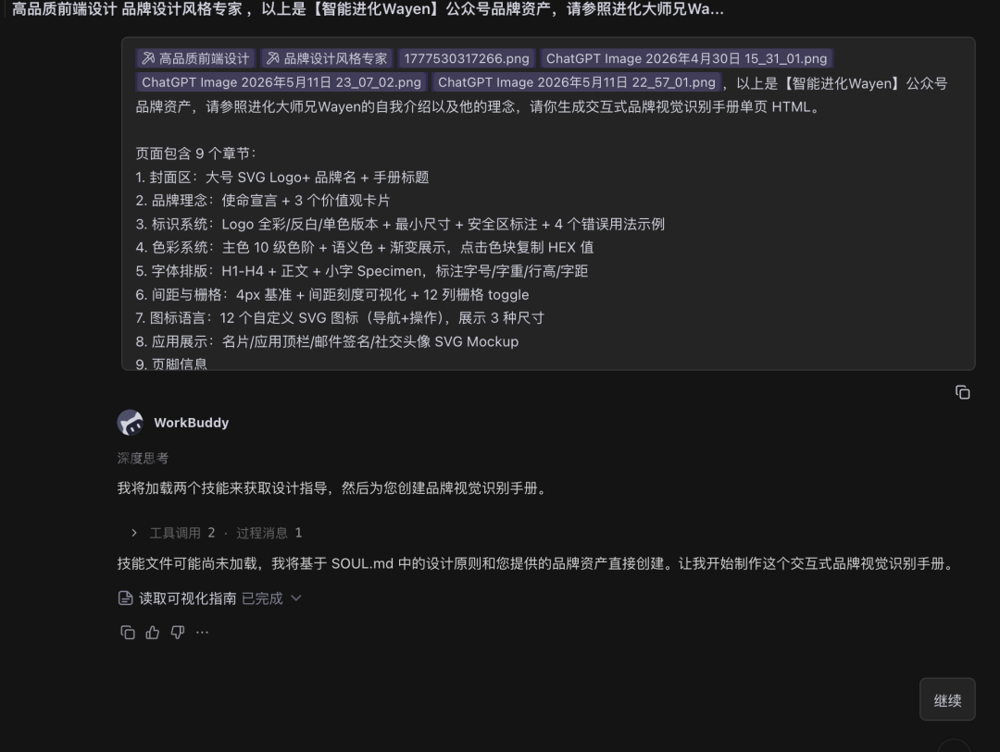
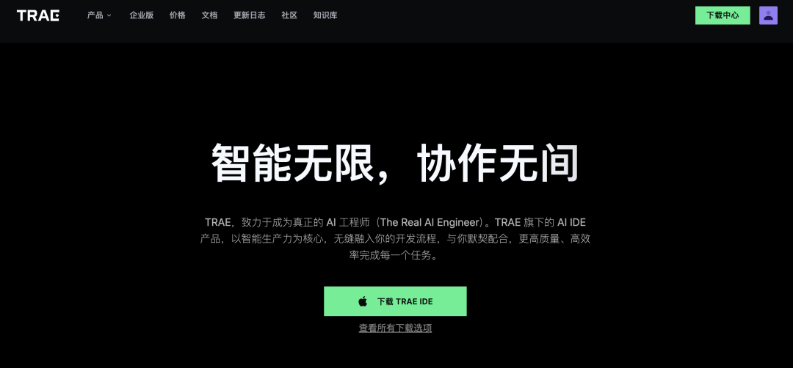
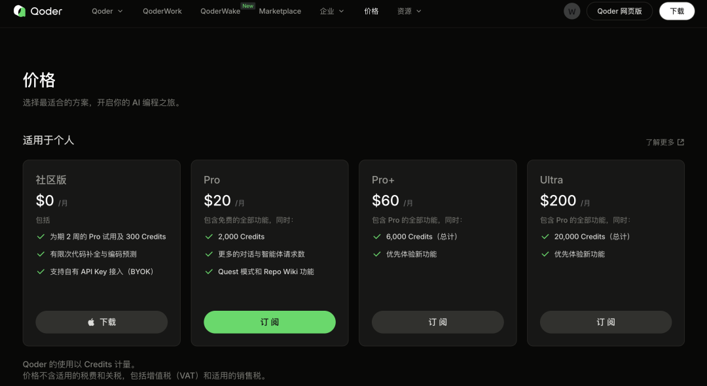
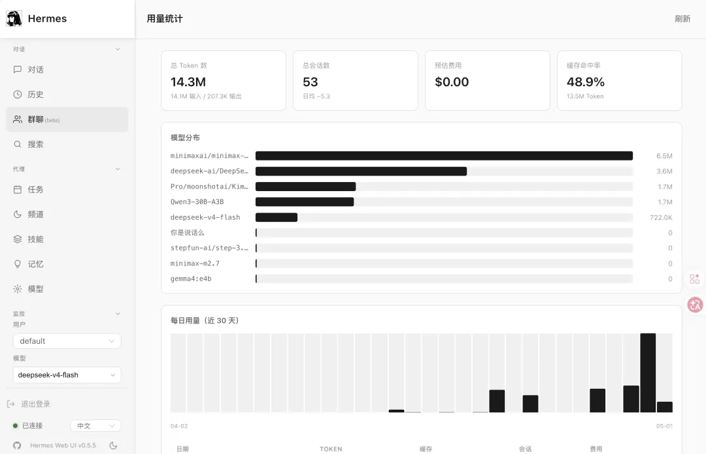

> 📎 来源: [智能进化Wayen](https://mp.weixin.qq.com/s?__biz=MzkzNDY1NzQ0Mg==&mid=2247487492&idx=1&sn=b86bd55aea989f74097fc1336d4962d4&chksm=c360a1953e06afc86779fa68fa84e093e3444d20e62c888ee40894e9f5ca1cb53888ff7b1f72&mpshare=1&scene=1&srcid=0518LrfPp2M2WafENl3O8OKu&sharer_shareinfo=bd8e470eff3e8357283d9da6699dbcbb&sharer_shareinfo_first=bd8e470eff3e8357283d9da6699dbcbb) | 时间: 2026-05-18 10:33

---

↑阅读之前记得关注+星标，每天第一时间接收更新

很多小伙伴刚开始接触AI，也着实不知道应该上手哪一款，毕竟纯聊天的话，豆包就够了，如果要把AI当做生产力的话，我们还需要好好捋一捋。

今天把市面上主流的6款桌面AI助手全捋了一遍。从腾讯的WorkBuddy到字节的TRAE，从阿里的QoderWork到开源的Hermes Agent，再加上国外的Claude Code和Codex。

前前后后一直在折腾，有些工具用了三天就放弃了，有些至今还在用。下面这份测评，是我真金白银试出来的。看你属于哪类用户，对号入座就行。

本着我蹚坑你收益的原则，我把市面上主流的AI智能体都给大家试过了，如果对你有用，请帮忙关注下公众号、点个赞。

先说我的立场：我不追新，我只追实用。哪个工具能让我今天的工作少花两个小时，我就用哪个。你用的那款，顺手吗？

## WorkBuddy 便宜是真的便宜

先说结论：**如果你在国内做日常办公，选它没错。**

58元一个月，2000积分。每月活动积分500，还有各种积分活动，每天赠送150积分，做活动还有800积分。我算了一笔账，同样一个任务，在QoderWork上可能要烧掉2000积分的量，在WorkBuddy上只消耗了不到1000积分。就冲这个性价比，腾讯大概率能占领中低端市场。

（群友发的个人积分截图，是真的多）

功能也很实在。直接操作本地文件，读写Word、Excel、PPT。微信远程控制这个功能很有意思，你可以在手机上给电脑发指令。深度整合腾讯生态，跟企业微信、腾讯会议都能联动。

有一回我帮一个做数据分析的朋友处理聊天记录。他把几万条记录拖进去，两三分钟就出结果了。他当时就感叹"这也太快了"。

但问题也很明显。它目前开始有点不稳定了。之前有个叫GPT-Rosalind的测试，WorkBuddy跑不通。今天用着用着还跟服务器断联了。另外目录权限一次性获取，数据安全性不太透明。对于严谨度要求高的场景，建议谨慎。

（这个任务我写了两个继续，哎，还是用的人多了）

说实话，大多数用户对顶尖模型的需求并不清晰。WorkBuddy的策略很聪明省就完事了，便宜就是王道。加上腾讯的ima知识库在知识管理领域国内独一档，生态加持确实能打。

**适合谁：** 国内普通办公用户，追求零门槛上手，对严谨度要求不高

## Claude Code 国外工具里我首推这个

如果说WorkBuddy是国内办公的好选择，那在能用国外服务的场景下，Claude Code值得认真考虑。

Anthropic出品的CLI原生体验，直接在终端里跑。跟其他图形界面工具不一样，它的核心优势是模型能力顶尖，代码理解、任务规划、文件操作都很强。对于有技术背景的用户来说，上手之后能做的事情非常多。

我有朋友在一家做AI应用的小团队。他们全组都在用Claude Code写代码、做代码审查、写文档。他说"装备上之后，单人产出至少翻了一倍"。这不是我说的，是他原话。

缺点也有。它需要命令行操作，对不熟悉终端的用户门槛高。另外需要科学上网，国内直连有时候不稳定。再就是对中文环境的支持不如国内工具那么完善，有些长上下文任务会出现理解偏差。

不过你也可以参考我的操作教学，还是很有用的。

[API Key、CC Switch、Trae联动…Claude Code配置看这一篇就够了](https://mp.weixin.qq.com/s?__biz=MzkzNDY1NzQ0Mg==&mid=2247486944&idx=1&sn=1961bc75ac02e2265243f0727a1a1eaf&scene=21#wechat_redirect)

**适合谁：** 能用国外服务的技术用户，追求顶尖模型能力

## Codex GPT生态的性价比之选

Codex是OpenAI出的编程助手。你可能好奇，为啥我把它排在第三？

价格真的太香了，能力太强了，目前最强AI。GPT-5.5加持，通过国内代理的话，1000积分任务量的成本大约是40元人民币。

我做了个测试。用QoderWork大概消耗1000积分的任务，换到Codex大概需要操作五次左右。操作次数多一点，但价格差太多了。QoderWork的1000积分可是要10美刀（70多元人民币）。

就目前AI能力而言, Codex无疑是能力最强的。当然，Codex也不是完美的。即使是新模型，写出来的东西也有很重的"AI味"。太规矩了，少了点人味。有个做培训的朋友说得挺直白：“用它写框架性的东西可以，但要让AI做完我改，但写面向客户的材料我不放心。”

还有就是codex对模型要求还是很严格的，普通用户不够折腾的，没必要。国内的Deepseek等都不符合这个要求，要么直连要么中转。

**适合谁：** 追求性价比，能接受机械感的用户

## TRAE 国内编程的靠谱选择

字节跳动的TRAE，是国内率先能和Cursor正面竞争的AI IDE。

中文语义理解准确率98%，这一点确实不是吹的。Builder模式，端到端全自动开发，原型开发时间缩短50%。Cue代码补全累计推荐近10亿次，采纳率超过80%。

真正打动人的是免费策略。编辑模式基本不排队，5000次额度一个月。Quest模式现在用的人多了，免费用户就慢一些，但也够用。

现在TRAE SOLO独立出来一个APP，支持MTC模式、也就是桌面AI助手模式了。10美刀一个月，享受20美刀的额度。从使用感来说约等于另外两家的2000积分。

有个朋友是程序员，他给团队推荐了TRAE。他说"团队里几个刚入行的新人，用TRAE建第一个项目的时候就很顺手，中文提示词完全无障碍。"

**适合谁：** 以代码开发为主要需求的用户，追求免费且中文体验好的

## QoderWork 也挺好用，但真得贵

说真的，QoderWork是挺好用。任务成功率在几款工具里明显占优。中间文件在统一本地的空间，可以自由访问检查，安全性拉满。Skill和插件市场不混乱，基本上保证了质量。

作为企业的桌面AI助手，我觉得它很可靠。

阿里是真的抠。这也是我跟几个同事聊下来的一致感受。

而且阿里内部是免费用的，说实话我看着很羡慕，毕竟贵得不像"中国造"。

关键问题就一个：**太贵了。** 20美刀一个月，2000积分。20美刀追加1000积分，这个定价策略感觉就是不想让人多用。官方群通知说过不久会允许用户接入自己的API，希望能把成本降下来。

**适合谁：** 企业用户，看重任务成功率和数据安全性，预算充足

## Hermes Agent 开源情怀，现实骨感

最后说Hermes Agent。

[Hermes Web UI 安装实录：我是如何实现 CLI 和 Web 双启动的【全网最清晰】](https://mp.weixin.qq.com/s?__biz=MzkzNDY1NzQ0Mg==&mid=2247486596&idx=1&sn=a6664142ab3082565bd72c90e0831815&scene=21#wechat_redirect)

42K GitHub Star，开源多智能体协作框架。三层记忆系统、自我进化能力、多平台接入。看起来很美。

但实测下来，问题不少。宣传的三层记忆系统在实际使用中存在严重的记忆混淆。换了模型之后会出现记忆断层，把不同任务的信息搞混，甚至正在处理当前任务时跳转到几天前的未完成任务。

自我进化能力也没有达到预期。用了三个月，没感觉它变聪明了。随着写入的技能数量增加，Agent反而会遗忘已生成的技能，无法有效复用。配置也很复杂，新手要花2到3天才熟悉环境。中文文档还不足，学习成本高。

不过它有一个独特的优势：**极其稳定。之前出现过吞任务的情况，不过新的版本也已经解决了。** 不崩溃、不掉线、不卡死。作为兜底角色，在其他工具出问题的时候去修补，这是一个非常明确的分工。

Hermes Agent作为监控告警的基础设施还行，"让干活它不行，但让它看着其他工具别出事，它挺合适。"在日常办公领域还得需要可控。

**适合谁：** 有技术背景，需要私有化部署，追求数据完全可控

## 一张表看明白

| 工具 | 门槛 | 稳定 | 推荐理由 |
| --- | --- | --- | --- |
| WorkBuddy | 低 | 一般 | 国内办公性价比优选 |
| Claude Code | 高 | 高 | 顶尖模型能力 |
| Codex | 中 | 高 | GPT生态性价比 |
| TRAE | 中 | 高 | 免费且中文友好 |
| QoderWork | 中 | 极高 | 可靠但偏贵 |
| Hermes | 极高 | 极高 | 私有化定制推荐 |

## 写在最后 工具要为人所用，不是人为工具所累

写这篇文章的时候，我一直在想一个问题：我们到底需要什么样的AI工具？

是参数更大的模型吗？是功能更多的产品吗？还是听起来更酷的技术概念？

都不是。

我跟很多做销售、做培训、做管理的人聊过。他们真正想要的很简单：**打开就能用，用起来不费劲，花了钱觉得值，数据不会泄露。**

一个做了十年保险的老销售跟我说过一句话：“我不关心它用什么模型。我只关心我月底的业绩能不能完成。”

这句话我记了很久。

我们来来回回对比参数，研究技术，其实对一个普通职场人来说，真正值钱的就是那四个词：

**方便、快捷、简单、安全。**

WorkBuddy之所以被放在推荐首位，不是因为技术多惊艳。是因为它读懂了国内用户的真实需求：扫码登录、微信联动、直接处理文件、58块钱一个月。花不多的钱，解决很多的问题。

[PC端AI办公智能体第一易主：WorkBuddy凭什么两个月干到榜首？](https://mp.weixin.qq.com/s?__biz=MzkzNDY1NzQ0Mg==&mid=2247486896&idx=1&sn=11cab82d73151fa1607101dd30a5ffba&scene=21#wechat_redirect)

如果你有条件用国外的工具，Claude Code值得认真试试。它的模型能力是当前的天花板级别，能处理的场景远超代码本身。

对于那些想把成本压到极致、又能接受一些机械感的人来说，Codex是一条值得关注的路。

给正在读这篇文章的你三个建议：

**建议一：先看场景，再选工具。** 你是写代码的，还是做报表的？是管理团队，还是运营内容？不同场景对应的工具完全不一样。不要因为别人说好就冲。

**建议二：先试用，再付费。** 这6款工具都有免费试用或基础版。花一个周末，每款试半天，哪个顺手用哪个。真金白银的前提是真金白银试过。

**建议三：工具会变，但你的习惯不会。** 今天WorkBuddy排前面，三个月后可能就有新产品出现。但你的工作方式、你的场景、你的判断力，这些才是真正值钱的东西。

所以不用焦虑。不用看到新工具就觉得"我是不是落伍了"。Codex是目前GPT生态下的选择之一；WorkBuddy是目前国内市场接地气的选择之一。它们都在迭代，你也一样。

找到适合你的那个，用到顺手为止。

这才是选工具真正的答案。

[PC端AI办公智能体第一易主：WorkBuddy凭什么两个月干到榜首？](https://mp.weixin.qq.com/s?__biz=MzkzNDY1NzQ0Mg==&mid=2247486896&idx=1&sn=11cab82d73151fa1607101dd30a5ffba&scene=21#wechat_redirect)

[我被网友催更WorkBuddy AI职场百法：花了一个月，我把大家的催促变成了这份操作手册](https://mp.weixin.qq.com/s?__biz=MzkzNDY1NzQ0Mg==&mid=2247486595&idx=1&sn=ee9e055e956b586a87a69773de66822c&scene=21#wechat_redirect)

[WorkBuddy从入门到精通：9个使用技巧让你的AI真正帮你干活](https://mp.weixin.qq.com/s?__biz=MzkzNDY1NzQ0Mg==&mid=2247487061&idx=1&sn=fe1d79912729eb9cbebe480b2f379047&scene=21#wechat_redirect)

[workbuddy系列文章](https://mp.weixin.qq.com/mp/appmsgalbum?__biz=MzkzNDY1NzQ0Mg==&action=getalbum&album_id=4462089621593915401#wechat_redirect)

[Agent测评与配置](https://mp.weixin.qq.com/mp/appmsgalbum?__biz=MzkzNDY1NzQ0Mg==&action=getalbum&album_id=4485700818041831425#wechat_redirect)

[智能Agent的高阶操作](https://mp.weixin.qq.com/mp/appmsgalbum?__biz=MzkzNDY1NzQ0Mg==&action=getalbum&album_id=4515802851226681352#wechat_redirect)

[Hermes Agent系列](https://mp.weixin.qq.com/mp/appmsgalbum?__biz=MzkzNDY1NzQ0Mg==&action=getalbum&album_id=4473856214359343109#wechat_redirect)

W∞ 智能进化 · 智能驱动 · 无限可能

我把麻烦事研究透，你只管拿去用。我蹚坑，你受益，有用就关注，常看就星标。

AI时代的新工具和野路子，第一时间同步你。

关于作者：Wayen，世界500强企业教练+AI职场提效专家。专注研究AI提效、人才赋能、管理提升，信奉"把重复的事交给AI，把思考的事留给自己"。

