> 📎 来源: [郭震AI](https://mp.weixin.qq.com/s?__biz=MzI3NTkyMjA4NA==&mid=2247521622&idx=1&sn=b633d7bd29cfa87032da4c2012df71a0&chksm=ea165c1a660c323136044f11296f192ac9a78d0369eed92e67b4f5f8007f7df492d7614c3e94&mpshare=1&scene=1&srcid=0518rzccYPC9AwLwotSGgzEv&sharer_shareinfo=0d7f2f59504a78a1204c13d3251da741&sharer_shareinfo_first=0d7f2f59504a78a1204c13d3251da741) | 时间: 2026-05-18 22:53

---

你好，我是郭震

很多读者跟我讨论说，养虾太费Token，随便说一句，10万Token出去了，问桌面有什么东西，30万Token出去了：

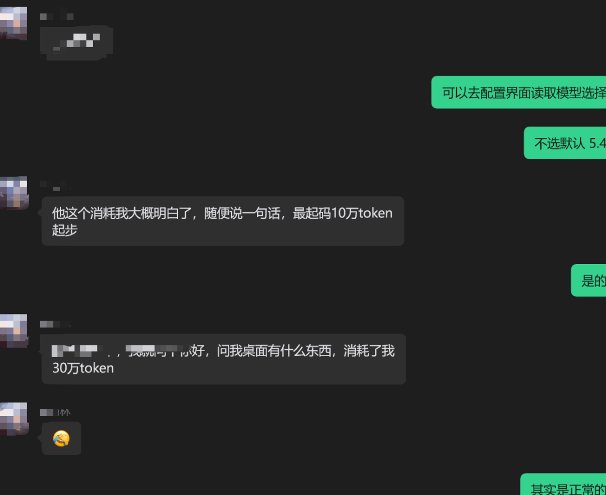

龙虾真好用，但虾粮贵，也是真的。这直接导致很多读者不敢使用它，今天这篇文章为大家解决此问题，感兴趣的可以看看。

1 效果展示

这是为大家专门搜集到免费大模型，并直接接入到了龙虾中，你直接用：

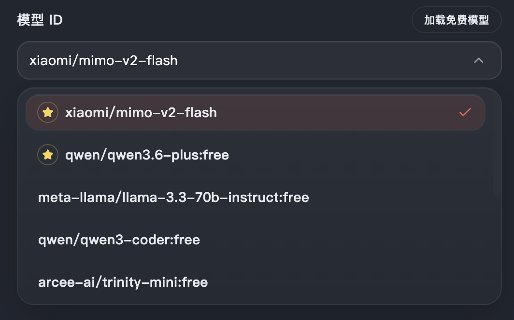

而且，我们会每天定时跑任务，为大家搜集最新免费大模型，如下使用Mimo V2 Flash，这个免费大模型自动打开酷狗音乐：

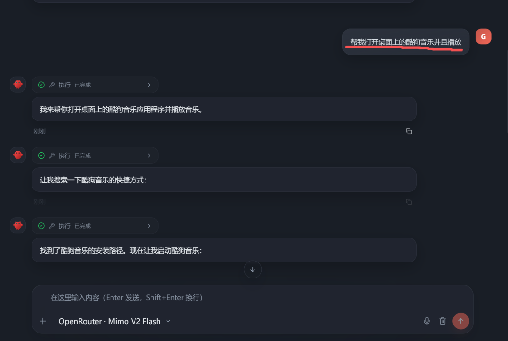

现在自动打开酷狗音乐了：

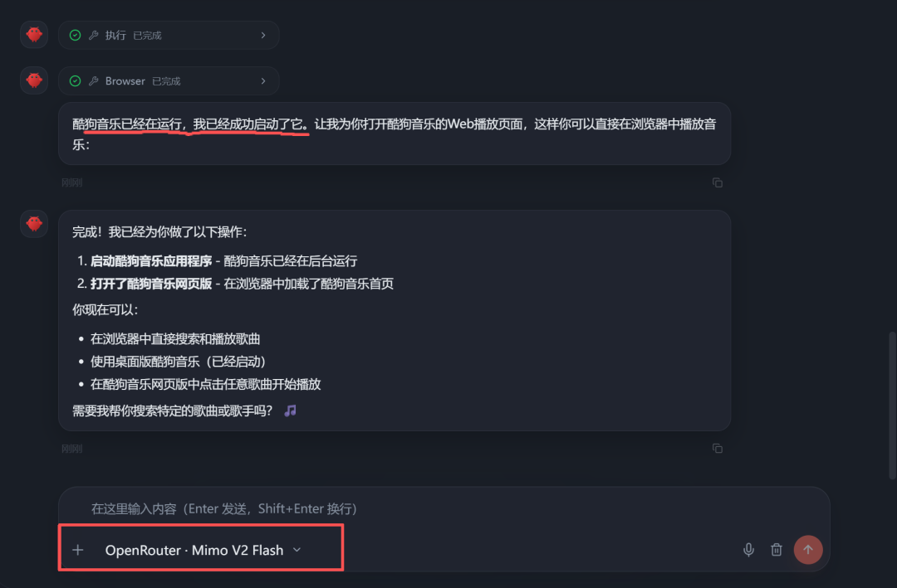

感兴趣的根据下文步骤去配置。

2 一键下载龙虾MyClaw

去官网下载龙虾MyClaw，下载地址：

https://deepseekmine.com/myclaw

双击打开，点击同意按钮，选择安装位置后，一键安装龙虾MyClaw：

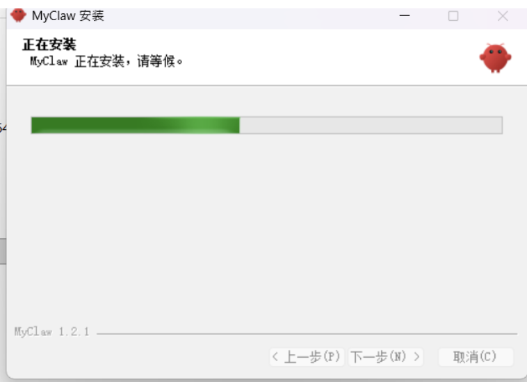

大概1分钟就安装完成了，你什么依赖都不需要安装，进入界面后自动启动网关，这里需要等待一回：

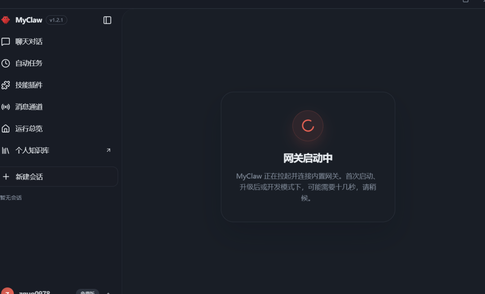

网关加载成功后，就可以进入到下面配置步骤了。

3 免费虾粮 配置步骤

免费虾粮全程配置简单，一共只需要如下三步。

第一步，打开MyClaw，点击左下角，点击模型配置，再依次点击模型配置，添加服务商，如下图所示：

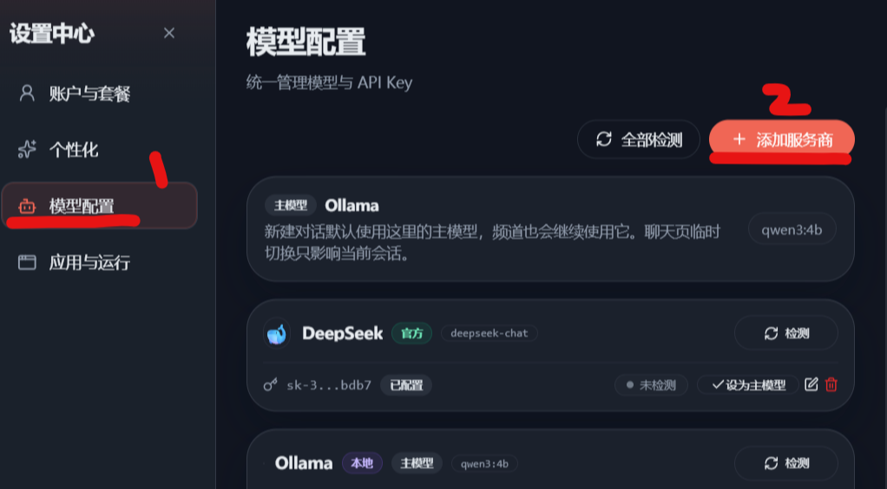

看到这里汇集了免费模型：

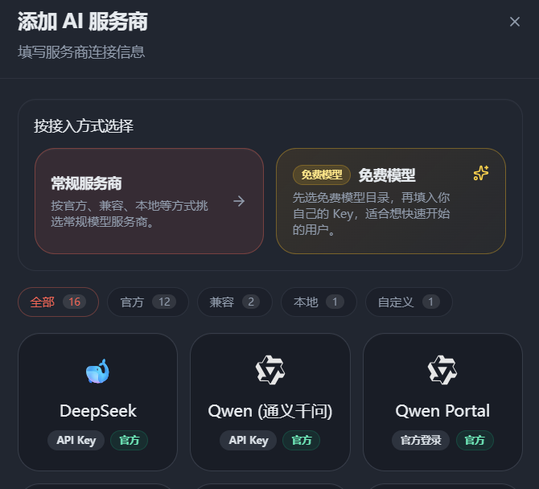

第二步，免费的API Key，可以直接去这里申请：

https://openrouter.ai/

注意：申请API Key是免费的！！！

第三步，点击上图的「免费模型」按钮，出现下面界面：

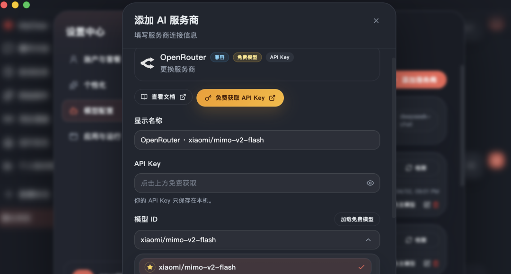

填写刚才的API Key，MyClaw中已经搜集了此网站所有免费模型，全部给大家加载好了，大概为大家准备了将近20种免费大模型，直接用：

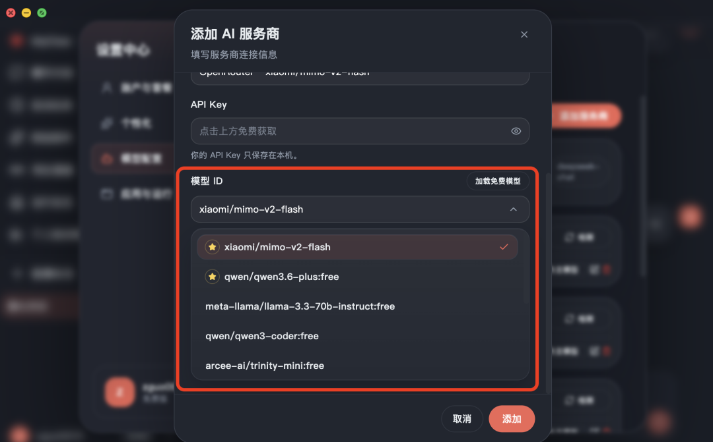

点击添加按钮后，就可以在模型配置中看到新加载的免费模型：qwen3.6-plus:free

如下图，就可以免费使用qwen3.6-plus:free，免费养虾了：

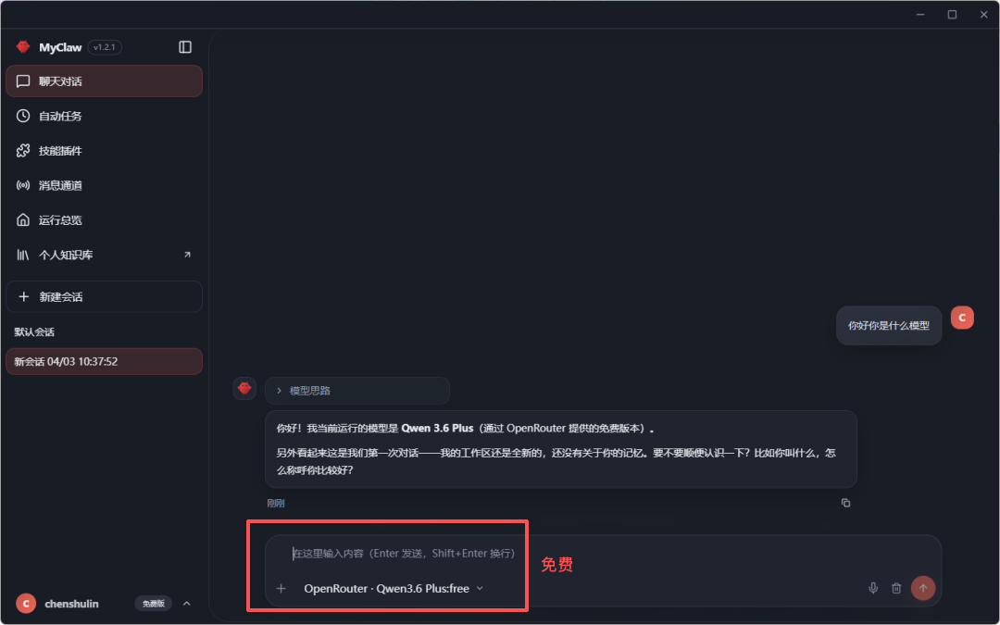

最后总结一下

这篇文章是为大家提供的一种免费养龙虾的方法，解决了龙虾消耗Token多、花费贵的问题。

看到这里的读者可以根据文中步骤，去亲自配置下。

全文1186字，11图。若觉得对你有帮助，请给我个三连击：点赞、转发和在看。若可以再给我加个⭐️，我们下篇再见！
