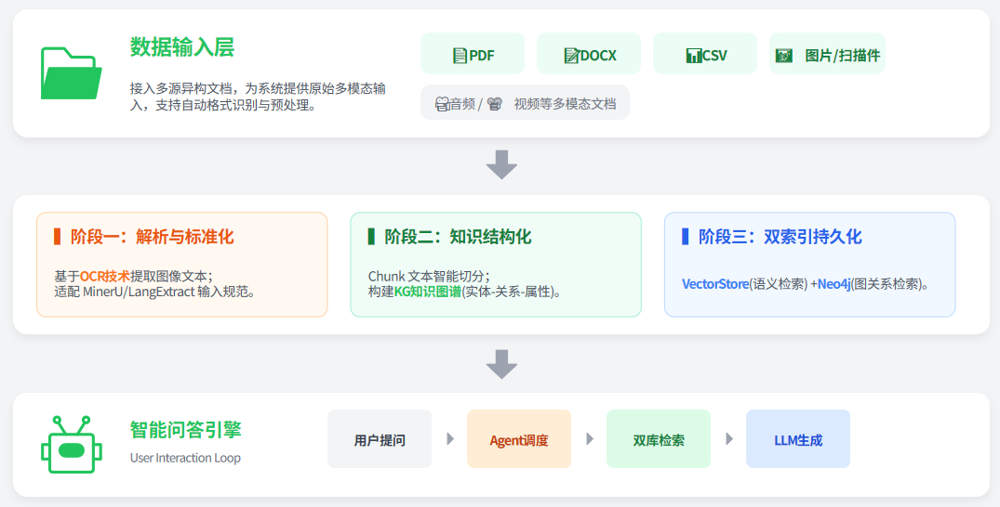
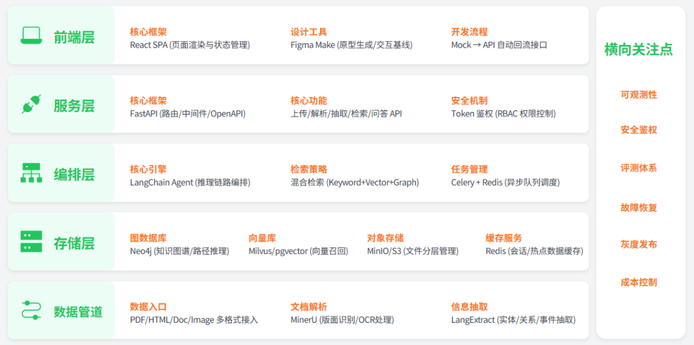
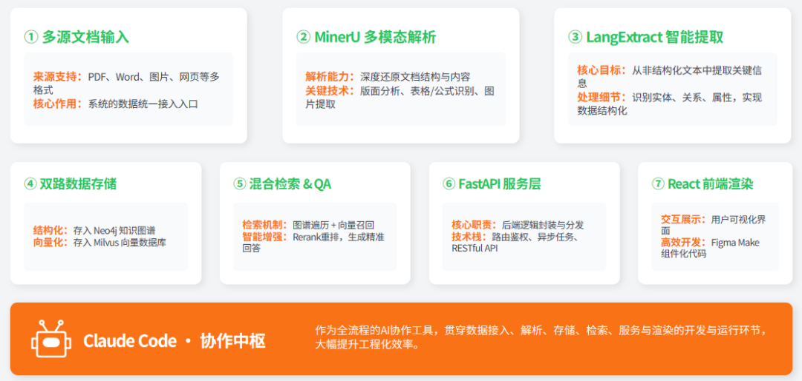
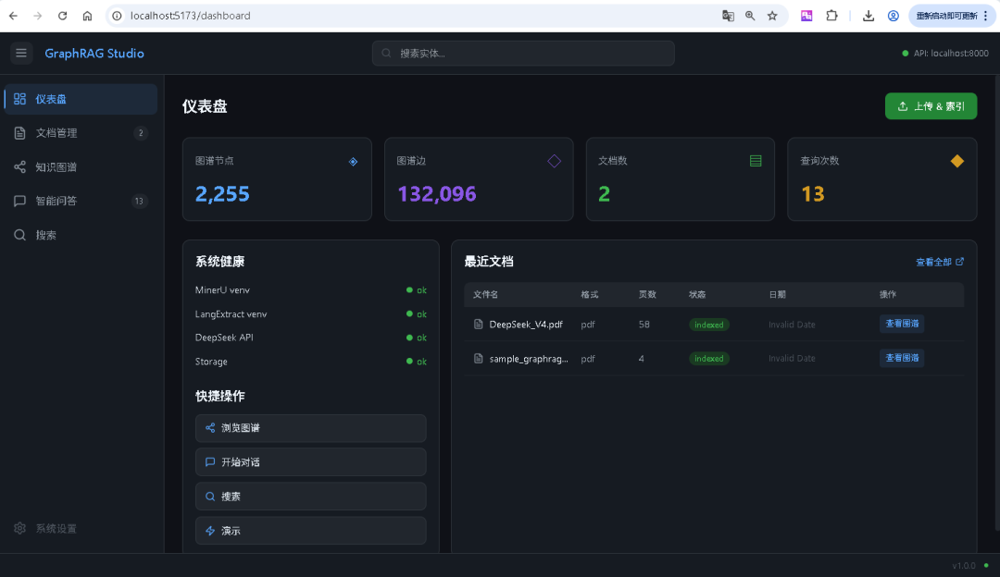
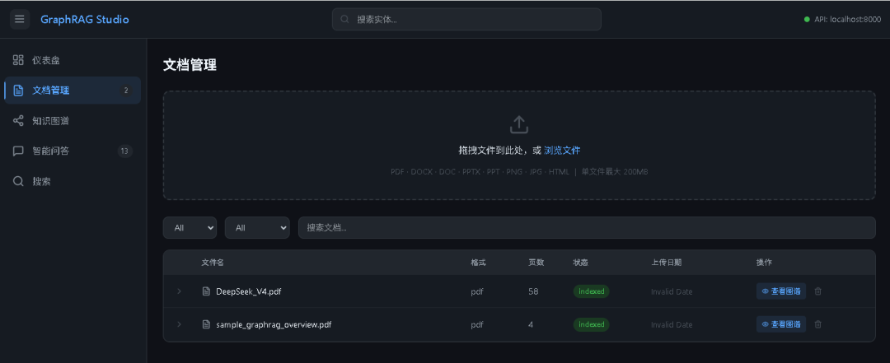
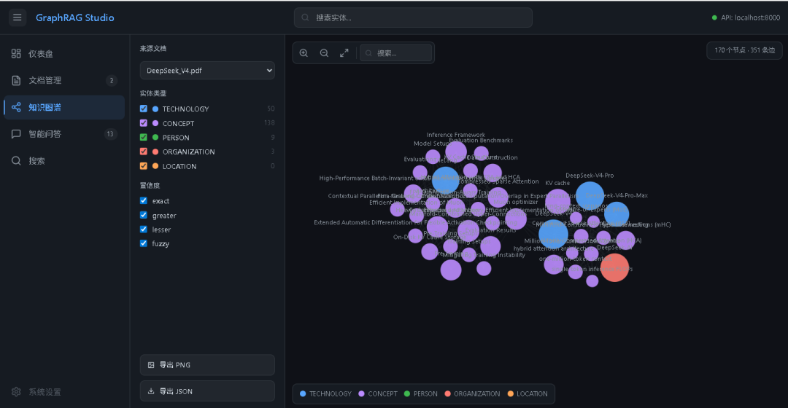
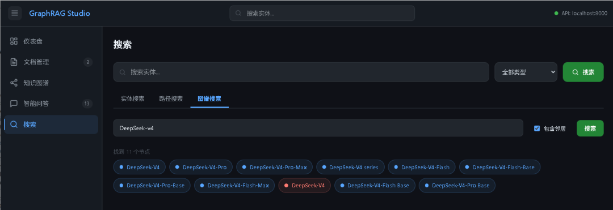
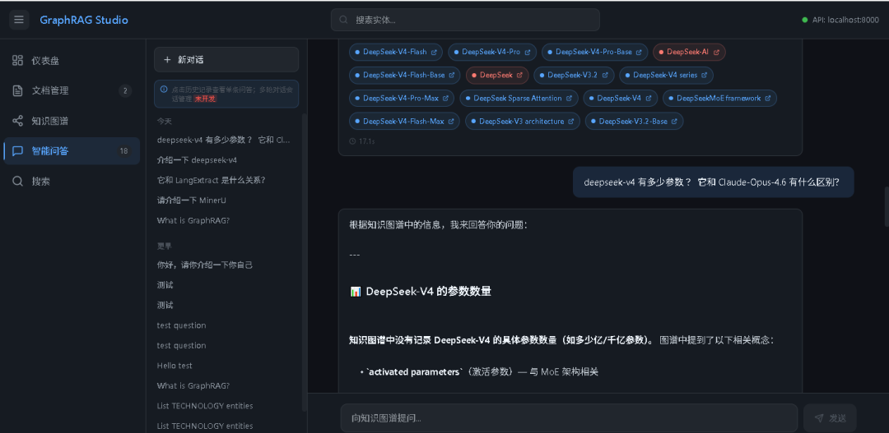
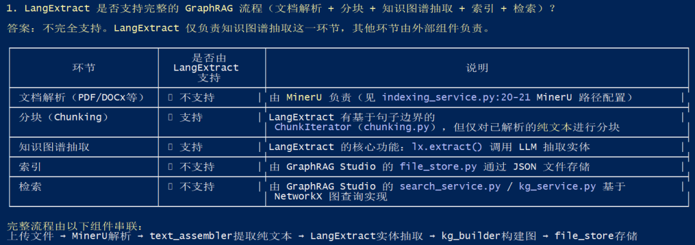
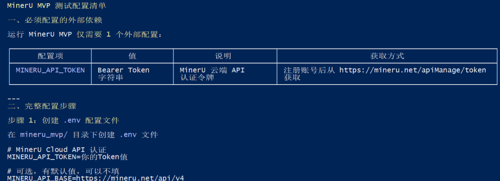

> 📎 来源: [星浩AI](https://mp.weixin.qq.com/s?__biz=MzYzNjI2NjMyNA==&mid=2247485338&idx=1&sn=fb7468a227246f4efe96a388c7fbf26a&chksm=f1d4e4508fdc621c6b2a22cd8e7bd0c4c1de53955efa7a79c5ba4060ffe879c35e8c6f11cea7&mpshare=1&scene=1&srcid=0522F886FSaKfcL2U7AfbyGS&sharer_shareinfo=bce6fc9d88896617c4cf83aad51856d6&sharer_shareinfo_first=bce6fc9d88896617c4cf83aad51856d6) | 时间: 2026-05-22 22:29

---

在做知识库问答被以下问题卡了很久。

**文档解析**：扫描 PDF、表格、图文混排都容易出错，OCR 后的数据依然不稳定。

**检索质量**：复杂对比问题经常召回偏题内容，关键信息缺失，回答自然不可靠。

我意识到，传统 RAG 更像“语义匹配”，缺少“关系理解”。所以我搭了这套多模态 GraphRAG：**MinerU 负责解析，知识图谱建关系，Agentic-RAG 做多跳推理。**

---

## 需求是什么？

- 一个完整的多模态知识库问答系统。
- 支持多格式文档解析、知识图谱构建、向量检索、混合问答。

多模态 GraphRAG 系统演示截图，见文章末尾。

**系统设计的核心目标是：**

- 前端保证交互体验
- 后端保证可扩展与可观测
- 数据层同时支撑语义检索与关系推理。

下面进入具体架构。

## 架构设计

### 系统架构



**数据输入**（PDF、CSV、Docx 等多格式）

**索引构建**（MinerU/OCR 解析 → LangExtract 抽取 → Chunk 切分 + KG 建图 → VectorStore 与 Neo4j 双存）

**问答**（Agent 并行查向量与图，检索片段与问题拼成 Prompt，大模型生成回答）。

**数据流**：多源文档 → MinerU解析 → LangExtract抽取 → Neo4j/Milvus/MinIO存储 → 混合检索 → LangChain Agent → FastAPI → React。

**控制流**：Claude Code 贯穿编排 · Figma Make驱动前端 · Celery调度异步 · Redis缓存加速 · 可观测性全链路覆盖。

**要点**：双索引（语义向量 + 图结构）与 RAG 拼接，兼顾多模态解析与 Graph RAG。

### 分层架构

多模态 GraphRAG 系统架构图从下至上分为五层：



各层技术栈及功能如下：

- **数据管道层（最底层）** — 多源数据入口，支持 PDF、HTML、Doc、Image 等多格式；MinerU 负责文档解析与 OCR 处理；LangExtract 进行实体、关系、事件、属性抽取，最终将数据写入存储层
- **存储层** — Neo4j 构建知识图谱，支持路径推理；Milvus / pgvector 提供向量索引与语义召回能力；MinIO / S3 用于文件分片管理；Redis 用于缓存与会话管理
- **编排层** — LangChain Agent 实现工具调用与推理链路编排，采用 ReAct 策略；混合检索引擎融合 Keyword、Vector、Graph 三种检索方式；Celery + Redis 负责任务调度、异步队列与失败重试
- **服务层** — FastAPI 提供路由与中间件支持，遵循 OpenAPI Spec 规范；Auth & 鉴权基于 Token 实现 RBAC 权限控制；核心功能包括上传、解析、抽取、检索、问答 API
- **前端层（最顶层）** — Figma Make 用于原型生成与交互基线定义；React SPA 负责页面渲染与状态管理；支持 Mock → 真实 API 过渡

### 端到端数据流向

多模态 GraphRAG 的端到端数据流向，从原始文档输入到最终前端展示的完整链路。



经历以下步骤：

**① 多源文档输入**

来源：支持 PDF、Word、图片、网页等多种格式的文档，作为系统的数据入口。

**② MinerU 多模态解析**

功能：对输入的文档进行深度解析。

细节：包括版面分析（Layout Analysis）、表格识别、公式识别以及图片提取。

**③ LangExtract 智能提取**

功能：从解析后的内容中提取关键信息。

细节：识别实体（Entity）、关系（Relation）、属性（Attribute），并将数据结构化。

**④ 图谱 + 向量双路存储**

数据在此处分为两路并行存储，构建混合索引。

左路（结构化语义）存入 Neo4j 知识图谱，重点在于实体、关系以及图遍历能力。

右路（语义向量）存入 Milvus 向量库，重点在于嵌入（Embedding）和近似最近邻（ANN）搜索。

**⑤ LangChain 混合检索 + QA**

结合了"图谱遍历"与"向量召回"，最后进行重排（Rerank），生成高质量的问答结果。

**⑥ FastAPI 服务输出**

处理路由、鉴权、中间件逻辑以及异步任务处理，将处理好的数据封装为 API 接口。

**⑦ React 前端渲染**

利用组件化代码进行最终的页面渲染。

### 为什么这样设计：先画图，再填坑

搭系统之前，我做了个初稿：文档进来 → OCR 解析 → 向量检索 → LLM 回答。跟市面上大多数 RAG 系统没区别。

后来踩了坑才明白：这套架构解决不了问答质量问题——向量检索本质上还是"找最像的文本片段"，不懂实体，不懂关系。

所以我重新设计了架构，加入了**知识图谱**这一层：

```
文档输入 → MinerU 多模态解析 → LangExtract 实体抽取 → Neo4j（图数据库）+ Milvus（向量库）双存储 → LangChain Agent 混合检索 → FastAPI → React 前端
```

**三层存储的设计思路：**

| 存储 | 作用 | 选型理由 |
| --- | --- | --- |
| Neo4j | 知识图谱，图遍历推理 | 实体关系一目了然，支持多跳查询 |
| Milvus | 向量库，语义召回 | ANN 检索快，适合海量embedding |
| MinIO | 文件对象存储 | PDF/图片原始文件分片管理 |

一开始想过只搭 Neo4j，后来发现实体抽取的文本片段也需要做语义检索，单靠图数据库不够用。加了 Milvus 之后问答召回质量明显提升。

**编排层用 LangChain Agent：** 最开始手写过一轮检索逻辑，后来切到 LangChain 是因为工具调用链太长——查实体、查邻居、查路径、合并结果，手写容易出 bug，换工具调试成本太高。LangChain 的 ReAct 策略天然适合这种多工具协作的场景。

**为什么不直接用现成框架？** LangChain/LangGraph 搭过，效果一般，主要卡在文档解析和图谱构建这两个环节没有现成方案，必须自己接 MinerU 和 LangExtract。与其绕远路，不如直接从底层接。

---

## 与传统 RAG 区别？

有朋友问：这套方案跟普通 RAG 相比，核心区别在哪？

直观对比：

|  | 传统 RAG | 多模态 GraphRAG |
| --- | --- | --- |
| 检索方式 | 语义向量匹配 | 向量 + 知识图谱混合 |
| 理解层次 | 文本片段相似度 | 实体关系推理 |
| 多跳问答 | 弱，容易答偏 | 强，可做关系路径推导 |
| 索引内容 | chunks 文本块 | 实体 + 关系 + 原始文本 |
| 适用场景 | 简单问答 | 需要推理的复杂问题 |

最典型的例子是这个问题：

> ❝

> "这份技术方案里，A 公司的产品相比 B 公司有什么优势？"

传统 RAG 召回的可能是两个产品各自的描述片段，LLM 硬比出一段话，不一定准确。

但 GraphRAG 的做法是：先找到 A 公司产品实体 → 找它的性能指标节点 → 再找 B 公司产品的对应指标 → 做节点级别的比较，回答有据可查。

这也是为什么我在实体抽取阶段要把关系类型抽准确——图谱里如果关系是"性能优于"还是"价格低于"，直接决定回答方向。

---

## 核心实现：从 PDF 到智能问答的完整 pipeline

整个系统分为三个串联的模块，数据依次流经：

```
PDF 文件  ↓MinerU 云端解析 → content_list.json  ↓text_assembler 格式转换 → 每页纯文本 .txt  ↓LangExtract + DeepSeek 实体抽取 → 实体 + 共现边  ↓kg_builder 图谱构建 → KGNode + KGEdge（Neo4j / NetworkX）  ↓LangChain ReAct Agent 多跳问答 → 最终回答
```

### 1. 文档解析：MinerU 打通多模态

解析是整个链路的第一个瓶颈。之前试过 pdfminer、PyMuPDF，扫描件和表格都是硬伤。后来换成 MinerU，云端 API 调用，版面分析 + 表格识别 + OCR 一套带走，解析质量直接上一个台阶。(MinerU 也支持私有化部署)

MinerU 的解析结果不能直拼喂给 LLM，还需要一步 text\_assembler 做格式转换。

MinerU 云端 API 解析完成后，会生成 

```
content_list.json
```

，描述文档每一页的每一个 block：

```
{  "content_list": [    {      "page_number": 0,      "blocks": [        { "type": "title", "content": "GraphRAG: Graph-based Retrieval Augmented Generation" },        { "type": "text", "content": "Large language models excel at natural language tasks..." },        { "type": "table", "content": "| Method | R@10 | MRR@10 |\n| -- | -- | -- |", "rows": 3, "cols": 3 },        { "type": "image", "content": "", "bbox": [0.1, 0.2, 0.5, 0.6] }      ]    }  ]}
```

```
type
```

 区分 title / text / table / image 四类 block，text\_assembler 据此做内容过滤和格式还原，最终输出每页一个 

```
.txt
```

 文件，供下游 LangExtract 使用：

```
def assemble_from_content_list(content_list_path: str, output_dir: str) -> list[str]:    with open(content_list_path, "r", encoding="utf-8") as f:        data = json.load(f)    output_files = []    for page in data["content_list"]:        page_text = ""        for block in page["blocks"]:            if block["type"] == "text":                page_text += block["content"].strip() + "\n\n"            elif block["type"] == "table":                # 表格转扁平文本，保留行列结构                page_text += flatten_table(block) + "\n\n"            elif block["type"] == "title":                # 标题加特殊标记，便于下游识别文档结构                page_text += f"[TITLE] {block['content']} [/TITLE]\n\n"        output_path = os.path.join(output_dir, f"page_{page['page_number']:04d}.txt")        with open(output_path, "w", encoding="utf-8") as out:            out.write(page_text.strip())        output_files.append(output_path)    return output_files
```

两个关键参数：

```
language
```

 指定文档主语言（默认 

```
zh
```

），影响 OCR 准确率；

```
model
```

 选 

```
v2
```

 支持更多格式。实测中文文档解析速度约 3-5 秒/页，OCR 识别率在 95% 以上。

**MinerU 支持的原始输入文件格式:**

- 支持格式清单

| 格式 | 扩展名 | 说明 |
| --- | --- | --- |
| **PDF** | `.pdf` | 核心能力 — 文本型 / 扫描型 / 混合型均支持 |
| **Word** | `.doc ,`.docx`` | 旧版和新版 Word 文档 |
| **PowerPoint** | `.ppt , `.pptx`` | 旧版和新版演示文稿 |
| **图片** | `.png,`.jpg`,`.jpeg`` | 单页图片文档，支持 EXIF 方向自动校正 |
| **HTML** | `.html` | 需指定 `MinerU-HTML` 模型版本 |

- 输入限制

| 约束项 | 限制值 |
| --- | --- |
| 单文件最大体积 | **200 MB** |
| 单文件最大页数 | **600 页** |
| 云端 API 每日免费额度 | **2,000 页** （最高优先级），超出部分降低优先级 |

- OCR 语言支持

MinerU 内置 OCR 引擎支持 **109 种语言**，可通过 

```
language
```

 参数指定文档主语言（默认 

```
zh
```

 中文）。

常用语言代码：

| 代码 | 语言 | 代码 | 语言 |
| --- | --- | --- | --- |
| `zh` | 中文 | `en` | 英文 |
| `ja` | 日文 | `ko` | 韩文 |
| `fr` | 法文 | `de` | 德文 |

### 2. 实体抽取：LangExtract + DeepSeek

LangExtract 是一个面向 LLM 的结构化信息抽取框架：你给它原文和抽取 schema，它返回可直接落库的结构化结果（实体、关系、属性）。

这里不用纯 prompt + 正则，是因为格式漂移后正则很容易失效；schema 化输出在稳定性和可落库性上更可靠。

text\_assembler 输出的每页纯文本，再送进 LangExtract + DeepSeek 

```
deepseek-v3-flash
```

 做实体抽取，逐步转换成知识图谱。

**实体类型体系是踩过坑才定下来的。**

最开始只分了人名/机构名/地名三类，技术文档一跑就傻眼了——"GraphRAG"、"Transformer" 这样的词全被归进地名，明显不对。后来扩到五类：

| 类型 | 说明 | 示例 |
| --- | --- | --- |
| TECHNOLOGY | 技术、框架、工具、算法 | GraphRAG, Transformer, PyTorch |
| CONCEPT | 抽象概念、理论、方法论 | retrieval-augmented generation |
| PERSON | 人名 | Yoshua Bengio |
| ORGANIZATION | 机构、公司名 | Microsoft Research |
| LOCATION | 地点 | San Francisco |

加了之后图谱密度从 0.3 升到 1.8，问答召回也好多了。

**Prompt 设计也是反复调出来的。**

第一个版本只说"抽取实体"，输出格式乱七八糟——同一个词在相邻两段里被标注成不同类型。后来加了 few-shot examples 才好：

```
Example:Input: "GraphRAG uses knowledge graphs to enhance retrieval."Output: [{"text":"GraphRAG","type":"TECHNOLOGY"},{"text":"knowledge graphs","type":"CONCEPT"}]Example:Input: "Retrieval-augmented generation combines retrieval with generation."Output: [{"text":"Retrieval-augmented generation","type":"CONCEPT"}]
```

**关系边的生成策略也换过一次。**

最初想让 LLM 输出一对一对的关系，但不稳定——LLM 要么漏掉关系，要么自己编不存在的关系。

后来换了个思路：**只抽实体，不抽关系，同一页出现的任意两个实体自动生成一条 

```
CO_OCCURS_IN
```

（共现）边。**

这是一个简化策略，但足够实用——共现本身就隐含语义关联，下游图检索可以通过共现边发现相关实体。

```
extract_prompt = """从以下文本中抽取实体和关系，输出 JSON 格式：文本：{chunk_text}要求：- 实体包含：名称、类型（TECHNOLOGY/CONCEPT/PERSON/ORGANIZATION/LOCATION）、置信度- 关系包含：源实体、目标实体、关系类型、证据文本- 只抽取高置信度内容，低置信度忽略"""response = deepseek.chat.completions.create(    model="deepseek-v4-flash",    messages=[{"role": "user", "content": extract_prompt}])
```

### 3. Agentic-RAG 问答：LangChain Agent 做多跳推理

这是最复杂的一块。问答不是「问一句答一句」那么简单，实际问题是多跳的——比如"这个方案为什么比竞品好"，需要：

① 先找到方案实体 → ② 找它的技术指标 → ③ 再找竞品对应指标 → ④ 做比较。

LangChain Agent 在这里做检索编排，ReAct 策略让 Agent 自己决定下一步该用什么工具：

```
# 核心工具集tools = [    search_entities,      # 按名称搜索实体，返回匹配节点及其类型、页面信息    get_neighbors,       # 获取节点的邻居节点，hops 参数控制扩展度数    get_entities_by_type, # 按类型筛选所有实体（TECHNOLOGY/CONCEPT/PERSON/ORGANIZATION/LOCATION）    describe_graph,      # 获取图谱概览：节点数、边数、类型分布]agent = create_react_agent(llm, tools)result = agent.invoke({"question": question})
```

以问题 **"GraphRAG 和传统 RAG 的核心区别是什么？"** 为例，Agent 的推理过程：

```
Step 1: search_entities("GraphRAG")        → [GraphRAG: TECHNOLOGY, page=0, degree=39]Step 2: get_neighbors("graphrag-node-id", hops=2)        → [knowledge graphs: CONCEPT, retrieval-augmented generation: CONCEPT,           Neo4j: TECHNOLOGY, Milvus: TECHNOLOGY]Step 3: get_entities_by_type("CONCEPT")        → [retrieval-augmented generation, knowledge graphs, ...]Step 4: describe_graph()        → "Graph has 142 nodes, 780 edges, types: TECHNOLOGY(40), CONCEPT(68), ..."综合以上信息，Agent 推理生成回答。
```

每轮问答平均调用 4-6 次工具，实测延迟 8-15 秒（取决于图谱规模和模型响应速度）。

回答质量比纯向量 RAG 高很多，尤其在需要关系推理的问题上。

---

## 效果：跑起来什么样

系统跑起来之后，我用 

```
deepseek-v4.pdf
```

（58 页）做了完整测试：

**索引阶段：**

- 文档解析：约 4 分钟（58 页，含表格和图片）
- 实体抽取：约 8 分钟（2256 个节点，132096 条边）
- 图谱规模：TECHNOLOGY 269 个、CONCEPT 969 个、PERSON 940 个……

**问答阶段：**

- 简单问题（直接召回）：3-5 秒
- 复杂多跳问题：10-20 秒
- 工具调用次数：平均 4-6 次/问答

效果最明显的是这类问题：

> ❝

> "列出文档里所有涉及 DeepSeek V4 的方案介绍，并说明它们之间的关系"

之前用传统 RAG 搜出来的是零散段落，现在 GraphRAG 直接给你一张关系网络图，实体类型、关联路径一目了然。

## 系统展示

### 首页



### 文档管理

上传文档后进入索引流程，Dashboard 右下角会实时显示索引进度（parsing → extracting → indexing），等待完成即可。



### 知识图谱

索引完成后，进入知识图谱页面，可以看到文档中抽取的实体以力导向图形式展示，点击节点可查看详情和邻居关系。



### 智能问答

在智能问答页面输入问题，系统会调用 LangChain Agent 做多跳推理，返回回答、工具调用链路和引用的实体节点。



### 搜索

支持按实体名称或类型搜索，快速定位文档中的关键信息。



## 实战步骤：10 步搭完整系统

这套系统从零到一落地，全过程在 Claude Code 中完成。以下是每一步的核心产出和目标：

**Step 1 · 确定知识图谱框架**

选定 LangExtract 作为实体抽取后端，克隆源码并详细分析其输入输出规范，生成 

```
langextract_specification.md
```

，明确 LangExtract 与文本模型、多模态模型、向量库/图数据库的交互方式。



**Step 2 · 确定解析模块**

选定 MinerU 作为文档解析引擎，详细阅读官方 API 文档确认支持的输入格式和输出规范，生成 

```
mineru_specification.md
```

，明确 MVP 测试所需配置和 API Token 获取方式。



**Step 3 · 建立 MinerU MVP 测试流程**

在 

```
mineru_mvp/
```

 下创建独立测试项目，使用 

```
uv
```

 做环境隔离，编写本地文件上传 → MinerU 云端解析 → 解析结果本地存储的完整 Pipeline，验证端到端可用性。

**Step 4 · 构建 LangExtract MVP 流程**

在 

```
langextract_src/
```

 下创建独立测试项目，同样使用 

```
uv
```

 隔离环境，接入 DeepSeek API（deepseek-v4-flash），验证从模拟文本输入到结构化信息输出的完整链路，生成 

```
langextract_specification-v1.0.md
```

。

**Step 5 · MinerU 与 LangExtract 对接** — 将 MinerU 的解析输出（content\_list.json）接入 LangExtract 的文本输入，打通"本地 PDF → MinerU 解析 → LangExtract 抽取 → 知识图谱结构化数据"的完整 Bridge Pipeline，生成 

```
bridge_pipeline_specification-v1.0.md
```

。

**Step 6 · 前端可视化**

基于 Bridge Pipeline 的输出数据规范，设计并实现一个可交互的 Web 单页面，支持上传 PDF、自动解析、查看抽取的实体数据，以及知识图谱的 D3.js 力导向图展示。

**Step 7 · 构建 Agentic-RAG 问答流程**

接入 LangChain MCP 获取最新版本规范，基于 Bridge Pipeline 的数据格式构建 LangChain Agent，接入 LangChain 的 ReAct 策略和 4 个工具（search\_entities、get\_neighbors、get\_entities\_by\_type、describe\_graph），完成"提问 → 多跳推理 → 生成回答"的完整 MVP，生成 

```
agentic_rag_specification-v1.0.md
```

。

**Step 8 · 设计后端架构与产品原型**

通过 Plan 模式基于已生成的规范文档设计 FastAPI 后端架构（25 个 API 端点），同时规划 React 前端产品原型（5 个页面），生成 

```
backend_service_specification-v1.0.md
```

 和 

```
frontend_design_specification-v1.0.md
```

，最终输出标准 PRD 文档。

**Step 9 · 开始构建项目**

搭建项目规范（CLAUDE.md），将前后端代码分别放入 

```
frontend/
```

 和 

```
backend/
```

 目录，

```
.env
```

 文件管理所有外部配置并加入 

```
.gitignore
```

，后端使用 

```
uv
```

 创建独立虚拟环境，基于规范文档生成完整的后端服务代码并完成接口测试。

**Step 10 · 前后端集成和联调**

编写各层 CLAUDE.md 说明启动命令，将前端所有 Mock API 替换为真实后端接口，逐个进行集成测试；如遇接口未开发情形，不自主扩展后端，仅在前端页面打上"未开发"标识。

> ❝

> 完整的 Claude Code 提示词和源码，有需要的可以私信我获取。

---

## 技术选型

**开发与辅助工具：** Claude Code + Cursor，模型：Minimax-M2.7

**核心架构：**

- 前端：React（Figma Make）
- 后端：FastAPI + LangChain
- 解析：MinerU + LangExtract
- 存储：Neo4j + Milvus

---

## 写在最后

搭这套系统最大的体会是：**文档解析和知识图谱是两个独立的难题，都解决了才有好的问答效果。**

解析做不好，后续一切都是垃圾进垃圾出。

图谱建不对，问答推理就找不到正确的路径。

这两件事没有捷径，只能一个坑一个坑踩过去。

如果你也在做类似的事情，欢迎交流。
