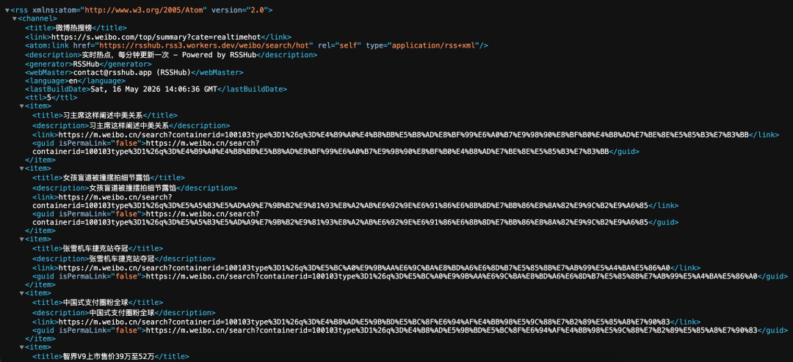

> 📎 来源: [前端仔玩儿nas](https://mp.weixin.qq.com/s?__biz=MzU0NjI5Njk3Mg==&mid=2247485532&idx=1&sn=63c0760a5634b7fc415b500c1261c0a7&chksm=facf8a99a55add9a471ae251d47960e1dddeb0a37e23c67fd6b3b8efe5d2bd69fc531579e69d&mpshare=1&scene=1&srcid=0521rR9xaAxFOWSFX5kyDeXd&sharer_shareinfo=f565c2d11a4f96c4dd710fe29d28718b&sharer_shareinfo_first=f565c2d11a4f96c4dd710fe29d28718b) | 时间: 2026-05-21 23:06

---


hello，大家好呀！依旧是爱搞事的**「前端仔」**。致力于让nas成为家庭必不可少的小家电。

不知道大家有没有这种情况——刷微博、刷小红书、看B站，想要的内容散落在各个平台，每天打开一堆APP来回切换，时间全碎片化了。

前端仔最近就遇到了这个痛点，直到发现了 **RSSHub** 这个开源项目，不得不说——**太好用了！**

## 什么是RSSHub

简单来说，RSSHub就是把所有不支持RSS的平台，帮你转换成RSS订阅源。一个服务，全网通用。

```
// GitHubhttps://github.com/DIYgod/RSSHub
```

支持400+网站，包括微博、小红书、B站、知乎、Twitter...基本上你常用的平台都有覆盖。

## 部署RSSHub

废话不多说，我们直接开始部署。官方推荐使用docker-compose，一键启动。

```
services:  rsshub:    image:diygod/rsshub:latest# 稳定版镜像    container_name:rsshub    ports:      -"1200:1200"# 默认端口1200    environment:      -NODE_ENV=production    restart:unless-stoppedredis:    image:redis:alpine# 缓存服务，提升性能    container_name:rsshub-redis    restart:unless-stoppedbrowserless:    image:ghcr.io/browserless/chromium:latest# 无头浏览器，某些路由需要    container_name:rsshub-browserless    restart:unless-stopped    environment:      -MAX_CONCURRENT_SESSIONS=10      -CONNECTION_TIMEOUT=60000
```

部署完成以后通过 

```
http://NASIP:1200
```

 进行访问。

> ❝

> ⚠️ 如果你订阅的路由包含需要渲染JS的页面（如微博、小红书），需要配置browserless服务。上面的compose 文件已包含，直接用即可。

## 支持的路由

来聊聊大家最关心的——**国内平台**的路由支持情况。

**哔哩哔哩 bilibili（47条路由，220.6K请求）**

```
// 文档地址https://docs.rsshub.app/routes/bilibili
```

B站是RSSHub最热门的平台之一，请求量排第四。

- ```
  /bilibili/user/video/:uid
  ```

   — 用户视频列表
- ```
  /bilibili/user/dynamic/:uid
  ```

   — 用户动态（最新投稿、直播、专栏）
- ```
  /bilibili/ranking/:rid
  ```

   — 排行榜（1全站/3动画/4游戏...）
- ```
  /bilibili/user/fav/:uid
  ```

   — 用户收藏夹
- ```
  /bilibili/live/room/:roomid
  ```

   — 直播间状态

**示例：** 订阅 B站 UP主「老师好我叫何同学」的视频更新：

```
http://NASIP:1200/bilibili/user/video/63765870
```

**微博 weibo（9条路由）**

```
// 文档地址https://docs.rsshub.app/routes/weibo
```

微博路由需要配置 Cookie 才能抓取，否则只能看部分内容。

- ```
  /weibo/user/:uid
  ```

   — 博主动态
- ```
  /weibo/search/hot
  ```

   — 热搜榜（实时热点）
- ```
  /weibo/keyword/:keyword
  ```

   — 关键词订阅（比如搜索「NAS」相关的微博）
- ```
  /weibo/super_index/:id/:type
  ```

   — 超话（支持精华/热门/最新帖子）

**示例：** 订阅微博热搜榜：

```
http://NASIP:1200/weibo/search/hot
```

> ❝

> 划重点！划重点！划重点！ 微博路由需要 Cookie 才能稳定抓取。在环境变量中配置 WEIBO\_COOKIES 即可，否则部分博主可能无法订阅。

**小红书 xiaohongshu（2条路由，1.4M请求）**

```
// 文档地址https://docs.rsshub.app/routes/xiaohongshu
```

小红书路由请求量排第一！可见大家对小红书订阅的需求有多强烈。

- ```
  /xiaohongshu/user/:user_id/:category
  ```

   — 用户笔记/收藏

- category 支持 

  ```
  notes
  ```

  （笔记）或 

  ```
  collect
  ```

  （收藏）

- ```
  /xiaohongshu/board/:board_id
  ```

   — 专辑

**示例：** 订阅某个小红书博主的笔记更新：

```
http://NASIP:1200/xiaohongshu/user/593032945e87e77791e03696/notes
```

> ❝

> 小红书路由同样需要 Cookie，配置 XIAOHONGSHU\_COOKIE 环境变量即可。

**抖音 Douyin（3条路由）**

```
// 文档地址https://docs.rsshub.app/routes/douyin
```

- ```
  /douyin/user/:uid
  ```

   — 博主视频
- ```
  /douyin/live/:rid
  ```

   — **直播间开播提醒**（直播时触发新消息）
- ```
  /douyin/hashtag/:cid
  ```

   — 标签/话题

**示例：** 订阅某个抖音博主的视频更新：

```
http://NASIP:1200/douyin/user/MS4wLjABAAAARcAHmmF9mAG3JEixq_CdP72APhBlGlLVbN-1eBcPqao
```

想追某个直播间开播？直接用 

```
/douyin/live/:rid
```

，主播开播时 RSS 就会推送一条消息——**再也不用一直盯着等开播了！**

## 更多精彩路由

除了上面这几个，RSSHub 还支持：

- **X (Twitter)** — 9条路由
- **YouTube** — 8条路由
- **Telegram** — 频道订阅
- **知乎** — 24条路由
- **GitHub** — 24条路由
- **即刻** — 3条路由

基本上你常用的平台都有覆盖，多探索一下会发现很多惊喜。

## 如何订阅

部署好RSSHub之后，需要搭配RSS阅读器使用。

- 桌面端推荐：**Reeder**（macOS/iOS）
- 手机端推荐：**Folo**（RSSHub官方出品，AI加持）
- 浏览器插件：**RSSHub Radar**（自动检测页面是否支持订阅）

订阅方式很简单：

1. 访问RSSHub地址 

   ```
   http://NASIP:1200
   ```
2. 找到想要的路由，拼接完整URL
3. 复制到RSS阅读器订阅

### RSS连接是什么

说白了，RSS连接就是一个固定格式的URL地址。每个路由就是一个RSS订阅源，格式如下：

```
http://NASIP:1200/[路由路径]
```

比如你想订阅微博热搜榜，直接把下面的链接复制到RSS阅读器里就行了：

```
http://NASIP:1200/weibo/search/hot
```

想追某个B站UP主的更新？

```
http://NASIP:1200/bilibili/user/video/63765870
```

RSS阅读器会定期访问这个地址，自动抓取最新内容推送到你面前——**再也不用打开微博、B站刷来刷去了，在一个地方看完所有更新。**

## 实战演示

微博加上参数以后，阅读体验直接拉满！来看一下效果：



如果想要更舒服的阅读体验，可以在路由后面加参数。

比如微博：

```
http://NASIP:1200/weibo/user/1642909335/readable=1&authorNameBold=1&showAuthorInTitle=1
```

效果就是标题显示作者、粗体排版，阅读体验大幅提升。

###### 写在最后

RSSHub这个项目确实有点东西——麻雀虽小五脏俱全。一个开源项目，覆盖400+平台，活跃度极高，作者也一直在维护更新。
