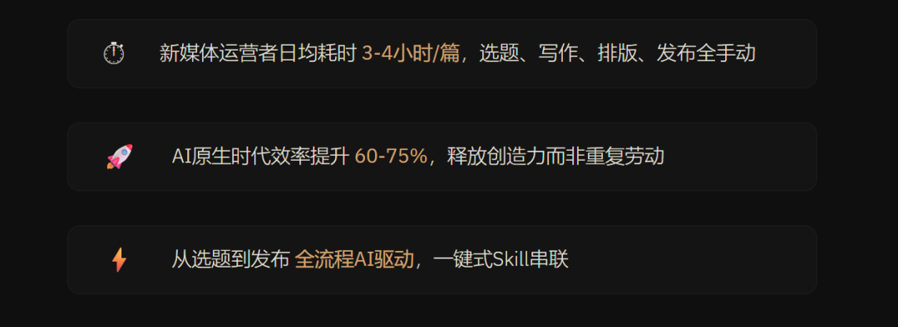
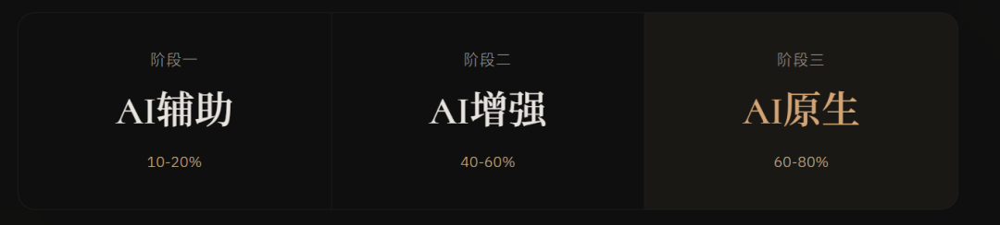
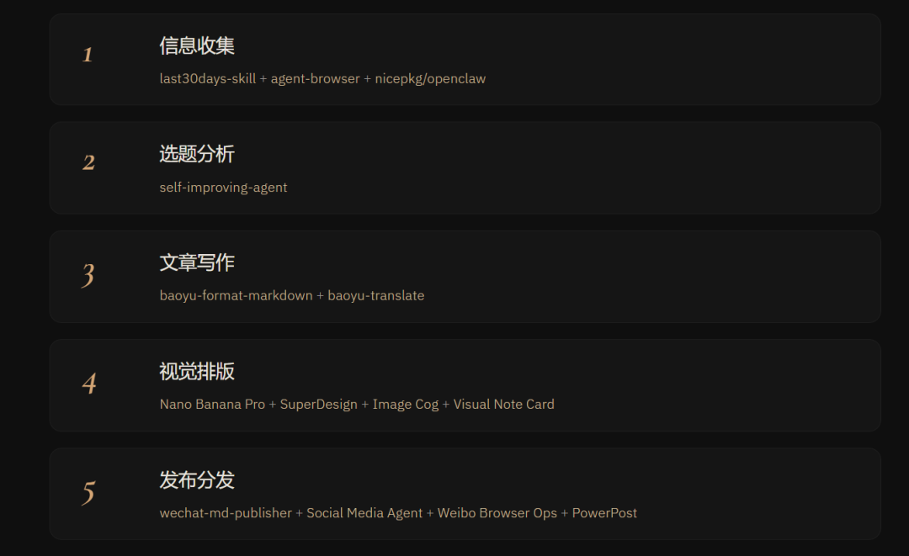
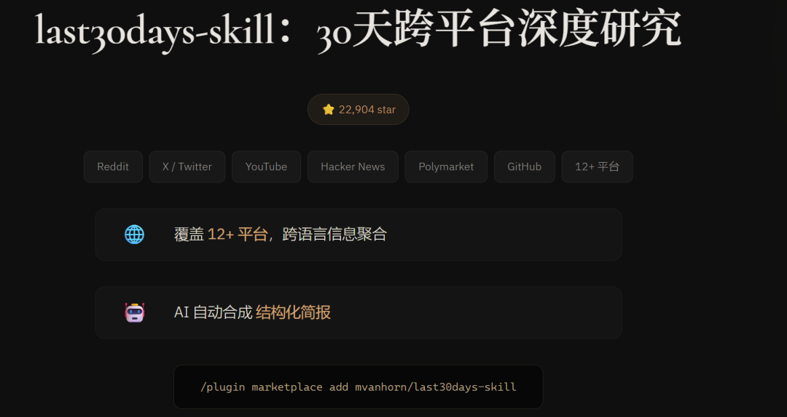
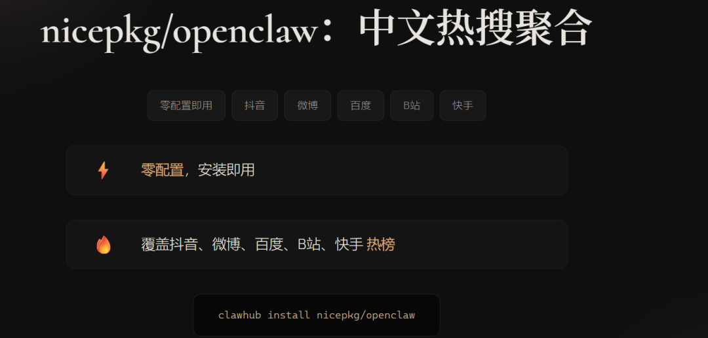
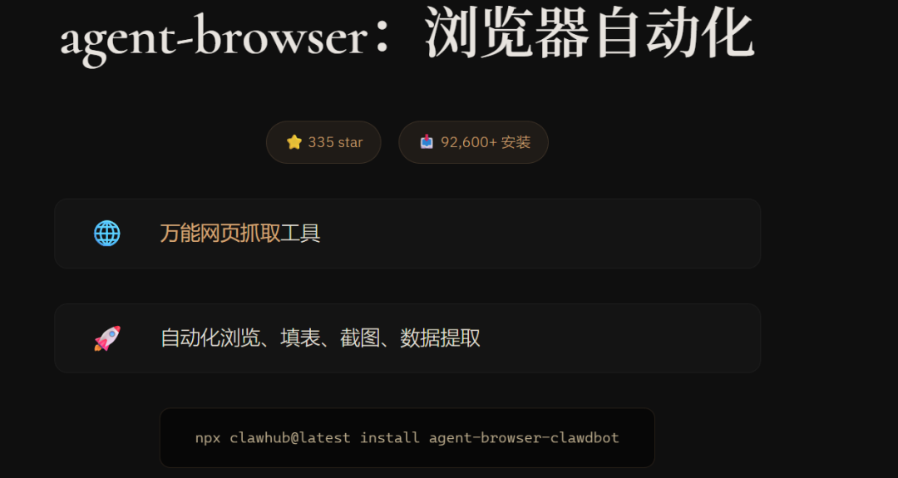

> 📎 来源: [老廖AI Agent实验室](https://mp.weixin.qq.com/s?__biz=MzIwNDQ4MDYzNg==&mid=2247484470&idx=1&sn=2efca73afcf7c352d362af09f361a95e&chksm=96a982f836d507c748b8e3e5bbc0bcabb7b8a517041cae1cf67000824e2c02a1b480df415ccc&mpshare=1&scene=1&srcid=05224y2jJRGcU5tCXwfYyOk7&sharer_shareinfo=d2a499ca9c886bfefda1bac71d13faac&sharer_shareinfo_first=d2a499ca9c886bfefda1bac71d13faac) | 时间: 2026-05-22 22:28

---

#


> **重点：** 全文共21000字，预计阅读时间50分钟，建议收藏保存，需要的时候将内容喂给Agent即可复刻此效果。

> 每天花3-4小时才能产出一篇内容？这篇文章带你用AI Skill把全流程压缩到1小时，后续自动化后降至5分钟。

> 从热点采集、选题搭建、文章写作、视觉排版到一键发布，围绕5个核心环节，逐一拆解可落地的AI技能方案。

> 全文共11章，所有技能均来自 **ClawHub**（clawhub.ai）和 **SkillHub**（skillhub.club），可在 Claude Code 中直接安装使用。

---

## 第一章：为什么你需要一套"AI内容创作技能包"？

### 1.1 一个新媒体运营者的日常



先说个真实场景。

早上9点打开电脑，刷微博热搜、看抖音热门话题、翻行业公众号——光"找选题"就要花掉40分钟。确定选题后，开始搜集素材：截图、存链接、整理金句、翻竞品文章，又一个小时没了。然后才是正式动笔，写初稿、调结构、润色措辞，中间还要反复修改。最后配图、排版、检查格式，一篇看起来还不错的公众号文章，往往已经过去了3-4个小时。

这还是顺利的情况。如果遇到"今天不知道写什么"的选题焦虑，时间只会更长。

**这不是个别现象，而是绝大多数新媒体运营者的日常。**

根据行业调研，一个中等体量的公众号运营者，每周产出3-5篇原创内容，平均每篇耗时3-4小时。其中，素材收集占25%**，选题策划占**15%**，写作占**40%**，视觉排版占**15%**，发布分发占**5%。

### 1.2 AI原生时代：三个阶段的进化



AI对内容创作的影响，正在经历三个阶段的演进：

| **阶段** | **AI参与度** | **典型行为** | **效率提升** |
| --- | --- | --- | --- |
| **AI辅助** | 10%-20% | 用ChatGPT润色段落、生成标题 | 节省10%-20%时间 |
| **AI增强** | 40%-60% | AI写初稿+人工精修，AI生成配图 | 节省40%-50%时间 |
| **AI原生** | 60%-80% | 从选题到发布全流程AI驱动，人工负责审核和创意决策 | 节省60%-75%时间 |

2026年，我们已经进入**AI原生阶段**。关键不再是"AI能不能帮我写"，而是"我能不能用一套系统化的Skill，让AI覆盖从热点到发布的全流程"。

### 1.3 要解决什么问题

这篇文章的核心目标只有一个：**给你一套完整的、可落地的AI内容创作技能包。**

我们将围绕内容创作的5个核心环节，逐一推荐对应的AI Skill：

1. **信息收集** —— 用AI跨平台深度研究+中文热搜聚合，30分钟掌握全网热点
2. **选题池搭建** —— 用AI系统化分析选题价值
3. **文章写作** —— 用AI提升写作效率和质量
4. **视觉排版与配图** —— 用AI生成专业级视觉内容
5. **一键发布与分发** —— 用AI实现多平台自动发布

> **效果：** 读完本文并实践后，你产出一篇内容的时间可以从4小时缩短到1小时以内。

这不是夸张，而是当你把每个环节的AI Skill串联起来后，自然能达到的效果。

---

## 第二章：内容创作全流程 × AI Skill地图

在深入每个环节之前，先给你一张"全局地图"。下面这张表格展示了内容创作5个核心环节，以及每个环节对应的AI Skill：



| **环节** | **核心任务** | **推荐AI Skill** | **来源平台** | **⭐ Star** | **📥 下载量** |
| --- | --- | --- | --- | --- | --- |
| **① 信息收集** | 跨平台深度研究、中文热搜、网页抓取 | last30days-skill、nicepkg/openclaw、agent-browser | ClawHub | 22,904 / — / 335 | — / — / 92.6k |
| **② 选题分析** | 分析选题价值，建立选题库 | self-improving-agent | ClawHub | 335 | 397k |
| **③ 文章写作** | 高效产出结构化文章 | baoyu-format-markdown、baoyu-translate | baoyu-skills (GitHub) | 685 | 15.1k |
| **④ 视觉排版** | 生成封面图、信息图、设计稿 | Nano Banana Pro、SuperDesign、Image Cog、Visual Note Card | ClawHub | 348 / 154 / 10 / — | 88.4k / 30.8k / 12.5k / 129 |
| **⑤ 发布分发** | 多平台自动发布 | wechat-md-publisher-skill、Social Media Agent、Weibo Browser Ops、PowerPost | ClawHub | — / 10 / 2 / — | 750 / 8.1k / 1.1k / 422 |

**关于本文提到的技能平台：**

- \*\*ClawHub\*\*：OpenClaw 官方技能注册中心，类似"AI Agent 的 npm"，收录 **13,700+** 技能，支持语义搜索、版本管理、社区评分。安装命令统一为 

  ```
  npx clawhub@latest install
  ```

  。
- \*\*SkillHub\*\*：跨 Agent 技能聚合平台，收录 **87,100+** 技能，兼容 Claude、Codex、Gemini 等多种 AI Agent。

**关于 Claude Code：** 本文所有技能均兼容 Claude Code。安装方式优先使用 Claude Code 的插件系统：

```
# Claude Code 插件安装（推荐）/plugin marketplace add /# 或通过 ClawHub CLI 安装npx clawhub@latest install
```

接下来，我们从第一个环节开始，逐一拆解。

---

## 第三章：环节1 —— 信息收集（重点）

> **这一章是本文的重点之一。** 信息收集是内容创作中最耗时的环节，传统方式需要1-2小时。使用本章节推荐的三个 Skill，你可以把时间压缩到15-20分钟。

### 3.1 AI能做什么

传统信息收集方式下，你需要手动打开几十个网页、逐段阅读、手动复制粘贴。而AI可以帮你做到：

- **跨平台深度研究**：输入一个话题，自动搜索12+个平台过去30天的全网讨论，AI合成为一份结构化简报
- **中文热搜聚合**：一键抓取抖音、微博、百度、B站等国内主流平台的热榜数据
- **任意网页抓取**：通过浏览器自动化，抓取任意网页内容并提取结构化数据

这三个能力分别对应三个独立的 ClawHub 技能。我们逐一来看。

### 3.2 last30days-skill：30天跨平台深度研究

> 🔍 **可在 ClawHub 搜索到** | ⭐ GitHub **22,904 star** | 📥 GitHub 1,884 fork | 作者：mvanhorn | 协议：MIT



**功能说明：** 这是一个 AI Agent 驱动的跨平台搜索引擎，可对任意话题在过去30天内的全网信息进行深度研究，然后由 AI 评审综合成一份有据可查的摘要报告。它不是传统搜索引擎——而是同时搜索十几个平台，按真实用户的互动量（点赞、评论、投注金额）来评分，最终由 AI 合成为一份简报。

**覆盖的数据源（12+个平台）：**

| **平台** | **数据类型** | **特点** |
| --- | --- | --- |
| Reddit | 帖子、评论、点赞数 | 免费无需配置，社区讨论深度最高 |
| X / Twitter | 热门讨论、专家长帖 | 适合追踪行业KOL观点 |
| YouTube | 完整视频字幕搜索 | 适合采集视频内容 |
| TikTok | 创作者内容 | 适合追踪年轻化话题 |
| Hacker News | 开发者社区共识 | 适合科技/AI话题 |
| Polymarket | 预测市场赔率 | 真金白银的预测数据 |
| GitHub | PR速度、仓库星标 | 适合技术趋势分析 |
| Instagram Reels / Threads / Pinterest / Bluesky | 社交内容 | 覆盖更多受众群体 |
| Perplexity Sonar | 联网搜索 | 通过 OpenRouter 的 AI 搜索 |
| Web | 编辑报道、博客 | 传统媒体和博客内容 |

**v3 版本核心特性：**

- **智能预研究**：输入话题后，引擎先解析出相关的人物、子版块、YouTube 频道、TikTok 标签，再开始搜索
- **跨源聚类合并**：同一故事在 Reddit、X、YouTube 上出现时，合并为一条
- **单次对比查询**：

  ```
  /last30days A vs B
  ```

   只需一次运行
- **ELI5 模式**：

  ```
  eli5 on
  ```

   将结果用通俗语言重写
- **Best Takes**：自动提取最幽默/最病毒式的金句

**适用场景：**

- 写作前做话题深度调研，了解社区最新讨论
- 对竞品/行业趋势做对比研究
- 会议前快速了解某人或某话题的近况

**安装命令：**

```
# 方式一：Claude Code 插件安装（推荐）/plugin marketplace add mvanhorn/last30days-skill# 方式二：通过 ClawHub 安装clawhub install last30days-official# 方式三：手动安装git clone https://github.com/mvanhorn/last30days-skill.git ~/.claude/skills/last30days
```

**使用方式：**

```
# 基础用法：深度研究一个话题/last30days AI agent prompting# 对比研究/last30days OpenClaw vs Hermes# 研究某个人物/last30days Sam Altman# 开启 ELI5 通俗模式eli5 on/last30days 大模型微调技术
```

**实际效果示例：**

```
输入：/last30days AI内容创作工具↓ last30days-skill 自动搜索 12+ 个平台输出：## 话题热度总览- Reddit r/aigc：327条讨论，热度上升42%- X/Twitter：#AIContent 标签下 1.2万条推文- YouTube：相关视频平均播放量 15万- Hacker News：3篇热文，最高 890 分## 核心观点（按社区互动量排序）1. "AI原生内容创作将成为2026年主流" —— Reddit 2.1k upvotes2. "Claude Code + Skills 是目前最高效的内容创作工作流" —— HN 890 points3. ...## 最佳金句（Best Takes）> "The best content in 2026 will be AI-native, not AI-assisted."> —— @someuser on X, 3.4k likes## 内容缺口分析- 高需求但低供给的话题：AI Skill 自定义教程、中文内容创作工作流- 推荐选题方向：Claude Code 内容创作 Skill 实战指南
```

### 3.3 nicepkg/openclaw：中文热搜聚合

> 🔍 **可在 ClawHub 搜索到** | 作者：nicepkg | 特点：**零配置即用，无需 API Key**



**功能说明：** 专注聚合中国主流平台的实时热搜/热榜数据，覆盖抖音、微博、百度、B站、快手等国内核心平台。无需任何 API Key 或服务器配置，安装即可使用。

**覆盖的热搜来源：**

| **类别** | **平台** |
| --- | --- |
| **核心热搜** | 抖音热榜、微博热搜、百度热搜、B站热门、快手热榜 |
| **娱乐榜单** | QQ音乐、网易云音乐 |
| **影视游戏** | 猫眼票房、App Store 排行榜 |
| **特色功能** | 人民日报电子版"看报纸" |

**适用场景：**

- 每日快速浏览全网中文热搜，发现选题灵感
- 追踪特定话题在国内各平台的热度差异
- 结合 last30days-skill 的海外数据，形成"国内+海外"双视角

**安装命令：**

```
# 通过 ClawHub 安装clawhub install nicepkg/openclaw
```

**使用方式：**

```
# 查看今日全平台热搜"请使用 nicepkg/openclaw，获取今日所有平台的热搜数据"# 查看特定平台热搜"请获取今日抖音热榜和微博热搜的前20条"# 对比不同平台的话题差异"请对比今天抖音热榜和百度热搜，找出两个平台都出现的话题"
```

**实际效果示例：**

```
输入：获取今日全平台热搜↓ nicepkg/openclaw输出：## 抖音热榜 TOP51. #AI写作工具推荐# —— 2.3亿播放2. #2026年最火副业# —— 1.8亿播放3. ...## 微博热搜 TOP51. #AI取代新媒体运营# —— 阅读4.2亿2. #Claude Code技能包# —— 阅读1.1亿3. ...## 交叉分析两个平台同时出现的话题：- "AI内容创作"（抖音第1 + 微博第1）→ 强烈推荐选题- "副业赚钱"（抖音第2 + 微博第5）→ 可考虑角度切入
```

### 3.4 agent-browser：浏览器自动化抓取

> 🔍 **可在 ClawHub 搜索到** | ⭐ ClawHub 335 star | 📥 **92,600+ 安装**



**功能说明：** 为 AI Agent 优化的无头浏览器自动化 CLI，通过 Chrome DevTools Protocol 控制浏览器。支持网页导航、截图、数据提取、表单填写等操作。当你需要抓取 last30days-skill 和 nicepkg/openclaw 覆盖不到的特定网页时，agent-browser 是你的万能工具。

**适用场景：**

- 抓取特定网页的正文内容
- 截取网页截图作为素材
- 从需要登录的网站提取数据
- 批量采集竞品公众号文章

**安装命令：**

```
# 方式一：全局安装 CLI（推荐）npm install -g agent-browseragent-browser install --with-deps# 方式二：通过 ClawHub 安装npx clawhub@latest install agent-browser-clawdbot
```

**使用方式：**

```
# 抓取网页内容"请使用 agent-browser，打开 https://example.com/article 并提取正文内容"# 截取网页截图"请截取这个页面的完整截图：https://example.com"# 批量采集"请依次打开以下5个URL，提取每篇文章的标题、正文和发布时间：1. https://example.com/article12. https://example.com/article2..."
```

### 3.5 三者配合的信息收集工作流

1. **Step 1**：用 nicepkg/openclaw 获取今日中文热搜（**2分钟**）—— 快速了解国内热点话题
2. **Step 2**：用 last30days-skill 深度研究感兴趣的话题（**10分钟**）—— 获取海外12+平台的30天深度数据，AI 自动合成结构化简报
3. **Step 3**：用 agent-browser 补充采集特定网页（**5分钟**）—— 抓取 last30days 未覆盖的深度文章
4. **Step 4**：让 AI 对所有素材进行汇总（**3分钟**）—— 生成一份"素材摘要文档"

> **总计：约20分钟，传统方式需要1-2小时。**

**为什么这个组合比传统方式强？**

| **维度** | **传统方式** | **last30days + openclaw + agent-browser** |
| --- | --- | --- |
| 覆盖平台 | 3-5个（手动） | 20+个（自动化） |
| 时间跨度 | 当天 | 过去30天 |
| 数据深度 | 标题+摘要 | 全文+评论+互动数据 |
| 语言覆盖 | 中文为主 | 中英文全覆盖 |
| 耗时 | 1-2小时 | 约20分钟 |

---

## 第四章：环节2 —— 选题池搭建

### 4.1 SKILL能做什么

选题是内容创作的"战略层"。选对了选题，文章就成功了一半。但很多运营者的选题方式是"拍脑袋"——今天看到什么热就写什么，缺乏系统性和持续性。

SKILL在选题环节能帮你做到：

- **系统化分析选题价值**：从搜索热度、竞争程度、受众匹配度、变现潜力等维度评估
- **发现内容缺口**：分析已有内容，找到"有需求但供给不足"的选题方向
- **建立可持续的选题日历**：基于行业节奏和热点周期，提前规划未来2-4周的选题
- **持续学习优化**：AI 越用越聪明，选题建议越来越精准

### 4.2 self-improving-agent：持续改进型选题分析

> 🔍 **可在 ClawHub 搜索到** | ⭐ ClawHub 335 star | 📥 **397,000+ 安装**（ClawHub 热榜第一）

**功能说明：** ClawHub 上下载量最高的技能。核心能力是捕获学习、错误和纠正，实现 Agent 持续改进。支持自我反思、自我批评、自我学习和自组织记忆。我们可以利用其"自我反思+结构化分析"的能力，改造为选题分析工具——每次分析后，AI 会记住哪些选题表现好、哪些不好，下次给出更精准的建议。

**安装命令：**

```
# 通过 ClawHub 安装npx clawhub@latest install self-improving-agent
```

### 4.3 可复用的"选题分析Skill"模板

下面是一个完整的选题分析Skill模板，你可以保存为 

```
SKILL.md
```

 文件，直接在Claude Code中使用。

```
# Skill: 选题分析助手## 描述帮助新媒体运营者系统化分析选题价值，输出结构化的选题评估报告。## 触发条件当用户说"分析选题"、"评估选题"、"选题建议"时激活此技能。## 输入要求用户提供以下信息（至少提供话题方向）：- 话题方向（必填）- 目标平台（可选，默认为微信公众号）- 目标受众（可选）- 竞品账号（可选，提供2-3个参考账号）## 分析框架### 第一步：话题热度评估- 评估该话题在目标平台的近期热度（高/中/低）- 判断话题所处的生命周期（萌芽期/上升期/爆发期/衰退期）- 预测未来7-14天的热度趋势### 第二步：竞争分析- 搜索该话题下已有的热门内容- 分析现有内容的切入角度和覆盖深度- 找出"内容缺口"——哪些角度还没有被充分覆盖### 第三步：受众匹配度- 评估话题与目标受众的匹配程度- 分析受众对该话题的潜在痛点- 推荐最能引发共鸣的切入角度### 第四步：选题角度推荐基于以上分析，推荐3个具体的选题角度：- 角度1：[标题建议] + [核心论点] + [预估热度] + [竞争程度]- 角度2：[标题建议] + [核心论点] + [预估热度] + [竞争程度]- 角度3：[标题建议] + [核心论点] + [预估热度] + [竞争程度]### 第五步：输出格式以Markdown表格形式输出选题评估报告，包含以下字段：| 选题角度 | 建议标题 | 核心论点 | 预估热度 | 竞争程度 | 内容缺口 | 推荐优先级 |## 注意事项- 不要编造数据，基于可获取的真实信息进行分析- 如果某些信息无法获取，明确标注"数据不足"- 优先推荐"高热度+低竞争"的选题角度- 标题建议要符合目标平台的内容风格
```

### 4.4 使用示例

```
# 示例1：结合 last30days 的数据进行选题分析"我使用 last30days-skill 研究了'AI内容创作工具'这个话题，以下是研究简报：[粘贴 last30days 输出]请使用选题分析助手，基于这些数据帮我分析最佳选题角度。目标平台：微信公众号，受众：新媒体运营者。"# 示例2：基于热搜数据生成选题"今日热搜中，'AI写作工具'同时出现在抖音和微博热榜。请帮我分析这个话题的选题价值，推荐3个角度。"# 示例3：定期选题规划"请帮我规划下周的选题日历，我的账号定位是'AI工具测评与教程'，目标受众是中小企业主和自由职业者，每周更新3篇。"
```

**AI输出示例：**

| **选题角度** | **建议标题** | **核心论点** | **预估热度** | **竞争程度** | **内容缺口** | **推荐优先级** |
| --- | --- | --- | --- | --- | --- | --- |
| 工具评测 | 2026年最值得用的10个AI写作工具实测 | 从实际使用体验出发，对比各工具的优缺点 | 高 | 中 | 缺少中文实测对比 | ★★★★★ |
| 方法论 | AI原生内容创作：从0到1的完整工作流 | 介绍AI原生内容创作的概念和实操方法 | 中 | 低 | 新概念，供给不足 | ★★★★☆ |
| 行业观察 | AI会取代内容创作者吗？数据说话 | 用数据呈现AI对内容行业的影响 | 高 | 高 | 需要独特数据视角 | ★★★☆☆ |

---

## 第五章：环节3 —— 文章写作

### 5.1 AI能做什么

到了写作环节，很多人的做法是"给AI一个标题，让它写一篇文章"。这种方式产出的内容往往千篇一律，带有明显的"AI味"。

真正高效的AI写作方式，是**人机协作**：

- **AI负责**：搭建文章框架、填充事实和数据、生成初稿、润色措辞、检查逻辑
- **人负责**：确定核心观点和独特角度、注入个人经验和案例、审核事实准确性、把控整体调性

> **关键在于：你要给AI足够的上下文和约束，而不是让它自由发挥。**

### 5.2 baoyu-format-markdown：Markdown格式化

> 🔍 **可在 ClawHub / SkillHub 搜索到** | ⭐ GitHub 685 star（baoyu-skills 仓库） | 📥 ClaudePluginHub 15,140+ 安装

**功能说明：** 对Markdown文本进行格式优化，包括标题层级调整、列表规范化、表格对齐、代码块标注等。写作环节中，baoyu-skills 是唯一保留的技能集——它的格式化和翻译能力在 Claude Code 中表现优秀。

**适用场景：**

- AI生成初稿后，快速规范化格式
- 将杂乱的笔记整理为结构化的文章
- 确保文章在不同平台（公众号、知乎、掘金等）的排版一致性

**安装命令：**

```
# 随 baoyu-skills 整体安装npx skills add jimliu/baoyu-skills
```

**使用方式：**

```
# 格式化已有内容"请使用baoyu-format-markdown，将以下内容格式化为规范的Markdown格式：[粘贴内容]"# 按照特定风格格式化"请将这篇文章格式化为公众号风格，要求：- 一级标题用##，二级标题用###- 每段不超过3行- 重点内容用**加粗**标注- 适当使用引用块（>）突出金句"
```

### 5.3 baoyu-translate：多语言翻译

> 🔍 **可在 ClawHub / SkillHub 搜索到** | ⭐ GitHub 685 star（baoyu-skills 仓库） | 📥 ClaudePluginHub 15,140+ 安装

**功能说明：** baoyu-skills 内置的多语言翻译技能，支持中英日韩等多种语言互译。适合快速翻译素材或文章。

**安装命令：**

```
# 随 baoyu-skills 整体安装（与 format-markdown 共用）npx skills add jimliu/baoyu-skills
```

**使用方式：**

```
# 翻译素材"请使用baoyu-translate，将以下英文内容翻译为中文，保持技术术语的准确性：[内容]"# 本土化改写"请将这篇英文文章进行本土化改写：1. 翻译为中文2. 将案例替换为中国读者熟悉的内容3. 调整语气为中文互联网的表达习惯"
```

### 5.4 可复用的"公众号文章写作Skill"模板

```
# Skill: 公众号文章写作助手## 描述辅助新媒体运营者高效产出公众号文章，遵循"框架先行→素材填充→初稿生成→人工精修"的流程。## 触发条件当用户提供选题方向或文章大纲时激活此技能。## 写作流程### Phase 1: 框架搭建1. 确认文章的核心观点（一句话概括）2. 确认目标读者和他们的核心痛点3. 搭建文章大纲（包含3-5个主要章节）4. 每个章节标注：核心论点 + 支撑素材 + 预计字数### Phase 2: 逐章写作按照大纲逐章写作，每章遵循以下原则：1. 开头用场景、数据或提问引入2. 中间用"观点+案例+数据"的三段式论证3. 结尾用总结或行动号召收束4. 每段不超过4行，保持阅读节奏### Phase 3: 润色优化1. 检查逻辑连贯性2. 消除AI味：替换"首先/其次/最后"等表达3. 增加个人色彩：加入第一人称视角4. 优化标题：确保有吸引力但不标题党## 写作风格要求- 语气：专业但不枯燥，像一个有经验的从业者在分享- 禁止：不要使用"总而言之"、"综上所述"等空话套话- 鼓励：使用具体的数据、真实的案例、生动的比喻## 注意事项- 不要编造数据、案例或引用- 如果用户提供了素材，优先使用用户提供的素材- 每完成一个Phase，等待用户确认后再进入下一个Phase- 最终输出使用baoyu-format-markdown进行格式化
```

### 5.5 使用示例

```
# Step 1: 搭建框架"请使用公众号文章写作助手，我的选题是'AI Skill如何改变内容创作流程'。目标读者是新媒体运营者，核心观点是'AI Skill不是替代人工，而是让运营者从执行者变成决策者'。请先帮我搭建文章框架。"# Step 2: 确认框架后，逐章写作"框架确认，请开始写第一章。素材我已经准备好了：- last30days-skill 研究了12+个平台的数据- nicepkg/openclaw 显示'AI写作'同时登上抖音和微博热搜请基于这些素材来写。"# Step 3: 润色"初稿收到了，请帮我润色：1. 第二章和第三章之间缺少过渡，请补充2. 有几处'值得注意的是'的表达，请替换3. 标题请再优化一下，要更有吸引力"
```

> **核心原则：把AI当成一个高效的写作助理，而不是一个自动写作机。**

---

## 第六章：环节4 —— 视觉排版与配图（重点）

> **这一章是本文的重点。** 视觉内容是公众号文章的"门面"，一张好的封面图能让打开率提升\*\*30%\*\*以上。本章推荐的4个 ClawHub 独立技能，覆盖了从AI图片生成到专业UI设计的全场景。

### 6.1 Nano Banana Pro：AI图片生成

> 🔍 **可在 ClawHub 搜索到** | ⭐ ClawHub 348 star | 📥 **88,400+ 安装** | ClawHub 官方推荐

**功能说明：** 使用 Google Gemini 3 Pro 模型生成和编辑图片，支持文生图和图生图，1K/2K/4K 分辨率。是 ClawHub 上最受欢迎的图片生成技能，适合生成封面图、配图、社交媒体图片等。

**适用场景：**

- 生成文章封面图
- 为文章各章节生成配图
- 生成社交媒体分享图
- 图生图编辑（在已有图片基础上修改）

**安装命令：**

```
npx clawhub@latest install nano-banana-pro
```

**使用方式：**

```
# 生成封面图"请使用 Nano Banana Pro，生成一张文章封面图：标题：2026年最全AI内容创作技能包风格：科技感，深蓝色背景，白色文字分辨率：4K"# 为文章配图"请为以下段落生成一张配图：'在AI原生阶段，内容创作者的角色从执行者转变为决策者。'要求：体现'人机协作'的概念，风格简洁专业。"# 图生图编辑"请基于这张图片进行编辑：./draft.png修改要求：将背景色改为深蓝色，增加AI相关的视觉元素"
```

### 6.2 SuperDesign：专业UI/视觉设计指南

> 🔍 **可在 ClawHub 搜索到** | ⭐ ClawHub 154 star | 📥 **30,800+ 安装** | 作者：@mpociot

**功能说明：** 专家级前端设计指南技能。不是直接生成图片，而是提供完整的视觉设计方案——包括布局设计（ASCII线框图）、主题设计（颜色/字体/间距/阴影）、动画设计（微交互和过渡效果）和实现代码生成。内置多种设计风格模板：现代暗色模式（Vercel/Linear风格）、新粗野主义、毛玻璃效果等。

**适用场景：**

- 设计落地页、仪表盘等 Web 页面
- 为文章设计信息图的布局方案
- 创建品牌视觉规范（颜色/字体/间距系统）
- 生成可直接使用的 HTML/CSS 实现代码

**安装命令：**

```
npx clawhub@latest install mpociot/superdesign
```

**使用方式：**

```
# 设计信息图布局"请使用 SuperDesign，为一篇关于'AI内容创作工具对比'的文章设计信息图布局。要求：- 现代暗色风格- 包含5个工具的对比数据- 使用卡片式布局输出 ASCII 线框图和配色方案"# 设计落地页"请使用 SuperDesign，为我的AI工具测评博客设计一个落地页。风格参考：Vercel/Linear 的现代暗色风格包含：Hero区域、功能介绍、工具对比表、CTA按钮"# 生成配色方案"请为我的公众号设计一套配色方案。定位：AI科技类，目标受众是新媒体运营者。要求：专业但不冰冷，有科技感但亲和力强。"
```

### 6.3 Image Cog：多模型图像生成与编辑

> 🔍 **可在 ClawHub 搜索到** | ⭐ ClawHub 10 star | 📥 **12,500+ 安装** | 底层：CellCog SDK

**功能说明：** 由 CellCog 驱动的多功能 AI 图像生成与编辑技能。集成多个模型（Nano Banana 2/Gemini 3.1 Flash、GPT Image 1.5、Recraft），支持文生图、图生图、角色一致性系列图、产品摄影、参考图生成。特别适合漫画条、故事板、品牌吉祥物、社交媒体图集等场景。

**与 Nano Banana Pro 的区别：**

- **Nano Banana Pro**：单一模型（Gemini 3 Pro），简单易用，适合快速生成
- **Image Cog**：多模型智能调度，功能更丰富，适合需要多种风格的高级场景

**安装命令：**

```
# 安装 Image Cognpx clawhub@latest install nitishgargiitd/image-cog# 前置依赖：安装 CellCog SDKpip install -U cellcog
```

**使用方式：**

```
# 生成角色一致性系列图"请使用 Image Cog，生成一组4张系列配图。角色：一个戴眼镜的AI助手形象场景：1.在电脑前写作 2.在白板前讲解 3.在咖啡厅思考 4.在发布按钮前庆祝风格：扁平插画，统一配色"# 生成品牌吉祥物"请使用 Image Cog，为我的公众号设计一个吉祥物。名称：小AI特点：可爱、专业、有科技感用途：用于文章配图和社交媒体头像"
```

### 6.4 Visual Note Card：中文信息图卡片

> 🔍 **可在 ClawHub 搜索到** | 📥 **129+ 安装** | 作者：@beilunyang

**功能说明：** 生成专业的中文视觉笔记卡片（信息图），输出为单页 HTML 信息图，支持自动 PNG 导出。采用编辑式知识卡片美学设计，包含框架行、深色/浅色面板、高亮条等结构化布局。非常适合将文章或主题转化为可分享的信息图卡片，发布到小红书、朋友圈等平台。

**安装命令：**

```
npx clawhub@latest install beilunyang/visual-note-card-skills
```

**使用方式：**

```
# 生成信息图卡片"请使用 Visual Note Card，生成一张信息图卡片。主题：5个提升效率的AI工具内容要点：1. last30days-skill —— 30天跨平台深度研究2. agent-browser —— 浏览器自动化3. nicepkg/openclaw —— 中文热搜聚合4. Nano Banana Pro —— AI图片生成5. SuperDesign —— 专业UI设计风格：深色面板，现代科技感"# 从文章生成卡片"请将以下文章转化为信息图卡片：[粘贴文章内容]要求：提取核心观点，用卡片形式呈现，适合分享到朋友圈"
```

### 6.5 配合工具推荐

| **工具** | **用途** | **与上述技能的配合方式** |
| --- | --- | --- |
| **SuperDesign** | 设计布局+配色 | 先用 SuperDesign 出设计方案，再用 Nano Banana Pro 按方案生成图片 |
| **Nano Banana Pro** | AI图片生成主力 | 日常封面图、配图的首选工具 |
| **Image Cog** | 高级图像生成 | 需要多模型、角色一致性等高级功能时使用 |
| **Visual Note Card** | 中文信息图卡片 | 将文章要点转化为可分享的卡片 |
| **Canva** | 在线设计工具 | 对AI生成的图片进行微调和二次编辑 |
| **Figma** | 专业设计工具 | 需要更精细的设计调整时使用 |

**一个高效的视觉制作工作流：**

1. **Step 1**：用 SuperDesign 设计视觉方案（配色+布局）（**3分钟**）
2. **Step 2**：用 Nano Banana Pro 生成封面图（**2分钟**）
3. **Step 3**：用 Image Cog 生成系列配图（**5分钟**）
4. **Step 4**：用 Visual Note Card 生成信息图卡片（**3分钟**）
5. **Step 5**：（可选）用 Canva 微调（**5分钟**）

> **总计：约15-20分钟，传统方式需要2-3小时。**

---

## 第七章：环节5 —— 发布与分发

### AI能做什么：一键发布多平台

内容写好了，排版也搞定了，接下来就是最后一步——发布。本章推荐的4个 ClawHub 独立技能，覆盖微信公众号、X/Twitter、微博以及 Instagram/TikTok/YouTube/LinkedIn 等更多平台。

---

### wechat-md-publisher-skill：发布到微信公众号

> 🔍 **可在 ClawHub 搜索到** | 📥 **750+ 安装**

**功能说明：** 全功能微信公众号 Markdown 发布工具，支持草稿管理、多主题、智能图片处理、自动封面图生成。将 Markdown 文件一键转换为公众号格式并提交到草稿箱，省去手动排版的时间。

**安装命令：**

```
npx clawhub@latest install wechat-md-publisher-skill
```

**使用方式：**

```
# 发布文章到公众号草稿箱"请使用 wechat-md-publisher-skill，将以下文章发布到公众号草稿箱：文件：./article.md标题：2026年最全AI内容创作技能包封面图：./cover.png"# 使用特定主题发布"请使用 grace 主题，将 ./article.md 发布到公众号草稿箱。要求：自动生成封面图，摘要控制在50字以内。"
```

---

### Social Media Agent：X/Twitter 自主运营

> 🔍 **可在 ClawHub 搜索到** | ⭐ ClawHub 10 star | 📥 **8,100+ 安装** | 作者：@psmamm

**功能说明：** 使用 OpenClaw 原生工具（浏览器自动化）自主管理 X/Twitter 账号，无需外部 API 密钥。支持发推、互动（点赞/转推/回复）、内容生成策略、Cron 定时发布、参与度追踪和分析。

**内置内容策略分配：**

- 行业洞察 **40%**
- Build in Public **30%**
- 观点输出 **20%**
- 互动参与 **10%**

**安装命令：**

```
npx clawhub@latest install psmamm/social-media-agent
```

**使用方式：**

```
# 发布推文"请使用 Social Media Agent，发布一条推文：内容：Just published my guide on AI content creation skills for 2026.配图：./preview.png"# 设置定时发布"请设置明天早上9点发布以下推文：[推文内容]"# 查看账号参与度分析"请分析我的X账号最近7天的参与度数据，给出优化建议。"
```

---

### Weibo Browser Ops：微博浏览器自动化

> 🔍 **可在 ClawHub 搜索到** | ⭐ ClawHub 2 star | 📥 **1,100+ 安装** | 作者：yikailucas

**功能说明：** 通过浏览器自动化管理微博。支持发布图文微博、回复评论和@提及、查看通知、从创作者中心拉取数据、置顶/取消置顶微博。内置安全机制：发布/删除前需用户确认，遇到验证码自动暂停。

**安装命令：**

```
npx clawhub@latest install weibo-browser-ops
```

**使用方式：**

```
# 发布微博"请使用 Weibo Browser Ops，发布一条微博：内容：2026年AI内容创作技能包来了！从热点挖掘到多平台发布，一套Skill搞定全流程。#AI创作# #新媒体运营#配图：./cover.png"# 查看创作者中心数据"请查看我的微博创作者中心最近7天的数据，包括阅读量、互动量、粉丝增长。"
```

---

### PowerPost：多平台一键分发

> 🔍 **可在 ClawHub 搜索到** | 📥 **422+ 安装** | 作者：@tarekhoury

**功能说明：** 通过 PowerPost API 一键生成社交媒体内容并发布到所有主流平台：Instagram（Feed/Reel/Story）、TikTok、X/Twitter、YouTube（视频/Shorts）、Facebook、LinkedIn。支持文案生成、AI 图片/视频生成、内容日历管理、定时发布。

**安装命令：**

```
npx clawhub@latest install tarekhoury/openclaw-powerpost
```

**使用方式：**

```
# 多平台同时发布"请使用 PowerPost，将以下内容同时发布到 Instagram、TikTok 和 LinkedIn：文案：AI内容创作的未来已经到来。5个环节，12个Skill，全流程AI驱动。配图：./cover.png标签：#AI #ContentCreation #AIAgent"# 创建内容日历"请帮我创建下周的内容日历，每天发布一条到 Instagram 和 X。主题围绕'AI工具推荐'。"
```

---

### 配合工具推荐

| **工具** | **覆盖平台** | **核心特点** | **适合场景** |
| --- | --- | --- | --- |
| **wechat-md-publisher-skill** | 微信公众号 | Markdown→公众号，多主题，自动封面 | 公众号日常发布 |
| **Social Media Agent** | X/Twitter | 全自动运营，内容策略，定时发布 | X平台长期运营 |
| **Weibo Browser Ops** | 微博 | 浏览器自动化，安全机制 | 微博内容同步 |
| **PowerPost** | Instagram/TikTok/YouTube/LinkedIn/Facebook等 | 多平台一键分发，内容日历 | 广泛覆盖多平台 |
| **BrowseX** | X/Twitter | 只读浏览+写入操作，无需API | X平台轻量操作 |

**BrowseX 安装命令：**

```
npx clawhub@latest install coding-commits/browsex
```

**组合建议：**

- **公众号为主**：wechat-md-publisher-skill 足够
- **国内+海外**：wechat-md-publisher-skill + Social Media Agent + Weibo Browser Ops
- **全平台覆盖**：以上三个 + PowerPost，覆盖公众号、X、微博、Instagram、TikTok、YouTube、LinkedIn

---

## 第八章：完整实战演示——从0到1用Skill生产一篇公众号文章

> 理论讲完了，现在我们来一次完整的实战。全程使用 Claude Code + ClawHub 独立 Skill。

### 场景设定

假设你是一名新媒体运营者，今天的任务是写一篇关于"AI技能推荐"的公众号文章。

---

### Step 1：信息收集（预计耗时：15分钟）

```
# 1.1 获取今日中文热搜（2分钟）"请使用 nicepkg/openclaw，获取今日抖音热榜和微博热搜的前20条，找出与AI相关的话题。"# 1.2 深度研究话题（10分钟）/last30days AI content creation skills 2026# 1.3 补充采集特定网页（3分钟）"请使用 agent-browser，打开以下3个URL并提取正文：1. https://example.com/ai-tools-20262. https://example.com/content-creation-trends3. https://example.com/claude-code-skills"
```

---

### Step 2：选题分析（预计耗时：5分钟）

```
"请使用选题分析助手，基于以下素材帮我分析最佳选题角度：目标平台：微信公众号目标受众：新媒体运营者、内容创作者素材1（last30days研究简报）：[粘贴输出]素材2（中文热搜数据）：[粘贴输出]素材3（网页采集内容）：[粘贴输出]"
```

根据分析结果，确定选题角度为\*\*"教程实操型"\*\*。

---

### Step 3：文章写作（预计耗时：15分钟）

```
# 3.1 搭建框架"请使用公众号文章写作助手，帮我写一篇文章：选题：2026年最全AI内容创作技能包角度：教程实操型风格：专业但不枯燥，step by step目标字数：5000字请先搭建文章框架。"# 3.2 逐章写作（框架确认后）"框架确认，请开始逐章写作。素材已准备好。"# 3.3 格式化"请使用baoyu-format-markdown，将初稿格式化为规范的Markdown格式。"
```

---

### Step 4：视觉排版（预计耗时：15分钟）

```
# 4.1 设计视觉方案"请使用 SuperDesign，为这篇文章设计配色方案和封面布局。风格：现代科技感，参考 Vercel/Linear 风格。"# 4.2 生成封面图"请使用 Nano Banana Pro，按照上面的设计方案生成封面图。标题：2026年最全AI内容创作技能包分辨率：4K"# 4.3 生成信息图卡片"请使用 Visual Note Card，将文章的5个核心环节生成一张信息图卡片。"# 4.4 生成系列配图"请使用 Image Cog，为文章各章节生成配图。风格统一。"
```

---

### Step 5：发布（预计耗时：5分钟）

```
# 5.1 发布到公众号"请使用 wechat-md-publisher-skill，将 ./article.md 发布到公众号草稿箱。标题：2026年最全AI内容创作技能包封面图：./cover.png"# 5.2 同步到X"请使用 Social Media Agent，发布一条推文：Just published my AI content creation skills guide for 2026.Covering 5 workflow stages with 12+ Claude Code skills.配图：./cover.png"# 5.3 同步到微博"请使用 Weibo Browser Ops，发布一条微博：2026年AI内容创作技能包来了！5个环节12个Skill，全流程AI驱动。#AI创作#配图：./cover.png"
```

发布完成！全程约 **55分钟**。

---

### 全程指令汇总

| **步骤** | **使用的Skill** | **核心操作** | **耗时** |
| --- | --- | --- | --- |
| Step 1 信息收集 | nicepkg/openclaw + last30days-skill + agent-browser | 获取热搜+深度研究+网页采集 | 15分钟 |
| Step 2 选题分析 | self-improving-agent + 选题分析模板 | 基于素材分析最佳选题角度 | 5分钟 |
| Step 3 文章写作 | 公众号文章写作助手 + baoyu-format-markdown | 框架搭建→逐章写作→格式化 | 15分钟 |
| Step 4 视觉排版 | SuperDesign + Nano Banana Pro + Visual Note Card + Image Cog | 设计方案→封面图→信息图→配图 | 15分钟 |
| Step 5 发布分发 | wechat-md-publisher-skill + Social Media Agent + Weibo Browser Ops | 公众号+X+微博同步发布 | 5分钟 |

### 耗时统计对比

| **环节** | **传统流程** | **AI Skill流程** | **节省时间** |
| --- | --- | --- | --- |
| 信息收集 | 2-3小时 | 15分钟 | 约90% |
| 选题分析 | 45分钟 | 5分钟 | 约89% |
| 写作初稿 | 3-4小时 | 15分钟 | 约93% |
| 修改润色 | 1-2小时 | 20分钟 | 约75% |
| 排版配图 | 2-3小时 | 15分钟 | 约90% |
| 发布分发 | 30分钟 | 5分钟 | 约83% |
| **总计** | **约8-12小时** | **约55分钟** | **约90%** |

---

## 第九章：Claude Code 环境安装与配置指南

### 前置要求

1. **Claude Code CLI**：本文所有技能均通过 Claude Code 运行，请确保已安装 Claude Code。
2. **Node.js 环境**：建议 v18 及以上版本。
3. **ClawHub CLI**（可选）：

   ```
   npm i -g clawhub
   ```

   ，用于搜索和安装技能。

### 安装方式说明

Claude Code 支持两种主要的技能安装方式：

**方式一：Claude Code 插件系统（推荐）**

```
# 添加技能市场源/plugin marketplace add /# 安装技能/plugin install
```

**方式二：ClawHub CLI**

```
# 搜索技能clawhub search "关键词"# 安装技能npx clawhub@latest install # 更新已安装技能clawhub update --all
```

### 全部技能一键安装清单

```
# ===== 信息收集 =====npx clawhub@latest install last30days-official          # 30天跨平台深度研究clawhub install nicepkg/openclaw                         # 中文热搜聚合npx clawhub@latest install agent-browser-clawdbot        # 浏览器自动化# ===== 选题分析 =====npx clawhub@latest install self-improving-agent          # 持续改进型Agent# ===== 文章写作（baoyu-skills） =====npx skills add jimliu/baoyu-skills                       # Markdown格式化+翻译# ===== 视觉排版 =====npx clawhub@latest install nano-banana-pro               # AI图片生成（Gemini 3 Pro）npx clawhub@latest install mpociot/superdesign           # 专业UI/视觉设计指南npx clawhub@latest install nitishgargiitd/image-cog      # 多模型图像生成与编辑npx clawhub@latest install beilunyang/visual-note-card-skills  # 中文信息图卡片# ===== 发布分发 =====npx clawhub@latest install wechat-md-publisher-skill     # 微信公众号发布npx clawhub@latest install psmamm/social-media-agent     # X/Twitter自主运营npx clawhub@latest install weibo-browser-ops             # 微博浏览器自动化npx clawhub@latest install tarekhoury/openclaw-powerpost # 多平台一键分发
```

### 常见问题FAQ

**Q1：last30days-skill 免费数据源有哪些？**

Reddit（含评论）、Hacker News、Polymarket、GitHub 这4个数据源免费无需配置即可使用。X、YouTube 等平台可能需要额外配置 API Key。

**Q2：nicepkg/openclaw 的数据从哪来？**

通过页面抓取获取各平台公开的热搜/热榜数据，非官方 API。存在平台改版导致失效的风险，但实测72小时可用性达\*\*92.3%\*\*。

**Q3：agent-browser 需要什么环境？**

需要 Node.js >= 18 和 Chrome 浏览器。安装时运行 

```
agent-browser install --with-deps
```

 会自动安装依赖。

**Q4：wechat-md-publisher-skill 首次使用需要什么？**

需要微信公众号管理员账号扫码授权。授权信息保存在本地，后续无需重复扫码。

**Q5：PowerPost 需要付费吗？**

PowerPost 本身是第三方服务，需要注册获取 API Key。提供 read\_draft（免费，仅创建草稿）和 read\_write（付费，可直接发布）两种密钥类型。

---

## 第十章：其他值得关注的ClawHub热门技能

除了本文重点推荐的技能，ClawHub 上还有许多优秀的技能。本章精选几个最值得关注的。

### ontology（ClawHub 热榜第二）

> 🔍 **可在 ClawHub 搜索到** | 📥 **167,000+ 安装**

- **功能**：类型化知识图谱，用于结构化 Agent 记忆。可以帮你构建选题知识库、素材标签体系等。
- **安装命令**：

  ```
  npx clawhub@latest install ontology
  ```

### Multi Search Engine（ClawHub 热榜第三）

> 🔍 **可在 ClawHub 搜索到** | 📥 **122,000+ 安装**

- **功能**：集成 **16** 个搜索引擎（7个国内+9个国际），一键搜索多个平台。
- **安装命令**：

  ```
  npx clawhub@latest install multi-search-engine
  ```

### API Gateway

> 🔍 **可在 ClawHub 搜索到** | 📥 **69,500+ 安装**

- **功能**：连接 **100+** API（Google、Microsoft 365、GitHub 等），统一接口调用。
- **安装命令**：

  ```
  npx clawhub@latest install api-gateway
  ```

### X Search

> 🔍 **可在 ClawHub 搜索到** | ⭐ ClawHub 81 star | 📥 **10,200+ 安装** | ClawHub 官方 Staff Pick

- **功能**：使用 xAI API 搜索 X/Twitter 帖子。
- **安装命令**：

  ```
  npx clawhub@latest install x-search
  ```

### Deep Scraper

> 🔍 **可在 ClawHub 搜索到** | ⭐ ClawHub 9 star | 📥 **9,700+ 安装**

- **功能**：深度网页抓取，基于 Docker + Crawlee + Playwright，可抓取 YouTube、X 等复杂网站。
- **安装命令**：

  ```
  npx clawhub@latest install deep-scraper
  ```

### Tavily Search

> 🔍 **可在 ClawHub 搜索到** | 📥 **142,000+ 安装**

- **功能**：AI 优化的网页搜索，返回简洁结果，搜索类下载量第一。
- **安装命令**：

  ```
  npx clawhub@latest install tavily-search
  ```

### 技能速查表

| **技能** | **来源** | **⭐ Star** | **📥 下载量** | **核心能力** | **安装命令** |
| --- | --- | --- | --- | --- | --- |
| last30days-skill | ClawHub | 22,904 | — | 30天跨平台深度研究 | `/plugin marketplace add mvanhorn/last30days-skill` |
| self-improving-agent | ClawHub | 335 | 397k | Agent持续改进 | `npx clawhub@latest install self-improving-agent` |
| agent-browser | ClawHub | 335 | 92.6k | 浏览器自动化 | `npx clawhub@latest install agent-browser-clawdbot` |
| Nano Banana Pro | ClawHub | 348 | 88.4k | AI图片生成 | `npx clawhub@latest install nano-banana-pro` |
| SuperDesign | ClawHub | 154 | 30.8k | 专业UI设计 | `npx clawhub@latest install mpociot/superdesign` |
| Image Cog | ClawHub | 10 | 12.5k | 多模型图像生成 | `npx clawhub@latest install nitishgargiitd/image-cog` |
| Social Media Agent | ClawHub | 10 | 8.1k | X/Twitter运营 | `npx clawhub@latest install psmamm/social-media-agent` |
| X Search | ClawHub | 81 | 10.2k | X平台搜索 | `npx clawhub@latest install x-search` |
| Deep Scraper | ClawHub | 9 | 9.7k | 深度网页抓取 | `npx clawhub@latest install deep-scraper` |
| Weibo Browser Ops | ClawHub | 2 | 1.1k | 微博自动化 | `npx clawhub@latest install weibo-browser-ops` |
| wechat-md-publisher | ClawHub | — | 750 | 公众号发布 | `npx clawhub@latest install wechat-md-publisher-skill` |
| PowerPost | ClawHub | — | 422 | 多平台分发 | `npx clawhub@latest install tarekhoury/openclaw-powerpost` |
| Visual Note Card | ClawHub | — | 129 | 中文信息图卡片 | `npx clawhub@latest install beilunyang/visual-note-card-skills` |
| ontology | ClawHub | — | 167k | 知识图谱记忆 | `npx clawhub@latest install ontology` |
| Multi Search Engine | ClawHub | — | 122k | 16引擎聚合搜索 | `npx clawhub@latest install multi-search-engine` |
| Tavily Search | ClawHub | — | 142k | AI优化搜索 | `npx clawhub@latest install tavily-search` |
| API Gateway | ClawHub | — | 69.5k | 100+ API连接 | `npx clawhub@latest install api-gateway` |

---

## 第十一章：总结——新媒体人的AI技能包推荐组合

到这里，我们已经完整走过了 AI 内容创作的全流程。最后，根据不同的需求和预算，给出三套推荐组合方案。

### 入门组合（免费/低成本）

**last30days-skill + nicepkg/openclaw + Nano Banana Pro + wechat-md-publisher-skill**

适合刚接触 AI 创作的新媒体人。last30days-skill 负责深度研究，nicepkg/openclaw 抓取中文热搜，Nano Banana Pro 生成配图，wechat-md-publisher-skill 发布到公众号。全部使用免费数据源，成本几乎为零。

### 进阶组合（Claude Code + 全套 ClawHub 技能）

**last30days-skill + agent-browser + nicepkg/openclaw + self-improving-agent + baoyu-format-markdown + Nano Banana Pro + SuperDesign + wechat-md-publisher-skill + Social Media Agent + Weibo Browser Ops**

这是本文重点推荐的方案。覆盖信息收集、选题分析、写作、视觉、发布的全链路，支持公众号+X+微博三大平台。所有操作在 Claude Code 中完成，效率大幅提升。

### 全自动组合（全平台覆盖）

**进阶组合全部 + Image Cog + Visual Note Card + PowerPost + ontology + Tavily Search**

适合需要日更5-7篇的重度内容生产者。在进阶组合基础上，增加多模型图像生成（Image Cog）、中文信息图卡片（Visual Note Card）、全平台分发（PowerPost），以及知识图谱记忆（ontology）和AI优化搜索（Tavily Search）。可实现近乎"无人值守"的内容生产流水线。

### 效率对比总览

| **维度** | **传统流程** | **入门组合** | **进阶组合** | **全自动组合** |
| --- | --- | --- | --- | --- |
| 单篇耗时 | 8-12小时 | 约2小时 | 约55分钟 | 约30分钟 |
| 日更产能 | 1篇 | 2-3篇 | 5-7篇 | 10篇+ |
| 信息收集覆盖 | 3-5平台 | 15+平台 | 20+平台 | 20+平台 |
| 发布覆盖 | 手动 | 公众号 | 公众号+微信+微博 | 10+平台自动 |
| 技术门槛 | 无 | 低 | 中 | 中高 |
| 月均成本 | 0元 | 0元 | 约$20 | 约$50-100 |

### 写在最后

AI 不会取代新媒体人，但会用 AI 的新媒体人一定会取代不会用的。

2026年，AI 内容创作工具已经从"锦上添花"变成了"必备基础设施"。无论你选择哪套组合，关键都是**现在就开始行动**。建议从入门组合起步，逐步升级到进阶组合，在实践中找到最适合自己的工作流。

如果你已经在用这些 Skill，欢迎在评论区分享你的使用体验；如果你还在观望，不妨今天就试试——毕竟，从安装到发布第一篇文章，可能只需要一个小时。

> **下期预告：** 我们将深入拆解 last30days-skill 的高级用法，包括 ELI5 模式、对比查询、GitHub 人物模式等进阶技巧。关注本号，不错过更新。

---
