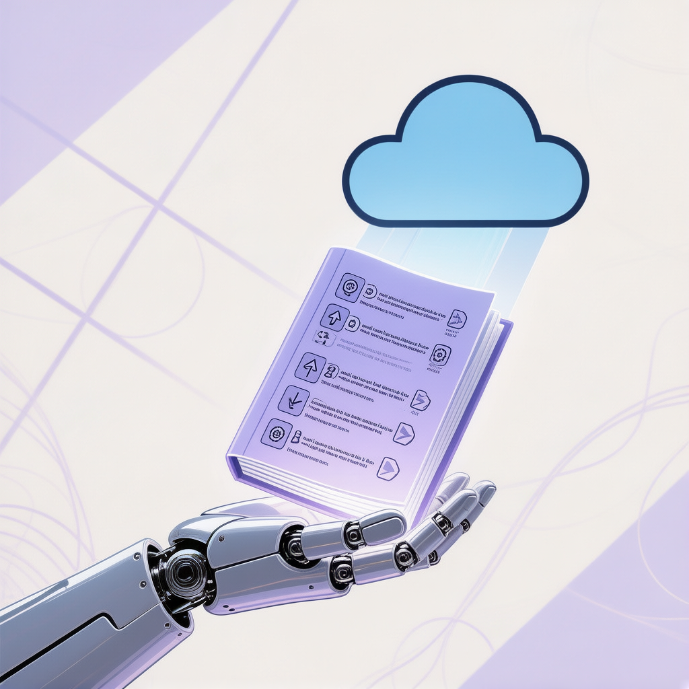
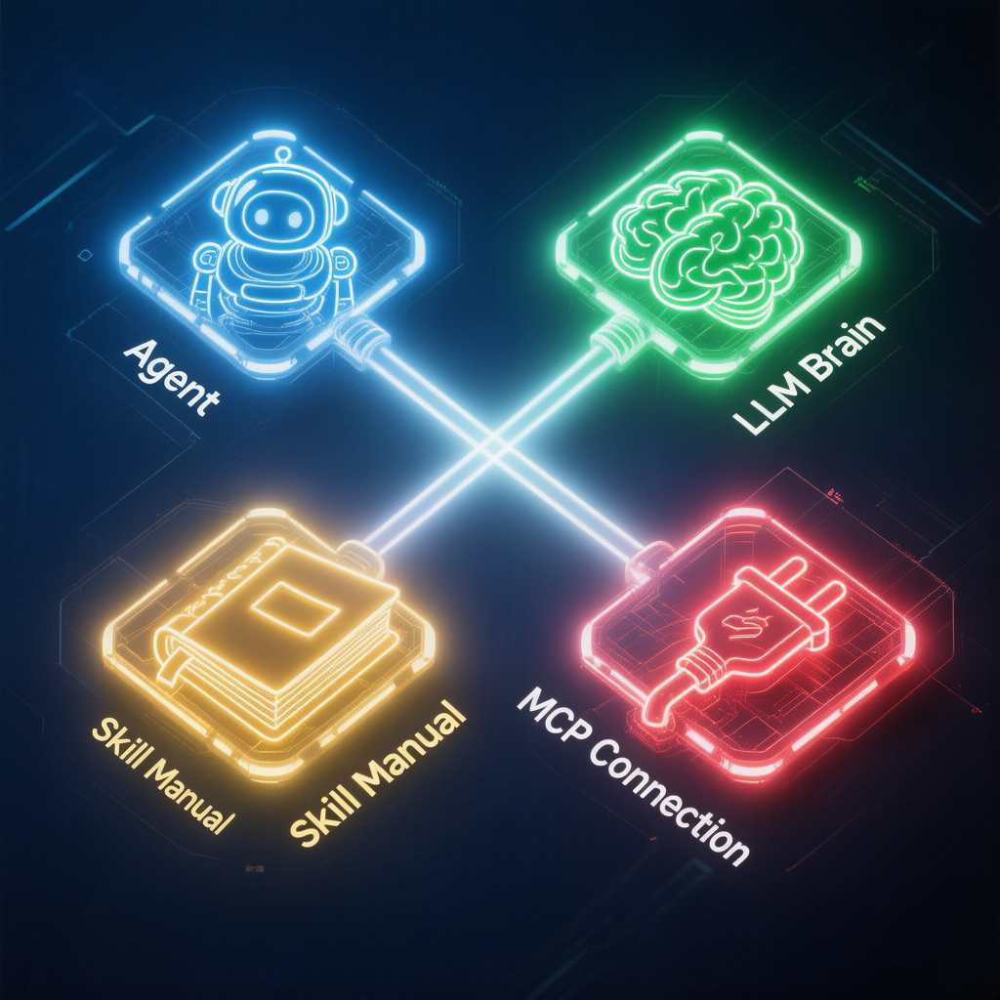
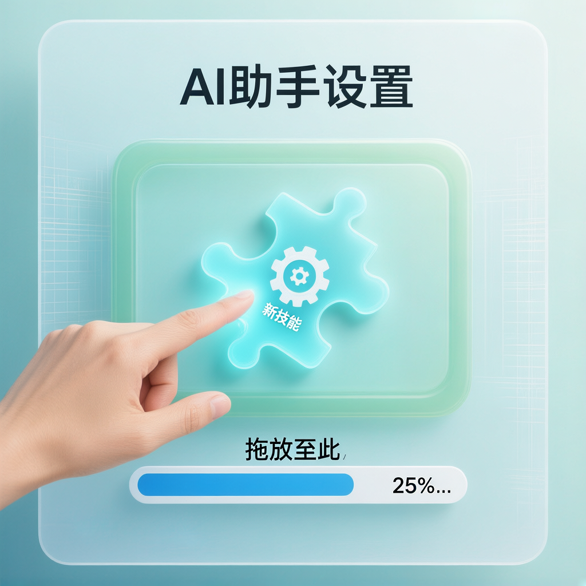

> 📎 来源: [忙嘞个芒](https://mp.weixin.qq.com/s?__biz=MzI1MDAyOTIzMA==&mid=2247483798&idx=1&sn=aff136f0f800f84cc4ccefc0d72c6617&chksm=e8873b92fd86f75f0edf6b5481f1a129de8b6be96c30742f53b95c62d941da1e209204c22a6b&mpshare=1&scene=1&srcid=0522QmjrH35WnXH0m1kbSkJR&sharer_shareinfo=88a5e361802400698b88ceb35daa23bb&sharer_shareinfo_first=88a5e361802400698b88ceb35daa23bb) | 时间: 2026-05-22 22:16

---

你有没有遇到过这种情况：让AI帮你做一件事，它每次的流程都不一样，质量忽高忽低，像个没有标准操作流程的新手厨师——同样的菜，今天咸了明天淡了。

问题不在于AI不够聪明，而在于它缺少一本**操作手册**。这本手册，在AI的世界里叫做**Skill**。

一、Skill不是超能力，而是标准流程

▲ Skill就像给员工编写的标准工作手册

很多人第一次听到"Skill"这个词，会以为它是什么高级能力或插件。但如果你把AI Agent想象成一个数字员工，Skill不过是这家公司给员工编写的**标准工作手册**。

一个做视频的Skill，就像厨房里的一道菜品SOP——它规定了三步走：先提取素材，再生成脚本，最后渲染输出。模型掌握了这个技能之后，每次做视频的流程就一模一样。

所以Skill的本质，是**把不确定性变成确定性**。用更少的时间，拿到更稳定的结果。

💡 独立判断

Skill的出现，标志着AI从"对话工具"迈向"流程自动化"的关键转折。它解决的不是一个AI能不能做的问题，而是能不能**每次都做得一样好**的问题。这才是企业级应用的入场券。

二、四个词看懂Agent生态

在深入Skill之前，需要理解它身处的整个生态。只需要记住四个词：

| 概念 | 类比 | 角色 |
| --- | --- | --- |
| Agent | 数字员工 | 能自主完成任务的执行者 |
| **LLM** | 大脑 | 决定智力上限 |
| **Skill** | 工作手册 | 标准化的操作流程 |
| **MCP** | 外部接口 | 连接外部数据和工具的桥梁 |

而Codex、Claude Code、WorkBuddy这些产品，本质上都是不同公司推出的Agent产品。模型负责想，Agent负责做，Skill告诉它怎么做，MCP让它触达外部世界。

💡 独立判断

这四个概念构成了AI应用的"最小闭环"：思考→执行→规范→连接。很多人只盯着模型升级，却忽略了Skill和MCP才是把AI从"聊天"变成"干活"的关键杠杆。

三、去哪找Skill？三条路各有利弊

当你理解了Skill的价值，第一个问题自然是：去哪找？综合多方信息，目前有三条主要渠道：

| 渠道 | 特点 | 适合场景 |
| --- | --- | --- |
| **官方市场** | 即装即用、最稳定 | 常见需求 |
| **GitHub/skills.sh** | 数量最多、更新最快 | 特定需求、前沿工具 |
| **ClawHub** | 社区驱动、经过筛选 | 相对成熟的场景 |

官方市场就像商场的品牌专柜——稳定但选择有限；GitHub/skills.sh是自由市场——什么都有，但需要自己淘；ClawHub则像是精选买手店——经过筛选，质量有保障。

四、安装Skill：复制链接一句话搞定

拿到Skill之后怎么装？出乎意料地简单。无论你用的是Codex、Claude Code还是WorkBuddy，流程几乎一致：

**1、找到目标Skill**：在官方市场点击安装，或在GitHub/skills.sh复制链接

**2、粘贴到对话框**：把链接发给你的Agent，说一句"帮我安装这个Skill"

**3、刷新即可**：安装完成后刷新界面，新技能就出现在技能列表里了

💡 独立判断

Skill格式不统一，看似是缺陷，实则是行业早期的必经阶段。正如USB标准统一之前的混乱期，最终会走向统一。

五、自己造一本手册：创建Skill的三要素

当市面上找不到你要的Skill，或者你有一套自己反复使用的独家流程，就可以动手创建一个。创建之前，只需要回答三个问题：

**这个技能做什么？**——明确定义它能解决什么问题

**什么时候触发？**——设定激活条件

**具体步骤是什么？**——写出严格按顺序执行的流程

六、当Skill成为基础设施

回看整个Skill生态，你会发现一个有趣的趋势：Skill正在从"可选插件"变成"基础设施"。

想象一下：当Skill市场足够成熟，你不再需要从零教AI做任何事。你只需要在市场里找到对应的技能，一键安装，就像给手机装App一样简单。

当你下次让AI做事却发现结果不稳定的时候，不要急着换模型——先想想，你给它配好"操作手册"了吗？
