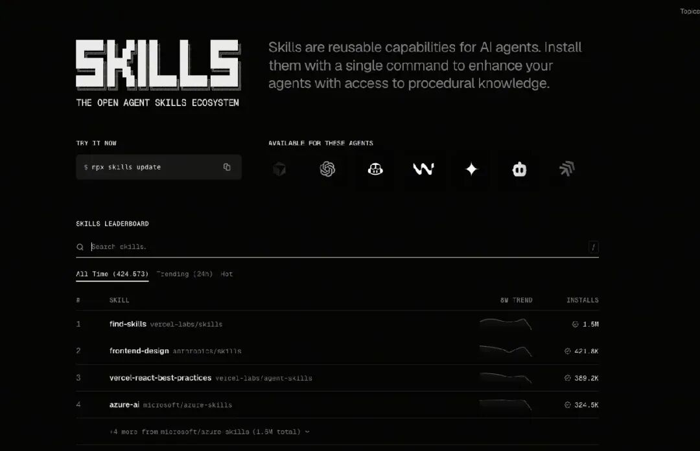
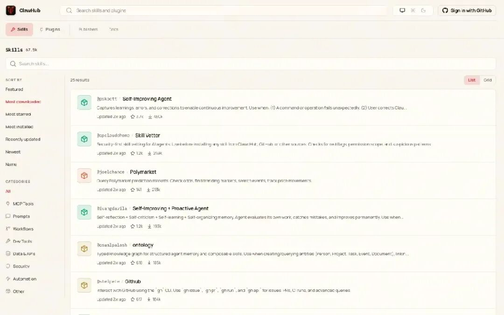
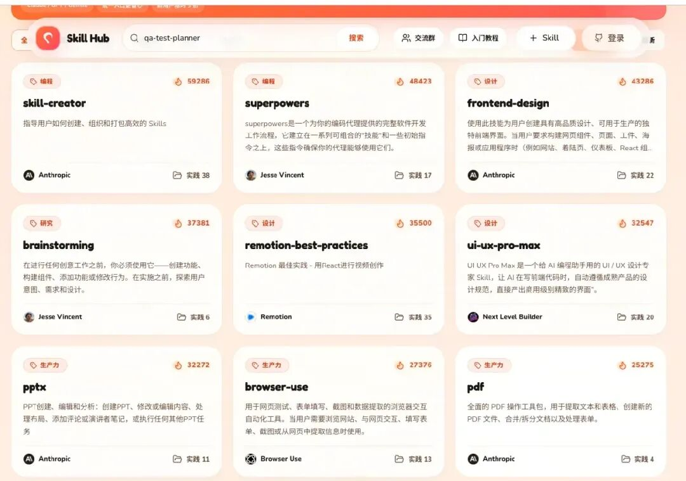
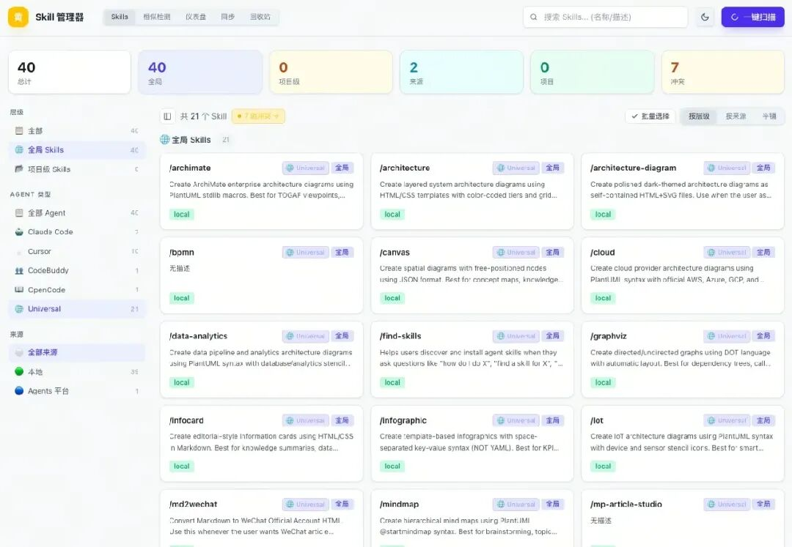
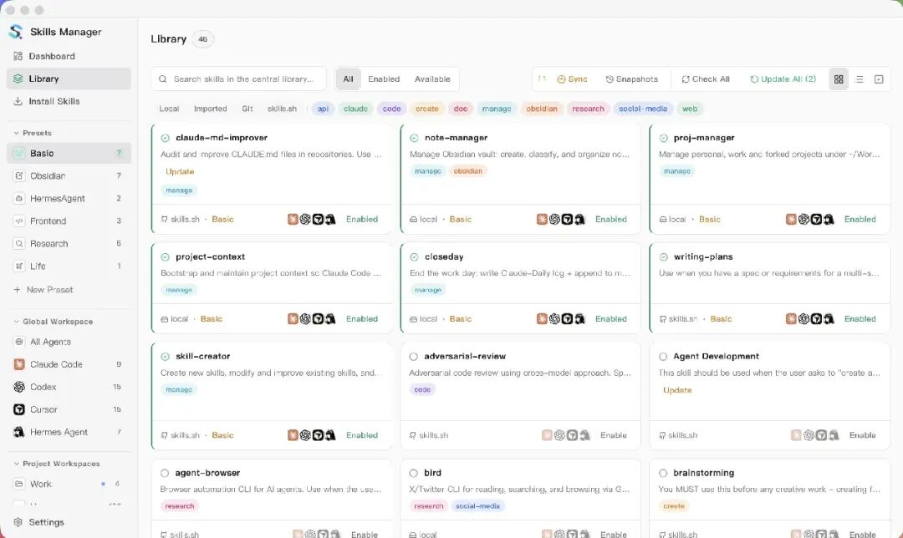
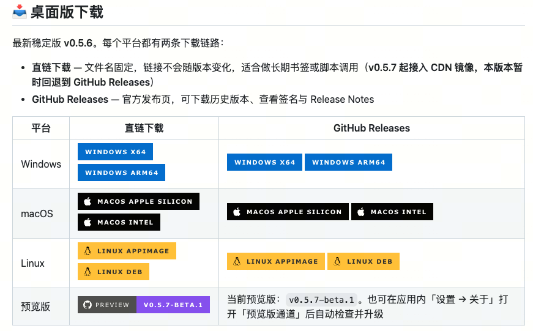
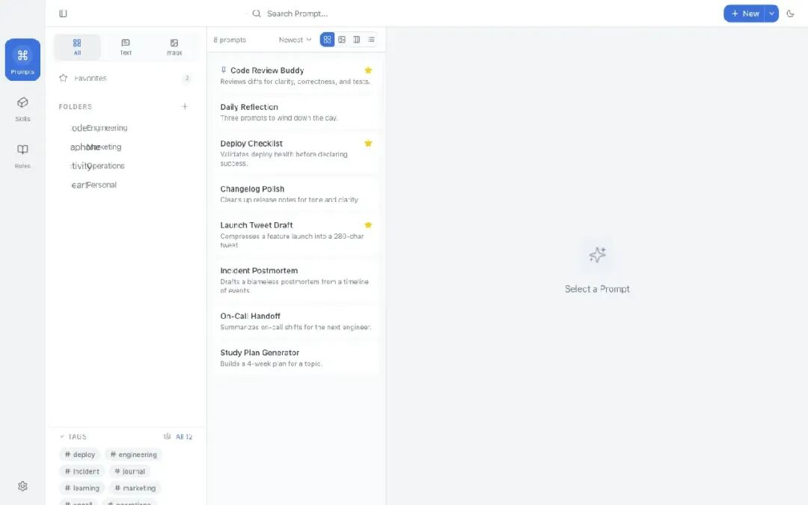

> 📎 来源: [天空奇点](https://mp.weixin.qq.com/s?__biz=MzI2MzM2MTM0MQ==&mid=2247484363&idx=1&sn=115100df59612bf624942900a514a63a&chksm=eb187baa1dc6622aeb980f7f5033cb23157895a46f20f98e9dcfa39fe8230e77bdd4f462f796&mpshare=1&scene=1&srcid=0530paqDzWEKbs6sH5DfVWka&sharer_shareinfo=8e03dd78d2f7fb281ef43b340c34bdc2&sharer_shareinfo_first=8e03dd78d2f7fb281ef43b340c34bdc2) | 时间: 2026-05-30 13:32

---

找 Skill、装 Skill、管 Skill：三个在线市场 + 三款本地桌面/Web 工具，一文串起来。

## 常用站点

下面三个站可以搜索、浏览、安装社区 Skill：

skills.sh — 技能索引与发现

ClawHub — 按下载量排序的 Skill 市场

Skill 中文站 — 中文检索与分类







💡小贴士

在线站点适合「发现新 Skill」；装到本机后，建议用下面的本地工具做统一管理与同步。

## 本地 SKILL 管理工具

### Skill Hub

Skill Hub 是**本地 Web UI**：扫描全盘、聚合展示、可视化编辑、自动版本快照。

**快速开始：**

npm install -g https://github.com/Backtthefuture/huangshu/raw/main/tools/skill-hub/release/claude-skill-hub.tgz && skill-hub



### Skills Manager

一个桌面应用，**统一管理** Cursor、Claude Code 等 AI 编码工具的 Skills。

**统一管理** — 从 Git、本地目录、

```
.zip
```

 / 

```
.skill
```

 文件或 skills.sh 市场安装，统一存放在 

```
~/.skills-manager
```

。

**多机同步** — 将 

```
~/.skills-manager/skills/
```

 备份到 Git，做版本管理与多机同步。

项目地址：github.com/xingkongliang/skills-manager



### PromptHub

Prompt、Skill、Agent **一站式**管理：提示词编辑、Skill 一键分发、Agent 资产云同步与版本管理。

**快速开始 / 项目地址：**github.com/legeling/PromptHub





在线找 Skill，本地用 Hub / Manager / PromptHub 装得稳、管得住。

作者：技术分享 / 公众号：天空奇点
