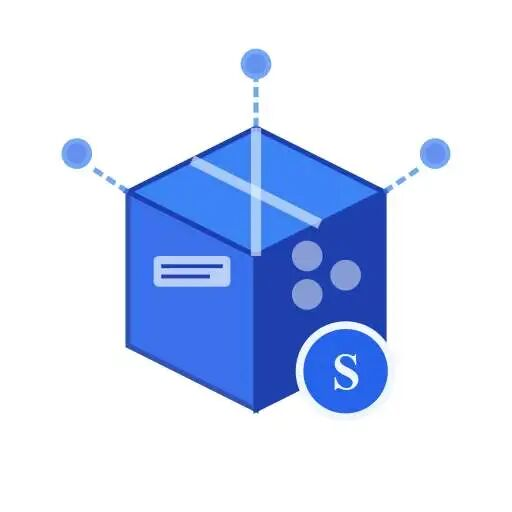
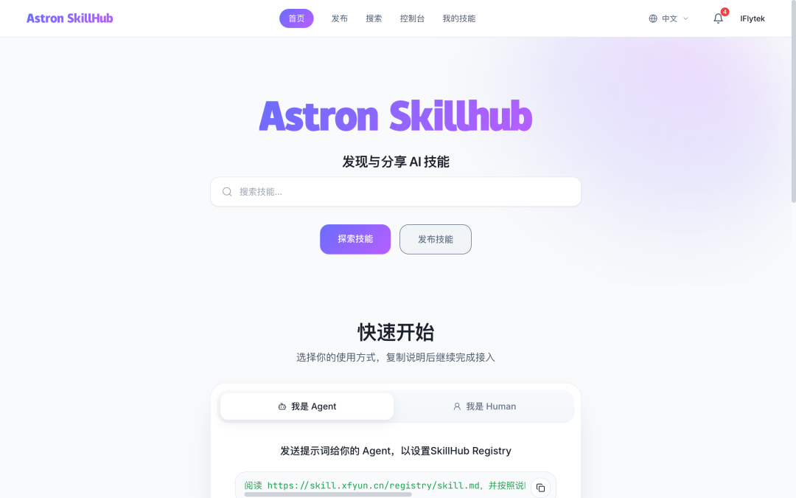
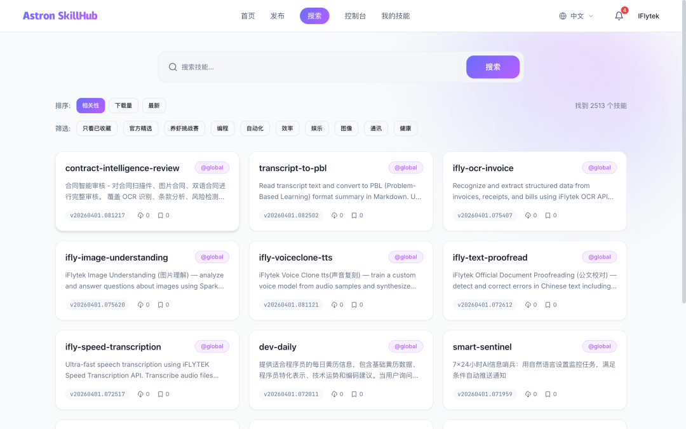
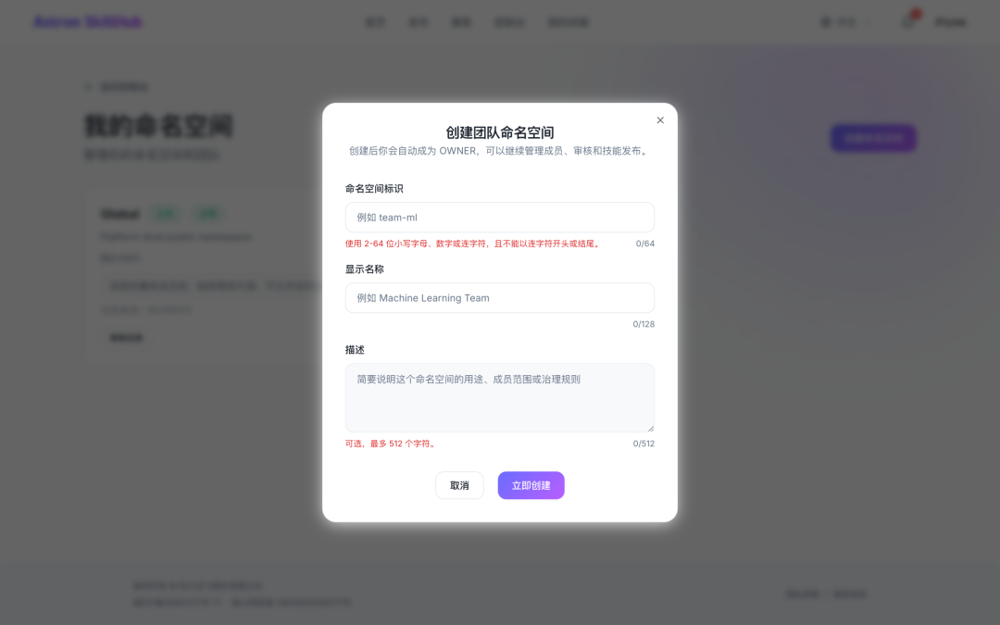
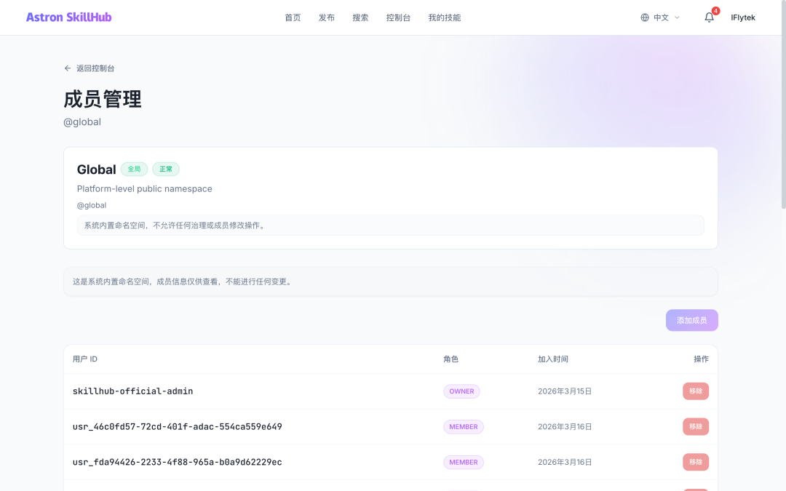
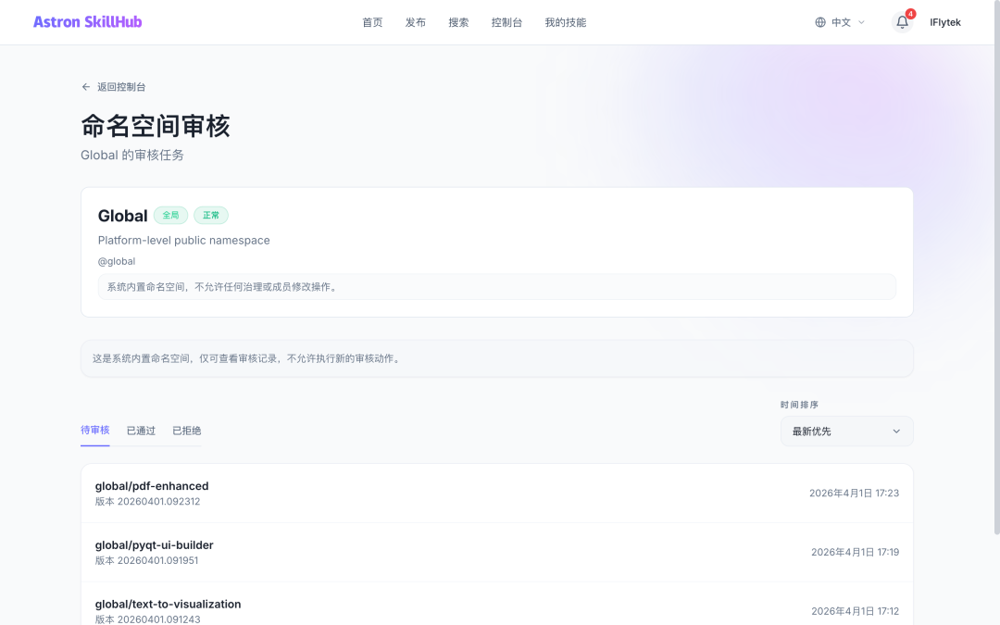
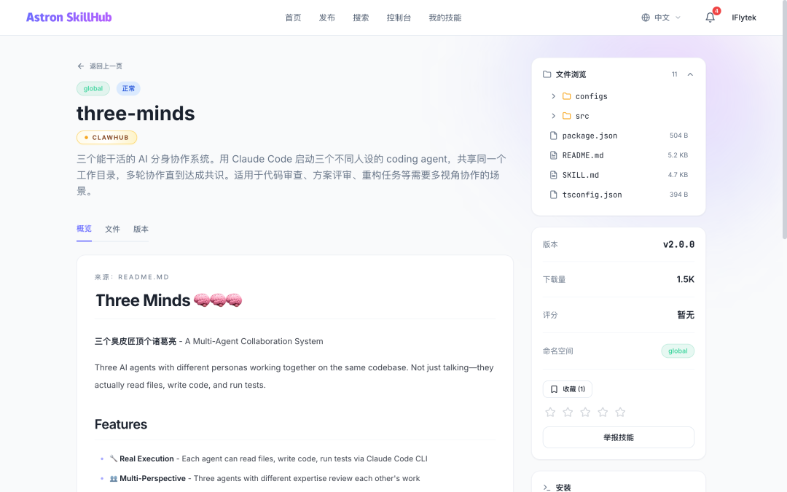
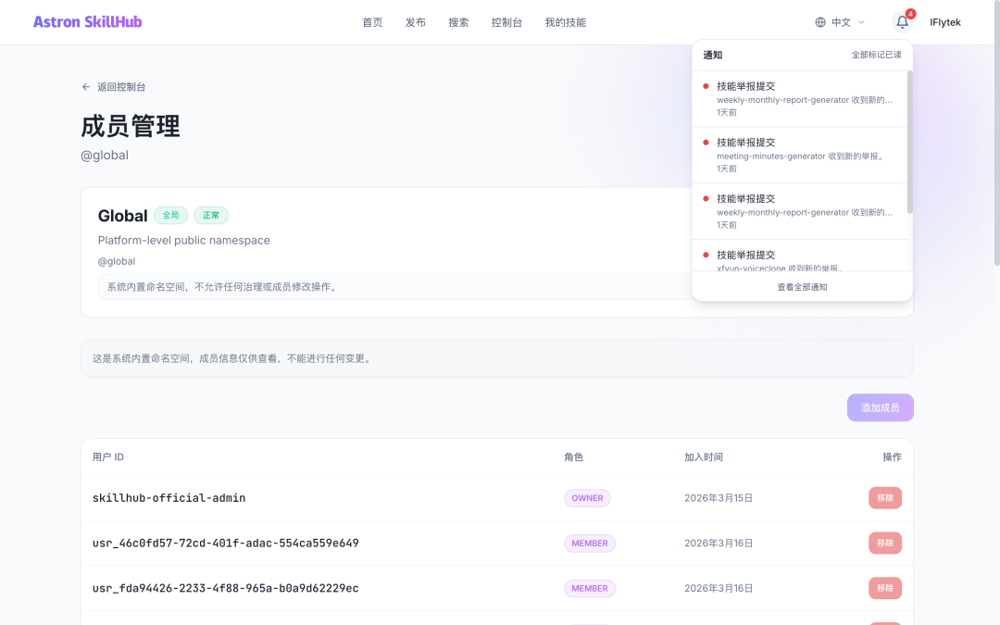
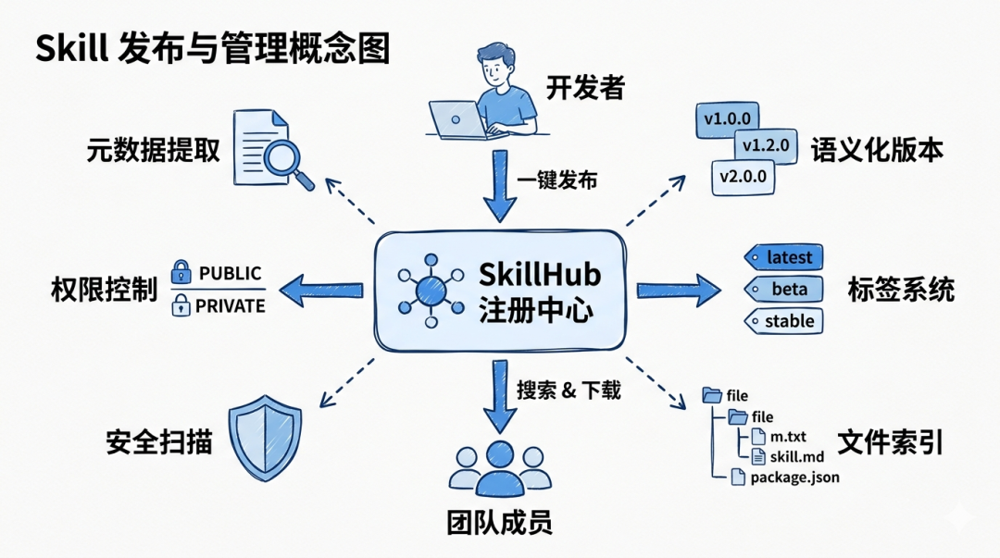

> 📎 来源: [一飞开源](https://mp.weixin.qq.com/s?__biz=Mzk0ODI4NjUyNA==&mid=2247508381&idx=1&sn=e8f78790529e85debff3f2972abc567c&chksm=c20fb4323f015c3b75ef7b2421f26b8c687747a45f0b43673c6bab36f288e5326dc5286b239f&mpshare=1&scene=1&srcid=05178tG3i63ozBi55rmbTEXJ&sharer_shareinfo=ec9378ba52d814527a67164a64b9033f&sharer_shareinfo_first=ec9378ba52d814527a67164a64b9033f) | 时间: 2026-05-17 23:58

---

> 一飞开源，介绍创意、新奇、有趣、实用的开源/AI应用、系统、软件、硬件及技术，一个探索、发现、分享、使用与互动交流的开源技术社区平台。致力于打造活力开源社区，共建开源新生态！

# 一、开源项目简介



# SkillHub

企业级开源智能体技能注册中心 — 在组织内发布、发现和管理可复用的技能包

SkillHub 是一个自托管平台，为团队提供私有的、受治理的智能体技能共享空间。发布技能包，推送到命名空间，让其他人通过搜索发现或通过 CLI 安装。专为防火墙后的本地部署而构建，提供与公共注册中心相同的精致体验。

# 二、开源协议

使用Apache-2.0开源协议

# 三、界面展示
















> 来源：SkillHub 官网文档

# 四、功能概述

Skill 发布是 SkillHub 的核心功能。开发者可以将本地开发的 Agent 技能包一键上传到注册中心，系统会自动处理版本管理、元数据提取、文件索引等工作。



**解决的问题**：

传统方式下，团队成员通过 Git 仓库或文件共享来分发技能包。这种方式存在几个痛点：

- **版本混乱**

  不同版本散落在各处，难以追踪
- **权限失控**

  无法精细控制谁能访问哪些技能包
- **发现困难**

  新成员不知道团队已有哪些可用技能

SkillHub 提供了类似 npm 的发布体验，但增加了企业级的权限控制和审核机制。

# 核心特性

- **自托管与私有化**

  — 部署在您自己的基础设施上。将专有技能保留在防火墙后，完全掌控数据主权。一条 make dev-all 命令即可在本地运行。
- **发布与版本管理**

  — 上传智能体技能包，支持语义化版本控制、自定义标签（beta、stable）和自动 latest 跟踪。
- **发现**

  — 全文搜索，支持按命名空间、下载量、评分和时间筛选。可见性规则确保用户只能看到其有权访问的内容。
- **团队命名空间**

  — 在团队或全局范围下组织技能。每个命名空间拥有自己的成员、角色（Owner / Admin / Member）和发布策略。
- **审核与治理**

  — 团队管理员在其命名空间内审核；平台管理员控制向全局范围的推广。治理操作记录审计日志以满足合规要求。
- **社交功能**

  — 收藏技能、评分并跟踪下载量。围绕组织的最佳实践构建社区。
- **账户合并**

  — 将多个 OAuth 身份和 API 令牌整合到单个用户账户下。
- **API 令牌管理**

  — 为 CLI 和程序化访问生成作用域令牌，采用基于前缀的安全哈希。
- **CLI 优先**

  — 原生 REST API，加上对现有 ClawHub 风格注册中心客户端的兼容层。原生 CLI API 是主要支持路径，协议兼容性持续扩展中。
- **可插拔存储**

  — 开发环境使用本地文件系统，生产环境使用 S3 / MinIO。通过配置切换。
- **国际化**

  — 使用 i18next 支持多语言。

# 五、技术选型

# 技术栈概览

|  |  |  |
| --- | --- | --- |
| 层级 | 技术 | 职责 |
| **前端** | React 19, TypeScript, Vite, TanStack Router & Query, shadcn/ui, Tailwind CSS, i18next | 包含路由、状态管理和国际化的 SPA |
| **后端** | Java 21, Spring Boot 3.2, Spring Security, Springdoc OpenAPI | 采用模块化架构的 REST API |
| **数据库** | PostgreSQL 16 + Flyway | 主数据存储、全文搜索、架构迁移 |
| **缓存** | Redis 7 | 会话管理、分布式锁、限流 |
| **对象存储** | 本地文件系统 (开发环境) / 兼容 S3 协议 (MinIO, AWS S3) | 技能包文件与打包归档 |
| **安全** | Spring Security OAuth2, RBAC, API 令牌, CSRF 防护 | 认证、授权、凭证管理 |
| **扫描器** | Python 服务 | 对上传的技能包进行多引擎安全分析 |
| **部署** | Docker Compose, Kubernetes, GitHub Actions → GHCR | 容器编排、多架构镜像发布 |

# 开发

# 前置要求

- Java 21+
- Node.js 20+
- Docker & Docker Compose
- Make

# 启动开发环境

```
# 克隆仓库
```

> 国内开发者：如果 Maven 依赖下载超时，需配置阿里云镜像。详见 本地开发指南。

# 常用命令

```
make help                    # 显示所有可用命令
```

# 项目结构

```
skillhub/
```

```

```

> 详细内容请查看 README.md 文档

# 六、源码地址

开源项目地址：

https://github.com/iflytek/skillhub

访问一飞开源：https://code.exmay.com/
