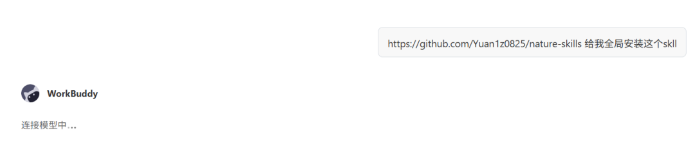
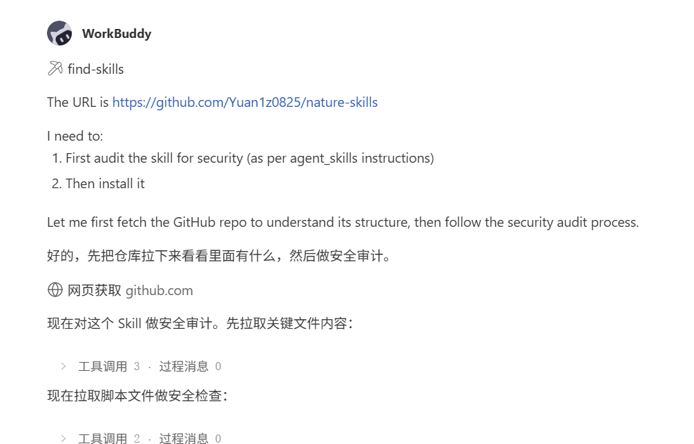
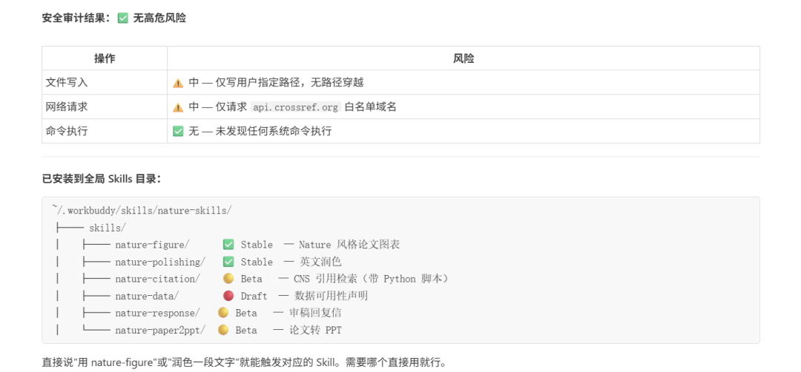
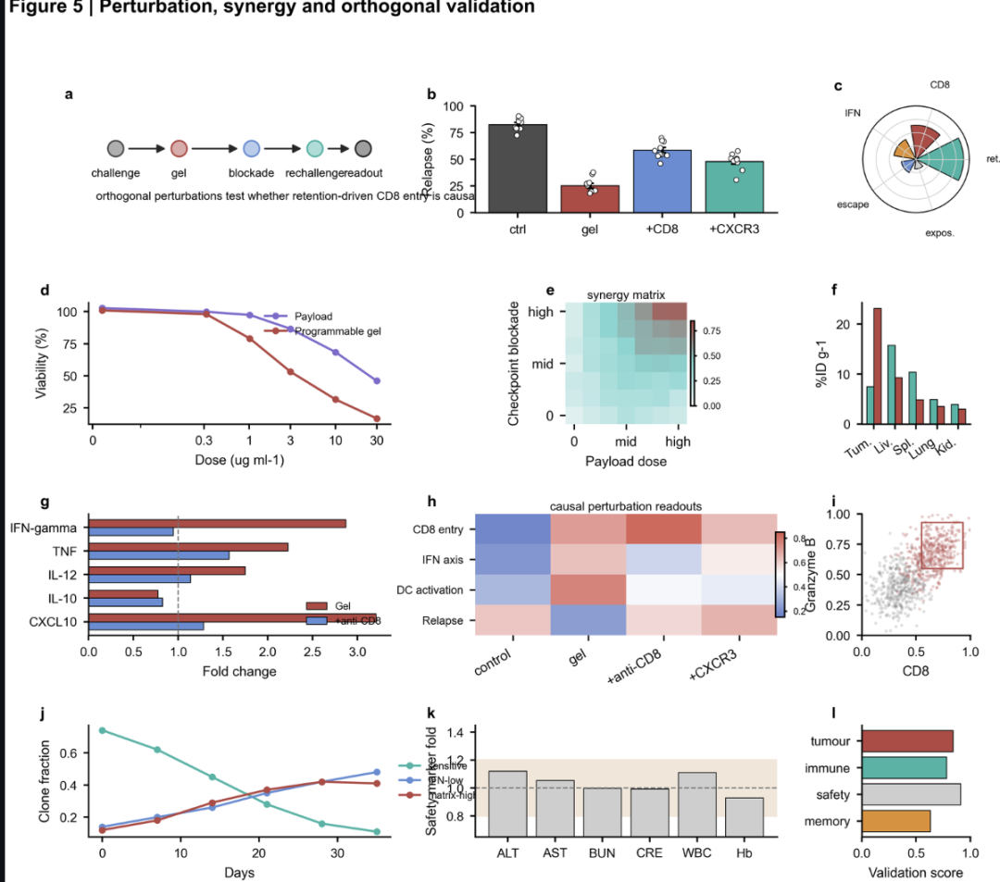
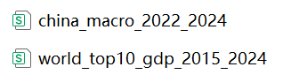
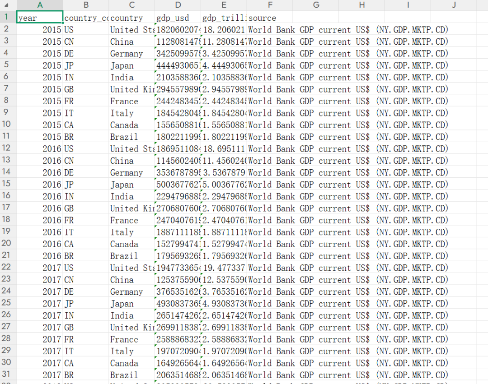
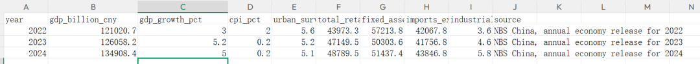
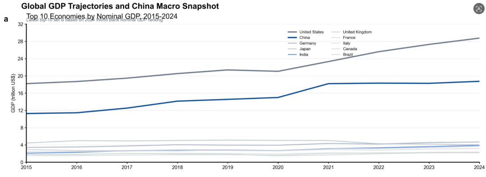
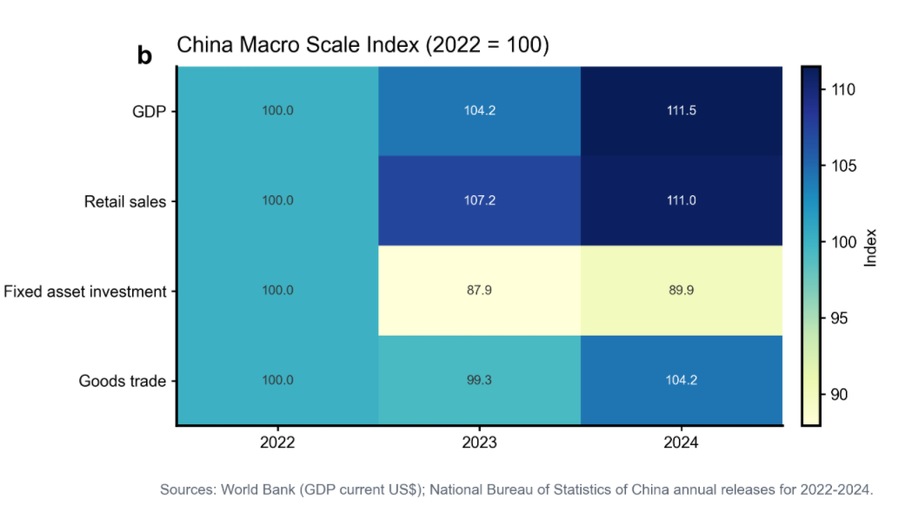
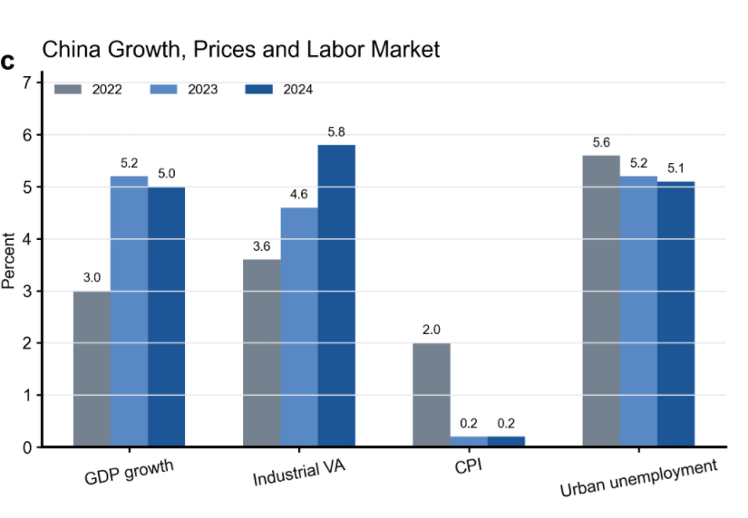

> 📎 来源: [AI变革指南](https://mp.weixin.qq.com/s?__biz=MzIzMTQ0NTM2MA==&mid=2247489430&idx=2&sn=a074ca08737e820d24214323dabf2736&chksm=e9a480c241e629160dea216dd3c4d5a1c9037752f99bf0890cf1dc97e9bab7051801bea66a86&mpshare=1&scene=1&srcid=0529JEX0HrHgXkeFaJ07HopG&sharer_shareinfo=52373882d228a5fe55e73f3042a91fcc&sharer_shareinfo_first=52373882d228a5fe55e73f3042a91fcc) | 时间: 2026-05-29 12:20

---

上一篇介绍了一个skill，能解决大家写论文中一些麻烦点，具体见文章

[搞科研写论文的看过来！这个skill帮你解决了最麻烦的五件事！](https://mp.weixin.qq.com/s?__biz=MzIzMTQ0NTM2MA==&mid=2247489407&idx=1&sn=a4802df85d85bfe1215c76bce21b9584&scene=21#wechat_redirect)

这篇文章主要是介绍下如何使用这个skill

01\_准备工作

skill是配合着AI智能体使用（skill本质上是给智能体用的工作流），所以你需要电脑上安装编程智能体。

下面是目前常用的，选择你喜欢的安装就好。如果你已经有了智能体，那么跳过这个环节，看下一章节。

国外好用智能体有：

1、codex（推荐），OpenAI公司推出的，桌面级AI智能体。

下载地址：https://openai.com/zh-Hans-CN/codex/

2、claude code，Anthropic 推出的**全流程自主式 AI 编程智能体，目前编程领域最火的**

下载地址：https://claude.com/download

国内好用智能体有：

1、Trae，字节旗下的编程办公智能体平台，分为国内版和国外版。国内版有免费模型使用，但是需要排队。国外版需要付费，可以使用GPT-5.4模型

国内版下载地址：https://www.trae.cn/ide/download

国外版下载地址：https://claude.com/download

2、workbuddy，腾讯旗下的桌面智能体，可以编程，可以办公和腾讯家产品链接做的好，适合轻度编程+日常办公人群使用。

下载地址：https://www.codebuddy.cn/work/

3、EOS，我朋友做的一个办公编程智能体，结合了codex和claude code等多个好产品优点。

下载地址：

https://github.com/dreamSailing/eos-app/releases/tag/v0.2.0-beta.1

02\_安装skill

用智能体安装skill很简单，你不需要懂任何原理，你把skill的地址复制，然后发给智能体，让其安装。

复制以下地址

```
https://github.com/Yuan1z0825/nature-skills
```

在你的智能体里粘贴，然后告诉其安装（我用workbuddy举例子）具体输入如下：

“https://github.com/Yuan1z0825/nature-skills 给我全局安装这个skll”



AI会自动工作，帮你安装好





03\_使用skill

今天先介绍第一个功能，图表生成，使用的是skill中的 nature-figure

把你需要制作图表的数据整理好，放到文件夹中。然后让你的智能体读取你的文件夹，你描述你要生成的图类型。

目前这个skill支持十种图表生成，包括条形图、折线图、热图、散点图/气泡图、雷达图/极坐标图、分布图、森林图/间隔图、区域图/堆叠图、图像板图和网络图/矩阵图。



实战示例：生成根据世界和中国的金融数据，生成图表

1、我让AI搜集整理了世界和中国最近几年的金融数据，然后存入文件中



下图是全球主要国家最近10年的GDP数据（world\_top10\_gdp\_2015\_2024）



下图是中国最近3年的经济数据（china\_macro\_2022\_2024）



2、和智能体对话，让其根据这两个文件，调用nature-skill生成图表

 “ 请根据文件中的数据，调用nature-skill，生成图片 ”

稍等几分钟，就生成了如下的效果图







其他的功能其实也是类似的使用，配合智能体，很快很简单，不需要你写一行代码，如有问题，可以留言私信讨论！

看到这里一定是真爱粉丝了，如果帮助到你了，请点赞推荐关注一波！

我个人有个星球，会在里面更新更多的工具和干货，期待大家的加入~


