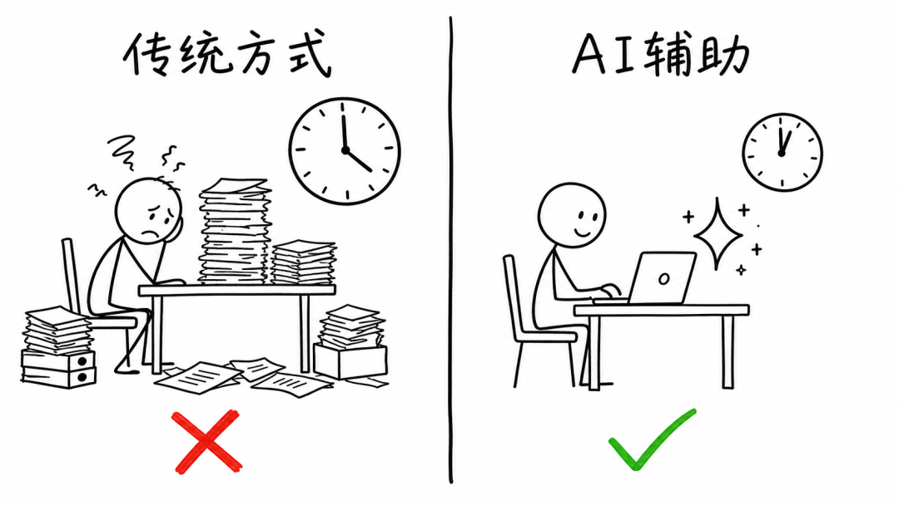
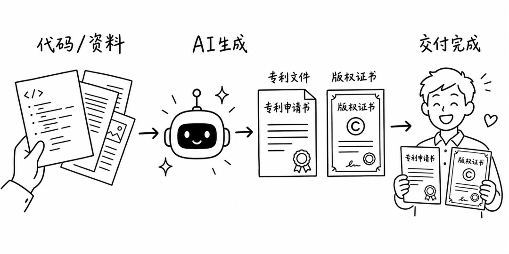
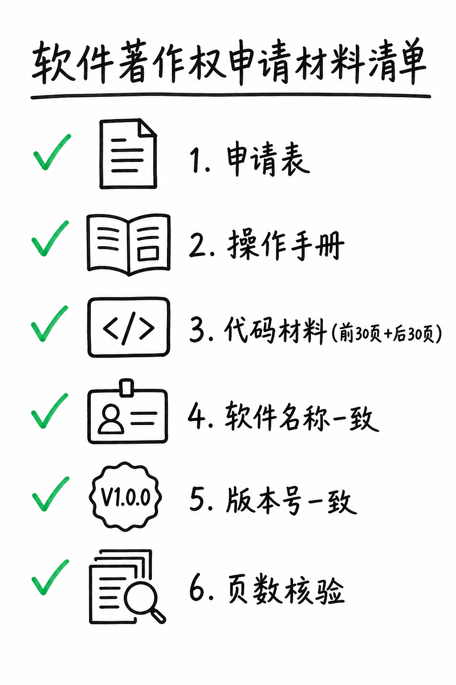
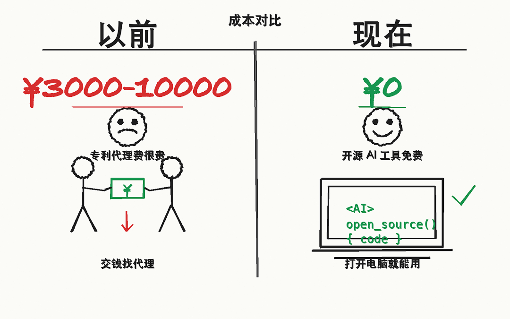

> 📎 来源: [AI实战局](https://mp.weixin.qq.com/s?__biz=MzkwNzUzMzIyMw==&mid=2247484426&idx=1&sn=e951581409cd56f969a9f562eb723854&chksm=c1a207b1851287c07b26b066a2f54eb919ad93bbe4d1b0c4814568e96963a9ed660672fba439&mpshare=1&scene=1&srcid=05179clw4BodHyqyyEGQ4t7e&sharer_shareinfo=658e17626e055f8b4da0b934825abe78&sharer_shareinfo_first=658e17626e055f8b4da0b934825abe78) | 时间: 2026-05-17 23:50

---


喜欢就关注我哦～

#

> 以前找代理要几千块，现在 AI 帮你搞定，代码和文档都留在本地。

---

痛点：写专利交底书和软著申请，太痛苦了

前几天，我在整理专利交底书时，发现一个问题。

每次写都要花好几天，从项目文档里挖技术点，去专利局查新，画系统框图，最后整理成 Word 文档。整个过程枯燥、重复、但又不能出错。

我有个朋友，去年写了一份专利交底书，前后改了七稿。每次以为差不多了，代理人又打回来，说这里逻辑不通，那里创新点不明确。最后他跟我说：以后再也不自己写了，花钱找代办。

软著申请也一样。申请表要填对，操作手册要像样，代码材料要按规则截取前 30 页后 30 页，软件名称、版本号、页数还要保持一致。我有个同事，因为操作手册写得太简单被退回来了，补了一周的材料，又因为代码材料的页数对不上被打回来，前后折腾了一个多月。

你是不是也遇到过这种事？



传统方式 vs AI 辅助流程对比

---

## 两个工具，解决两个问题

今天介绍两个开源工具，一个做专利，一个做软著。都是免费的，代码和文档都留在本地。



AI + 知识产权概念图

### 专利 Skill：专利点挖掘

**能干什么：** 扫描项目文档和代码，自动挖掘专利点，去专利局查新，生成完整的技术交底书（含 mermaid 框图和 Word 文档）。

**适合谁：** 有代码仓库的开发者，需要写专利交底书的人。

**不适合谁：** 纯文档类项目（没有代码），或者只需要简单专利点建议的人。

**GitHub：**https://github.com/handsomestWei/patent-disclosure-skill

### 软著 Skill：软件著作权申请

**能干什么：** 分析项目代码，自动生成申请表信息、操作手册、代码材料（前 30 页 + 后 30 页），输出 Word 和 TXT 文件。

**适合谁：** 需要申请软件著作权的开发者和团队。

**不适合谁：** 非软件类项目（比如硬件产品、纯设计方案）。

**GitHub：**https://github.com/Fokkyp/SoftwareCopyright-Skill

---

## 怎么安装

### 专利 Skill

在你的项目目录下执行：

- 1
- 2

```
mkdir -p .claude/skills
```

装完之后，在 Claude Code 或 Cursor 里直接说"帮我做专利挖掘"就行。

如果你有 .docx 或 .pptx 文件需要转换，还需要装 Python 依赖：

- 1
- 2

```
cd .claude/skills/patent-disclosure-skill
```

如果要用专利局查新功能，还需要装 Playwright：

- 1
- 2

```
pip install -r tools/requirements-cnipa.txt
```

### 软著 Skill

克隆仓库后把 `software-copyright-materials` 目录复制到 skills 目录：

- 1
- 2

```
git clone https://github.com/Fokkyp/SoftwareCopyright-Skill
```

装完之后，在 Codex 里说"帮我生成软著申请资料"就行。

如果需要完整的 Word 生成能力，还需要装 .NET SDK（可选，不装也能用基础方案）。

---

## 专利 Skill 使用流程

整个流程分七步，每步都会停下来让你确认：

**第一步：环境检查**

它会检查你的 Python 环境和依赖是否齐全。如果有 .docx 或 .pptx 文件需要转换，它会提示你安装 mammoth 或 python-pptx。

**第二步：项目扫描**

它会按优先级读你的项目文档和代码。Markdown、代码文件直接读，Word 和 PPT 先转成 Markdown 再扫。这一步很关键，因为很多项目的技术方案都藏在这些文档里。

**第三步：专利点挖掘**

它会分析你的技术方案，找出可能具有新颖性和创造性的点，然后跟你讨论哪些点值得申请。

**第四步：查新**

这一步最让我惊讶。它优先去专利局的公布公告站，用 Playwright 精准爬取。你需要先提供 2-8 个相关度高的关键词，它会分多次调用，每次只搜一个词块，然后按专利号合并结果。查不到结果，再降级到 Google 学术。

**第五步：生成技术交底书**

它会用 mermaid 生成系统框图和流程图，然后按照专利交底书的标准格式组织内容，最后导出 Word 文档。文件命名是 `{案件名}_{时间戳}.md` 和同名 `.docx`。

**第六步：自检**

生成完交底书之后，它会自动检查逻辑闭环、公式与参数一致性。如果有问题，它会标注出来让你修改。

**第七步：迭代**

如果你需要修改，它会把修改后的内容另存为新文件，不会覆盖旧稿。每轮修改还会生成一个 `交底书修订对话记录.md`，方便追溯。

---

## 软著 Skill 使用流程

同样分七步，有 7 个强制确认节点：

**第一步：环境检查**

运行 `check_environment.py`，检查你的 Python 环境、DOCX 生成工具是否齐全。如果 .NET SDK 缺失，它会问你要不要安装完整环境，还是用基础方案继续。

**第二步：项目分析**

扫描你的项目代码，理解你的软件是干什么的，然后生成一个 `业务理解.md`，包括行业、目标用户、核心功能、申请口径。这一步会停下来让你确认。

**第三步：申请表信息**

自动生成 `申请表信息.txt`，包括软件名称、版本号、著作权人、开发环境、运行环境、源程序量、功能说明等字段。你对照着填到官网就行。这一步也会停下来让你确认。

**第四步：代码选择**

生成一个 `代码文件选择.json`，列出它打算抽取的代码文件和行段。你要确认哪些文件选对了，哪些要改。这一步同样会停下来。

**第五步：操作手册**

先理解你的项目业务，然后写面向审核员的操作说明。不是套模板的功能列表，而是用普通人能看懂的语言说明软件用途和操作流程。而且它会自动去"AI 味"——避免"旨在、赋能、一站式、高效便捷"这种套话。

**第六步：截图**

问你用什么方式截图：Chrome DevTools MCP、Codex Computer Use、还是你自己截。如果现在不想截图，可以跳过，但操作手册里会保留截图预留位置。

**第七步：Word/TXT 输出**

确认所有草稿没问题后，生成正式的操作手册 DOCX、代码材料 DOCX 和申请表 TXT，统一放在 `软件著作权申请资料/正式资料/` 目录下。



软著申请材料清单

---

## 成本对比



成本对比：以前几千上万 vs 现在免费

| 项目 | 以前找代理 | 用 AI Skill |
| --- | --- | --- |
| 专利交底书 | 几千~上万 | 免费 |
| 软著申请 | 几百~上千 | 免费 |
| 时间 | 好几天~一周 | 几分钟 |
| 材料归属 | 代理手里 | 本地，随时可改 |

---

## 实测感受

说实话，这两个工具我没有长时间使用，但从项目的实现来看，设计思路是认真的：

**优点：**

- 流程完整，不是那种"帮你写个大概"的玩具
- 有查新功能，去专利局爬取而不是随便搜 Google
- 有自检功能，能发现逻辑不一致的问题
- 有迭代功能，修改不会覆盖旧稿
- 代码和文档都留在本地，你随时可以改
- 7 个强制确认节点，你对材料有完全控制

**缺点：**

- 第一次运行需要装不少依赖，环境配置有点麻烦
- 专利 Skill 目前只支持中文专利，不支持英文
- 软著 Skill 的 .NET SDK 依赖可能让部分用户头疼
- 生成速度不算快，大项目要等几分钟

**踩过的坑：**

- 专利 Skill：如果项目里有 .docx 文件，需要先装 mammoth，不然会报错
- 专利 Skill：查新时提供的关键词要准确，太泛了结果太多，太窄了可能查不到
- 软著 Skill：如果 .NET SDK 没装，生成的 Word 文档可能格式有问题

---

## 适合谁用

**适合：**

- 有代码仓库的开发者，需要写专利交底书
- 需要申请软件著作权的团队
- 想省时间、省钱，但又不想完全依赖代办的人
- 对技术方案比较熟悉，能判断 AI 生成内容质量的人

**不适合：**

- 纯文档类项目（没有代码）
- 完全不懂技术，无法判断 AI 输出质量的人
- 需要英文专利申请的人
- 对格式要求极高，需要像素级调整的人

---

## 总结

这两个工具解决了一个很实际的问题：知识产权申请中的重复性文档工作。

以前找代理要几千块，现在 AI 帮你搞定。代码和文档都留在本地，你随时可以改。

但有一点要说清楚：AI 生成的内容，最后都要经过你的确认。它不会自动提交，不会替你做决定。你还是那个最终把关的人。

如果你也有写专利交底书或软著申请的痛点，现在就去试试。

**GitHub 仓库：**

- 专利：https://github.com/handsomestWei/patent-disclosure-skill
- 软著：https://github.com/Fokkyp/SoftwareCopyright-Skill

省下来的时间，可以写更多代码。

---

以上，既然看到这里了，如果觉得不错，随手点个赞、转发吧，如果想第一时间收到推送，也可以加个关注～谢谢你看我的文章，我们，下次再见。

交个朋友


