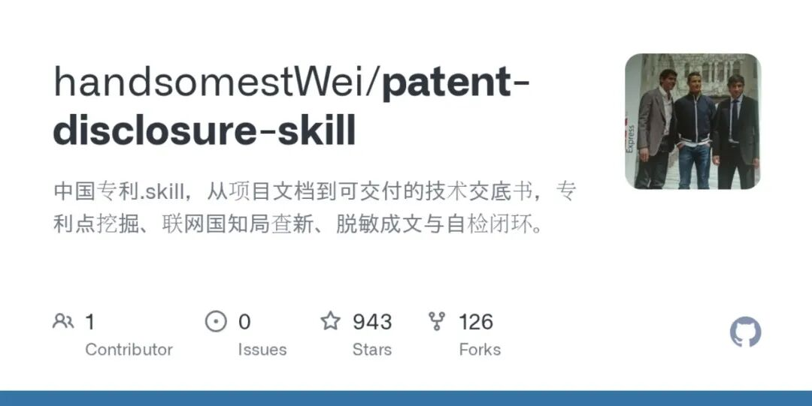

> 📎 来源: [掘金GitHub](https://mp.weixin.qq.com/s?__biz=Mzk2NDMzMDY3OA==&mid=2247484483&idx=1&sn=9df2749dfce04f780a7a1638cf86c27d&chksm=c539db9f720cd2b3019a5e1d04c4f1186bf906d87887769d727596feac64e2531fcf247b1621&mpshare=1&scene=1&srcid=0525l7ztg2fKIMZtJTkOmx39&sharer_shareinfo=9856c959c985ec8d62978b90ebb83a7d&sharer_shareinfo_first=9856c959c985ec8d62978b90ebb83a7d) | 时间: 2026-05-25 15:24

---

写专利交底书，是很多研发工程师的噩梦。

产品做完了，技术文档也写了，代码也交了。但专利代理人一句"系统框图呢？流程图呢？"就让你从头再来一遍。

handsomestWei 开源了一个 AgentSkill，叫 **patent-disclosure-skill**，专门做这件事——**从项目文档出发，自动挖掘专利点、检索现有专利、生成技术交底书。**

GitHub：https://github.com/handsomestWei/patent-disclosure-skill



## 01 它解决了什么痛点

写专利交底书，最烦的地方在哪里？

- 要从代码和文档里**挖专利点**，不是看一眼就有的
- 要**检索现有专利**，确认自己的技术有没有人先做了
- 要画**系统框图、流程图**，Mermaid 都不一定会
- 要写成代理人能直接改的格式，不是你自己写的随便文档

这个 Skill 把这些步骤全部自动化了。你给项目文档，它给你一份可交付的技术交底书。

## 02 工作流程

一个 AgentSkill，安装到 Claude Code 或 Cursor 里，一条命令触发：

```
/patent-disclosure-skill/交底书
```

然后它按 7 步走：

### 2.1 项目扫描

自动读取你的项目文档和代码，先搞清楚你的技术到底是什么。支持 

```
.docx
```

 和 

```
.pptx
```

 文件，会自动转成 Markdown 再扫描。

### 2.2 专利点挖掘

不只是"你的技术有什么特点"，它会**讨论和融合多个候选专利点**，帮你找到最有价值的申请方向。

### 2.3 查新检索

查现有专利：**优先使用国家知识产权局·中国专利公布公告站**（epub.cnipa.gov.cn），查不到时自动降级到 WebSearch。

这一步最关键——写交底书前不知道有没有人先做了，后面全白干。

### 2.4 交底书成稿

自动生成完整的交底书文档，包含：

- **脱敏后的模板**（不需要你自己写）
- **Mermaid 系统框图和流程图**（自动转 PNG）
- **可直接交付的 Word 文件**（.docx）

### 2.5 自检

逻辑是否闭环？公式和参数是否一致？自动生成一份自检报告，不写入正文，但帮你查漏补缺。

### 2.6 迭代管理

交底书不是一次成型的。修改了方案怎么办？Skill 会自动：

- 合并新版本到旧版
- 纠正错误信息
- 生成**修订对话记录**，每一步变更都有据可查

### 2.7 交付

最终输出的文件自动命名：

```
{案件名}_{时间戳}.md
```

 和同名 

```
.docx
```

，清晰明了，直接交给代理人。

## 03 技术栈

- **AgentSkills 标准格式**：兼容 Claude Code、Cursor 等 AI IDE
- **Python 3.9+**：专利查新、文档生成、文件处理
- **Node.js**：Mermaid 图表渲染（npm mmdc）
- **Playwright**：国知局站的精准爬取

## 写在最后

专利交底书是技术人和法律之间的桥梁。以前这座桥全靠人力搭，现在有人帮你用 AI 搭好了。

如果你或者你的团队经常写专利交底书，这个 Skill 值得试。

GitHub：https://github.com/handsomestWei/patent-disclosure-skill
