> 📎 来源: [小爽爽学智能体鸭](https://mp.weixin.qq.com/s?__biz=MzIxODc1MTM2Nw==&mid=2247491224&idx=1&sn=6a5fd7ab51f364cdb71c15d72b428c22&chksm=96c2fb817c931c10edf71a9eb99f26dac939be541677d0d7b729fd36183ceffc70ac47491862&mpshare=1&scene=1&srcid=0530FLp9qKL78dWuLZHMbTIN&sharer_shareinfo=b2fe4d2ebb290742ae3f4db8b41355d0&sharer_shareinfo_first=b2fe4d2ebb290742ae3f4db8b41355d0) | 时间: 2026-05-30 01:55

---

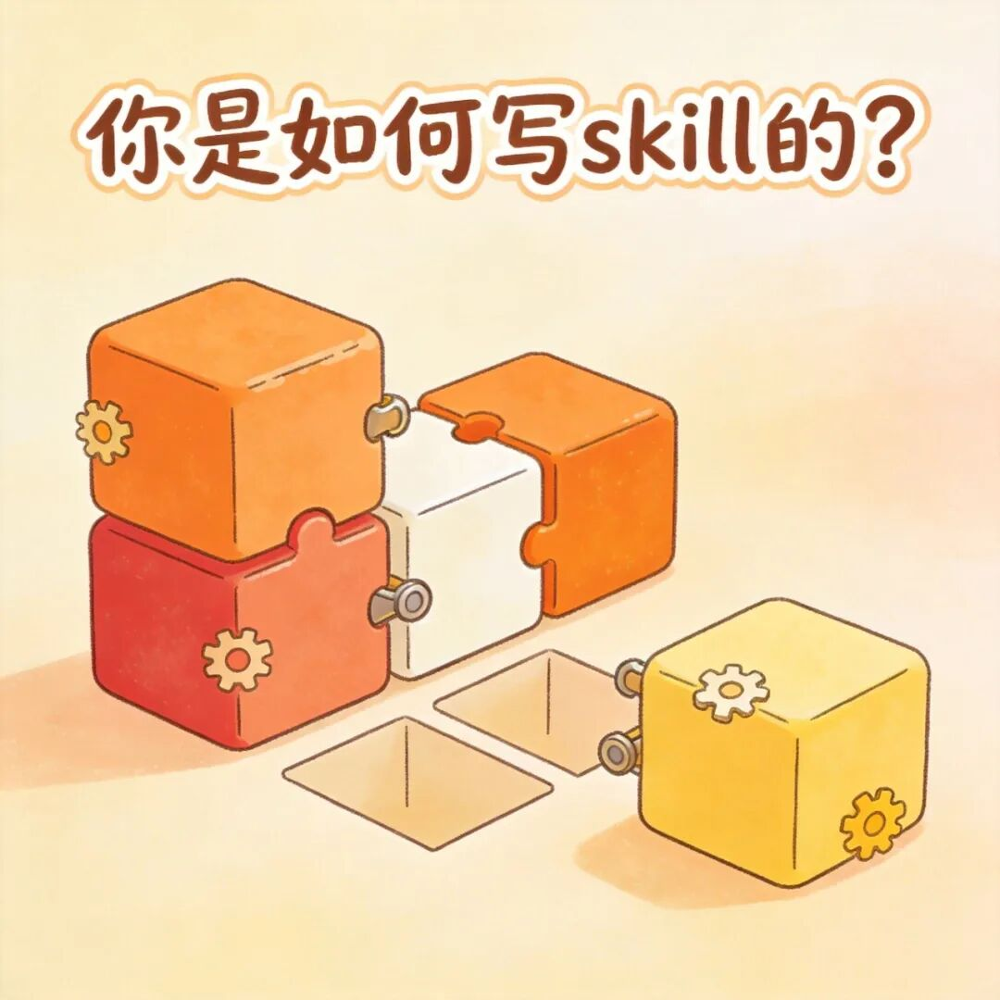

你是如何写skill的？

有个想法直接就写？我之前就是这样的。

不过后来我明白了，做Skill的人，需要有工程思维。不是上来就干，而是干之前要想清楚。

什么叫工程思维？不靠一次性的感觉做决定，靠可重复的验证做判断。

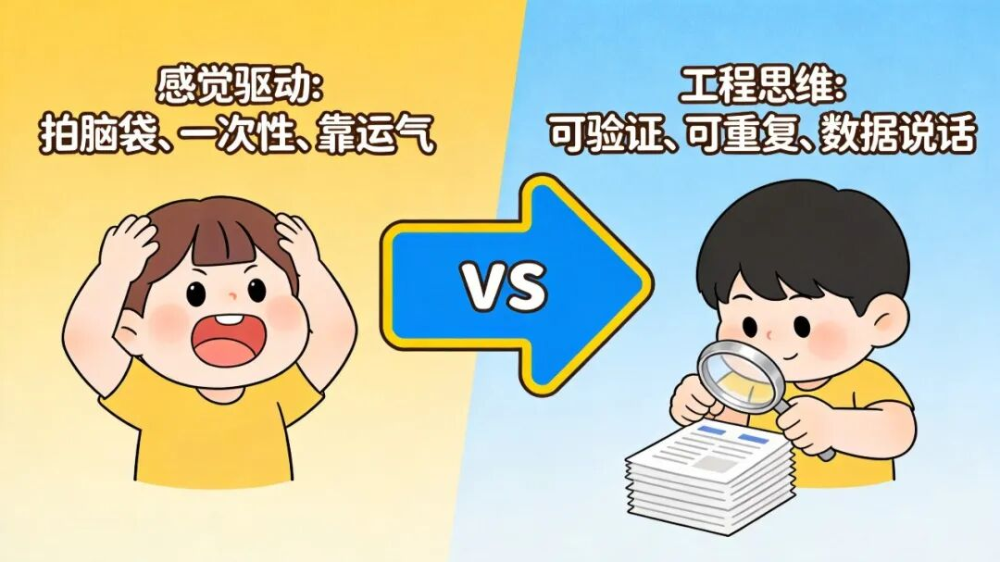

比如说一个Skill"效果好"，跟什么比？好了多少？换个模型还稳吗？以前这些问题只能拍脑袋。

改了指令，跑两个例子瞅一眼，觉得行就可以。后来出问题，你连当初怎么改的都忘了。

有一个思路给了我很大启发：把软件工程里成熟的测试和迭代方法，搬到skill创作里来，并且尽量降低技术门槛，让不懂代码的领域专家也能用起来。

很多写Skill的人不是工程师，他们懂业务，但没工具去验证两件要命的事：模型升级之后，Skill还跑得动吗？我改了指令，效果真的变好了吗？以前只能靠感觉，靠手工一遍遍试。

Evals、基准测试、版本对比、保鲜期检查。我们后面聊的这些方法，都来自这个思路的延伸。看不懂这些词不会怕，它其实就是评估-对比-测试。

## 01 问自己：需求值得做成Skill吗？

并不是所有需求，都最适合被固化成Skill。

高频复用，而且流程够固定，才值得制作成skill。

什么叫高频？你每周都在做，甚至每天都在做。

什么叫流程固定？每次做的步骤、标准、产出格式，都差不多。

skill的本质，就是解决你当下需求的流程指导手册。

最近我在想一个问题，我现在用的最多的技能是哪些？哪些已经从没打开过了？

**文章插图Skill**

每次写完文章都要配图。以前每次都手写图生文提示词，次次重来。后来把常用的画面风格、尺寸、构图偏好全固化成Skill。现在要配图，直接用。

省的不是一次的事，是每一次。

**公众号排版Skill**

我发文有一套固定习惯：段落空多少、哪里加粗、引用块怎么用、小标题什么格式。以前每次手动调，或者把同样的排版指令重新发给模型。做成Skill之后，一口输入原文，一口输出成品。

固化的是流程，不是某一次的输出。

**标题生成Skill**

如何起标题以前对于我来说是一个头疼的事情，后来我学到一个非常好的思考思路，主体词+修饰词+句式套路组合+人性(恐惧，欲望)，那基于它的思路，我就可以封装成一个技能，后来可以反复使用这个skill解决问题。

后面就是不断完善标题的技巧的拼图，比如说看到一个文章说某某的标题比较不错，那就直接在句式套路组合中添加。

随着不断积累，当我需要标题的时候，大模型可以在我的skill的组合中选择合适的，给我起标题。

我一般习惯于让AI多给我提供不同方向的标题，给我做选择。

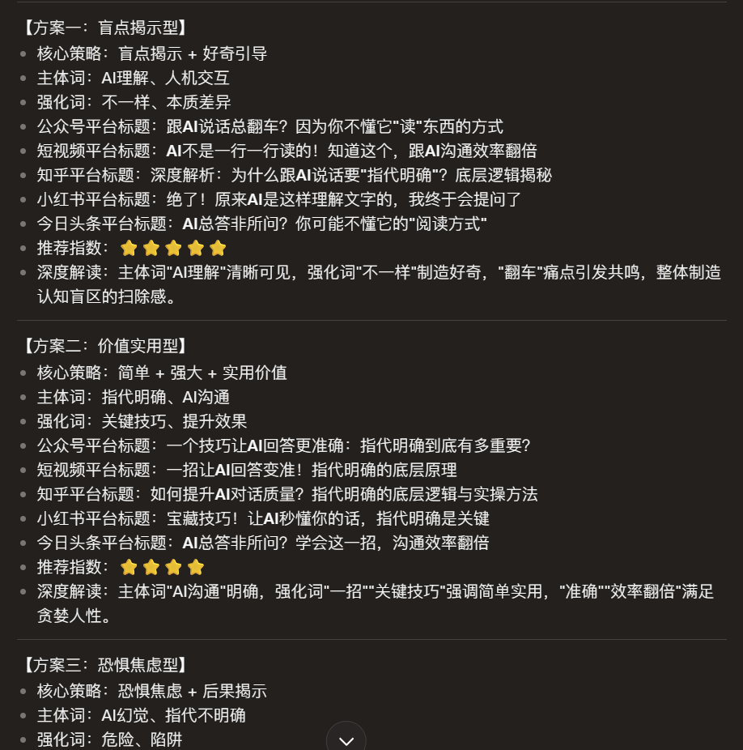

同样的道理，如果要写爆款文章的skill，也是同样的思路，组合拼接，不同爆款文章的架构组合拼接，就是新的"爆款"文章。比如说开头套路+中间转折方式+结尾套路。

N的开头N转折N结尾，就是N^3的套路组合，可以高效地支撑批量内容创作。当然，真正的内容价值仍然依赖于洞察和素材质量，结构只是提效工具，不是万能公式。就是因果理论+方法沉淀+组合拼接。

不同人对于爆款的理解不同，文字习惯不同，虽然它所设计的底层逻辑相似，但还是带有不同人的特色。

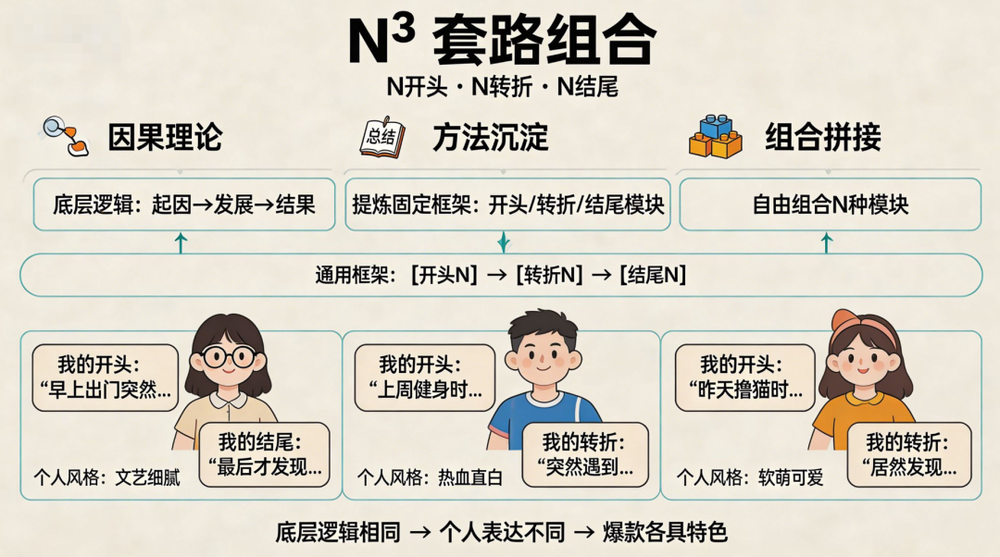

前面这些Skill共同点是什么？

**固化的是我的流程偏好，不是补模型的能力短板。**

反面教材我也踩过。

之前做过一个小红书风格优化Skill。逻辑特简单：把任意文本转成小红书调性，口语化、加emoji、分段短、带感叹词。

当时模型自己还不太会拿捏这种风格，或者说是风格不符合我的习惯，Skill确实有用。但后来模型升级了，自己加的emoji更自然，分寸感更好，而我的Skill还在按旧脚本套固定模板。Skill的输出，反而不如裸模型。后面我就没怎么用了，直接让大模型帮我改了。

这件事教会我一个道理：不是所有需求都值得做成Skill，也不是做出来的Skill都值得一直留着。

## 02 动手之前，先问三个问题

需求值得做，也别急着打开编辑器。先回答三个问题。

**第一问：你是补能力，还是固偏好？**

能力补充型，教模型做它原本搞不定的事。比如处理特殊格式的PDF、生成特定结构的文档。模型自己有短板，Skill把技巧编进去。

偏好编码型，模型本来也能做，但你要它按你的规矩来。比如按公司法务标准逐条审合同，每周从多个数据源汇总数据写周报。

两种Skill盯的东西不一样。

补能力的，盯保鲜期，模型升级之后，这Skill还用的上吗？

固偏好的，盯忠实度，它还在按你的规矩办事吗？

小红书Skill就是补能力型的典型下场。模型学会了，Skill从帮手变累赘。

标题生成Skill是偏好型，模型自己会起标题，但不知道怎么按我的标准起。

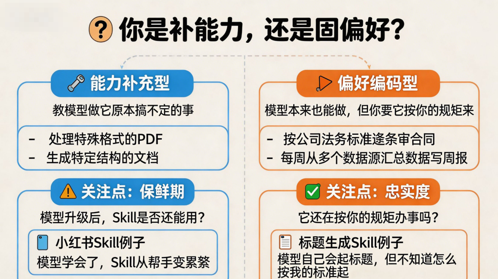

**第二问：输入、输出、边界是什么？**

这是Skill的契约。输入什么格式？输出长什么样？绝对不能碰什么？没这个契约，你连它干没干活都判断不了。

**第三问：单Skill，还是主Skill套子Skill？**

解决问题，一个Skill干到极致。插图、排版、标题，各管各的。

解决流程，主Skill管编排，子Skill管执行。

将来我要是做"文章发布全流程"Skill，会挨个调用排版Skill、插图Skill、标题Skill。

但子Skill各自跑得好，不等于串起来就好。上游的输出格式，可能刚好是下游不喜欢的输入。多Skill组合，必须做集成测试。

目前我还没制作过流程技能，基本都聚焦在解决单一问题上。

三个问题答完，再动手写第一行。

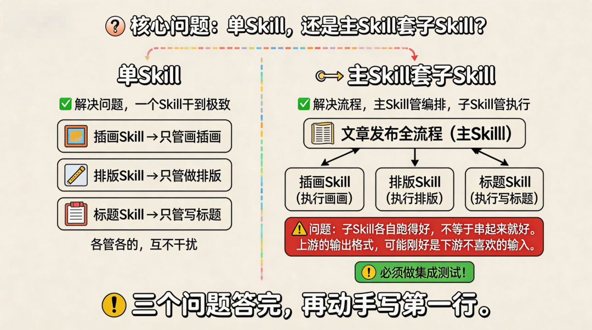

## 03 Skill和Agent，到底什么关系？

聊到这儿，得澄清一个很多人搞混的概念。

有人说Skill就是轻量版Agent。这个说法听着顺耳，但不准。

Agent是决策者。它看环境、定计划、选动作、看反馈、修正自己。它有运行时的反思能力，是一个活的推理循环。

Skill是一本写好的操作手册。它告诉执行者"遇到这种情况，按这个步骤做"。不观察，不决策，不反思。改进不发生在跑的时候，而发生在你设计它的时候，你改它、测它、迭代它。

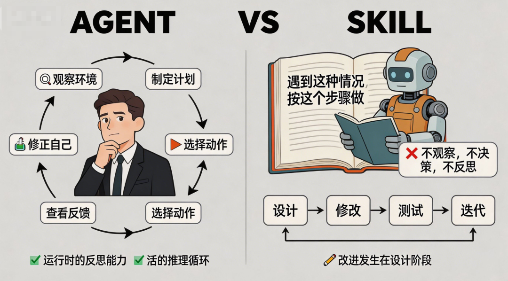

拿公众号排版Skill来说就清楚了。它没有自己的想法，只是忠实地执行我预设好的段落间距、加粗规则、小标题格式。哪天我觉得段落间距要改，我不会让它自己拿主意，我会在设计阶段改规则，然后跑测试验证。

把Skill当Agent设计，你会给它不该有的自由度，它开始乱发挥，你又没评估机制管它。当然，有些Skill在设计时也可以在参数范围内定义一些灵活判断的空间，让它在约束下自己选择，但它的边界是预定义好的，不是开放式的自主决策。

把Skill当手册设计，你会盯着操作步骤、输入输出契约、可验证的结果。你可以对它做测试、做对比、做保鲜期检查。

> 所以，Agent做决策，Skill做执行。Agent在跑的时候反思，Skill在设计的时候迭代。

这个区别不是咬文嚼字，是整个工程化体系的根。

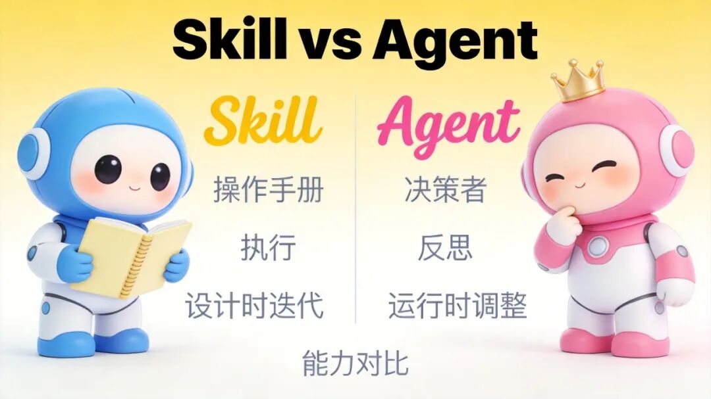

## 04 Skill怎么长出来的？归纳，然后演绎

搞明白Skill是什么了，下一步是怎么设计。

设计Skill的思维过程，本质就是归纳和演绎来回倒。

归纳的过程中，要学会拆解思维。从普遍到抽象的过程。

拿标题生成Skill举例子。

我把看到的好标题翻出来，几十个，一个个拆共同点：口语化、带悬念、读起来像在聊天。提炼成规则，写成第一版。这叫归纳。

从一堆具体例子里抽出通用的东西。

演绎的过程中，要有目标思维。从抽象到普遍的过程。

然后用这版去给新文章起标题。

起完一看，有几个太标题党了，不符合我的目标风格。

补一条：口语化可以，但"惊呆了""万万没想到"这种词不能用。这叫演绎，从通用规则回到具体场景。

再跑，再发现问题，再补。这个循环没完。我的标题生成Skill到现在还在调，每次用都有小改。

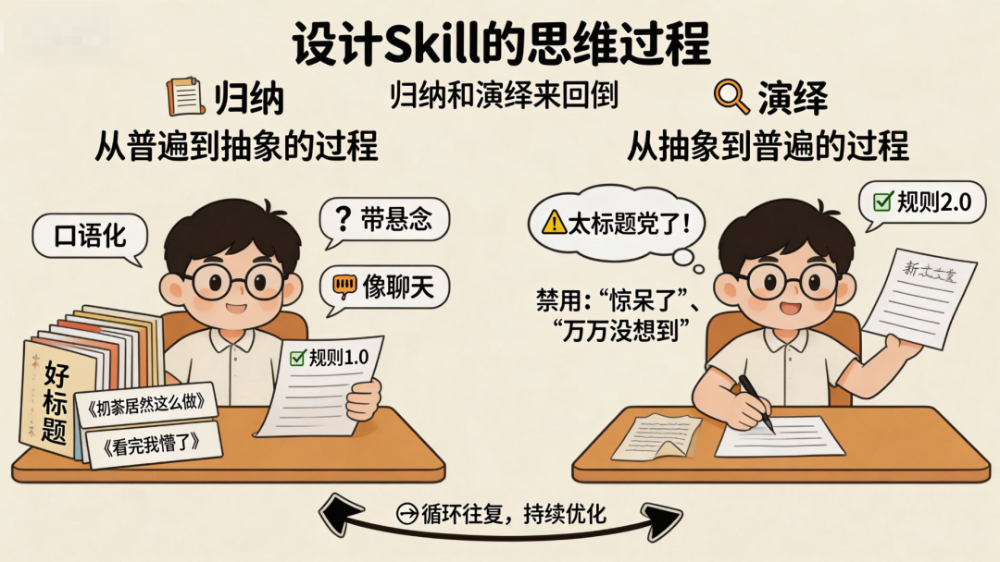

> 归纳，演绎，再归纳，再演绎。这就是假设、实验、修正、再实验。

Skill不是一次写成的，是一轮一轮养出来的。

## 05 怎么判断一个Skill好不好？看数据，别看感觉

Skill写好了。但你真知道它好吗？

以前我们凭感觉：嗯，输出瞅着还行，过了。

**判断好不好？看对比。**

**第一个：Evals，给Skill写"单元测试"。(Evals是评估)**

提供一组测试提示词，说清楚"好的输出该长什么样"，自动帮你验。两个用途：一是抓质量退化，模型一直在更新，上个月好好的Skill这个月可能就挂了，evals提前报信。

二是判断Skill过没过时，主要针对补能力型，裸模型不用Skill也能通过evals，说明这Skill的招数基本被模型学走了，价值已经大幅缩水。

对应第一个对比：**有Skill vs 没Skill**。

小红书Skill放这套框架里，裸跑新版模型直接过测试，当场就该被判退役。反过来，去掉排版Skill让模型自己排，段落间距就是不对，这Skill有存在的理由，数据说的。

**第二个：Comparator，A/B盲测。(Comparator是对比裁判)**

同时跑两个版本，第三方裁判在不知道谁是谁的情况下评判输出质量，看改动是不是真变好了。

对应第二个对比：**新版本 vs 旧版本**。改了标题Skill的规则，新版本起的标题真比旧版强吗？用Comparator做双盲，别靠"我感觉"。

**第三个：Benchmark模式，性能仪表盘。**

批量跑同一组evals，看通过率、执行时间和token消耗，每次模型更新后跑一遍，追踪趋势。

对应第三个对比：**模型升级后 vs 升级前**。底层模型一换，排版Skill还稳吗？插图Skill的风格还一致吗？

三种对比，把"我觉得"干成了"我证明"。

评估集也要分层。

- 基准测试集看存在价值，

- 回归测试集防修改搞坏旧能力，

- 版本对比测试集专盯旧版本不行的场景。

每次线上出了坏例子，必须沉成新的回归用例。同一个坑，不能摔两次。

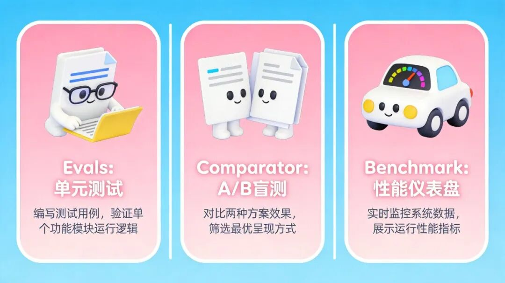

## 06 一个Skill的一辈子：从出生到退休

以前很多人踩同一个坑：写一个长长的SKILL.md，试几条提示词，觉得"能用"，上线。

然后模型或环境一更新，效果悄悄跑偏。就需要让Skill从一次性交付，变成持续迭代的工程资产。

**先说开发阶段，8步循环：定义任务、写草稿、小规模测试、看结果、人工复核、修改、扩大测试集、继续迭代。** 

用排版Skill过一遍。

**定义任务**: 输入Markdown原文，输出按我公众号格式排好的成品。边界：不改内容，只调格式。

**写草稿**: 把脑子的排版规则倒出来：段落间空一行，金句加粗，引用块用灰色。先别想完美，倒出来再说。

**小规模测试**: 找一篇文章丢进去。跑通了，第一关过。

**看结果**: 仔细瞅。引用块格式对了但里面第二段没空行，金句加粗漏了一句。记下来。

**人工复核**: 这次看风格。连续三句金句都加粗，太密了。补一条：金句挨着的话，只加粗最要命的那句。

**修改Skill**: 把问题全改进去，草稿变v0.2。

**扩大测试集**: 找三篇不同类型的：纯议论、带对话、有表格清单。测试分层的道理，这就具体怎么干。

**继续迭代**:新测试又发现表格排版对不齐。补规则，再跑。排版Skill到现在还在调。

这就是敏捷开发的MVP思维：先用最小劲做出能跑的东西，靠反馈推着改进。

不是一口气憋完美，是一轮一轮长出来的。

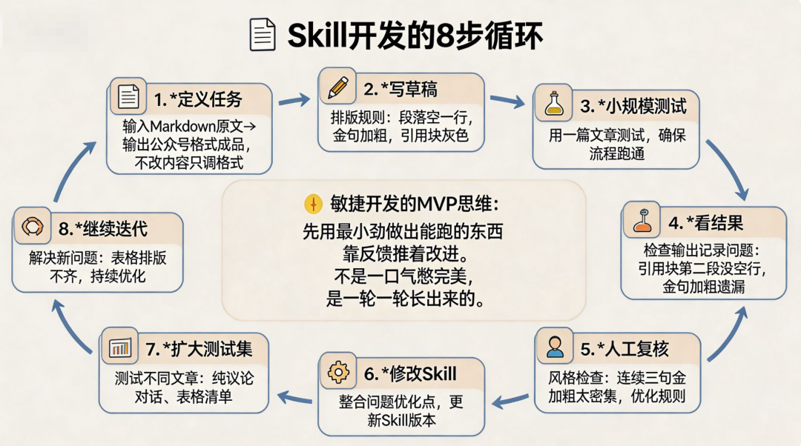

**再说CI/CD流水线。(它就是提交代码、自动测试、自动部署、发送通知的流水线)**

这8步手工跑一遍，改一次半小时。Skill一多根本管不过来，得自动化。

任何修改都用版本管理工具管住。敲完commit一条，出问题随时回滚。

每次改完提交后，自动跑测试集。

回归测试和版本对比一起上，跑完自动出报告：哪些持平、哪些跌了、哪些涨了。跟benchmark模式一样，把Skill质量管理接进CI/CD体系。

人只看报告。新版本整体好于旧版本，没有退化，打版本标签，发布。

报告显示明显退步，回去改，再跑一轮。

这就是Skill的CI/CD：改、测、审、发，四个动作串成一条自动化流水线。Skill不再是死文件，是持续交付的工程资产。

跑起来之后，还得持续盯着。定时重跑基准测试，查保鲜期。

能力补充型Skill会随着模型改进而过时，evals会告诉你什么时候发生，这样你就不用维护死代码了。

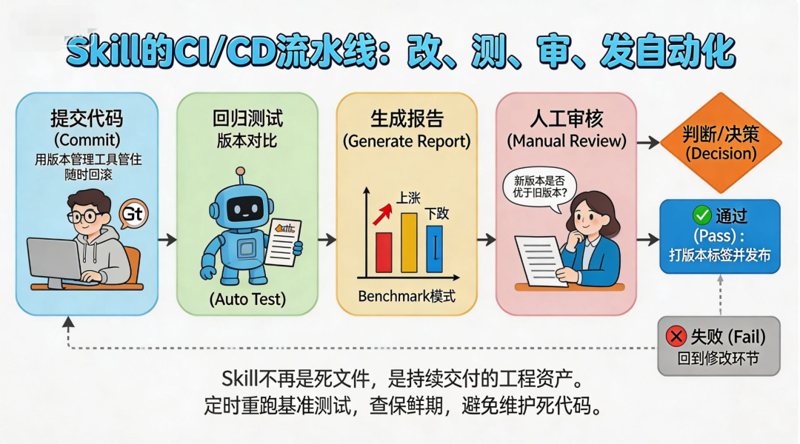

**最难的一步，很多人做不到：敢删。**

补能力型Skill，模型学会了还留着，就是负资产。

偏好型Skill，你标准变了还留着，它就在把输出往过时了拉。

没有退役机制的Skill库，早晚变成没人敢动的垃圾堆。

## 07 从造一个Skill，到管一群Skill

前面聊的都是怎么造好一个Skill。但当你手上攒了十个、二十个，新问题就来了：怎么让它们搭伙干活？

这就是Skill驾驭者的活儿。核心还是工程思维，只不过从管单个模块的质量，升级到了管整个系统的效能。

### Skill不是提示词，是一份交互策划书

一个熟透了的Skill，不是一段长提示词，是你和Agent之间的一份交互策划书。

它告诉Agent：什么情况启动我？启动之后按什么流程走？每一步用什么格式跟你说话？哪里是变量，哪里是死规矩？什么时候停，什么时候叫别的Skill帮忙？

提示词只是策划书里的"正文"。完整策划书还包括流程图、数据格式约定、异常处理办法、跟其他模块的接口。成熟的Skill目录，看着更像一个小软件项目，不是你想象中一段长文字。

### 给Agent分配两种脑子

既然Skill是我和Agent的交互策划书，我就得想清楚：这场交互里，我需要Agent用哪种脑子？

我发现可以分成两种：**理性脑和感性脑**。

**理性脑**管精确的、结构化的、能验证的事。按JSON schema输出数据、按Mermaid流程图走分支、按Evals测试集跑验证。这类活儿得用程序词汇约束，JSON、YAML、占位符{{placeholder}}、MUST声明。它不需要文笔好，只需要格式对。

**感性脑**管模糊的、创造性的、要审美的事。标题要有对话感、文案要有画面感、配图提示词得描述氛围。这类活儿得用风格种子引导，给它一个seed，朝那个方向靠。用自然语言描偏好，不用JSON锁死它。

好的Skill驾驭者，不是把什么事都塞进僵硬结构里，也不是让Agent放飞自我。而是知道什么时候用程序词汇卡死理性脑，什么时候用风格种子引导感性脑。

**一张速查卡：**

> 问自己一句：这个任务的输出，能不能写成"if A then B"的规则？

> 能，走理性脑。用JSON、schema、流程图锁死它。改规则时跑回归测试。

> 不能，走感性脑。用风格种子、自然语言偏好引导它。改规则时用Comparator做A/B盲测。

> *(风格种子Seed，打比方就是给它参考风格，比如说文章风格，它就会按照我的说话风格改写)*

### 四大骨架

有了两种脑子，再往上抽象一层，整个Skill系统可以拆成四个能组合的维度，我叫它**四大骨架**。

**流程骨架**。先干啥，后干啥，分支条件是什么。这是时间线。

**规范骨架**。每一步按什么标准来。安全边界、排版规则、合规检查点。这是锚点。

**能力骨架**。每一步谁来干。子Skill、工具、API，还是裸模型。这是工具箱。

**任务骨架**。这一次启动到底要解决什么问题。输入是啥，输出是啥，怎么算成功。这是起点和终点。

好的Skill系统，就像搭乐高。面对新需求，不是从零写提示词，而是从四个维度各抽合适模块，拼成新策划书。

比如搭一个"竞品分析报告生成系统"：

- **流程骨架**

  数据采集、信息提取、分析对比、生成报告

- **规范骨架**

  报告固定结构、分析维度要求、结论必须带数据

- **能力骨架**

  数据采集Skill、竞品信息提取Skill、对比分析Skill、排版Skill

- **任务骨架**

  这次分析的行业和竞品名单、输出格式、交付时间

四大骨架一搭，系统就立起来了。

**怎么用四大骨架搭新系统？三步走：**

1. **先写任务骨架**

   这次要干什么？输入什么、输出什么、怎么算成功。写死。
2. **再翻能力库**

   库里有没有现成的Skill能复用？有就用，没有就新建。考虑这个任务给理性脑还是感性脑。

**3. 最后串流程和规范**

画出步骤图，标出每步要遵守的硬规矩。

如果每次做新系统都按这三步走，你会发现大部分时间不是在"创造"，而是在"组合"。组合的速度比创造快十倍。

别一上来就写提示词。先翻翻你的能力库。

> **克制创造欲，是成为驾驭者的第一课。**

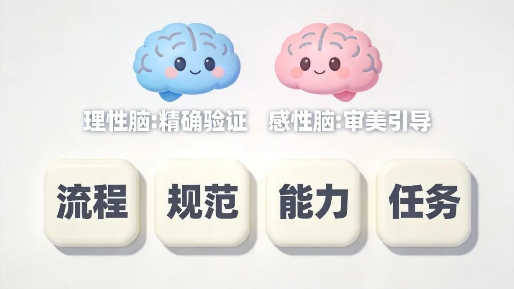

### 驾驭者看全局

回头看，前面聊的所有东西，都可以放回这个"驾驭者"视角重新理解：

- 定性定界，就是决定任务交给理性脑还是感性脑。

- 归纳演绎，就是不断校准风格种子和约束声明的过程。

- 三种对比，就是用数据验证规范骨架还站不站得住。

- CI/CD流水线，就是让策划书的版本管理和测试自动化。

- 退役机制，就是对整个系统做断舍离，不让旧拼图干扰新拼图。

从写提示词，到设计Skill，再到驾驭一个Skill系统，三个层次。第一层靠灵感，第二层靠工程，第三层靠全局视角。

**贯穿三层的，永远是同一个东西：工程思维。**

## 08 最后，给你讲一个小故事

讲个故事做个对比。

**A是提示词高手**，库里塞了几十个Skill。每次做新项目，第一反应是"这个得新写一个"。库就像一个塞满衣服却永远找不到穿的衣柜。

**B是系统思维者**。Skill不到十个。排版、标题、插图、数据分析、案例拆解。每次接新项目，先用十分钟在脑子里用四大骨架拼一遍：哪些能复用，哪些要微调，哪些真得新写。大部分时候，新写的只有任务骨架。

A的产出很高，但总觉得累。

B的产出也高，但他不累。

因为他在用系统，不是用蛮力。

B的秘诀是什么？

> "Skill不是你的武器库，Skill是你把脑子里的隐知识，变成能传给明天自己的工程资产。"

所以，下次你想写一个新Skill之前，先问自己四个问题：

这个需求我每周都在做吗？流程够固定吗？

这Skill是补能力还是固偏好？要是补能力，我准备好接受它有一天会过时吗？

我的验证方案，能不能用数据替掉感觉？

如果有一天它该退役了，我有勇气删掉它吗？

最后一个问题，最要命。我的小红书Skill教了我一件事：**敢承认一个Skill没用了，比敢写一个新Skill更难，也更值钱。**

> Skill不是攒得越多越牛。留下来的每一个，都得是经过验证的、值得维护的工程资产。就像我的排版Skill、插图Skill、标题Skill，它们不炫技，不追新，就是把我翻来覆去做的事，一次性固下来。

而当你把这些工程资产组合成一个系统，能复用、能迭代、能淘汰，你就不再是一个写提示词的人。

**你就是这个系统的驾驭者。**

最后

用软件工程的思维来编写skill。

问问自己

这个skill值得制作吗，它是否是高频，可复用的需求?

如果是补能力的skill，要不要使用官方已经被验证过的?

你要做的skill是解决什么问题?输入，输出，以及边界是什么?

你制作的skill是补充agent哪一块的手脚执行问题?

做归纳和演绎

从内容中提炼出共性，快速制作MVP

然后不断进行测试修正循环

做对比测试

基准测试: 有skill和没有skill的效果对比

A/B测试: 优化前后版本，效果变好还是变差

性能测试: 新模型和旧模型，效果变化差距

能不能做自动化检测?

Skill的CI/CD的流程，改，测，审，发，如何设定?

一个skill的流程

定目标-写草稿-小测试-看结果-看审查-去修改-大测试-再迭代
