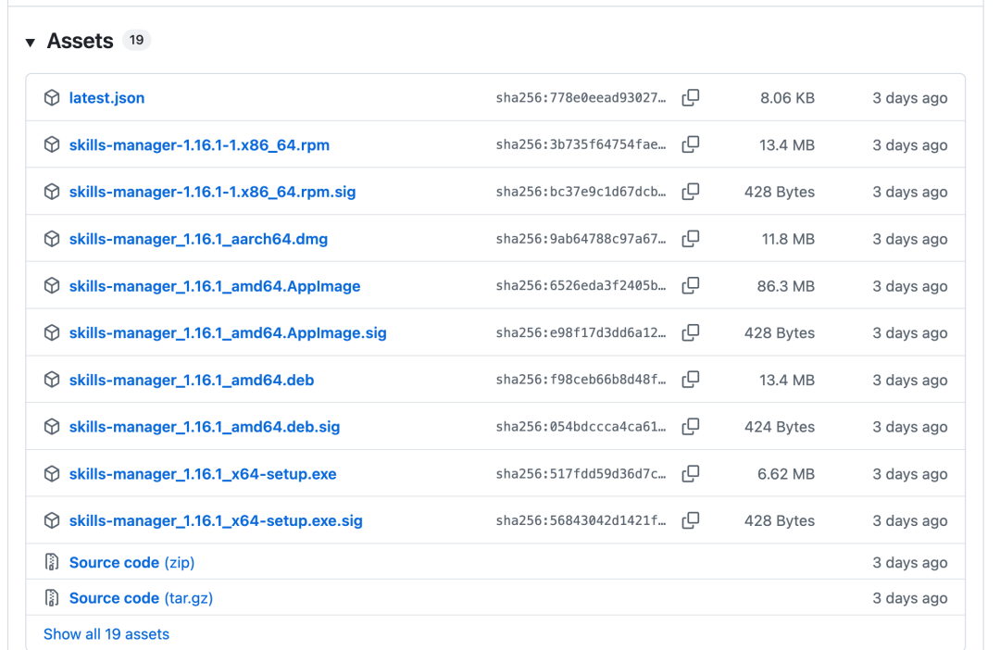
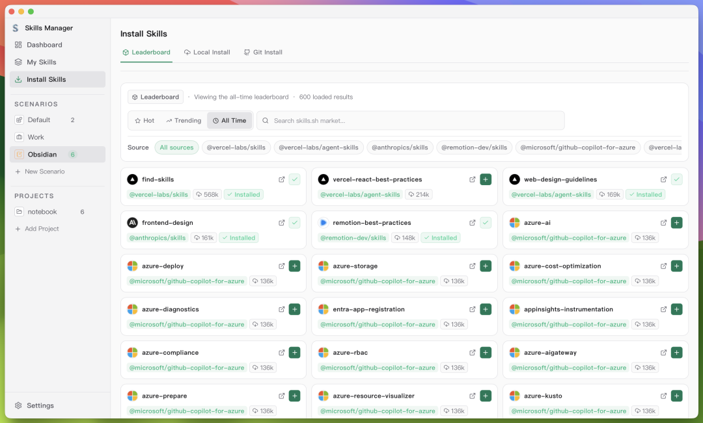
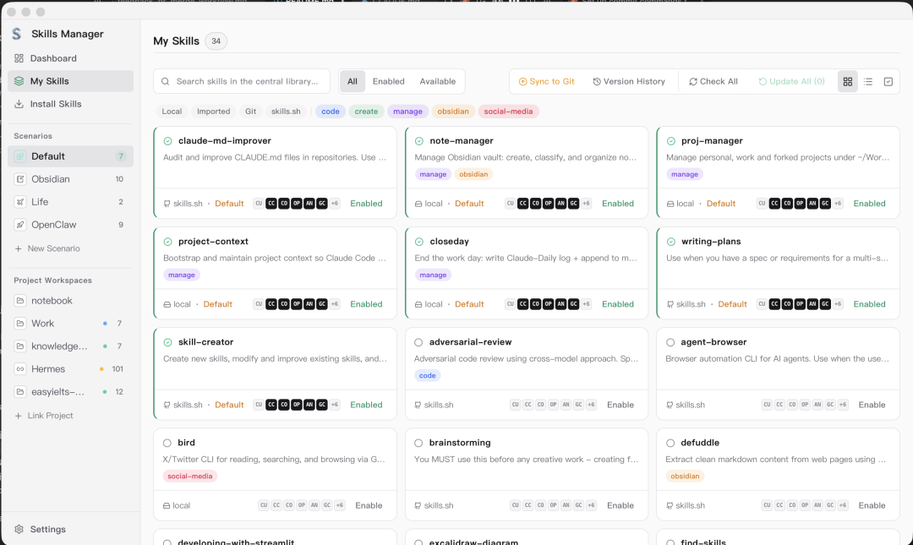
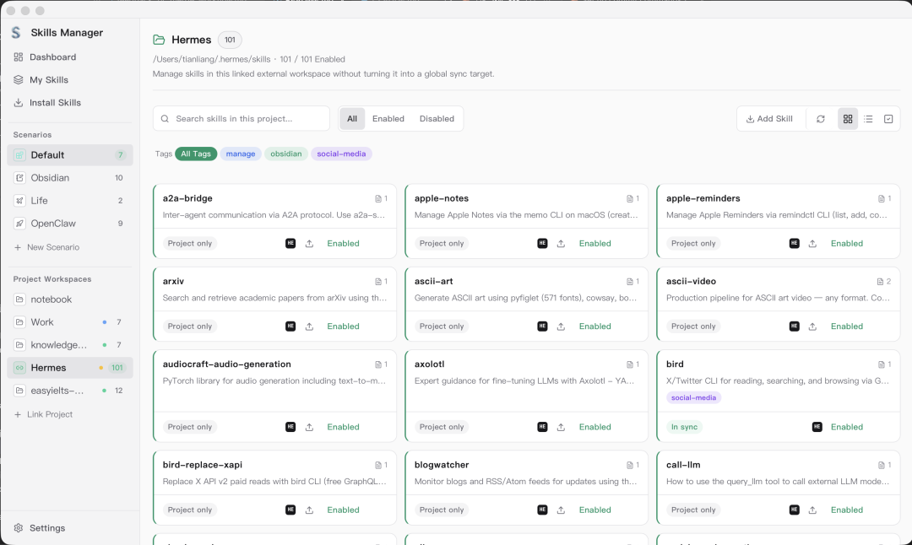
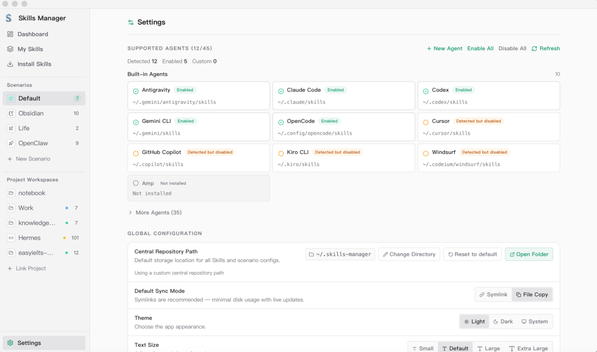

> 📎 来源: [测试开发技术](https://mp.weixin.qq.com/s?__biz=MzA4NDUyNzA0Ng==&mid=2247508461&idx=1&sn=eb4400c20bebdf9fd169987adecfb651&chksm=9e333871842219d94bb5e2f37ce7a598524c4f173ce55faed5d15454bfa3f247398329e8fc4f&mpshare=1&scene=1&srcid=0511pQTFJiB3pKswLItmFqlU&sharer_shareinfo=577ddb3f5f9556356a253d2855007779&sharer_shareinfo_first=577ddb3f5f9556356a253d2855007779) | 时间: 2026-05-11 03:21

---

你是不是也有这些烦恼？

玩 

```
Claude Code
```

、

```
Cursor
```

、

```
Codex
```

、

```
OpenCode
```

、

```
TRAE IDE
```

时，由于每个工具都有自己的 Skills 配置目录，技能文件散落在各个目录；

比如：

- ```
  ~/.cursor/skills/
  ```
- ```
  ~/.claude/skills/
  ```
- ```
  ~/.opencode/skills/
  ```

换电脑、换设备，技能要重新下载、手动复制粘贴；

技能太多杂乱无章，分不清哪个启用、哪个失效；

想批量导入、分组管理、备份同步，却没有趁手工具……

玩 AI Agent、AI 编程的人都知道，**技能（Skills）是大模型智能体的核心战斗力**。

但技能多了之后，管理反而成了最大痛点。

1. **配置分散**：Skills 散落在不同目录，管理混乱
2. **重复配置**：换电脑或重装系统，每个工具都要重新配
3. **团队协作难**：无法与团队共享统一的 Skills 规范
4. **场景切换麻烦**：前端开发和后端调试需要不同的 Skills 组合，手动切换繁琐

今天给大家安利一款**开源免费、跨平台桌面端 Skill 管理器**： **Skills Manager**，彻底解决 AI 技能杂乱难管的问题。

## 一、工具简介

**Skills Manager**  是一款开源且基于现代化技术栈（Tauri 2 + React 19 + Rust）开发的跨平台 AI 技能桌面管理工具，支持 Windows、macOS、Linux 三大系统，Tauri 轻量化打包，**占用内存极低、启动飞快**，不用依赖复杂运行环境，下载即用。

专门为 **Claude Code、Cursor、各类 AI 智能体、本地大模型** 玩家打造，一站式实现：技能导入、分组管理、一键启用 / 禁用、批量同步、备份恢复、技能市场浏览。

不用再手动找路径、复制文件、改配置，全程图形化操作，小白也能零门槛上手。

**Skills Manager 的核心思路**：建立中央技能仓库，一处管理，一键同步到所有工具

## 二、核心功能一览

### 1. 统一技能库（Central Library）

所有 Skills 集中存放在 

```
~/.skills-manager
```

 目录下，支持从多种来源安装：

| 来源 | 说明 |
| --- | --- |
| **skills.sh 市场** | Vercel 官方市场，收录 87,000+ Skills，带排行榜和热度统计 |
| **Git 仓库** | 直接克隆 GitHub/GitLab 上的 Skill 仓库 |
| **本地目录** | 导入本地已有的 Skill 文件夹 |
| **文件导入** | 支持 `.zip` 和 `.skill` 格式拖拽导入 |

安装后的 Skills 统一收纳，版本清晰可查。

### 2. 多工具一键同步

支持 **15+ 款 AI 编程工具** ：

Cursor · Claude Code · Codex · OpenCode · Amp · Kilo Code · Roo Code · Goose · Gemini CLI · GitHub Copilot · Windsurf · TRAE IDE · Antigravity · Clawdbot · Droid

同步方式有两种：

- **软链接（Symlink）**：推荐。所有工具共享同一份文件，修改一处全局生效，节省磁盘空间
- **复制（Copy）**：将 Skill 文件完整复制到目标目录，适合需要独立维护的场景

### 3. 场景管理（Scenarios）

这是 Skills Manager 的杀手级功能 。

你可以创建多个"场景"，每个场景绑定不同的 Skills 组合：

- 🌐 **frontend-dev**：React、Vue、TypeScript 相关 Skills
- ⚙️ **backend-pro**：Spring Boot、Go、微服务相关 Skills
- 📊 **data-analysis**：Pandas、SQL、机器学习相关 Skills
- 🐛 **debugging**：调试、日志分析专用 Skills

切换场景时，Skills 自动跟随切换，无需手动逐个启用/禁用。

### 4. 项目级 Skills（Project Workspaces）

除了全局 Skills，还支持管理项目级 Skills ：

- 自动识别项目中的 

  ```
  .claude/skills/
  ```

  、

  ```
  .opencode/skills/
  ```

   目录
- 支持与中央库双向同步（导入/导出）
- 支持嵌套 Skill 目录和按 Agent 分配

这意味着你可以为特定项目定制专属 AI 能力，而不影响全局配置。

### 5. Git 备份与多机同步

Skills 配置可以通过 Git 备份到私有仓库 ：

- 自动处理 pull → commit → push 流程
- 每次同步自动创建快照标签
- 支持版本历史回滚
- 换电脑时一键拉取，团队协作共享同一套配置

> 注意：SQLite 数据库（

> ```
> skills-manager.db
> ```

> ）不纳入 Git，其元数据可通过扫描 Skill 文件重建。

### 6. 其他实用功能

- **批量操作**：多选后批量启用/禁用/导出/删除
- **Skill 标签**：为 Skills 打标签，按标签筛选
- **更新检查**：Git 类 Skills 自动检测上游更新
- **文档预览**：应用内直接查看 

  ```
  SKILL.md
  ```

   / 

  ```
  README.md
  ```
- **自定义 Agent**：添加官方未内置的工具，指定其 Skills 目录
- **AI 搜索**：集成 SkillsMP AI 搜索，用自然语言找 Skill

## 三、谁一定要用这款工具

- 经常玩 Claude Code、Cursor 做 AI 编程的开发者
- 搭建本地 AI 智能体、私人知识库的玩家
- 技能数量多、经常整理和切换技能配置的人
- 经常换电脑、需要备份同步技能的技术爱好者
- 做 AI 教学、需要给学员批量分发技能的博主 / 讲师

## 四、安装方式

### 方式一：直接下载桌面客户端

进入项目 Releases 发布页，根据自己系统下载对应安装包：

Windows / Mac / Linux 都有现成安装包，双击下一步即可完成安装，零配置开箱即用。

| 系统 | 安装包 |
| --- | --- |
| macOS | `.dmg` （通用架构） |
| Windows | `.msi` / `.exe` |
| Linux | `.deb` / `.AppImage` / `.rpm` |



### 方式二：从源码构建

需要 Node.js 18+、Rust 工具链和 Tauri 2 前置依赖

```
git clone https://github.com/xingkongliang/skills-manager.gitcd skills-managernpm installnpm run tauri:build
```

构建产物位于 

```
src-tauri/target/release/bundle/
```

。适合想二次开发、自定义功能的开发者。

## 五、快速上手

### 第一步：初始化

首次启动时，应用会引导选择或创建技能存储目录（默认 

```
~/.skills-manager
```

），并自动检测已安装的 AI 工具。


### 第二步：安装 Skills

打开 **Install Skills** → **Marketplace**，浏览

```
skills.sh
```

市场的热门 Skills：

- 支持按热度/趋势/全时段筛选
- 支持按来源筛选（如 

  ```
  @vercel-labs/skills
  ```

  、

  ```
  @anthropics/skills
  ```

  ）
- 点击 **Install** 即可安装到中央库

也可通过 **Git Install** 或 **Local Install** 导入私有 Skills。



### 第三步：同步到工具

进入 **My Skills**，勾选需要启用的 Skills，点击 **Sync** 按钮，选择目标工具（如 OpenCode），选择同步模式（软链接/复制），完成同步 。



### 第四步：配置场景

1. 侧边栏点击 **+ New Scenario**，创建场景（如 "Work"、"Obsidian"）
2. 为场景勾选需要的 Skills
3. 配置场景内各 Agent 的开关（细粒度控制）
4. 通过侧边栏或系统托盘菜单快速切换场景



### 第五步：Git 备份

1. 创建私有 Git 仓库（GitHub/GitLab）
2. 进入 **Settings → Git 同步配置**，填写远程仓库地址
3. 点击 **同步到 Git**，自动完成备份
4. 换电脑时，点击 **开始备份** 从远程克隆恢复



## 六、写在最后

AI 编程工具的竞争还在白热化阶段，今天用 Cursor，明天可能换 Windsurf，后天又冒出新的工具。与其把 Skills 配置绑定到某个特定工具，不如建立一个**中央化的 Skills 管理体系**，让工具为人服务，而不是人被工具绑架。

随着 AI Agent、AI 编程越来越普及，**技能管理**已经从 “可有可无” 变成了 “必备工具”。

Skills Manager 正是这样一个"基础设施型"工具——它不 flashy，但解决的是真实、高频、痛苦的痛点。如果你也在被多工具的 Skills 管理折磨，不妨一试。

感兴趣直接去下载体验：

```
https://github.com/xingkongliang/skills-manager
```


 

如果这篇文章对你有帮助，不妨**点个赞**、**转发、**收藏三连支持！**** ❤️想第一时间收到推送，记得加个星标 ⭐

往期推荐

[5年陪跑，带你撸20个企业实战项目(附全景路线图)](https://mp.weixin.qq.com/s?__biz=MzA4NDUyNzA0Ng==&mid=2247507207&idx=1&sn=faf126f109b5b9a35299756125e5ce70&scene=21#wechat_redirect)

[我的小“破”站，花了3天，终于上线了！](https://mp.weixin.qq.com/s?__biz=MzA4NDUyNzA0Ng==&mid=2247507134&idx=1&sn=4255d30694150304c45dc5cc6fe3ae56&scene=21#wechat_redirect)

[最新AI+全栈测试开发技能实战指南（第6期）](https://mp.weixin.qq.com/s?__biz=MzA4NDUyNzA0Ng==&mid=2247505395&idx=1&sn=468bb6360f530d11e5b370bb729367da&scene=21#wechat_redirect)

[AI 测试全体系详解：自动化测试框架 + 智能缺陷检测 + A/B 测试优化](https://mp.weixin.qq.com/s?__biz=MzA4NDUyNzA0Ng==&mid=2247507268&idx=1&sn=76b65462067cab91e0dc2a951cdb2fa7&scene=21#wechat_redirect)

[Cursor 生成测试用例实战：一个 Skill，10 分钟产出可评审测试用例！](https://mp.weixin.qq.com/s?__biz=MzA4NDUyNzA0Ng==&mid=2247507888&idx=1&sn=7d7def325c84a6ba04a62be894d98ce7&scene=21#wechat_redirect)

温馨提醒：[「狂师・AI 进化社」](https://mp.weixin.qq.com/s?__biz=MzA4NDUyNzA0Ng==&mid=2247507262&idx=1&sn=a03e29abf84cf5075d29de5604645d87&scene=21#wechat_redirect)，旨在帮助每一个人系统全面的学习 AI，哪怕你是纯 AI 小白，这里面的教程你从 0 开始看保证你一样能看懂，目标是让每一个人可以系统掌握 AI 并赋能提效到工作中，

目前已更新到AI智能体、AI测试版块，建议立马去跟着学习，还是那句话，会用 AI 只是表面，能理解 AI 背后的逻辑，以及用 AI 解决一些你的问题，才会比人更进一步。

现在上车性价比非常划算，早点跟上，后面在公司拿成果、面试都会轻松很多


****

👇 点击下方关注公众号《测试开发技术》，获取免费测开学习路线、简历模板、面试真题、AI测试、AI 编程、自动化测试、测试开发资料教程等。

END


**添加个人微信，进交流群**


后台回复【领资料包】试试

**下一篇，更精彩，敬请期待~~**

**赞、转发**和**在看**就是最大的支持❤️
