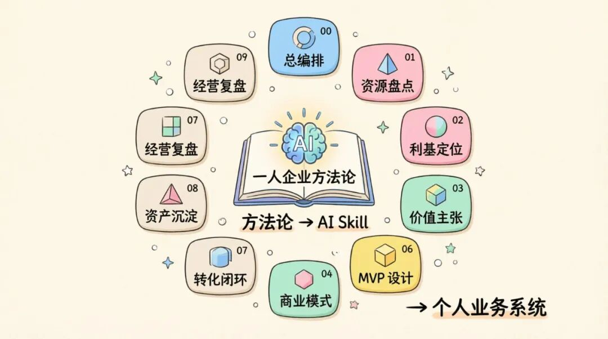
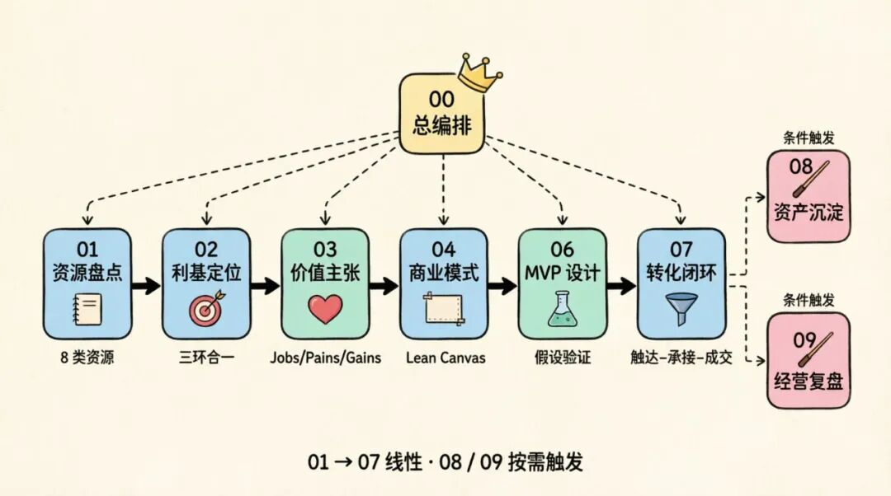
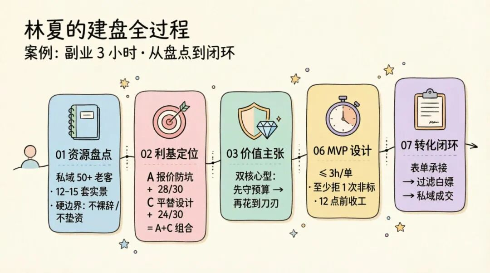
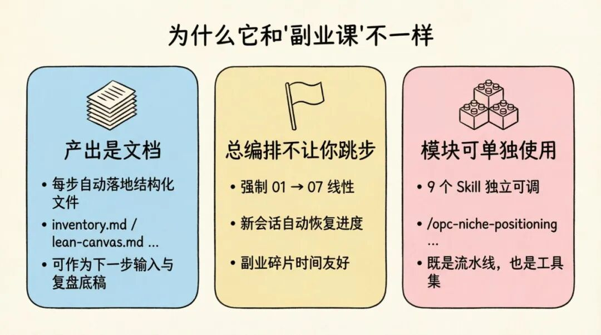

> 📎 来源: [不知名程序员指南](https://mp.weixin.qq.com/s?__biz=MzA3MDM4MTY2NA==&mid=2455509584&idx=1&sn=9a03a2caccf02929e2655db1039d981f&chksm=894679194e5ea1d740de1b446a8eaf4f7d1e4684c7582d951ae7fb3c75fcfc710c8a434ecea4&mpshare=1&scene=1&srcid=0524116HkjAIZsapZbqCZw3f&sharer_shareinfo=f60a02a105f5d2cb254ee243e630584d&sharer_shareinfo_first=f60a02a105f5d2cb254ee243e630584d) | 时间: 2026-05-24 11:49

---



> 看到一个挺有意思的项目——方糖出的 **OPC 技能集**，把易仁永澄那套《一人企业方法论³》直接做成了 9 个可调用的 AI Agent Skill。

> 一句话概括：**它不是又一个"教你做副业"的课，而是一条"装上就能跑"的流水线**。你把背景丢给它，它带着你一步步把"已有的能力"重组成一个轻资产、可验证、可复用的个人业务。

---

## 一、为什么这件事值得看

很多人卡在副业/一人企业的同一个坑里：

- 道理都懂——盘点资源、找利基、做 MVP、跑闭环；
- 真要一个人从头落，**不是不会做，是不知道下一步先做什么**；
- 翻书、看课、报训练营，最后还是回到"先发条小红书试试"。

OPC 技能集的解法很直接：**把方法论拆成 9 个独立的 AI Skill，每个 Skill 只管一件事，由一个"总编排"串起来**。

你不用记流程，AI 自己知道现在在第几步、缺什么输入、产出什么文档、什么时候该停。

---

## 二、九步建盘：流水线长什么样

整套方法被拆成"线性 7 步 + 触发 2 步"：

| 阶段 | 名字 | 它在干嘛 |
| --- | --- | --- |
| 00 | 总编排 | 判断你在哪一步，控制节奏，会话之间能续上 |
| 01 | 资源盘点 | 按 8 类（经验/人群/能力/关系/渠道/资产/约束/硬性边界）确认你手上有什么 |
| 02 | 利基定位 | "三环合一"找细分市场，6 维评分筛候选 |
| 03 | 价值主张 | 拆 Jobs / Pains / Gains，给出多个版本对比 |
| 04 | 商业模式 | Lean Canvas + 收费结构 + 最高风险假设 |
| 06 | MVP 设计 | 决定先验证哪个假设、用什么最小形式、什么算成功 |
| 07 | 转化闭环 | 从触达到承接到成交的完整路径 |
| 08 | 资产沉淀 | 把跑出来的东西沉淀成可复用资产（按需触发） |
| 09 | 经营复盘 | 找当下真实瓶颈，定下一周期的唯一重点（按需触发） |

> 设计上很克制：**01 → 07 严格线性，不跳步；08、09 在跑起来后按需触发**。这一点比大部分"模板套餐"清醒很多——它默认你是在搭系统，不是在凑 PPT。



---

## 三、一个真实案例：室内设计师林夏的 3 小时副业

官方放了一段几乎是"屏幕实录"的对话，主角林夏：

- 29 岁，二线城市，**室内全案设计 6 年**；
- 公司派单从每月 5–8 个掉到 1–2 个，底薪三千，被迫跑小区、打电销、无偿改图；
- **绝对不能裸辞**：存款只够 4–5 个月，社保不能断；
- 时间窗口：工作日晚 9–12 点 + 周末 1 天。

她和 AI 走完一遍流程，几个关键节点很有信息量：

**01 资源盘点**——AI 不让她笼统说"我有客户"，而是逼她列：

- 私域 50+ 深度老客户、200+ 沉睡咨询；
- 高信任老客户 5–8 个能转介绍 / 做实景拍摄；
- 12–15 套高清实景 + 30 套施工前后对比；
- 硬性边界：不碰公司准客户、不垫资、不接传统全包私单、不接白嫖。

**02 利基定位**——AI 给出 3 个候选并打分：

- A. 报价防坑陪跑（28/30）
- B. 自装翻车救火（24/30）
- C. 预算内高颜值平替设计（24/30）

最终定的是 **A + C 组合**：前端用"防坑"切入降低决策门槛，后端承接"平替设计"做利润。她自己也认：B 太不可控，副业阶段扛不住。

**03 价值主张**——挑了"双核心型"：

> 先帮你守住预算（防坑），再把省下的钱花到最出效果的地方（平替设计）。

理由很冷静：**只做降风险会沦为低价审单，只做结果型会被独立设计师红海卷死**，两个合一才有壁垒。

**06 MVP 设计**——锁死了她最怕的"滑回定制苦力"：

- 第 1 单：高信任老客户做校准；
- 第 2–3 单：真实付费客户跑标准包 + 2 次答疑；
- 成功标准：**单客 ≤ 3 小时**、**至少拒绝 1 次非标需求且客户仍认可**、**晚 12 点前收工**。

**07 转化闭环**——一个让人会心一笑的细节：**用表单承接，而不是直接私聊**。

> "以前被私聊轰炸怕了。"

表单同时干了三件事：过滤白嫖、预收集信息、给自己一个心理缓冲带。

读完这个案例，最大的感觉不是"哇好厉害"，而是——**它把一个普通设计师晚上 3 小时能做的事，理得清清楚楚，每一步都有边界**。



---

## 四、它真正的产品力在哪

我把它和市面上常见的"副业课/SOP 模板"对比，差别有三点：

**1. 产出是文档，不是聊天记录。**
每跑完一步，会自动落地结构化文件：

```
inventory.md
```

、

```
three-ring-analysis.md
```

、

```
candidates.md
```

、

```
positioning-statement.md
```

、

```
lean-canvas.md
```

、

```
risky-assumptions.md
```

、

```
mvp-spec.md
```

、

```
conversion-path.md
```

……
这些不是装饰，是你下一步的输入，也是日后复盘的底稿。

**2. 总编排负责"不让你跳步"。**
建盘最常见的失败是：跳过盘点直接想定位，跳过 MVP 直接做产品。总编排会把这件事拦下来。每次新会话还能恢复上次进度——这点对副业党特别友好，因为你本来就是碎片时间在推。

**3. 模块可单独使用。**
不一定要从 01 走到 07。如果你只想分析一下某个产品的利基，可以直接 

```
/opc-niche-positioning 分析 Todo 产品的利基市场
```

。**它既是一条流水线，也是 9 个独立工具**。



---

## 五、怎么用：两条命令的事

它走的是 Skill 标准协议，Claude Code、CodeX 这类支持 Skill 的客户端都能装：

```
# 1. 装总编排（必装）npx skills add https://github.com/easychen/opc-methodology/skills/opc-orchestrator# 2. 装各阶段 Skillnpx skills add https://github.com/easychen/opc-methodology/skills/opc-resource-auditnpx skills add https://github.com/easychen/opc-methodology/skills/opc-niche-positioningnpx skills add https://github.com/easychen/opc-methodology/skills/opc-value-propositionnpx skills add https://github.com/easychen/opc-methodology/skills/opc-business-model-designnpx skills add https://github.com/easychen/opc-methodology/skills/opc-mvp-designernpx skills add https://github.com/easychen/opc-methodology/skills/opc-conversion-loopnpx skills add https://github.com/easychen/opc-methodology/skills/opc-asset-opsnpx skills add https://github.com/easychen/opc-methodology/skills/opc-dashboard-review
```

启动也只要一句：

```
# Claude Code/opc-orchestrator# CodeX@opc-orchestrator
```

然后把你现在的处境讲给它——它会自己判断你属于哪种用户，从 01 开始带你走。

> ⚠️ 一个容易踩的小坑：**不是第一次运行的话，记得清空对话目录下的 

> ```
> opc-doc
> ```

>  目录**，否则会载入上次的数据。

---

## 六、我的几点观察

1. 1. **这是 AI Skill 这个形态第一次"真的对得起"方法论这三个字**。过去方法论靠书和课传播，损耗极大；现在它直接变成可调用的步骤，损耗几乎为零。
2. 2. **它最值钱的不是"教你做"，而是"拦着你别瞎做"**。林夏案例里，AI 反复在做的事是——劝退、设边界、定成功标准。这正是一个人创业最容易缺的"外部理性"。
3. 3. **它适合谁**：手上已经有点东西（经验、客户、内容、关系），但卡在"怎么把这些重新组织成一门小生意"的人。完全空白的新手用它会有点超纲，因为 01 资源盘点会直接把你问穿。
4. 4. **它不适合谁**：想要"复制粘贴就能赚钱"的项目党。它给的是骨架，肉还得你自己长。

---

## 七、最后

如果你最近也在琢磨"副业 / 一人公司 / 把手艺重新打包"这件事，强烈建议花一个晚上把 01 → 07 走一遍——**哪怕不为了真的开干，光是被 AI 按着头做一次资源盘点和利基定位，对自己业务的认知都会清晰一个量级**。

> 项目主页：https://opc-skills.ft07.com/
> 视频讲解：B 站 BV1JMDQBiEjx
> 方法论原作：易仁永澄《一人企业方法论³》

副业最贵的从来不是钱，是把碎片时间错配到错误动作上的成本。
有这么一条流水线在旁边盯着，至少能让你**少走几个晚上的弯路**。
