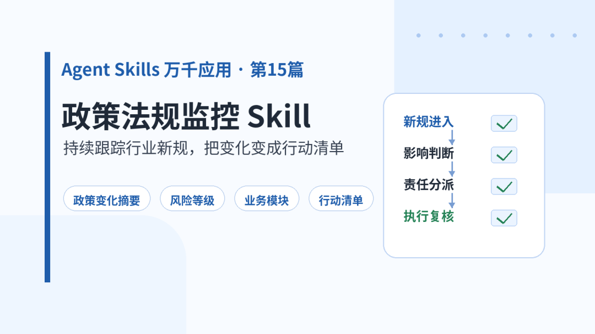
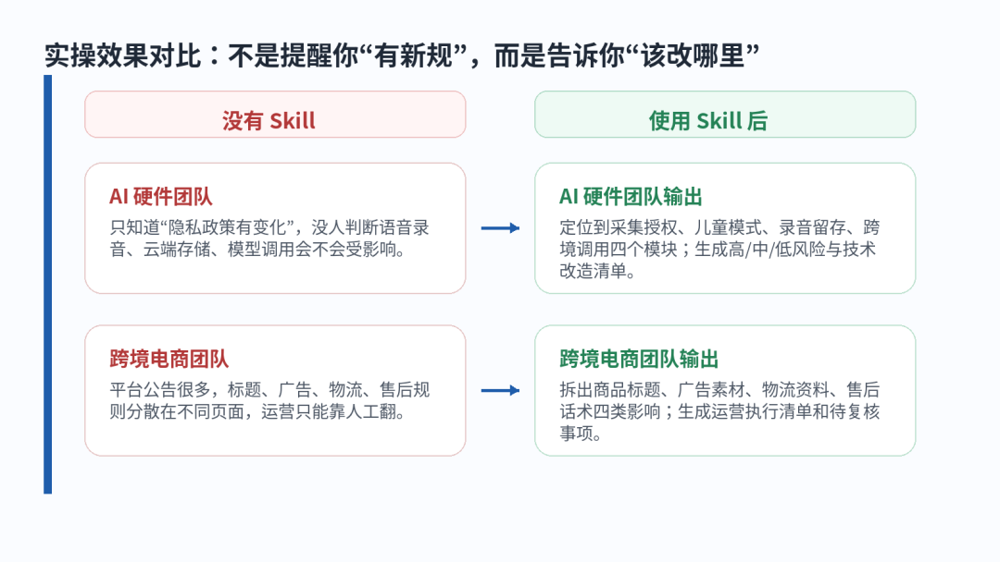
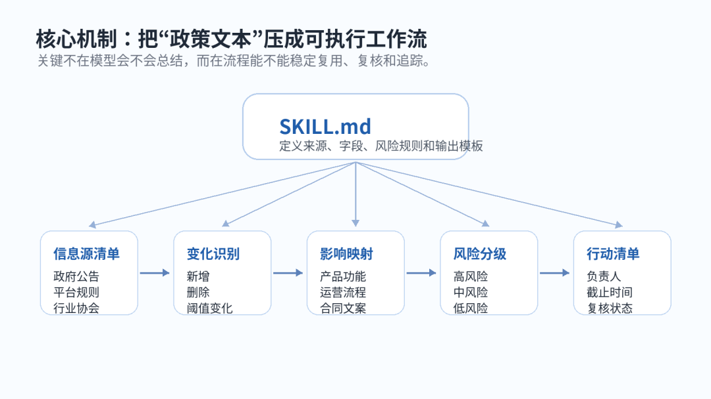
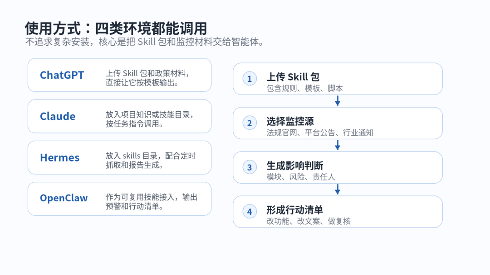

> 📎 来源: [厚国兄](https://mp.weixin.qq.com/s?__biz=Mzk1NzM1MTI1Ng==&mid=2247490463&idx=1&sn=8ae5db400a7c48df6a18e8df202996e3&chksm=c220ba6e95c71efec1c0744c4ed09d7de2786d96043bd49ee03c4a822e3ab72e56b8074afafa&mpshare=1&scene=1&srcid=0530cfy4qwVFeCNwdkX69hNo&sharer_shareinfo=52f86cf7862a163eb75444e848c61192&sharer_shareinfo_first=52f86cf7862a163eb75444e848c61192) | 时间: 2026-05-30 20:54

---

Agent Skills 万千应用 · 第15篇

政策法规监控 Skill：持续跟踪行业新规，把变化变成行动清单

本文定位：帮助团队把政策、法规、平台规则变化，快速转换成业务影响判断和执行清单。示例仅用于工作流说明，不替代正式法律意见。

▌ 1、场景痛点开场

做 AI 硬件、跨境电商、金融科技、教育工具的人，最怕的不是“没有看到新政策”，而是看到了也不知道怎么处理。

一条公告里可能只有几句话和你有关，但它可能影响录音授权、数据留存、商品标题、广告素材、物流资料，甚至售后话术。真正麻烦的是：老板问“我们要不要改”，产品、技术、运营、法务却各看各的，最后没有人形成行动清单。

政策法规监控 Skill 要解决的就是这个问题：不是把新规简单摘要一遍，而是把变化拆成业务影响、风险等级、负责人动作和复核事项。它适合小团队、运营团队、合规负责人，也适合正在做 AI 产品或跨境业务的创业者。

▌ 2、Skill 实操效果

这个 Skill 的价值要放在前面看：它不是“提醒工具”，而是“合规变化到执行动作”的转换器。下面两个案例可以直接感受到差异。

案例 1：AI 硬件团队关注数据合规

没有 Skill 时：团队只能把政策链接转到群里，技术说“等法务确认”，运营说“先别改页面”，最后没人知道录音、云端存储、模型调用分别要不要调整。

使用 Skill 后，输出会直接拆成下面这种工作结果：

|  |  |
| --- | --- |
| 字段 | 输出示例 |
| 政策变化摘要 | 出现关于数据采集、语音录音、个人信息出境、模型服务备案等要求变化，需要判断是否影响设备端采集和云端调用。 |
| 涉及业务模块 | 设备端录音授权、儿童/未成年人模式、云端存储、第三方模型调用、隐私政策页面。 |
| 风险等级 | 高：未弹窗授权即采集语音；中：日志留存周期未说明；低：帮助中心文案未同步。 |
| 产品功能调整 | 增加首次录音授权弹窗；新增关闭云端分析入口；隐私设置页增加数据删除说明。 |
| 技术侧行动项 | 梳理采集字段；补充本地脱敏；检查接口日志留存；记录模型调用地区和供应商。 |
| 法务/运营待确认 | 隐私政策是否需要重发；用户协议是否要补充模型服务说明；是否需要公告老用户。 |
| 预计影响时间 | 建议 7 天内完成风险评估，14 天内完成高风险改造，30 天内完成复核归档。 |

 

案例 2：跨境电商团队关注平台规则

没有 Skill 时：平台公告分散在帮助中心、卖家论坛、广告政策页里，运营每天靠人工翻，容易漏掉标题、广告和售后口径变化。

使用 Skill 后，输出会变成一张可执行清单：

|  |  |
| --- | --- |
| 字段 | 输出示例 |
| 新规则变化 | 平台更新商品标题、广告素材、发货资料和退换货说明要求，部分违规内容可能导致下架或广告暂停。 |
| 影响模块 | 商品资料页、广告投放素材、物流承诺、售后话术、客服模板。 |
| 风险等级 | 高：标题含禁用表达或重复词；中：广告图承诺与详情页不一致；低：售后模板未更新。 |
| 页面/资料修改 | 重写标题；删除夸张承诺；补齐材质、认证、适用场景；统一物流时效说明。 |
| 运营执行清单 | 导出在售商品；按类目批量筛查标题；复核广告素材；更新客服快捷回复。 |
| 待复核事项 | 高销量 SKU 优先复核；新广告上线前二次检查；异常下架原因需要人工确认。 |

 

▌ 3、Skill 简介

政策法规监控 Skill 是一个“持续监控 + 变化识别 + 影响分析 + 行动清单生成”的专用 Skill。它面向的不是律师写正式法律意见，而是帮助业务团队先把变化看懂、分级、派单、复核。

典型 Skill 包结构如下：

|  |
| --- |
| policy-regulation-monitoring-skill-zh-v1/ ├── SKILL.md ├── scripts/ ├── references/ ├── templates/ └── assets/ |

 

其中 SKILL.md 定义任务边界、输入材料、字段结构和输出格式；scripts/ 放变化比对和报告生成脚本；references/ 放监控源清单和风险分级说明；templates/ 放行动清单、周报、复核表等模板。

这类 Skill 目前更适合按团队场景自制，因为不同行业关注的法规、平台规则和风险阈值差异很大。本篇已同步生成配套 Skill 包，可直接作为起点改造成 AI 硬件合规监控、跨境电商规则监控、金融产品规则监控等版本。

▌ 4、核心机制

普通提示词的问题是：今天能总结，明天可能漏字段；这次能写清楚风险，下次又变成泛泛摘要。政策法规监控需要稳定字段、稳定流程、稳定复核点，所以更适合做成 Skill。

它的核心机制可以拆成四层。第一层是信息源清单：明确监控哪些官网公告、平台规则、行业通知和内部制度。第二层是变化识别：对比新旧文本，标出新增、删除、阈值变化和生效时间。第三层是影响映射：把文本变化映射到产品功能、运营流程、合同文案、客服话术、技术接口。第四层是行动清单：输出负责人、优先级、截止时间和复核状态。

渐进式加载的好处是：Agent 不必一次读完整套合规知识库。先读 SKILL.md 明确任务，再按需打开监控源说明、风险矩阵、输出模板和脚本。这样上下文更干净，执行也更稳。

最终它让 Agent 从“读政策的人”变成“合规项目助理”：看到变化、判断影响、拆动作、提醒复核。

▌ 5、使用方式

使用方式不需要复杂。你可以把 Skill 包上传到 ChatGPT，对它说：“按政策法规监控 Skill 分析这批公告，输出影响清单。”

在 Claude 中，可以把 Skill 包放到项目知识或技能目录里，再上传政策公告、平台规则或网页摘录，让它按模板输出。

在 Hermes 或 OpenClaw 中，可以把该 Skill 放入 skills 目录，再配合定时抓取、RSS、网页快照或人工上传文件，定期生成周报和高风险预警。

最小可用流程是：准备监控源清单 → 放入新规文本 → 让 Agent 输出变化摘要 → 业务负责人确认 → 转成行动清单。

▌ 6、避坑指南

第一，不要把它当成正式法律意见。Skill 可以帮你初筛、拆动作、发现风险，但最终是否合规，仍然需要法务或业务负责人确认。

第二，不要只监控新闻稿。很多真正影响执行的变化藏在实施细则、帮助中心、卖家后台通知、接口文档和平台公告里。

第三，风险等级不要写得太虚。比如“可能有风险”没有用，应该写成“影响录音授权弹窗，建议 7 天内完成改造”。

第四，要保留复核记录。政策监控最怕“看过但没证据”，所以每次输出都要有来源链接、判断依据、负责人和状态。

第五，跨行业不要直接套模板。AI 硬件关注数据采集和模型调用，跨境电商关注商品资料和平台规则，两者字段必须分开配置。

▌ 7、下期预告

下一篇可以继续做“客户投诉分析 Skill”：把散落在客服聊天、差评、售后记录里的问题自动归类，找出高频原因、责任环节和改进动作。

真正有价值的 Skill，不是让 Agent 多写几段话，而是把一个重复、容易漏、需要交付结果的工作流程固定下来。

▌ 配套资源

本篇配套 Skill 包：          
policy-regulation-monitoring-skill-zh-v1.zip。

链接：https://pan.quark.cn/s/c0fb8d0aa0af
