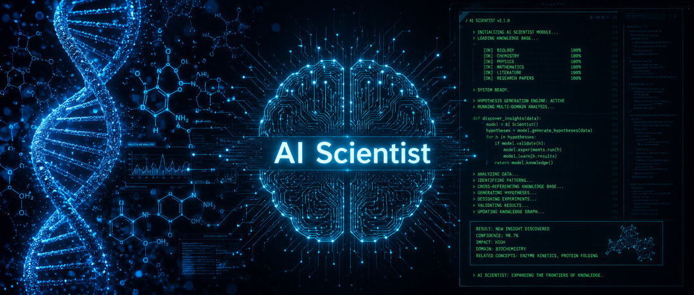
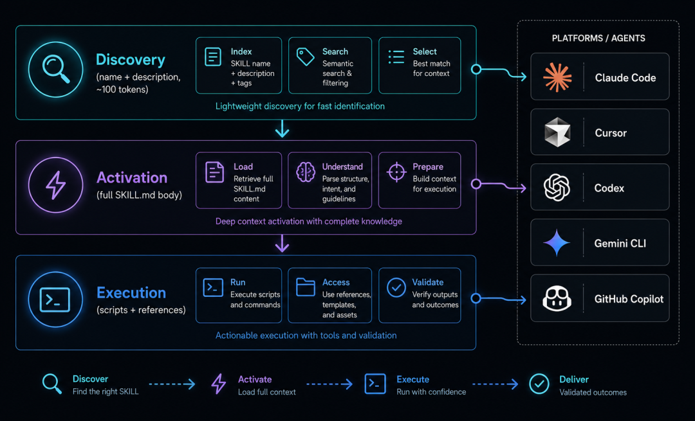
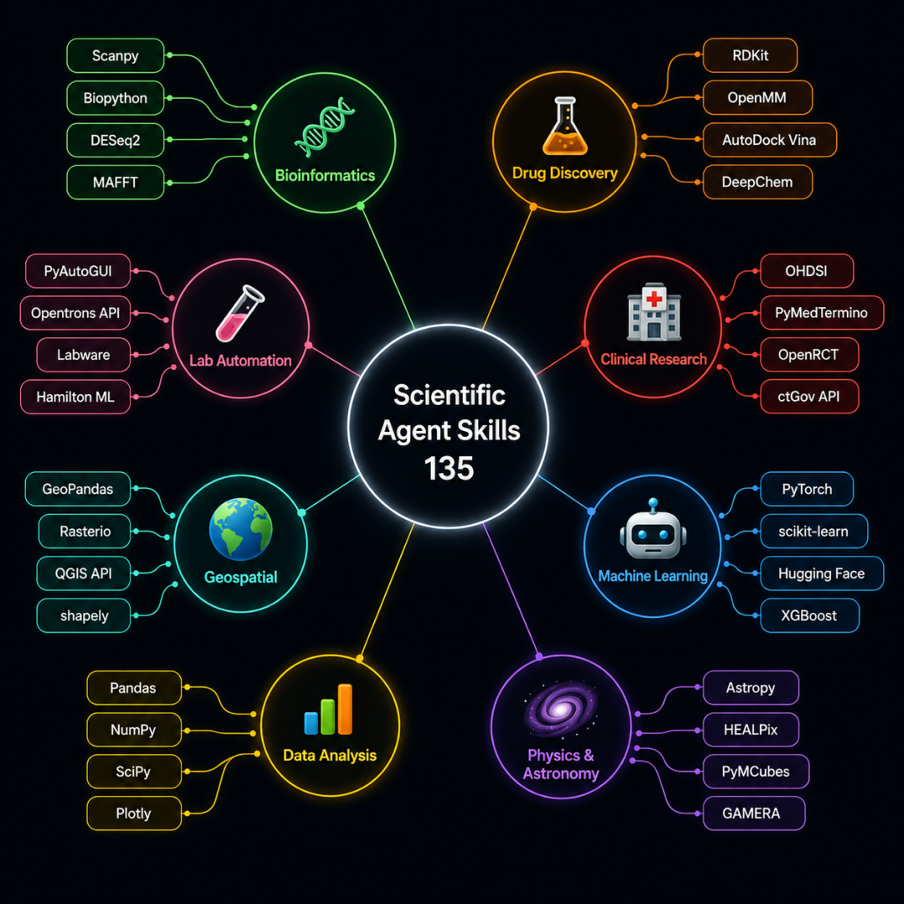
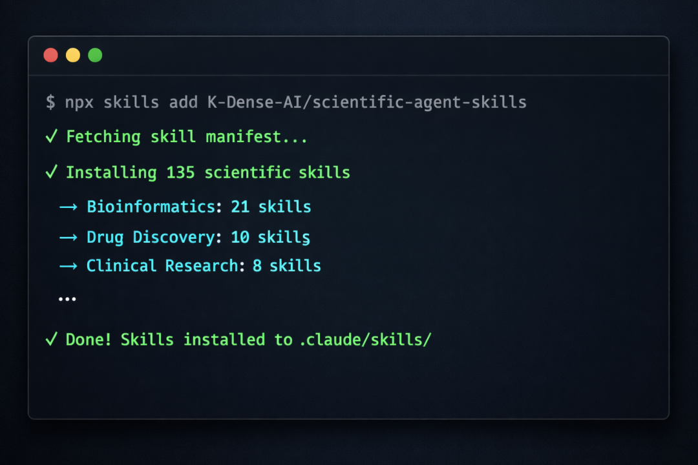
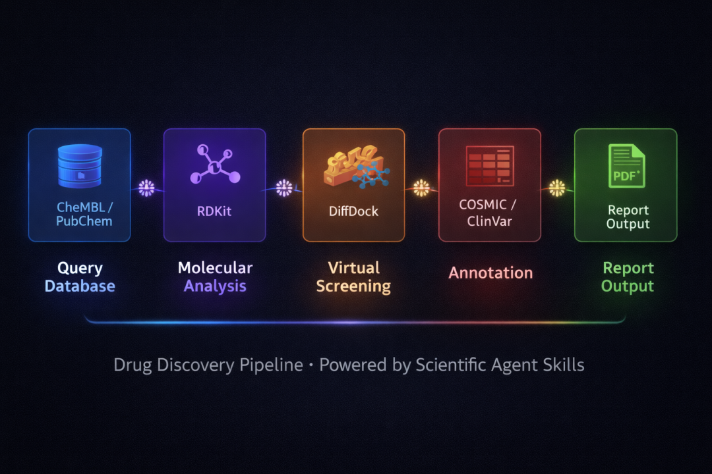
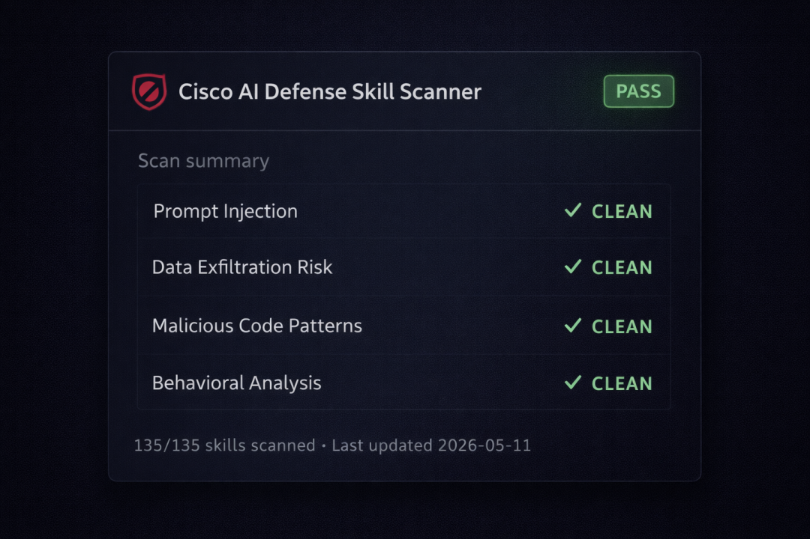

> 📎 来源: [顾北 AI](https://mp.weixin.qq.com/s?__biz=Mzg5ODk3NDc3MA==&mid=2247489011&idx=1&sn=5d2d12399f5b5684f2ffd22c19d66ddd&chksm=c1e4358d10ec33b6279300309d4bb1c929db6d829a328f5fbe8f8eed4548f008087de353a6ce&mpshare=1&scene=1&srcid=0517cZlPw6HXZkHS79pzRC8C&sharer_shareinfo=45d676ee6b98f05fbb5a64a3d3da5d49&sharer_shareinfo_first=45d676ee6b98f05fbb5a64a3d3da5d49) | 时间: 2026-05-17 23:53

---

> 摘要：K-Dense 开源了 Scientific Agent Skills，135 个即用型科学技能，覆盖生物信息学、药物发现、临床研究、量子计算等 17 个科学领域，兼容 Claude Code、Cursor、Codex 等所有支持 Agent Skills 标准的工具。一条命令安装，自动适配工作流，GitHub 已超过 22,000 Star。

说实话，我一直觉得现在的 AI 编程助手用来写科研代码是有点"大材小用"的——它们很聪明，但你得花大量时间跟它解释「EGFR 是什么」「Scanpy 的 API 长什么样」「ChEMBL 数据库怎么查」。

直到我发现了这个项目：**Scientific Agent Skills**。

22,000+ Star，135 个即用型科学技能，一条命令装好，打开就用。它做的事情说白了就一件：**给你的 AI Agent 装上一个「科学家大脑」**。



---

## 它到底解决了什么问题？

先说痛点。

任何做过生信或计算化学的人都知道，真正消耗时间的不是分析本身，而是：

- 翻半小时 Scanpy 文档，才找到 

  ```
  sc.pp.neighbors
  ```

   的参数怎么传
- 问 AI 怎么查 ChEMBL，它给你一段代码，运行报错，再来一轮
- 想跑个 DiffDock 虚拟筛选，先花两小时研究它的输入格式

AI 本身有能力完成这些任务，但它需要「上下文」——那些藏在文档深处、API 细节里的知识。

**Scientific Agent Skills 就是在给 AI 补这块拼图。**

---

## 什么是 Agent Skills？

这里先插一个背景。

**Agent Skills** 是 Anthropic 在 2025 年 12 月发布的开放标准（agentskills.io），现在已并入 Linux Foundation 旗下的 Agentic AI Foundation，和 MCP、AGENTS.md 一起，成为 AI Agent 互操作性的基础协议。

它的设计极其简单：一个文件夹 + 一个 

```
SKILL.md
```

 文件。

```
my-skill/├── SKILL.md          # 核心：告诉 Agent 这个技能是干什么的├── scripts/          # 可执行脚本└── references/       # 参考文档（按需加载）
```

```
SKILL.md
```

 里写的是：这个技能做什么、什么时候用、有哪些示例和最佳实践。Agent 启动时只加载名字和描述（约 100 tokens），需要时才拉取完整内容——这叫**渐进式披露（Progressive Disclosure）**，不会撑爆 context window。

目前已有 26+ 个平台支持这个标准，包括 Claude Code、Cursor、GitHub Copilot、OpenAI Codex、Gemini CLI、Windsurf 等。



---

## Scientific Agent Skills 的规模

**K-Dense** 基于这个标准，做了目前最大的科学技能集合：

| 维度 | 数量 |
| --- | --- |
| 技能总数 | 135 个 |
| 覆盖科学领域 | 17 个 |
| 科学数据库 | 100+ 个 |
| 优化 Python 包 | 70+ 个 |
| 贡献者 | 40 人 |
| GitHub Star | 22,000+ |

覆盖范围相当夸张：

🧬 **生物信息学 & 基因组学**：Scanpy、BioPython、scVelo、Arboreto、PyDESeq2、Cellxgene Census……

🧪 **化学信息学 & 药物发现**：RDKit、DeepChem、DiffDock、OpenMM、MDAnalysis、Datamol……

🏥 **临床研究 & 精准医学**：ClinicalTrials.gov、ClinVar、COSMIC、FDA 数据库、DepMap……

🔬 **蛋白质组学**：pyOpenMS、matchms……

🌌 **物理 & 天文**：Astropy、量子计算（PennyLane、Qiskit、Cirq）……

📊 **数据分析 & 可视化**：GeoPandas、Dask、Polars、NetworkX、Seaborn……

还有实验室自动化（PyLabRobot、Benchling）、科学写作（文献综述、同行评审、LaTeX 海报）等等，基本上科研工作流的每个环节都覆盖到了。



---

## 安装只需一行

支持 npx（全平台通用）：

```
npx skills add K-Dense-AI/scientific-agent-skills
```

或者用 GitHub CLI（v2.90.0+），还支持按需安装单个技能：

```
# 只装 Scanpy 技能gh skill install K-Dense-AI/scientific-agent-skills scanpy# 装给指定 Agentgh skill install K-Dense-AI/scientific-agent-skills --agent claude-codegh skill install K-Dense-AI/scientific-agent-skills --agent cursor# 版本锁定，保证可复现gh skill install K-Dense-AI/scientific-agent-skills --pin v2.38.0
```

装完之后，你的 AI Agent 自动发现这些技能，什么都不用配置。



---

## 实际能做什么？用几个例子说话

**例子 1：EGFR 抑制剂药物发现流水线**

装好技能之后，你只需要这样一句提示词：

```
Use available skills. 从 ChEMBL 查询 EGFR 抑制剂（IC50 < 50nM），用 RDKit 分析构效关系，用 datamol 生成改进类似物，用 DiffDock 对 AlphaFold EGFR 结构做虚拟筛选，查 COSMIC 的突变数据，输出综合报告。
```

以前这个流程要花几天自己拼各种 API、调各种包。现在 Agent 知道该调哪些数据库、用什么参数、输出什么格式。

**例子 2：单细胞 RNA-seq 全流程分析**

```
Use available skills. 用 Scanpy 加载 10X 数据，QC 和双细胞去除，整合 Cellxgene Census 公开数据，用 PyDESeq2 差异表达，Arboreto 推断基因调控网络，Reactome/KEGG 富集分析，Open Targets 找治疗靶点。
```

**例子 3：临床变异解读**

```
Use available skills. 解析 VCF 文件，Ensembl VEP 变异注释，查 ClinVar 致病性，COSMIC 癌症突变，UniProt 蛋白影响，ClinPGx 药物基因组学，ClinicalTrials.gov 匹配临床试验，生成临床报告。
```

这些不是演示用的花架子——每个技能都有完整的文档、可运行的代码示例和最佳实践。



---

## 安全性这块怎么处理的？

这个问题我特别关注，因为 Agent Skills 本质上是在告诉 AI「去执行这些代码、调这些 API、改这些文件」，如果有恶意 Skill 混进来，后果不堪设想。

K-Dense 的做法：所有技能都跑 **Cisco AI Defense Skill Scanner** 扫描，检测提示注入、数据外泄、恶意代码模式，扫描结果记录在 

```
SECURITY.md
```

，大约每周更新一次。

他们的建议也很务实：不要一口气全装，只装你实际用到的技能。K-Dense 自己维护的技能经过内部审核，社区贡献的技能尽力审查但资源有限。

如果要用第三方技能，可以自己跑扫描器：

```
uv pip install cisco-ai-skill-scannerskill-scanner scan /path/to/skill --use-behavioral
```



```

```

---

## 不想自己部署？K-Dense BYOK 直接用

仓库同期发布了配套工具 **K-Dense BYOK**：免费、开源、跑在本地的桌面版 AI 科学家。

- 支持 40+ 模型（自带 API Key，数据留在你电脑上）
- 内置 Web 搜索、文件处理、100+ 科学数据库
- 访问全部 135 个技能
- 需要大算力时可以通过 Modal 扩展到云端

对于不想折腾 CLI 的用户，这是个好选择。

---

## 我的判断

这个项目最聪明的地方在于：**它不试图重新发明科学软件栈，而是把现有工具的使用文档结构化了**。

Scanpy 还是 Scanpy，RDKit 还是 RDKit，Agent 只是多了「怎么用好它们」的知识。这种设计让技能的维护成本很低，跟着包的更新迭代就行。

对于计算生物学家、生信工程师来说，这个工具能节省的不是几分钟，而是那些「配环境、找 API、调参数」消耗的整个下午。

对于刚入门科学计算的同学来说，这 135 个技能也是一份很好的学习路线图——你能看到业内主流用哪些工具做哪些事。

**美中不足**：仓库还在快速迭代（已发布 v2.38.0，76 个 releases），社区贡献的技能质量参差不齐，使用前最好先看一眼对应的 

```
SKILL.md
```

。

---

**项目地址**：https://github.com/K-Dense-AI/scientific-agent-skills

**标准规范**：https://agentskills.io

**K-Dense BYOK**：https://github.com/K-Dense-AI/k-dense-byok

你在用什么工具加速科研工作流？欢迎评论区聊聊。

我是顾北，关注我，获取更多好玩有趣的开源仓库！

谢谢你阅读我的文章~

我们下期再见！
