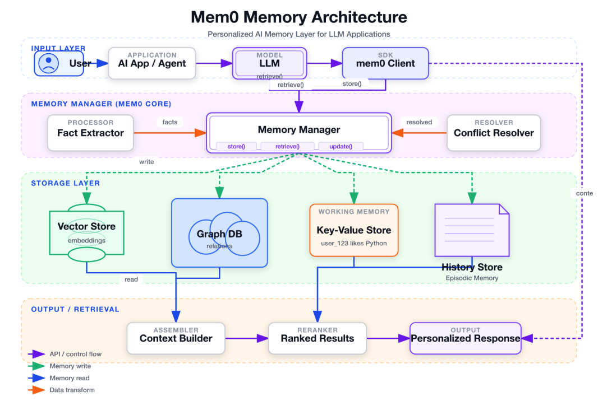
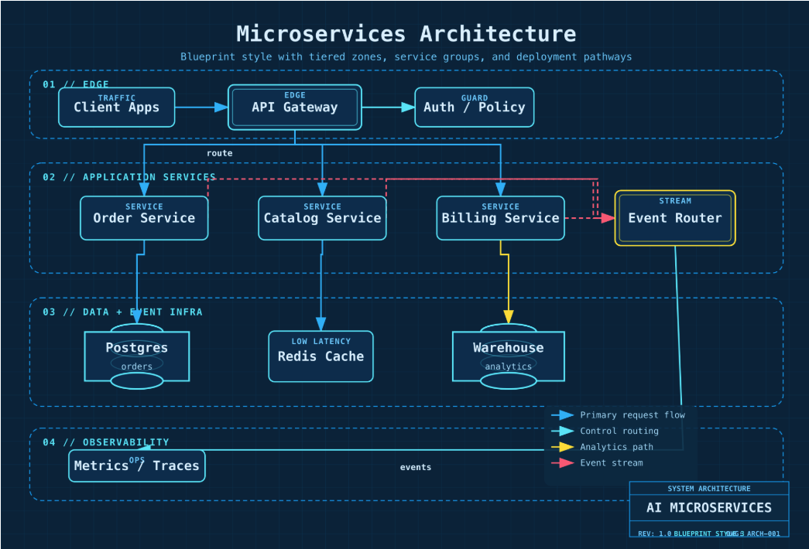
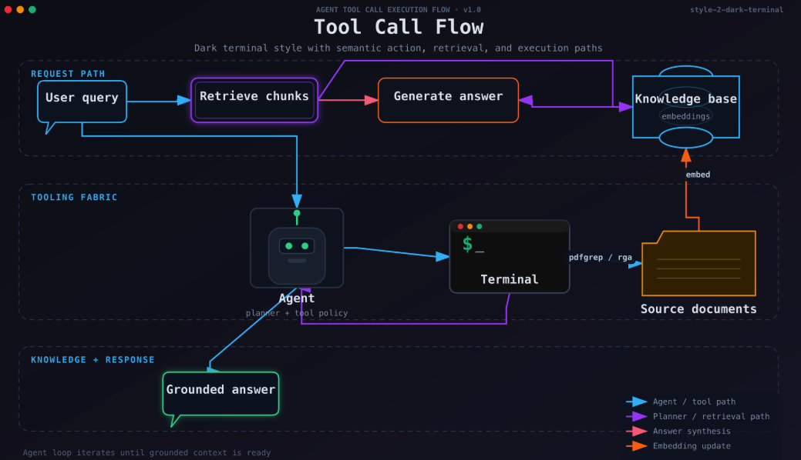
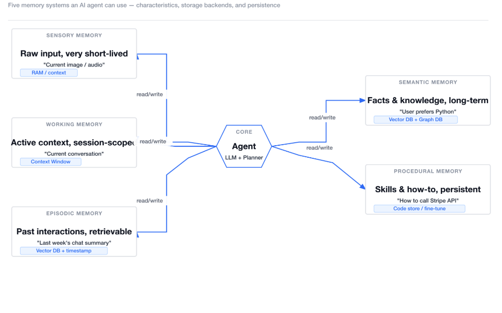
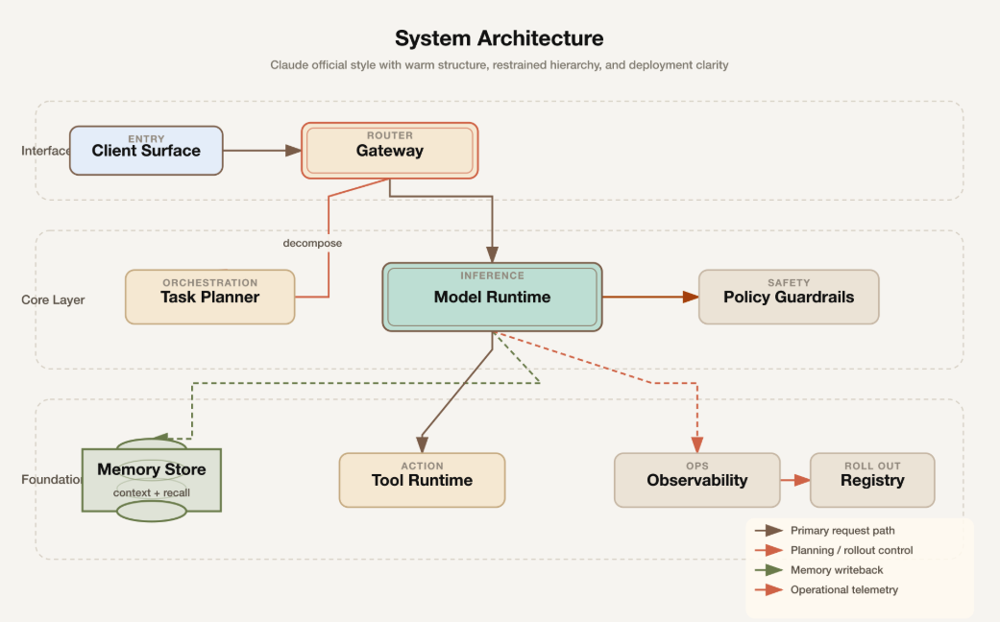

> 📎 来源: [前端新视野brizer](https://mp.weixin.qq.com/s?__biz=Mzk0MjM4Mjc1Mw==&mid=2247491212&idx=1&sn=5418f002bc31b744ab8b3603b862578c&chksm=c323e0739549a457e96acaea6af03eea280922acb811afef1dbb0a2c48e883fc575fdc616fa3&mpshare=1&scene=1&srcid=0522mQVCpuKKoGXmdRXltKQA&sharer_shareinfo=078d5dad94ae4fda9ae58515346a5ad8&sharer_shareinfo_first=078d5dad94ae4fda9ae58515346a5ad8) | 时间: 2026-05-22 01:25

---

# 这个开源skill画的图，吊打mermaid和draw.io

---

Mermaid 写代码，draw.io 点点鼠标。

但说实话，都不够爽。

Mermaid 要写语法，draw.io 要手动排版。

**fireworks-tech-graph** 干的事很简单——

你描述，它画图。



**怎么用？**

就说一句话：

"画一个 RAG 架构图，深色风格"



完事。SVG + PNG 直接给你。

支持 7 种视觉风格：深色终端风、蓝图风、毛玻璃风、Notion 干净风、Claude 官方风……



**它懂 AI 的语言**

Agent = 六边形，LLM = 双边框圆角矩形，向量库 = 环形圆柱。



RAG、Mem0、Multi-Agent、Tool Call 流程……这些 AI 工程师才用的图案，它全认识。



**比 Mermaid 强在哪？**

|  | Mermaid | draw.io | fireworks |
| --- | --- | --- | --- |
| 自然语言输入 | ✗ | ✗ | ✅ |
| AI 领域图案 | ✗ | ✗ | ✅ |
| 品牌风格 | ✗ | 手动 | ✅ 7种内置 |
| 高清 PNG | ✗ | 手动 | ✅ 自动 1920px |

---

**安装一行：**

```
npx skills add yizhiyanhua-ai/fireworks-tech-graph
```

macOS 装一下 librsvg：

```
brew install librsvg
```

---

说句话就能画专业架构图，程序员值得一试。

GitHub：https://github.com/yizhiyanhua-ai/fireworks-tech-graph

---

#AI工具 #开源 #架构图 #Mermaid #ClaudeCode
