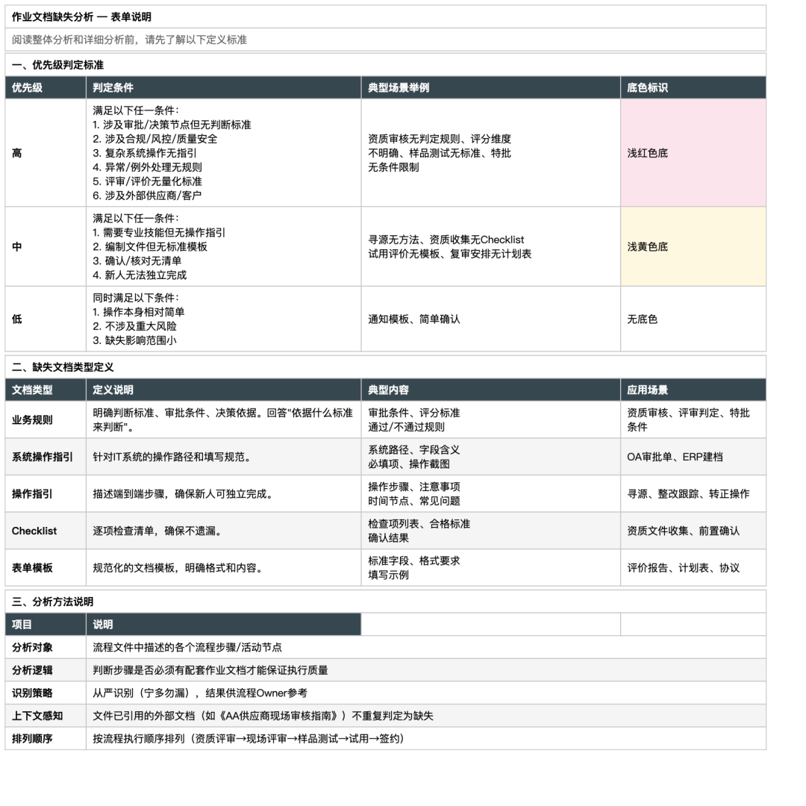
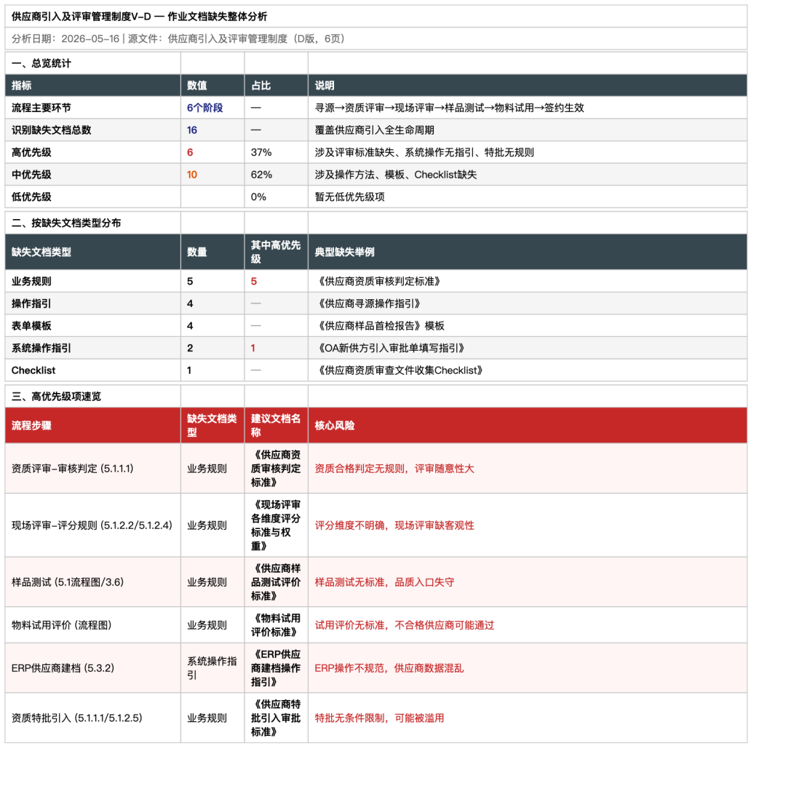
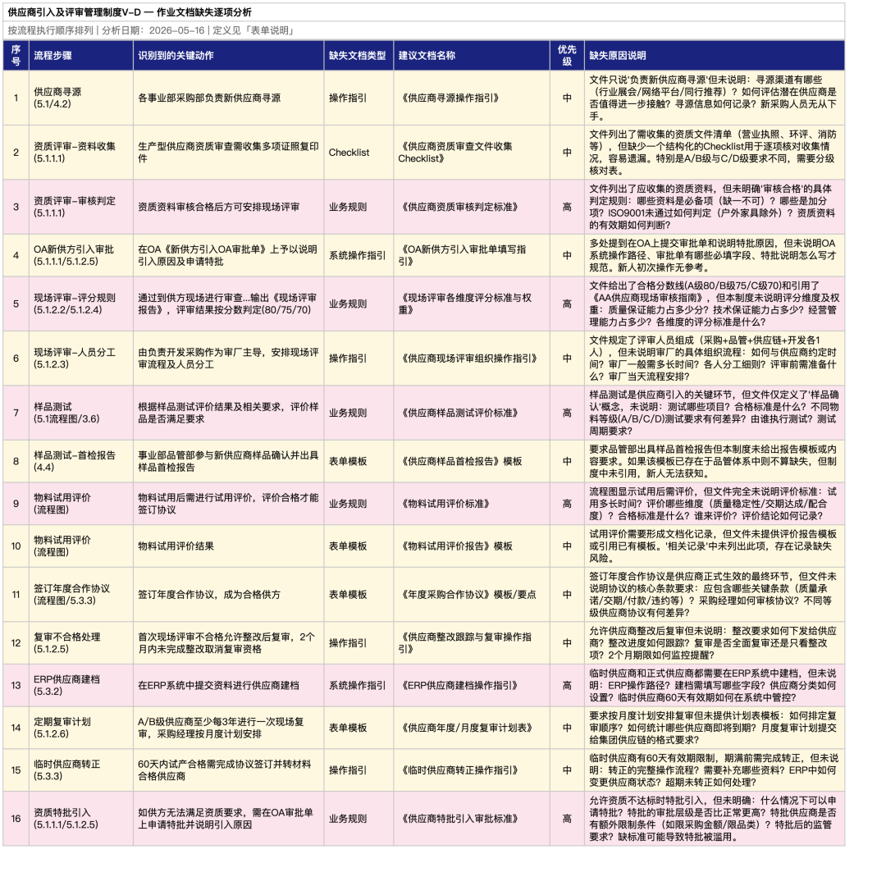

> 📎 来源: [流程研习社](https://mp.weixin.qq.com/s?__biz=MzAxNzQ5ODc0Mg==&mid=2247490513&idx=1&sn=a3b61a3aa1806f94df51ccbd80a15978&chksm=9a5ca625db5035d25bcd648bd80fefb6c0d80c3394d71f9056bd102f74bd6ae1f1914497aefe&mpshare=1&scene=1&srcid=0527LSvXuomHxBrMqtrs9KbM&sharer_shareinfo=144033ea6f3a148b19a076d4d6801837&sharer_shareinfo_first=144033ea6f3a148b19a076d4d6801837) | 时间: 2026-05-27 23:21

---

## 一、先看结果：16条缺失，6个高危

我用一份6页的《供应商引入及评审管理制度》PDF文件，喂给我锻造的AI Skill，**30秒内输出一份完整的作业文档缺失分析Excel**，包含三个子表：

**分析结果一览：**

- 共识别缺失文档：**16条**
- 高优先级（红色）：**6条** — 涉及评审标准、系统操作、特批规则
- 中优先级（黄色）：**10条** — 涉及操作方法、模板、Checklist
- 输出格式：3个Sheet的专业Excel报告

这不是人工一条一条对着文件挑毛病，而是**AI按照10大识别规则系统性扫描**，按流程步骤顺序逐一输出，标注优先级，给出建议文档名称和缺失原因。

下面是三个子表的实际截图：

### Sheet 1：表单说明

### Sheet 2：整体分析

### Sheet 3：详细分析

---

## 二、为什么要做这个Skill？

组织的能力必须落在流程中。如果一个流程节点缺少必要的作业文档，就意味着：新人无法上手、执行靠个人经验、数字化无法深入、知识无法传承。

我辅导过300多家企业做流程体系建设，发现一个普遍现象：

**80%的流程文件只写了"谁做什么"，没写"怎么做"和"依据什么"。**

比如一个流程写"部门经理审批采购申请"——审批什么？超过多少金额不批？什么情况退回？全靠经验。

再比如"在ERP系统中完成供应商建档"——新人怎么知道操作路径？填什么字段？必填项有哪些？没有指引，只能找老员工问。

这些"怎么做"和"依据什么"，就是**作业文档**——表单模板、操作指引、业务规则、Checklist、计算公式等。它们才是组织能力真正沉淀的载体。

但问题是：**人工逐条审查流程文件找缺失，太慢、太主观、容易遗漏。**

所以我锻造了一个AI Skill，让它系统性地帮我扫描。

---

## 三、完整锻造过程：16条原始指令全公开

以下是我锻造这个Skill过程中，**发给AI的每一条原始指令**，一字不改，完整罗列。

为什么要公开？因为**Skill的质量取决于你跟AI的对话质量**。很多人觉得AI不好用，不是AI不行，是指令不行。

你可以从这16条指令中学到：如何从模糊想法到清晰规则，如何通过迭代反馈不断打磨输出质量。

| 序号 | 阶段 | 我发出的原始指令 |
| --- | --- | --- |
| 1 | 需求描述 | 我现在想开发一个识别流程文件中作业文档的skill，之所以做这个skill，底层逻辑是这样的：组织的能力一定要落在流程中，而落在流程中的方式，是通过表单、操作指引、规则、业务规则、Checklist等作业文档来承载的，很多流程文件只说了A是谁做，B是谁做，但没说A怎么做，基于什么标准来判断，也没说B的操作指引在哪里，这会导致很多流程节点在执行时，仍然依赖个人经验（人治），无法做到真正的规范化和数字化。所以我想让AI帮我从一份流程文件中识别出缺失的作业文档，输出一个清单，供流程owner参考并补全。 |
| 2 | 格式确认 | 重点对word和PDF吧，不过好像你不支持word上下文啊。输出excel清单即可。 |
| 3 | 设计决策 | 识别可以严格，但要选择重要优先级才行。而且最好按照流程的上下文顺序显示，这样比较方便用户在对照原文件的同时查看识别的结果。skill名字我更喜欢第二个。 |
| 4 | 首次测试 | （提供固定资产管理制度PDF文件）请用这个做一个分析，然后我们再一起完善规则 |
| 5 | 格式调整 | 汇总分析，最好能用一个表格的方式，一目了然 |
| 6 | 结构调整 | 汇总分析效果不错，不过上下格式不美观，你可以把规则分析做一个子表，汇总分析做一个子表，都放在一个excel文件中 |
| 7 | 增加说明 | 在第一个表后需要增加相关说明，比如高中低的标准是什么？比如文档类型定义？ |
| 8 | 说明独立 | 这些解释我认为也可以单独一个表，放在最开始，命名为定义说明，这样更清爽。 |
| 9 | 修复列宽 | （1）最后一个子表的列宽有些问题，明明可以拉长，但现在列宽很短，展示不好。 |
| 10 | 第二次测试 | （提供竞价保证金退款流程Word文件路径）用这个文件做一次我看看效果 |
| 11 | 命名与排序 | （1）汇总分析改为整体分析（2）详细分析子表放在最后一个，整体分析提到第二位（3）定义说明，改为表单说明 |
| 12 | 第三次测试 | （提供供应商引入及评审管理制度PDF路径）你再尝试分析一下这个文件 |
| 13 | 固化更新 | 根据我们上面的沟通，你更新作业文档识别skill |

仔细看这13条指令，你会发现一个规律：

**Skill锻造 = 需求描述 + 快速测试 + 持续反馈 + 迭代打磨**

不是一次写完就行，而是"做一次看一次、不满意就调"。从格式到结构到命名到列宽，每一条反馈都让AI更懂你要什么。

---

## 四、Skill的核心设计：10大识别规则

这个Skill之所以能系统性识别缺失，是因为内置了**10大类识别规则**。每条规则定义了触发词、判定条件、缺失文档类型和默认优先级：

| 规则 | 识别什么 | 缺失文档类型 | 优先级 |
| --- | --- | --- | --- |
| 规则1 | 审批/审核无标准 | 业务规则 | 高 |
| 规则2 | 决策/评审无依据 | 决策标准/评审规则 | 高 |
| 规则3 | 委员会/集体决策无议事规则 | 议事规则 | 高 |
| 规则4 | 系统操作无指引 | 系统操作指引 | 高/中 |
| 规则5 | 编制/填写无模板 | 表单模板 | 中 |
| 规则6 | 检查/验收无标准 | Checklist/验收标准 | 高/中 |
| 规则7 | 计算/测算无规则 | 计算规则 | 高 |
| 规则8 | 专业复杂任务无操作指引 | 操作指引 | 中 |
| 规则9 | 移交/交接无清单 | 交接清单 | 中/高 |
| 规则10 | 异常/例外处理无指引 | 异常处理指引 | 高 |

**核心判断逻辑：**不是看"有没有提到文档"，而是看"该步骤的性质是否必须有配套文档才能保证执行质量"。

举个例子：流程里写"资质资料审核合格后方可安排现场评审"——这里的问题是：**"合格"的标准是什么？**哪些资料是必备项？ISO9001没有通过怎么判？有效期怎么看？如果没有明确的判定规则，审核就变成了审核人的个人经验。

---

## 五、案例详解：供应商引入流程的6个高危缺失

以《供应商引入及评审管理制度》为例，AI识别出的**6个高优先级缺失**如下：

| 流程步骤 | 缺失什么 | 核心风险 |
| --- | --- | --- |
| 资质评审-审核判定 | 《供应商资质审核判定标准》 | 资质合格判定无规则，评审随意性大 |
| 现场评审-评分规则 | 《现场评审各维度评分标准与权重》 | 评分维度不明确，现场评审缺客观性 |
| 样品测试 | 《供应商样品测试评价标准》 | 样品测试无标准，品质入口失守 |
| 物料试用评价 | 《物料试用评价标准》 | 试用评价无标准，不合格供应商可能通过 |
| ERP供应商建档 | 《ERP供应商建档操作指引》 | ERP操作不规范，供应商数据混乱 |
| 资质特批引入 | 《供应商特批引入审批标准》 | 特批无条件限制，可能被滥用 |

这6条如果不补全，意味着什么？

**意味着整个供应商引入流程中，最关键的"质量入口"——从资质审查到样品测试到试用评价——全部依赖审核人的个人经验。**换一个人来做，结果可能完全不同。这就是典型的"人治"。

---

## 六、三个Sheet的设计逻辑

最终输出的Excel不是简单罗列一张表，而是**三个子表各司其职**：

| Sheet名称 | 内容 | 解决什么问题 |
| --- | --- | --- |
| **表单说明** （第1个） | 优先级判定标准、6类文档类型定义、分析方法说明 | 让读者先理解"看什么、怎么看" |
| **整体分析** （第2个） | 总览统计、类型分布、高优先级速览 | 管理层快速了解全貌，聚焦重点 |
| **详细分析** （第3个） | 按流程步骤顺序逐条列出缺失项 | 流程Owner逐条对照原文件补全 |

这个设计是经过**6轮迭代**才形成的：

> v1：单表 + 文字汇总 → v2：单表 + 表格汇总 → v3：双Sheet → v4：三Sheet（定义在详细分析内）→ v5：三Sheet（定义说明独立） → v6（最终）：三Sheet（表单说明 → 整体分析 → 详细分析）

每一版都是"先看效果，不满意就调"。**好的Skill不是设计出来的，是打磨出来的。**

---

## 七、你可以学到什么

这篇文章不只是展示一个工具，更想传递一个方法：

**1. Skill锻造的本质是"需求翻译"**

把你脑子里模糊的专业判断，翻译成AI能执行的规则。比如"审批要有标准"这个常识，翻译成"触发词=审批/审核/批准/核准/签批/会签 + 上下文无审批标准/审批依据/审批条件"。

**2. 不要追求一次完美，要追求快速迭代**

13条指令中，有7条是"看了结果后的调整反馈"。这不是返工，这是打磨。每次反馈让AI更精确地理解你的标准。

**3. 流程管理+AI的真正结合点**

不是让AI替你画流程图，而是让AI**按照你的专业规则做系统性扫描**。人的价值在于定义规则（10大识别规则），AI的价值在于快速执行（30秒扫完一份文件）。

以前靠一个资深顾问花半天才能完成的作业文档缺失分析，现在提供一份文件、30秒输出结果。这不是取代人，是把人的经验规则化、规则引擎化。

---

## 八、小结

这个Skill的名字叫**doc-gap-analyzer**，已经测试过三份真实文件：

- 固定资产管理制度（PDF）— 25条缺失
- 竞价保证金退款流程（Word）— 10条缺失
- 供应商引入及评审管理制度（PDF）— 16条缺失

它不完美，但足以让流程Owner快速定位"到底还缺什么"。后续我会继续优化识别规则的精准度，减少误报。

**如果你也在做流程体系建设，强烈建议尝试AI辅助做这类"系统性扫描"的工作。人的精力有限，但规则可以无限复用。**

---

互动话题

你的企业流程文件中，最常缺失的是哪类作业文档？
是表单模板？操作指引？还是业务规则？
**欢迎评论区聊聊。**

**需要这个skill，请转发到朋友圈或行业群，然后联系助理**

---

广东端到端咨询
流程管理+AI | 组织变革 | 数字化转型

加金国华老师联系方式，相学相长！

特别说明：此文章也是由我的公众号文章发布skill自动产生。但是大家不要误解，不必担心AI乱写，更不用担心文章质量，因为AI是根据作业文档识别这个skill产生的过程（上下文）写的文章，过程都是真实的，而且在写文章时，我也会提出明确的质量要求要求。
